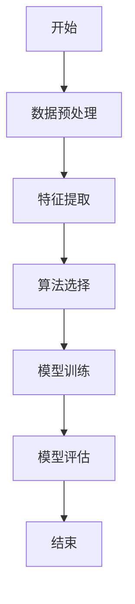
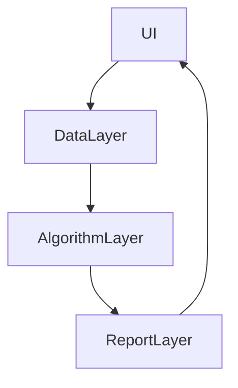

                 


# 智能财富传承规划助手

> 关键词：智能财富传承、人工智能、财富规划、风险管理、资产配置、机器学习

> 摘要：智能财富传承规划助手是一种结合人工智能技术的财富管理工具，旨在通过智能化的分析和规划，帮助用户实现财富的稳健传承。本文将从背景、核心概念、算法原理到系统架构，全面解析智能财富传承规划助手的构建与应用。

---

## 第一部分：智能财富传承规划助手的背景与概念

### 第1章：财富传承的背景与问题

#### 1.1 财富传承的背景与现状

财富传承是人类社会永恒的话题，尤其是在现代社会，随着家族企业的发展和个人财富的积累，如何高效、安全地进行财富传承成为许多人关注的焦点。传统的财富传承方式往往依赖于律师、财务顾问等专业人士，这种方式虽然专业，但效率较低，且难以应对复杂多变的市场环境和法律政策变化。

#### 1.2 智能财富传承规划助手的提出

随着人工智能技术的快速发展，智能化工具逐渐渗透到各个领域。智能财富传承规划助手应运而生，它通过整合大数据分析、机器学习等技术，为用户提供个性化的财富传承方案。这种工具不仅能够提高效率，还能在复杂情况下做出最优决策。

---

## 第二部分：智能财富传承规划助手的核心概念与原理

### 第2章：智能财富传承规划助手的核心概念

#### 2.1 财富传承规划的关键要素

- **资产配置与管理**：智能助手需要分析用户的资产分布，并提供优化建议。
- **家族传承结构**：考虑家族成员的关系和财产分配方案。
- **风险与税务优化**：识别潜在风险，并制定税务优化策略。

#### 2.2 智能化规划的关键技术

- **人工智能与机器学习**：用于数据分析和预测。
- **数据分析与预测**：帮助识别趋势和潜在问题。
- **自然语言处理与知识图谱**：用于文档处理和知识管理。

#### 2.3 核心概念的ER实体关系图

```mermaid
erDiagram
    user {
        id : int
        name : string
        age : int
        assets : int
        risk_tolerance : string
    }
    asset {
        id : int
        type : string
        value : float
        owner : user
    }
    plan {
        id : int
        strategy : string
        user : user
        assets : asset
    }
```

---

## 第三部分：智能财富传承规划助手的算法与数学模型

### 第3章：智能财富传承规划的算法原理

#### 3.1 基于机器学习的财富规划算法

- **数据预处理与特征提取**：清洗数据，提取关键特征。
- **算法选择与训练**：选择合适的算法（如决策树），进行模型训练。
- **模型评估与优化**：通过交叉验证优化模型性能。

#### 3.2 算法流程图



#### 3.3 数学模型与公式

- **资产配置优化模型**：
  $$ \text{max} \sum_{i=1}^{n} w_i r_i - \lambda \sum_{i=1}^{n} w_i^2 $$
  其中，\( w_i \) 是资产 \( i \) 的权重，\( r_i \) 是资产 \( i \) 的预期收益，\( \lambda \) 是惩罚系数。

---

## 第四部分：智能财富传承规划助手的系统架构与设计

### 第4章：系统架构与功能设计

#### 4.1 系统架构设计

- **分层架构**：包括数据层、业务逻辑层和用户界面层。
- **模块划分**：数据采集、分析、规划、报告生成。

#### 4.2 系统功能设计

- **用户交互**：用户输入需求，系统生成规划。
- **数据处理**：清洗和分析用户数据。
- **算法执行**：运行优化算法，生成方案。

#### 4.3 系统架构图



---

## 第五部分：项目实战与最佳实践

### 第5章：项目实战

#### 5.1 环境安装

```bash
pip install numpy pandas scikit-learn
```

#### 5.2 核心代码实现

```python
import numpy as np
from sklearn.tree import DecisionTreeRegressor

def optimize_asset_allocation(users, assets):
    # 数据预处理
    X = []
    y = []
    for user in users:
        for asset in assets:
            X.append([user['age'], asset['value']])
            y.append(user['risk_tolerance'])
    # 模型训练
    model = DecisionTreeRegressor()
    model.fit(X, y)
    # 预测与优化
    predicted_risk = model.predict(X)
    return predicted_risk
```

#### 5.3 案例分析

通过实际案例分析，展示智能财富传承规划助手如何帮助用户制定最优的资产分配策略，并通过模型预测潜在风险。

---

## 第六部分：总结与展望

### 第6章：总结与展望

智能财富传承规划助手通过结合人工智能技术，显著提高了财富传承的效率和准确性。未来，随着技术的进一步发展，智能助手将更加智能化，能够处理更复杂的情况，为用户提供更优质的服务。

---

通过以上内容，我们详细介绍了智能财富传承规划助手的构建与应用，从理论到实践，为读者提供了一个全面的视角。

