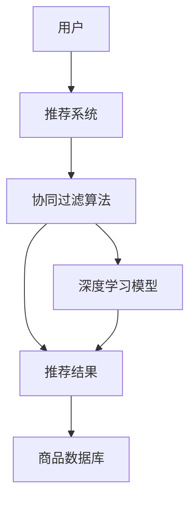
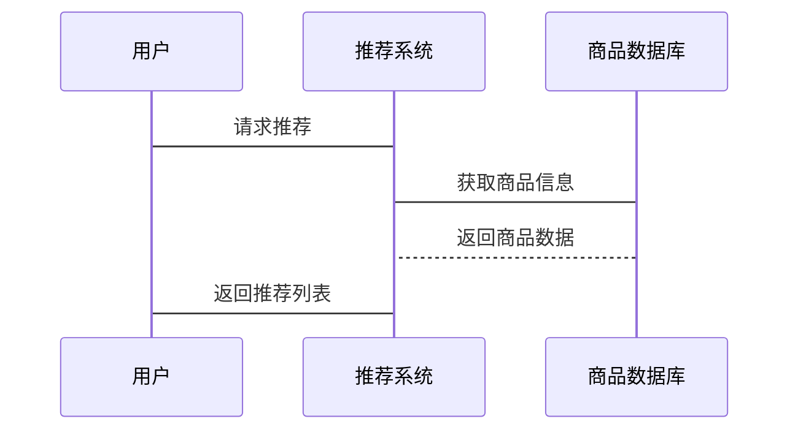

                 


# 智能购物车：AI Agent的商品推荐系统

> 关键词：AI Agent，推荐系统，智能购物车，机器学习，深度学习，协同过滤

> 摘要：本文将探讨AI Agent在智能购物车中的应用，详细分析商品推荐系统的原理与实现。从背景介绍到核心算法，再到系统架构设计与项目实战，全面解析如何利用AI技术提升购物体验。

---

# 第一部分: 智能购物车与AI Agent概述

## 第1章: 智能购物车的背景与概念

### 1.1 传统购物车的局限性
#### 1.1.1 传统购物车的功能特点
传统购物车主要提供商品展示、用户交互和下单功能，但缺乏智能化推荐能力，无法根据用户行为动态调整推荐结果。

#### 1.1.2 用户需求的多样性与复杂性
用户在购物时可能有不同的需求，如价格敏感、品牌偏好或季节性需求，传统推荐系统难以覆盖这些多样性。

#### 1.1.3 传统推荐系统的不足
传统推荐系统通常基于简单的规则或静态数据，无法实时捕捉用户行为变化，导致推荐结果不够精准。

### 1.2 AI Agent的概念与特点
#### 1.2.1 AI Agent的基本定义
AI Agent是一种能够感知环境、自主决策并执行任务的智能体，能够在动态环境中优化目标。

#### 1.2.2 AI Agent的核心能力
- 数据感知与分析能力
- 自主决策能力
- 实时交互能力
- 学习与适应能力

#### 1.2.3 AI Agent与传统推荐系统的区别
| 属性       | AI Agent推荐系统 | 传统推荐系统 |
|------------|------------------|--------------|
| 数据来源    | 多模态数据       | 单一数据源   |
| 决策机制    | 自主学习         | 预设规则     |
| 交互方式    | 实时反馈         | 周期性更新   |

### 1.3 商品推荐系统的核心目标
#### 1.3.1 提升用户体验
通过个性化推荐减少用户浏览时间，提高购买意愿。

#### 1.3.2 增加销售额
通过精准推荐高价值商品，提升转化率。

#### 1.3.3 提高用户粘性
通过持续优化推荐结果，增强用户对平台的依赖。

### 1.4 智能购物车的实现价值
#### 1.4.1 提高推荐效率
AI Agent能够实时分析用户行为，快速生成推荐结果。

#### 1.4.2 个性化推荐
基于用户历史行为、偏好和实时数据，提供高度个性化的商品推荐。

#### 1.4.3 实时反馈与动态调整
根据用户实时行为调整推荐策略，优化推荐结果。

### 1.5 本章小结
本章介绍了传统购物车的局限性，AI Agent的核心概念及其在商品推荐系统中的优势，为后续技术实现奠定了基础。

---

# 第二部分: AI Agent的核心原理与技术

## 第2章: AI Agent的基本原理

### 2.1 AI Agent的基本原理
#### 2.1.1 信息感知与数据收集
AI Agent通过收集用户行为数据、商品数据和环境数据，构建用户画像和购物场景。

#### 2.1.2 数据分析与特征提取
利用机器学习技术对数据进行特征提取，识别用户的潜在需求和偏好。

#### 2.1.3 决策与推荐生成
基于特征分析，AI Agent生成推荐列表，并通过实时反馈优化推荐策略。

### 2.2 AI Agent的核心算法
#### 2.2.1 协同过滤算法
协同过滤基于用户行为相似性进行推荐，分为基于用户的协同过滤和基于物品的协同过滤。

**基于用户的协同过滤流程：**
1. 计算用户之间的相似度。
2. 找到与当前用户相似的用户。
3. 推荐这些用户喜欢的商品。

**基于物品的协同过滤流程：**
1. 计算商品之间的相似度。
2. 找到与当前商品相似的商品。
3. 推荐这些商品给目标用户。

**数学模型：**
- 相似度计算：$sim(i,j) = \frac{\sum_{k} (r_{ik} - \bar{r}_i)(r_{jk} - \bar{r}_j)}{\sqrt{\sum_{k} (r_{ik} - \bar{r}_i)^2} \sqrt{\sum_{k} (r_{jk} - \bar{r}_j)^2}}$

### 2.3 AI Agent的决策机制
#### 2.3.1 多目标优化
在推荐过程中，AI Agent需要同时优化多个目标，如准确率和召回率。

#### 2.3.2 动态权重调整
根据用户行为的变化，动态调整推荐算法的权重，以适应不同场景。

#### 2.3.3 实时反馈机制
通过实时收集用户反馈，快速调整推荐策略，提高推荐精度。

### 2.4 本章小结
本章详细讲解了AI Agent的基本原理，包括信息感知、数据分析和决策机制，并介绍了协同过滤算法及其数学模型。

## 第3章: 商品推荐系统的实现原理

### 3.1 商品推荐系统的整体架构
#### 3.1.1 数据层
- 用户行为数据：点击、收藏、购买。
- 商品数据：商品属性、价格、库存。
- 环境数据：时间、地点、设备。

#### 3.1.2 推荐算法层
- 协同过滤、基于内容的推荐、深度学习模型。

#### 3.1.3 接口层
- REST API接口。
- 数据存储接口。

#### 3.1.4 用户交互层
- 页面展示。
- 用户反馈收集。

### 3.2 推荐算法的核心流程
#### 3.2.1 数据预处理
- 数据清洗、特征提取、数据增强。

#### 3.2.2 模型训练
- 训练协同过滤模型或深度学习模型。

#### 3.2.3 推荐结果生成
- 根据模型预测结果生成推荐列表。

### 3.3 推荐系统的评价指标
#### 3.3.1 准确率
$$Precision = \frac{TP}{TP + FP}$$

#### 3.3.2 召回率
$$Recall = \frac{TP}{TP + FN}$$

#### 3.3.3 F1值
$$F1 = \frac{2 \cdot Precision \cdot Recall}{Precision + Recall}$$

### 3.4 本章小结
本章详细介绍了商品推荐系统的整体架构和核心算法流程，同时给出了评价指标的数学公式。

---

# 第三部分: 项目实战与系统架构设计

## 第4章: 系统分析与架构设计方案

### 4.1 问题场景介绍
- 零售电商平台。
- 用户行为数据：点击、加购、收藏、购买。
- 推荐目标：提高转化率和用户满意度。

### 4.2 系统功能设计
#### 4.2.1 用户画像构建
- 数据来源：用户行为、偏好、购买历史。
- 特征提取：兴趣标签、消费层级。

#### 4.2.2 推荐算法实现
- 协同过滤算法实现。
- 深度学习模型训练。

#### 4.2.3 推荐结果展示
- 页面展示。
- 推荐理由说明。

### 4.3 系统架构设计


### 4.4 系统接口设计
- API接口：RESTful风格。
- 数据接口：数据库查询接口。

### 4.5 系统交互流程


## 第5章: 项目实战与实现细节

### 5.1 环境安装
- Python 3.8+
- TensorFlow 2.5+
- Flask 2.0+
- 数据库：MySQL 8.0+

### 5.2 系统核心实现
#### 5.2.1 协同过滤算法实现
```python
def collaborative_filtering(user_id, user_similarity_matrix):
    similar_users = user_similarity_matrix[user_id]
    recommended_items = []
    for user in similar_users:
        recommended_items.extend(users[user]['basket'])
    return recommended_items
```

#### 5.2.2 深度学习模型实现
```python
import tensorflow as tf
model = tf.keras.Sequential([
    tf.keras.layers.Dense(64, activation='relu'),
    tf.keras.layers.Dense(1, activation='sigmoid')
])
model.compile(optimizer='adam', loss='binary_crossentropy')
```

### 5.3 案例分析
- 用户A：喜欢电子产品，预算较高。
- 推荐列表：高端手机、智能手表。
- 反馈：购买手机，增加推荐相关配件。

### 5.4 本章小结
本章通过实战案例，详细讲解了推荐系统的实现细节，包括环境配置、算法实现和系统交互流程。

---

# 第四部分: 最佳实践与总结

## 第6章: 最佳实践与小结

### 6.1 最佳实践
- 数据质量：确保数据清洗和特征提取的有效性。
- 算法选择：根据场景选择合适的推荐算法。
- 实时反馈：收集用户反馈，优化推荐策略。

### 6.2 注意事项
- 避免过拟合：使用交叉验证和正则化。
- 数据隐私：保护用户数据安全。
- 系统性能：优化推荐速度和响应时间。

### 6.3 拓展阅读
- 《推荐系统实践》
- 《深度学习推荐系统》
- 《AI Agent与智能系统》

### 6.4 本章小结
本章总结了文章的核心内容，给出了实际应用中的注意事项和未来研究方向。

---

# 附录

## 附录A: 代码示例
```python
import pandas as pd
from sklearn.metrics.pairwise import cosine_similarity

# 数据预处理
user_behaviors = pd.read_csv('user_behaviors.csv')
item_features = pd.read_csv('item_features.csv')

# 协同过滤实现
def collaborative_filtering(user_id, user_behaviors):
    user_vector = user_behaviors[user_behaviors['user_id'] == user_id]['features'].values[0]
    similarity = cosine_similarity([user_vector], user_behaviors['features'].values)
    similar_users = user_behaviors.iloc[similarity.argsort()[::-1]]
    recommended_items = similar_users['item_id'].tolist()
    return recommended_items

# 深度学习模型训练
import tensorflow as tf
model = tf.keras.Sequential([
    tf.keras.layers.Dense(64, activation='relu'),
    tf.keras.layers.Dense(1, activation='sigmoid')
])
model.compile(optimizer='adam', loss='binary_crossentropy')
model.fit(x_train, y_train, epochs=10, batch_size=32)
```

---

# 结束语

通过本文的详细讲解，读者可以全面了解智能购物车的AI推荐系统，从理论到实践，掌握相关技术的核心原理和实现方法。希望本文能为相关领域的研究和应用提供有价值的参考。

--- 

以上是文章的完整目录和部分内容框架，您可以根据需要进一步补充具体内容。

