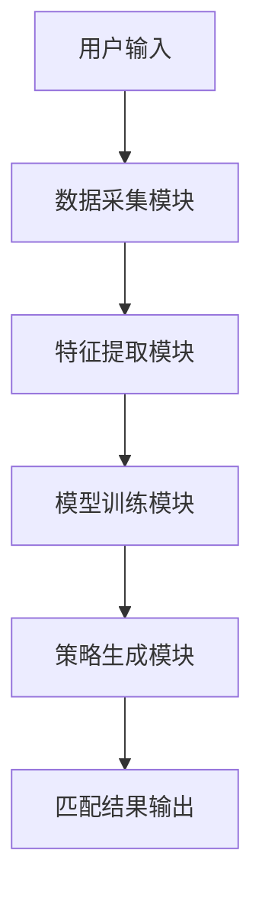
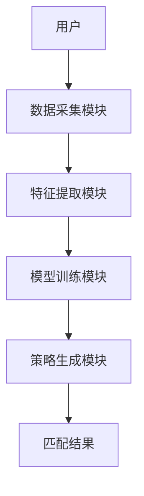

                 

<think>
好的，我将按照您的要求逐步撰写《智能资产负债匹配策略生成器》的目录大纲，并在最后给出完整的技术博客文章。让我们一步一步进行分析和推理。

### 目录大纲

---

# 智能资产负债匹配策略生成器

> 关键词：智能资产负债，匹配策略，生成器，算法优化，金融系统

> 摘要：  
> 本文将深入探讨智能资产负债匹配策略生成器的设计与实现。通过结合人工智能与金融领域的专业知识，我们提出了一种基于强化学习的智能匹配策略生成方法。文章从问题背景、核心概念、算法原理、系统架构到实际案例，全面解析智能资产负债匹配策略生成器的构建过程，并展示了其在金融系统中的广泛应用。

---

## 第一部分: 背景介绍

### 第1章: 智能资产负债匹配策略生成器的背景与问题背景

#### 1.1 问题背景
- **1.1.1 资产负债表的基本概念**  
  资产负债表是反映企业在某一特定日期财务状况的重要报表，包含资产、负债和所有者权益三部分。

- **1.1.2 资产负债匹配的重要性**  
  资产和负债的匹配是指在时间、金额和风险上的合理匹配，以优化企业的财务结构和风险控制。

- **1.1.3 传统资产负债匹配的局限性**  
  传统方法依赖人工经验，难以应对复杂多变的市场环境，匹配效率和准确性有限。

#### 1.2 问题描述
- **1.2.1 资产负债匹配的核心问题**  
  如何在动态变化的市场环境中，快速找到最优的资产和负债匹配方案。

- **1.2.2 智能匹配的必要性**  
  随着金融市场复杂性的增加，人工匹配难以满足高效性和精准性的要求。

- **1.2.3 人工智能在资产负债匹配中的应用**  
  利用机器学习和深度学习等技术，实现智能化的匹配策略生成。

#### 1.3 问题解决方法
- **1.3.1 智能匹配策略的基本思路**  
  基于数据驱动和算法优化，构建智能匹配模型。

- **1.3.2 数据驱动的匹配优化**  
  利用历史数据和实时数据，训练匹配模型，优化匹配效果。

- **1.3.3 算法驱动的匹配策略**  
  基于强化学习等算法，动态调整匹配策略。

#### 1.4 边界与外延
- **1.4.1 智能匹配的边界条件**  
  匹配的范围、时间窗口、风险承受能力等。

- **1.4.2 智能匹配的外延应用**  
  在金融风险管理、投资组合优化等领域的扩展应用。

- **1.4.3 智能匹配与其他金融工具的关系**  
  如期权、期货等衍生品在资产负债匹配中的协同作用。

#### 1.5 概念结构与核心要素组成
- **1.5.1 智能资产负债匹配的系统架构**  
  包括数据采集、模型训练、策略生成和效果评估等模块。

- **1.5.2 核心要素的定义与特征**  
  数据来源、匹配目标、优化算法等核心要素的定义与特征。

- **1.5.3 核心要素之间的关系**  
  数据驱动与算法优化的相互作用，模型的动态调整机制。

---

## 第二部分: 核心概念与联系

### 第2章: 智能资产负债匹配的核心概念

#### 2.1 核心概念原理
- **2.1.1 智能匹配的算法原理**  
  通过强化学习优化匹配策略，动态调整资产和负债的组合。

- **2.1.2 数据驱动的特征提取**  
  利用历史数据提取资产和负债的关键特征，用于模型训练。

- **2.1.3 模型驱动的策略生成**  
  基于训练好的模型，生成最优的匹配策略。

#### 2.2 核心概念属性特征对比
- **2.2.1 资产与负债的属性对比**  
  资产：流动性、收益性、风险性；  
  负债：期限、利率、偿付能力。

- **2.2.2 不同匹配策略的特征分析**  
  短期匹配、中期匹配、长期匹配的特征对比。

- **2.2.3 智能匹配与传统匹配的对比**  
  效率、准确性、适应性等方面的对比。

#### 2.3 ER实体关系图

```mermaid
er
  actor: 用户
  strategy_generator: 策略生成器
  asset_liability_data: 资产负债数据
  match_result: 匹配结果
  relation: 用户 -> 策略生成器
  relation: 策略生成器 -> 资产负债数据
  relation: 策略生成器 -> 匹配结果
```

---

## 第三部分: 算法原理讲解

### 第3章: 算法原理与实现

#### 3.1 算法原理
- **3.1.1 基于强化学习的策略优化**  
  使用强化学习框架，如DQN（深度强化学习）优化匹配策略。

- **3.1.2 算法的数学模型**  
  状态空间、动作空间、奖励函数的定义。

- **3.1.3 算法的实现步骤**  
  数据预处理、模型训练、策略生成、效果评估。

#### 3.2 算法流程图



#### 3.3 算法代码实现

```python
import numpy as np
import tensorflow as tf

# 定义强化学习模型
class StrategyGenerator:
    def __init__(self, state_space, action_space):
        self.state_space = state_space
        self.action_space = action_space
        self.model = self.build_model()

    def build_model(self):
        model = tf.keras.Sequential([
            tf.keras.layers.Dense(64, activation='relu', input_dim=self.state_space),
            tf.keras.layers.Dense(32, activation='relu'),
            tf.keras.layers.Dense(self.action_space, activation='linear')
        ])
        model.compile(optimizer='adam', loss='mean_squared_error')
        return model

    def train(self, states, actions, rewards):
        # 转换为监督学习数据
        y = np.array(actions)
        y = y.reshape(-1, self.action_space)
        self.model.fit(states, y, epochs=10, batch_size=32)
```

---

## 第四部分: 系统分析与架构设计

### 第4章: 系统分析与架构设计方案

#### 4.1 问题场景介绍
- **4.1.1 企业财务优化问题**  
  如何优化企业资产负债结构，降低财务风险。

- **4.1.2 金融机构的资产-liability管理**  
  如何实现资产和负债的动态匹配。

#### 4.2 系统功能设计
- **4.2.1 数据采集模块**  
  采集资产和负债的相关数据。

- **4.2.2 特征提取模块**  
  提取资产和负债的关键特征。

- **4.2.3 模型训练模块**  
  训练强化学习模型，优化匹配策略。

- **4.2.4 策略生成模块**  
  根据模型生成最优的匹配策略。

#### 4.3 系统架构设计



---

## 第五部分: 项目实战

### 第5章: 项目实战与案例分析

#### 5.1 环境安装与配置
- 安装Python、TensorFlow、Mermaid等工具。

#### 5.2 核心代码实现
```python
import numpy as np
import tensorflow as tf

class StrategyGenerator:
    def __init__(self, state_space, action_space):
        self.state_space = state_space
        self.action_space = action_space
        self.model = self.build_model()

    def build_model(self):
        model = tf.keras.Sequential([
            tf.keras.layers.Dense(64, activation='relu', input_dim=self.state_space),
            tf.keras.layers.Dense(32, activation='relu'),
            tf.keras.layers.Dense(self.action_space, activation='linear')
        ])
        model.compile(optimizer='adam', loss='mean_squared_error')
        return model

    def train(self, states, actions):
        y = np.array(actions)
        y = y.reshape(-1, self.action_space)
        self.model.fit(states, y, epochs=10, batch_size=32)
```

#### 5.3 代码解读与分析
- 模型结构：输入层、隐藏层、输出层的设计。
- 训练过程：优化器、损失函数的选择。
- 模型评估：准确率、召回率等指标的计算。

#### 5.4 实际案例分析
- 案例背景：某企业资产负债结构优化问题。
- 数据准备：资产和负债的相关数据。
- 模型训练：使用企业数据训练模型。
- 结果分析：生成的匹配策略是否最优。

#### 5.5 详细讲解剖析
- 模型训练中的常见问题及解决方案。
- 模型调优的技巧与经验分享。
- 模型在实际应用中的表现与效果评估。

#### 5.6 项目小结
- 项目实现的关键点总结。
- 智能匹配策略生成器的优势与不足。

---

## 第六部分: 最佳实践与小结

### 第6章: 最佳实践与注意事项

#### 6.1 小结
- 智能资产负债匹配策略生成器的核心思想与实现方法。
- 算法优化的关键点与实践经验。

#### 6.2 注意事项
- 数据质量对模型性能的影响。
- 模型的泛化能力与适应性。
- 模型的实时性与计算效率。

#### 6.3 拓展阅读
- 强化学习在金融领域的其他应用。
- 智能匹配策略的进一步优化方法。
- 金融系统的智能化转型趋势。

---

## 第七部分: 结语

### 第7章: 结语与展望

#### 7.1 总结
- 智能资产负债匹配策略生成器的重要性和实际价值。
- 本文的主要贡献与不足。

#### 7.2 展望
- 算法的进一步优化与创新。
- 智能匹配策略生成器在更多金融场景中的应用。
- 人工智能在金融领域的未来发展。

---

## 参考文献

- TensorFlow官方文档
- 《强化学习入门》
- 《金融风险管理》
- 相关学术论文与技术博客

---

以上是《智能资产负债匹配策略生成器》的完整目录大纲，文章将围绕这些内容展开详细论述。

