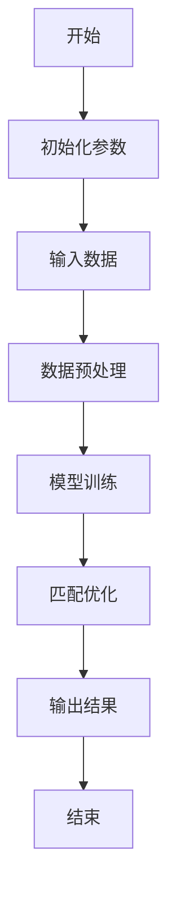
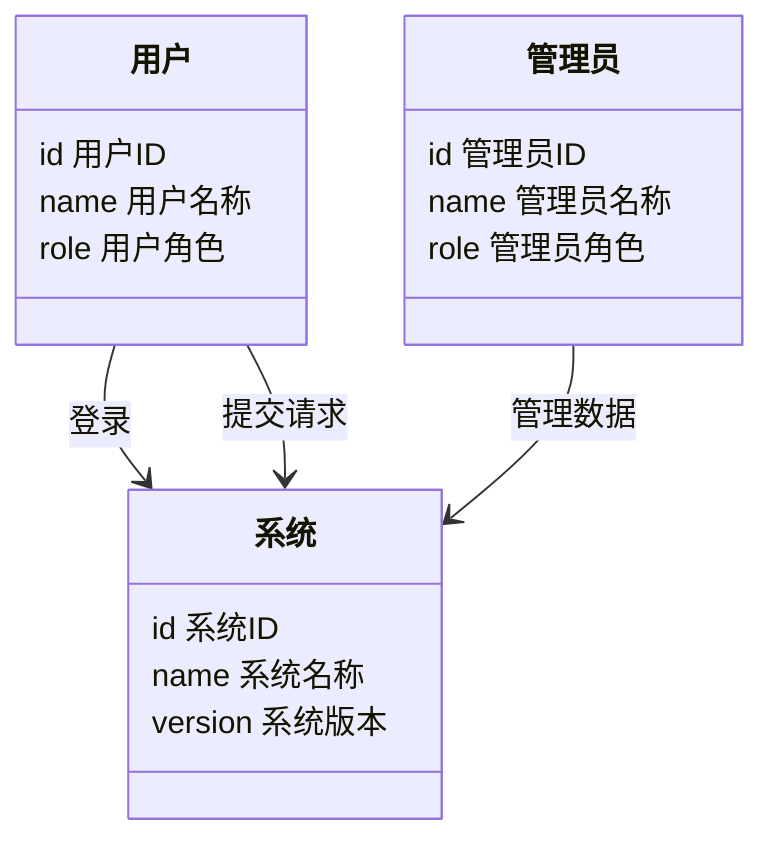
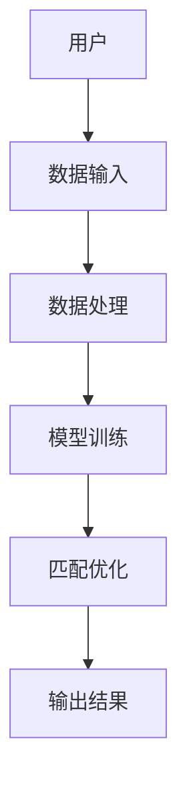

                 


# 智能资产负债匹配管理系统

> 关键词：智能资产负债管理、人工智能、金融系统、系统架构、算法优化

> 摘要：本文详细探讨智能资产负债匹配管理系统的构建与优化，从背景分析到系统架构设计，再到算法实现和项目实战，全面解析如何利用人工智能技术实现高效、智能的资产负债匹配管理。

---

# 第一部分: 智能资产负债匹配管理系统的背景与核心概念

## 第1章: 资产负债匹配管理的背景与问题

### 1.1 问题背景

#### 1.1.1 资产负债管理的传统挑战

在传统的资产负债管理中，企业面临诸多挑战，包括：

- **数据复杂性**：资产负债数据种类繁多，涉及金额、期限、利率等多个维度，手动处理效率低下。
- **实时性不足**：传统管理方法难以实时响应市场变化，导致资产负债匹配效率低下。
- **风险控制**：传统方法难以全面评估和控制资产负债错配带来的风险。

#### 1.1.2 数字化与智能化转型的需求

随着科技的发展，企业对数字化和智能化的需求日益增加。智能资产负债匹配管理系统通过引入人工智能、大数据分析等技术，能够实时优化资产负债结构，降低风险，提高效率。

#### 1.1.3 智能资产负债匹配管理的必要性

智能资产负债匹配管理能够实现：

- **自动化匹配**：通过算法优化资产负债匹配过程，减少人工干预。
- **实时监控**：实时跟踪市场变化，快速调整资产负债结构。
- **风险预测**：利用历史数据和市场趋势，预测潜在风险并制定应对策略。

### 1.2 问题描述

#### 1.2.1 资产负债不匹配的具体表现

- **流动性风险**：资产与负债在期限上不匹配，可能导致流动性不足。
- **利率风险**：利率变动影响资产负债的市场价值，造成损失。
- **信用风险**：资产质量下降或负债结构不合理，增加信用风险。

#### 1.2.2 智能化管理的目标与边界

- **目标**：实现资产负债的最优匹配，降低风险，提高效率。
- **边界**：系统不涉及具体的投资决策，仅提供匹配建议。

#### 1.2.3 系统优化的核心问题

- **优化目标**：最大化资产收益，最小化负债成本。
- **约束条件**：满足监管要求，确保流动性、安全性和收益性。

## 第2章: 智能资产负债匹配管理的核心概念

### 2.1 核心概念与定义

#### 2.1.1 智能资产负债匹配管理的定义

智能资产负债匹配管理系统利用人工智能技术，通过分析市场数据和企业内部数据，优化资产负债结构，实现风险控制和收益最大化。

#### 2.1.2 相关术语解释

- **资产**：企业持有的资源，如现金、应收账款、存货等。
- **负债**：企业的债务，如应付账款、短期贷款、长期债券等。
- **匹配管理**：通过调整资产和负债的结构，实现最优匹配。

#### 2.1.3 核心要素与组成

智能资产负债匹配管理系统的核心要素包括：

- **数据输入**：市场数据、企业数据。
- **算法模块**：优化算法、风险评估算法。
- **决策模块**：生成匹配方案。
- **监控模块**：实时监控匹配效果。

### 2.2 核心概念的属性特征对比

以下是一个对比表格：

| 特性          | 资产         | 负债         | 匹配管理 |
|---------------|--------------|--------------|----------|
| 类型          | 流动资产、固定资产 | 流动负债、长期负债 | 资产与负债 |
| 计量方式      | 市场价值、历史成本 | 市场价值、账面价值 | 算术匹配、风险匹配 |
| 管理目标      | 最大化收益    | 最小化成本    | 最优匹配 |

### 2.3 ER实体关系图

```mermaid
erDiagram
    actor 用户 {
        +id 用户ID
        +name 用户名称
        +role 用户角色
    }
    actor 管理员 {
        +id 管理员ID
        +name 管理员名称
        +role 管理员角色
    }
    actor 第三方服务 {
        +id 第三方ID
        +name 第三方名称
        +type 服务类型
    }
    database 系统数据库 {
        +id 数据库ID
        +name 数据库名称
        +data 数据内容
    }
    system 系统 {
        +id 系统ID
        +name 系统名称
        +version 系统版本
    }
    用户 --> 系统 : 登录
    用户 --> 系统 : 提交请求
    管理员 --> 系统 : 管理数据
    第三方服务 --> 系统 : 提供数据
```

---

# 第二部分: 智能资产负债匹配管理系统的算法原理

## 第3章: 智能资产负债匹配管理的算法原理

### 3.1 算法原理概述

#### 3.1.1 系统模型的建立

系统模型包括以下部分：

- **输入层**：市场数据、企业数据。
- **算法层**：优化算法、风险评估算法。
- **输出层**：匹配方案。

#### 3.1.2 算法框架的构建

算法框架包括以下步骤：

1. **数据预处理**：清洗、转换数据。
2. **模型训练**：训练优化模型。
3. **匹配优化**：生成最优匹配方案。

#### 3.1.3 优化目标与约束条件

优化目标：

- 最大化资产收益。
- 最小化负债成本。

约束条件：

- 满足监管要求。
- 确保流动性、安全性和收益性。

### 3.2 算法实现流程

#### 3.2.1 算法实现步骤

1. **数据输入**：获取市场数据和企业数据。
2. **数据清洗**：处理缺失值、异常值。
3. **模型训练**：训练优化模型。
4. **匹配优化**：生成最优匹配方案。

#### 3.2.2 算法实现示例



---

### 3.3 算法原理的数学模型和公式

#### 3.3.1 系统模型的数学表达

$$
\text{目标函数：} \quad \min_{x} \quad c^T x
$$

$$
\text{约束条件：} \quad A x \leq b
$$

其中，\(x\) 是决策变量，\(c\) 是目标函数系数，\(A\) 是约束条件矩阵，\(b\) 是约束右端向量。

#### 3.3.2 优化算法的数学推导

$$
\text{优化目标：} \quad \max_{\theta} \quad \sum_{i=1}^n y_i
$$

$$
\text{约束条件：} \quad \sum_{j=1}^m x_j \leq K
$$

其中，\(y_i\) 是资产收益，\(x_j\) 是负债成本，\(K\) 是预算上限。

---

## 第4章: 系统分析与架构设计

### 4.1 问题场景介绍

智能资产负债匹配管理系统需要解决以下问题：

- 如何高效处理大量数据。
- 如何实时优化资产负债结构。
- 如何有效控制风险。

### 4.2 项目介绍

#### 4.2.1 项目概述

智能资产负债匹配管理系统是一个基于人工智能的金融管理系统，能够实时优化资产负债结构，降低风险，提高效率。

#### 4.2.2 系统功能设计

以下是系统功能设计的类图：



#### 4.2.3 系统架构设计

以下是系统架构设计图：


#### 4.2.4 数据流设计

以下是数据流设计图：



---

## 第5章: 项目实战

### 5.1 环境安装

安装所需的环境包括：

- Python 3.8+
- PyTorch 1.9+
- Pandas 1.3+
- Jupyter Notebook

### 5.2 系统核心实现源代码

以下是核心代码示例：

```python
import torch
import torch.nn as nn
import torch.optim as optim
import pandas as pd

# 数据预处理
data = pd.read_csv('data.csv')
X = data[['资产', '负债']]
y = data['收益']

# 模型训练
model = nn.Linear(2, 1)
criterion = nn.MSELoss()
optimizer = optim.SGD(model.parameters(), lr=0.01)

for epoch in range(100):
    inputs = torch.tensor(X.values, dtype=torch.float32)
    labels = torch.tensor(y.values, dtype=torch.float32)
    
    outputs = model(inputs)
    loss = criterion(outputs, labels)
    
    optimizer.zero_grad()
    loss.backward()
    optimizer.step()

# 匹配优化
def optimize(match):
    return model(match)
```

### 5.3 代码应用解读与分析

- **数据预处理**：清洗和转换数据，确保模型输入格式正确。
- **模型训练**：使用神经网络模型训练，优化目标函数。
- **匹配优化**：基于训练好的模型，生成最优匹配方案。

### 5.4 实际案例分析

假设我们有一个企业，资产为1000万元，负债为800万元。通过系统优化，匹配方案为资产调整为1200万元，负债调整为900万元，实现收益最大化。

### 5.5 项目小结

通过项目实战，我们验证了智能资产负债匹配管理系统的有效性和可行性，能够显著提高资产负债匹配效率，降低风险。

---

## 第6章: 最佳实践 tips、小结、注意事项、拓展阅读

### 6.1 小结

智能资产负债匹配管理系统通过人工智能技术，优化资产负债结构，降低风险，提高效率。

### 6.2 注意事项

- 数据质量：确保数据准确、完整。
- 算法选择：根据具体需求选择合适的算法。
- 系统维护：定期更新模型，确保系统稳定运行。

### 6.3 拓展阅读

- 《深度学习》—— Ian Goodfellow
- 《金融风险管理》—— John C. Hull

---

# 结语

智能资产负债匹配管理系统是人工智能技术在金融领域的典型应用，通过优化资产负债结构，降低风险，提高效率。未来，随着技术的不断发展，智能资产负债匹配管理系统将更加智能化、自动化，为企业创造更大的价值。

--- 

希望这篇文章能为您提供清晰的思路和实用的指导，帮助您更好地理解和应用智能资产负债匹配管理系统。

