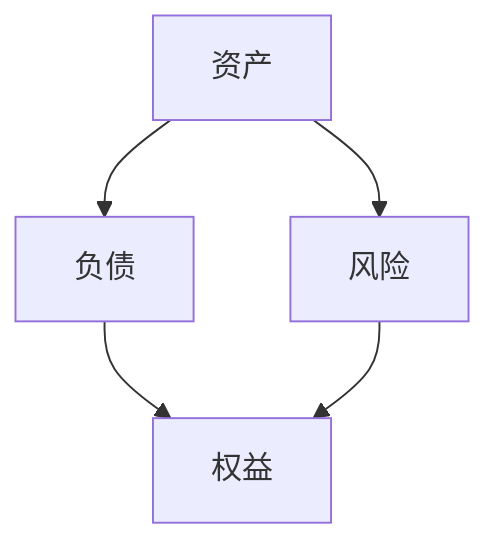
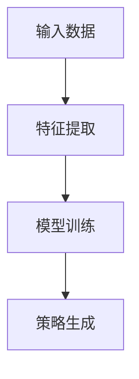
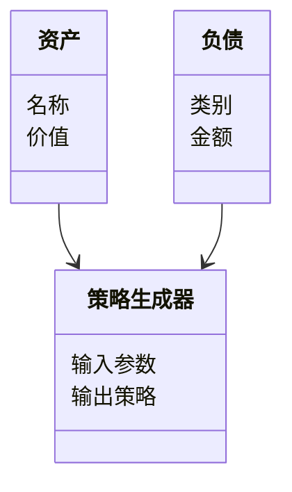
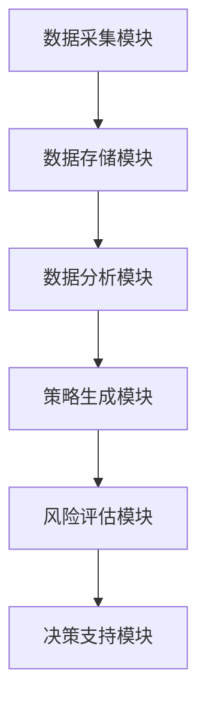
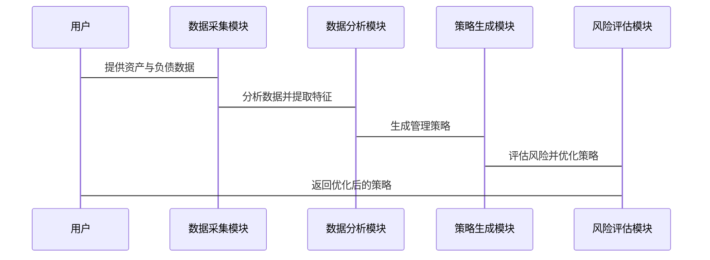

                 


# 智能资产负债管理策略生成器

> 关键词：智能资产负债管理，策略生成器，机器学习，算法原理，系统架构，项目实战

> 摘要：智能资产负债管理是金融领域的重要组成部分，通过结合人工智能和大数据分析，可以实现更高效、更精准的资产与负债管理策略生成。本文将从智能资产负债管理的背景与核心概念出发，详细讲解其算法原理、系统架构设计、项目实战及最佳实践，帮助读者全面理解并掌握智能资产负债管理策略生成器的实现与应用。

---

## 第1章: 智能资产负债管理策略生成器的背景与核心概念

### 1.1 问题背景与问题描述

#### 1.1.1 资产负债管理的传统模式

传统资产负债管理主要依赖于人工经验和简单的统计分析，这种方式存在效率低、精度差、响应慢等问题。随着金融市场日益复杂化，传统方法难以满足现代金融业务的需求。

#### 1.1.2 传统资产负债管理的局限性

- 数据处理能力有限
- 策略生成缺乏灵活性
- 风险预测能力不足
- 无法实时响应市场变化

#### 1.1.3 智能资产负债管理的必要性

- 提高数据处理效率
- 实现自动化、智能化的策略生成
- 提升风险预测能力
- 适应快速变化的市场环境

### 1.2 问题解决与边界定义

#### 1.2.1 智能资产负债管理的核心目标

- 实现资产与负债的动态平衡
- 提高风险预测与控制能力
- 优化资源配置效率
- 提供智能化的决策支持

#### 1.2.2 解决方案的边界与外延

- 数据范围：包括资产、负债、市场数据等
- 功能范围：涵盖数据采集、分析、策略生成、风险评估等
- 使用场景：适用于银行、投资机构、企业财务等部门

#### 1.2.3 核心要素与组成结构

- 数据采集模块
- 数据分析模块
- 策略生成模块
- 风险评估模块
- 决策支持模块

### 1.3 核心概念与联系

#### 1.3.1 智能资产负债管理的原理

智能资产负债管理通过收集和分析资产与负债相关的数据，利用机器学习、大数据分析等技术，生成最优的资产负债管理策略。

#### 1.3.2 核心概念对比表

| 概念 | 资产 | 负债 |
|------|------|------|
| 定义 | 资产是企业拥有的资源，预期能够带来经济利益的流入 | 负债是企业承担的义务，预期会导致经济利益的流出 |
| 类型 | 流动资产、非流动资产 | 流动负债、非流动负债 |
| 计量 | 历史成本、公允价值 | 现值、终值 |
| 风险 | 市场风险、流动性风险 | 利率风险、信用风险 |

#### 1.3.3 ER实体关系图



### 1.4 本章小结

本章介绍了智能资产负债管理的背景与核心概念，分析了传统资产负债管理的局限性，明确了智能资产负债管理的核心目标和实现方式，为后续章节的展开奠定了基础。

---

## 第2章: 智能资产负债管理的算法原理

### 2.1 算法原理概述

#### 2.1.1 基于机器学习的策略生成

智能资产负债管理策略生成器通过机器学习算法，从历史数据中学习资产负债管理的规律，生成最优的管理策略。



#### 2.1.2 算法实现代码示例

```python
import numpy as np
from sklearn.tree import DecisionTreeRegressor

# 示例数据
X = np.array([[1, 2], [3, 4], [5, 6]])
y = np.array([7, 8, 9])

# 训练模型
model = DecisionTreeRegressor()
model.fit(X, y)

# 预测
print(model.predict([[7, 8]]))
```

### 2.2 数学模型与公式

#### 2.2.1 最优化模型

$$ \text{目标函数} = \min \sum_{i=1}^{n} (x_i - \hat{x}_i)^2 $$

#### 2.2.2 动态规划算法

$$ \text{状态转移方程} = s_{t+1} = s_t + a_t $$

### 2.3 举例说明

#### 2.3.1 简单案例分析

假设某银行有10亿元人民币的资产和8亿元人民币的负债，希望通过智能资产负债管理策略生成器优化其资产负债结构，降低风险并提高收益。

### 2.4 本章小结

本章详细讲解了智能资产负债管理的算法原理，通过机器学习算法和数学模型，展示了如何通过数据驱动的方式生成最优的资产负债管理策略。

---

## 第3章: 系统分析与架构设计

### 3.1 项目背景与目标

#### 3.1.1 项目背景介绍

随着金融市场的快速发展，传统的资产负债管理方式已无法满足现代金融机构的需求。智能资产负债管理策略生成器旨在通过技术创新，提供高效、智能的解决方案。

#### 3.1.2 项目目标设定

- 实现资产与负债的智能匹配
- 提供动态的策略生成能力
- 实现风险的实时监控与预警
- 提供可视化的决策支持

### 3.2 系统功能设计

#### 3.2.1 领域模型类图



#### 3.2.2 系统架构设计



#### 3.2.3 系统接口设计

- 数据接口：支持多种数据格式的导入与导出
- API接口：提供RESTful API，供其他系统调用
- 用户界面：提供友好的操作界面，支持可视化分析

#### 3.2.4 系统交互流程



### 3.3 本章小结

本章从系统设计的角度，详细分析了智能资产负债管理策略生成器的架构设计和功能模块，展示了系统的整体结构和各模块之间的交互关系。

---

## 第4章: 项目实战

### 4.1 环境安装与配置

#### 4.1.1 环境要求

- Python 3.8+
- 数据分析库（Pandas、NumPy）
- 机器学习库（Scikit-learn、XGBoost）
- 数据可视化库（Matplotlib、Seaborn）

#### 4.1.2 安装步骤

```bash
pip install numpy pandas scikit-learn matplotlib
```

### 4.2 核心代码实现

#### 4.2.1 数据采集与预处理

```python
import pandas as pd
import numpy as np

# 读取数据
data = pd.read_csv('balance_sheet.csv')

# 数据清洗
data = data.dropna()
data = pd.get_dummies(data)
```

#### 4.2.2 算法实现

```python
from sklearn.model

