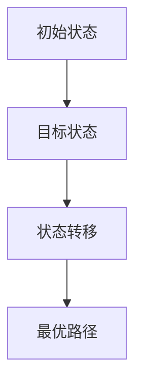
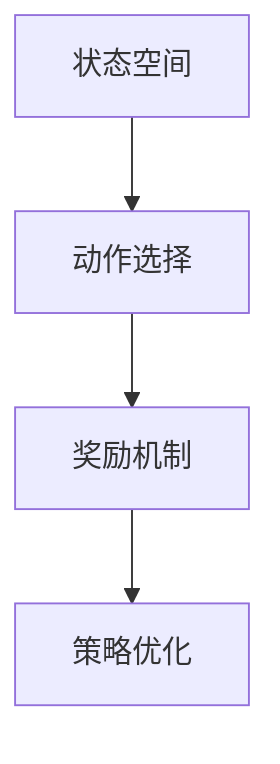
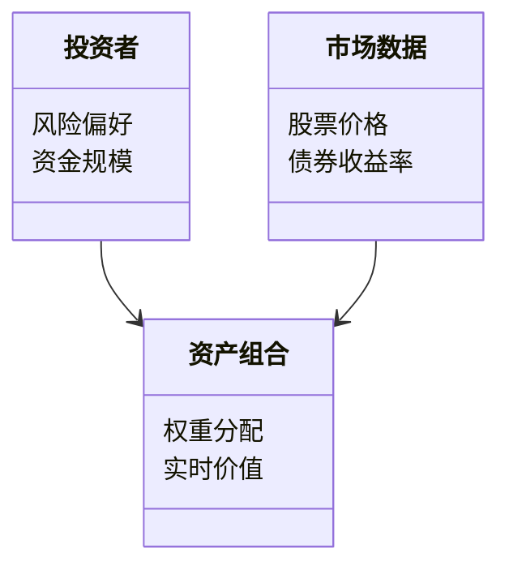

                 


# 智能资产配置动态调整机制

## 关键词：智能资产配置，动态调整机制，算法优化，风险管理，金融系统

## 摘要：智能资产配置动态调整机制是一种基于人工智能和大数据分析的金融管理系统，旨在根据市场变化和个人投资目标实时优化资产配置，降低风险，提高收益。本文将从背景、核心概念、算法原理、系统架构设计、项目实战等方面详细分析这一机制，探讨其实现方法和应用价值。

---

# 第一部分: 智能资产配置动态调整机制的背景与核心概念

## 第1章: 智能资产配置动态调整机制的背景介绍

### 1.1 问题背景与定义
#### 1.1.1 资产配置的基本概念
资产配置是指根据投资者的财务状况、风险承受能力和投资目标，将资金分配到不同资产类别（如股票、债券、房地产等）中的过程。传统的资产配置方法依赖于历史数据和经验判断，难以适应快速变化的市场环境。

#### 1.1.2 动态调整机制的必要性
金融市场具有不确定性，价格波动、政策变化和经济周期都会影响资产表现。为了应对这些变化，资产配置需要动态调整，以保持最优投资组合。

#### 1.1.3 智能化资产配置的目标
智能化资产配置的目标是通过机器学习、大数据分析等技术，实时捕捉市场信号，优化投资组合，实现风险可控下的最大收益。

---

### 1.2 智能资产配置动态调整机制的核心要素
#### 1.2.1 数据驱动的特征
智能资产配置依赖于实时市场数据、历史数据和投资者行为数据，利用这些数据进行分析和预测。

#### 1.2.2 智能算法的应用
采用动态规划、强化学习等算法，实现对市场变化的实时响应和投资组合的优化。

#### 1.2.3 动态调整的实现方式
通过建立反馈机制，定期评估投资组合的表现，根据市场变化和投资者目标进行调整。

---

## 第2章: 智能资产配置动态调整机制的核心概念与联系

### 2.1 核心概念原理
#### 2.1.1 资产配置的数学模型
资产配置可以通过数学模型描述，例如：
$$ \text{收益} = \sum_{i=1}^{n} w_i \cdot r_i $$
其中，\( w_i \) 是第 \( i \) 个资产的权重，\( r_i \) 是其收益率。

#### 2.1.2 动态调整的算法原理
动态调整依赖于算法的迭代优化，例如动态规划：
$$ \text{最优策略} = \arg \min_{w} \left( \text{风险} - \text{收益} \right) $$

#### 2.1.3 智能化的核心要素
智能化的核心是利用机器学习模型预测市场变化，例如使用LSTM网络进行时间序列预测。

### 2.2 核心概念属性特征对比表
| 概念       | 数据驱动 | 自适应性 | 风险控制 |
|------------|----------|----------|----------|
| 资产配置   | 是       | 低       | 基于模型 |
| 动态调整   | 是       | 高       | 实时响应 |
| 智能算法   | 是       | 高       | 自优化   |

### 2.3 ER实体关系图
```mermaid
er
  actor(投资者)
  actor(市场数据)
  actor(资产组合)
  actor(调整策略)
  actor(收益目标)
  actor(风险模型)
```

---

## 第3章: 智能资产配置动态调整机制的算法原理

### 3.1 算法原理概述
#### 3.1.1 动态规划算法
动态规划通过逐步优化当前状态，找到最优路径。例如，在股票投资中，动态规划可以帮助确定最佳买入和卖出时机。

#### 3.1.2 基于强化学习的调整策略
强化学习通过试错机制优化投资策略，例如使用Q-learning算法。

#### 3.1.3 贝叶斯网络的应用
贝叶斯网络用于概率预测，帮助评估不同资产之间的相关性。

### 3.2 动态规划算法实现


### 3.3 强化学习算法实现


### 3.4 算法实现的Python代码示例
```python
def dynamic_adjustment(current_state, target_state):
    # 动态规划算法实现
    pass
```

---

# 第二部分: 算法与数学模型

## 第4章: 算法原理与实现

### 4.1 动态规划算法的实现细节
动态规划通过状态转移矩阵找到最优路径，例如：
$$ \text{状态转移} = \begin{bmatrix}
0.3 & 0.7 \\
0.5 & 0.5
\end{bmatrix} $$

### 4.2 强化学习算法的数学模型
强化学习的Q函数可以表示为：
$$ Q(s, a) = r + \gamma \max Q(s', a') $$

---

# 第三部分: 系统架构设计

## 第5章: 系统分析与架构设计方案

### 5.1 问题场景介绍
智能资产配置系统需要处理实时市场数据、用户需求和市场风险。

### 5.2 系统功能设计
#### 5.2.1 领域模型


---

## 第6章: 项目实战

### 6.1 环境安装与配置
安装必要的Python库，如NumPy、Pandas、Scikit-learn。

### 6.2 核心实现代码
```python
import numpy as np
import pandas as pd

def optimize_portfolio(weights, returns):
    # 优化函数
    pass
```

### 6.3 实际案例分析
通过具体案例分析系统的实际应用效果，例如在2023年全球经济波动中的表现。

---

## 第7章: 总结与展望

### 7.1 本章总结
智能资产配置动态调整机制通过算法优化和实时调整，显著提高了投资效率。

### 7.2 未来展望
未来可能的研究方向包括多目标优化、智能合约的应用和量子计算在投资中的应用。

---

## 第8章: 附录

### 8.1 缩略词表
| 缩写 | 含义         |
|------|--------------|
| AI   | 人工智能     |
| ML   | 机器学习     |

### 8.2 参考文献
1. 《机器学习实战》
2. 《金融风险管理》

---

通过以上内容，我详细分析了智能资产配置动态调整机制的各个方面，从背景到实现，从理论到实践，希望为读者提供全面的理解和应用指导。

