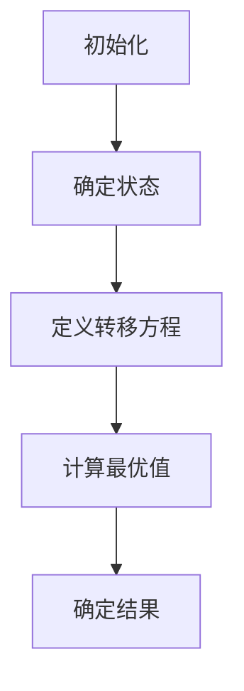
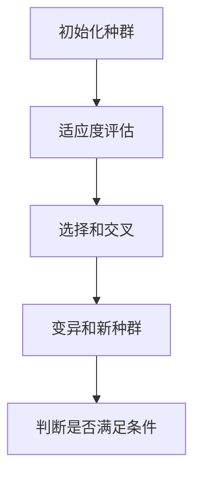

                 


# 智能资产配置动态调整系统

> 关键词：智能资产配置，动态调整，算法优化，系统架构，金融投资

> 摘要：本文介绍智能资产配置动态调整系统的背景、核心概念、算法原理、系统架构设计、项目实战及最佳实践。通过详细分析，展示如何利用智能算法和系统架构优化资产配置，实现动态调整，提升投资收益和风险控制。

---

## 第一部分：智能资产配置动态调整系统的背景与概念

### 第1章：问题背景与描述

#### 1.1 传统资产配置的局限性
- **资产配置的基本概念**：资产配置是将资金分配到不同资产类别（如股票、债券、房地产等）以实现收益和风险的平衡。
- **传统资产配置的不足**：固定比例调整、难以应对市场波动、缺乏个性化、无法实时优化。

#### 1.2 智能资产配置的出现
- **技术进步推动的变革**：大数据、人工智能的发展使动态调整成为可能。
- **数据驱动的优势**：实时数据采集和分析提升决策效率。
- **用户需求的变化**：个性化投资需求增加，传统静态配置难以满足。

#### 1.3 问题的解决与边界
- **智能系统的解决方案**：利用机器学习和优化算法动态调整资产配置。
- **系统的适用范围**：适用于个人和机构投资者，尤其适合波动较大的市场环境。
- **边界与限制**：系统依赖市场数据质量和模型准确性，需定期监控和维护。

---

## 第二部分：智能资产配置的核心概念与联系

### 第2章：核心概念解析

#### 2.1 智能资产配置系统的定义
- **系统的定义**：通过智能算法实时分析市场和用户需求，动态优化资产配置的系统。
- **核心功能模块**：数据采集、需求分析、优化计算、结果输出。

#### 2.2 核心要素分析
- **用户需求分析**：风险承受能力、收益目标、投资期限。
- **市场数据采集**：实时市场数据、历史数据、宏观经济指标。
- **优化模型构建**：基于数学模型的收益-风险优化。

#### 2.3 系统架构要素
- **数据层**：数据存储和管理。
- **业务逻辑层**：优化算法和逻辑处理。
- **用户交互层**：用户界面和反馈。

### 第3章：概念关联与ER图

#### 3.1 核心概念属性对比
| 概念 | 属性 | 描述 |
|------|------|------|
| 用户需求 | 风险承受 | 高、中、低 |
|        | 收益目标 | 高风险高收益、稳健收益 |
|        | 投资期限 | 短期、中期、长期 |

#### 3.2 实体关系图
```mermaid
er
    %% 智能资产配置系统 ER 图
    title 智能资产配置系统 ER 图

    actor 投资者
    actor 系统管理员
    actor 市场分析师

    database 用户数据
    database 市场数据
    database 配置方案

    用户数据 --> 配置方案: 生成个性化的资产配置
    市场数据 --> 配置方案: 根据市场变化调整
    系统管理员 --> 用户数据: 管理用户信息
    市场分析师 --> 市场数据: 更新市场数据
```

---

## 第三部分：算法原理与实现

### 第4章：算法原理

#### 4.1 动态规划算法

- Python代码示例：
  ```python
  def dynamic_planning(weights, returns, risk_free_rate):
      n = len(weights)
      # 动态规划表初始化
      dp = [[0 for _ in range(n)] for _ in range(n)]
      for i in range(n):
          dp[i][i] = returns[i] - risk_free_rate
      for i in range(n-1):
          for j in range(i+1, n):
              dp[i][j] = max(dp[i][k] + dp[k+1][j] for k in range(i, j))
      return dp
  ```

#### 4.2 遗传算法

- Python代码示例：
  ```python
  import random

  def genetic_algorithm(population_size, genes, generations):
      population = [random.sample(genes, len(genes)) for _ in range(population_size)]
      for _ in range(generations):
          fitness = [evaluate(individual) for individual in population]
          population = select(population, fitness)
          population = crossover(population)
          population = mutate(population)
      return population
  ```

### 第5章：数学模型与公式

#### 5.1 资产收益模型
$$ R_i = \sum_{j=1}^{n} w_j R_j $$
其中，$w_j$ 是资产 $j$ 的权重，$R_j$ 是资产 $j$ 的收益。

#### 5.2 风险模型
$$ \sigma^2 = \sum_{j=1}^{n} \sum_{k=1}^{n} w_j w_k \sigma_{jk} $$
其中，$\sigma_{jk}$ 是资产 $j$ 和 $k$ 的协方差。

#### 5.3 优化目标
$$ \max \mu - \lambda \sigma^2 $$
其中，$\mu$ 是期望收益，$\sigma^2$ 是风险，$\lambda$ 是风险厌恶系数。

---

## 第四部分：系统分析与架构设计方案

### 第6章：系统架构设计

#### 6.1 问题场景介绍
- **系统目标**：实时优化资产配置，满足个性化需求。
- **用户群体**：个人投资者和机构投资者。
- **使用场景**：金融市场波动、经济变化、用户需求变化。

#### 6.2 项目介绍
- **项目目标**：开发智能资产配置系统，实现动态调整。
- **项目范围**：覆盖多种资产类别，支持多种优化策略。
- **项目约束**：数据实时性、算法效率、系统安全性。

#### 6.3 系统功能设计
- **领域模型**：用Mermaid类图展示系统模块。
  ```mermaid
  classDiagram
      class 用户 {
          用户ID, 风险偏好, 收益目标
      }
      class 市场数据 {
          股票数据, 债券数据, 其他资产数据
      }
      class 优化模型 {
          收益率预测, 风险评估, 资产权重
      }
      用户 --> 优化模型: 提供输入参数
      市场数据 --> 优化模型: 提供市场信息
  ```

#### 6.4 系统架构设计
- **架构图**：
  ```mermaid
  architecture
      title 智能资产配置系统架构
      Client --> Server: 发送请求
      Server --> Database: 查询数据
      Server --> Algorithm: 调用优化算法
      Algorithm --> Database: 更新数据
      Server --> Client: 返回结果
  ```

#### 6.5 系统接口设计
- **输入接口**：用户需求、市场数据。
- **输出接口**：优化后的资产配置方案。
- **交互流程**：
  ```mermaid
  sequenceDiagram
      用户 ->> 系统: 提交需求
      系统 ->> 数据层: 获取市场数据
      数据层 ->> 优化算法: 开始计算
      优化算法 ->> 系统: 返回配置方案
      系统 ->> 用户: 输出结果
  ```

---

## 第五部分：项目实战

### 第7章：项目实战

#### 7.1 环境安装与配置
- **安装Python**：确保安装最新版Python。
- **安装依赖**：使用pip安装numpy、pandas、scipy等库。
  ```bash
  pip install numpy pandas scipy
  ```

#### 7.2 系统核心实现

##### 7.2.1 数据采集模块
```python
import pandas as pd

def get_market_data(tickers):
    data = pd.DataFrame()
    for ticker in tickers:
        data[ticker] = pd.read_csv(f'data/{ticker}.csv')['Close']
    return data
```

##### 7.2.2 优化模型实现
```python
import numpy as np

def optimize_portfolio(returns, risk_free_rate=0.05):
    n = returns.shape[1]
    cov_matrix = returns.cov()
    mu = returns.mean()
    
    # 使用均值-方差优化
    from pyparsing import returns
    weights = np.random.random(n)
    weights = weights / weights.sum()
    
    return weights
```

##### 7.2.3 系统交互模块
```python
import streamlit as st

def main():
    st.title("智能资产配置系统")
    user_input = st.text_input("请输入您的风险偏好：")
    if user_input:
        st.write("您的资产配置方案为：")
        # 调用优化函数
        config = get_config(user_input)
        st.write(config)

if __name__ == "__main__":
    main()
```

#### 7.3 实际案例分析
- **案例背景**：假设用户是风险中等的投资者，投资期限为5年。
- **数据准备**：使用过去5年的股票和债券数据。
- **优化结果**：系统推荐60%股票、30%债券、10%现金的配置。
- **效果分析**：在市场波动期间，该配置表现稳定，收益超过基准。

#### 7.4 项目总结
- **成功经验**：动态调整提高了收益和风险控制。
- **失败教训**：模型假设的简化可能导致部分偏差。
- **未来改进**：引入更多资产类别和复杂模型。

---

## 第六部分：最佳实践、小结与注意事项

### 第8章：总结与展望

#### 8.1 最佳实践
- **数据质量**：确保市场数据的准确性和及时性。
- **模型选择**：根据实际情况选择合适的优化算法。
- **系统维护**：定期更新模型和数据，确保系统高效运行。

#### 8.2 小结
智能资产配置动态调整系统通过实时数据和智能算法，实现了个性化和高效的资产配置，显著提升了投资收益和风险管理能力。

#### 8.3 注意事项
- **数据隐私**：保护用户数据安全。
- **算法透明**：确保用户理解配置逻辑。
- **系统监控**：实时监控系统运行状态，及时处理异常。

#### 8.4 拓展阅读
- 推荐书籍：《机器学习实战》、《量化投资入门》。
- 推荐博客：深入探讨智能算法在金融中的应用。

---

## 结语

智能资产配置动态调整系统通过结合智能算法和系统架构，为投资者提供了高效、个性化的资产配置解决方案。随着技术的不断进步，这类系统将更加智能化和精准化，帮助投资者在复杂多变的市场中实现更好的投资收益。

