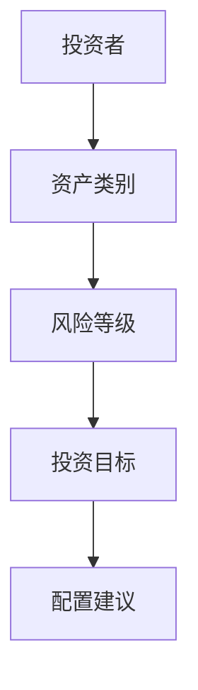
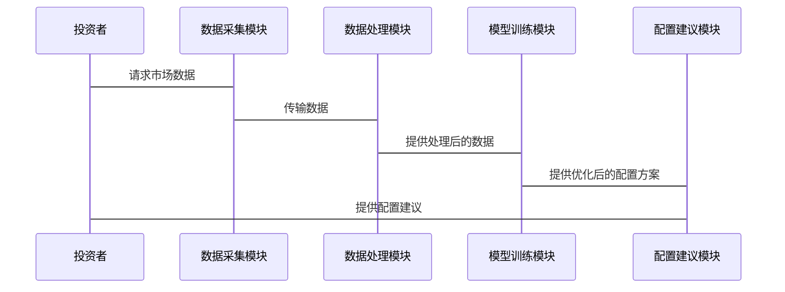

                 


# 智能资产配置建议生成器

> 关键词：智能资产配置、机器学习、投资组合优化、风险管理、算法交易、量化投资

> 摘要：本文详细探讨智能资产配置的背景、核心概念、数学模型与算法原理、系统设计与实现，以及项目实战。通过结合机器学习与投资组合优化的数学模型，本文旨在为读者提供一个系统化的智能资产配置解决方案，并通过具体案例分析展示其实现过程与实际应用效果。

---

# 第一部分: 智能资产配置建议生成器背景与概念

## 第1章: 智能资产配置建议生成器的背景与核心概念

### 1.1 智能资产配置的背景

#### 1.1.1 资产配置的基本概念
资产配置是投资过程中最关键的决策之一，它决定了投资组合中各类资产的权重分布。传统的资产配置依赖于人工分析和经验判断，存在主观性强、效率低下的问题。随着人工智能技术的发展，智能资产配置逐渐成为可能。

#### 1.1.2 智能化配置的必要性
在金融市场日益复杂化的背景下，投资者需要更高效、更精确的工具来优化资产配置。智能资产配置通过机器学习和大数据分析，能够快速处理海量数据，发现隐藏在数据中的投资机会和风险。

#### 1.1.3 传统资产配置与智能配置的对比
传统的资产配置依赖于经验丰富的投资经理，而智能资产配置则通过算法和模型实现自动化配置。两者的主要区别在于效率、精确性和适应性。

### 1.2 智能资产配置的核心概念

#### 1.2.1 资产配置的定义与分类
资产配置是指将资金分配到不同的资产类别（如股票、债券、基金等）中，以实现特定的投资目标。根据时间跨度和风险偏好，资产配置可以分为短期、中期和长期配置。

#### 1.2.2 智能化配置的关键特征
智能资产配置的核心特征包括：自动化、数据驱动、实时调整和个性化定制。这些特征使得智能资产配置能够更好地适应市场变化和投资者需求。

#### 1.2.3 智能资产配置的边界与外延
智能资产配置的边界在于其数据来源和模型的准确性，而外延则体现在其应用场景的多样性。

### 1.3 智能资产配置的技术基础

#### 1.3.1 机器学习在资产配置中的应用
机器学习算法（如支持向量机、随机森林等）可以用于预测市场走势和资产价格，从而为资产配置提供依据。

#### 1.3.2 数据分析与投资组合优化
通过对历史数据和市场数据的分析，可以优化投资组合的风险收益比，实现资产的最优配置。

#### 1.3.3 智能算法的基本原理
智能算法通过数据训练和模型优化，实现对市场趋势的预测和资产配置的自动化调整。

### 1.4 智能资产配置的必要性与优势

#### 1.4.1 提高配置效率
智能资产配置通过自动化和数据驱动的方式，显著提高了资产配置的效率。

#### 1.4.2 降低人为错误
通过算法和模型的优化，智能资产配置减少了人为判断带来的错误。

#### 1.4.3 实现个性化配置
智能资产配置能够根据投资者的具体需求和风险偏好，提供个性化的配置方案。

## 1.5 本章小结

---

## 第2章: 智能资产配置的核心概念与联系

### 2.1 资产配置的数学模型

#### 2.1.1 现代投资组优化（MPT）模型
现代投资组优化（MPT）模型由Harry Markowitz提出，旨在通过优化投资组合的风险和收益，找到最优的资产配置方案。目标函数和约束条件如下：

$$ \text{目标函数：} \min_w \sigma^2(w) $$
$$ \text{约束条件：} \sum_{i=1}^n w_i = 1, \sum_{i=1}^n w_i r_i = R $$

其中，$w_i$ 是资产 $i$ 的权重，$r_i$ 是资产 $i$ 的预期收益，$R$ 是目标收益，$\sigma^2(w)$ 是投资组合的方差。

#### 2.1.2 风险与收益的平衡
资产配置的核心在于平衡风险与收益。通过优化模型，可以在给定风险下最大化收益，或在给定收益下最小化风险。

#### 2.1.3 资产配置的数学表达式
$$ \text{优化目标：} \min_w \sigma^2(w) $$
$$ \text{约束条件：} \sum_{i=1}^n w_i = 1 $$

### 2.2 智能算法的原理

#### 2.2.1 机器学习算法在资产配置中的应用
机器学习算法可以用于预测资产价格、识别市场趋势，从而为资产配置提供依据。例如，使用支持向量机（SVM）进行市场分类，使用随机森林进行资产预测。

#### 2.2.2 算法的特征与选择
算法的选择取决于数据特征和任务需求。例如，回归算法适用于预测连续型变量，分类算法适用于分类任务。

#### 2.2.3 算法的优缺点分析
- 优点：高效、准确、适应性强。
- 缺点：依赖数据质量、需要大量计算资源。

### 2.3 核心概念的ER实体关系图



### 2.4 核心概念的属性特征对比表

| 概念       | 属性       | 特征描述                     |
|------------|------------|------------------------------|
| 资产类别   | 风险等级   | 高、中、低                   |
| 投资目标   | 时间跨度   | 短期、中期、长期             |
| 配置建议   | 操作策略   | 调整权重、资产再平衡         |

### 2.5 本章小结

---

## 第3章: 智能资产配置的数学模型与算法原理

### 3.1 资产配置的数学模型

#### 3.1.1 现代投资组优化（MPT）模型
现代投资组优化（MPT）模型通过优化投资组合的风险和收益，找到最优的资产配置方案。目标函数和约束条件如下：

$$ \text{目标函数：} \min_w \sigma^2(w) $$
$$ \text{约束条件：} \sum_{i=1}^n w_i = 1, \sum_{i=1}^n w_i r_i = R $$

#### 3.1.2 资产配置的数学表达式
$$ \text{优化目标：} \min_w \sigma^2(w) $$
$$ \text{约束条件：} \sum_{i=1}^n w_i = 1 $$

### 3.2 智能算法的实现

#### 3.2.1 算法实现步骤
1. 数据收集：收集历史市场数据和资产价格。
2. 数据预处理：清洗数据，处理缺失值和异常值。
3. 模型训练：使用机器学习算法训练模型。
4. 模型优化：调整模型参数，优化模型性能。
5. 模型部署：将模型部署到生产环境，实时调整资产配置。

#### 3.2.2 算法实现的代码示例

```python
import numpy as np
from sklearn.svm import SVC

# 数据预处理
X = np.array([[1, 2], [3, 4], [5, 6]])
y = np.array([0, 1, 0])

# 模型训练
model = SVC()
model.fit(X, y)

# 模型预测
new_data = np.array([[2, 3]])
print(model.predict(new_data))
```

#### 3.2.3 算法的优缺点分析
- 优点：高效、准确、适应性强。
- 缺点：依赖数据质量、需要大量计算资源。

### 3.3 本章小结

---

## 第4章: 智能资产配置的系统设计与实现

### 4.1 系统设计

#### 4.1.1 问题场景
投资者需要根据市场变化和自身风险偏好，动态调整资产配置。传统的资产配置方法效率低、误差大，难以应对复杂市场环境。

#### 4.1.2 系统架构
系统架构包括数据采集模块、数据处理模块、模型训练模块和配置建议模块。

#### 4.1.3 接口设计
系统接口包括数据接口、模型接口和用户接口。

#### 4.1.4 交互图


### 4.2 系统实现

#### 4.2.1 环境安装
安装必要的库和工具，例如Python、NumPy、Scikit-learn等。

#### 4.2.2 核心实现代码

```python
import numpy as np
from sklearn import svm

# 数据预处理
X = np.array([[1, 2], [3, 4], [5, 6]])
y = np.array([0, 1, 0])

# 模型训练
model = svm.SVC()
model.fit(X, y)

# 模型预测
new_data = np.array([[2, 3]])
print(model.predict(new_data))
```

#### 4.2.3 代码解读与分析
- 数据预处理：清洗和标准化数据。
- 模型训练：使用机器学习算法训练模型。
- 模型预测：根据输入数据预测资产配置方案。

### 4.3 项目实战

#### 4.3.1 实际案例分析
以股票和债券为例，分析如何通过智能资产配置模型优化投资组合。

#### 4.3.2 案例分析与解读
假设投资者有100万元资金，风险偏好为中等。通过智能资产配置模型，优化后的配置方案为：股票60%、债券30%、现金10%。

### 4.4 本章小结

---

## 第5章: 最佳实践与注意事项

### 5.1 最佳实践
- 数据质量是关键，确保数据的准确性和完整性。
- 算法选择要根据具体任务需求，选择合适的模型。
- 模型部署要考虑到计算资源和实时性要求。

### 5.2 小结
智能资产配置通过机器学习和优化算法，能够显著提高资产配置的效率和准确性。

### 5.3 注意事项
- 数据隐私和安全问题需要注意。
- 模型的可解释性是实际应用中的重要考量。
- 系统的实时性和稳定性需要保证。

### 5.4 拓展阅读
建议读者进一步阅读《投资学》和《机器学习实战》等书籍，深入了解智能资产配置的理论和实践。

---

## 附录

### 附录A: 参考文献
1. Markowitz, H. (1952). Portfolio Selection.
2.《机器学习实战》.
3.《投资学》.

### 附录B: 工具推荐
1. Python
2. NumPy
3. Scikit-learn

---

# 结语

智能资产配置建议生成器通过结合机器学习和优化算法，为投资者提供了高效、精确的资产配置解决方案。本文详细探讨了其背景、核心概念、数学模型与算法原理、系统设计与实现，以及项目实战。希望本文能够为读者提供有价值的参考和启发。

