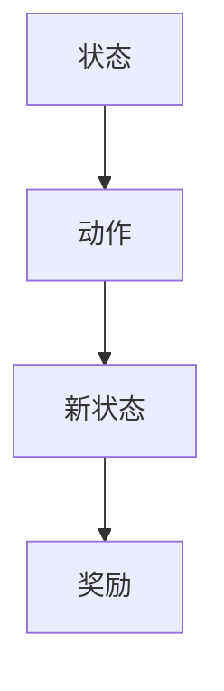
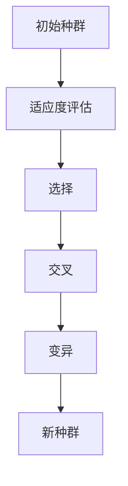
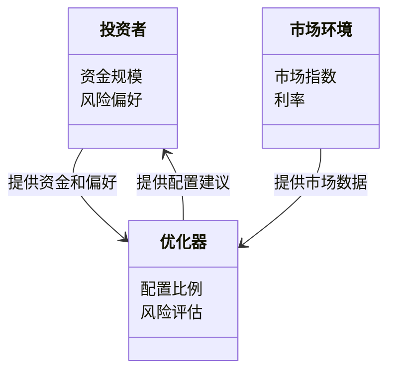
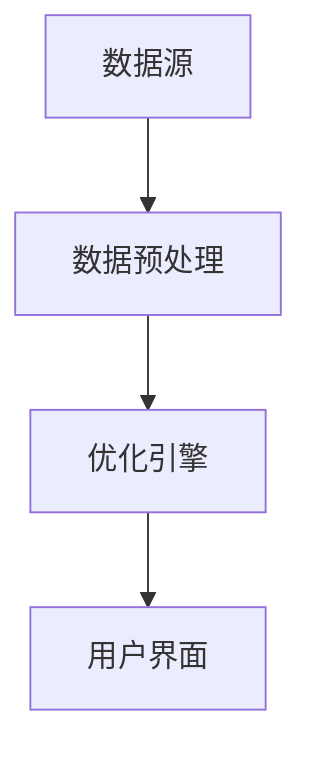
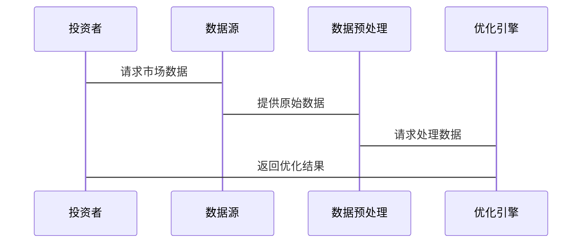

                 


# 《智能资产配置策略动态优化器》

> 关键词：智能资产配置，动态优化，多目标优化，资产组合管理，优化算法，系统架构设计，投资组合优化

> 摘要：本文详细探讨了智能资产配置策略动态优化器的设计与实现。通过分析传统资产配置方法的局限性，提出了动态优化的核心理念，并结合实际案例，详细阐述了优化算法的数学模型、系统架构设计以及项目实战中的具体实现。本文旨在为投资组合优化领域的研究者和实践者提供理论支持和实践指导。

---

# 第一部分: 智能资产配置策略动态优化器的背景与概念

---

## 第1章: 智能资产配置策略动态优化器的背景介绍

### 1.1 问题背景

#### 1.1.1 资产配置的传统方法与局限性
传统的资产配置方法主要依赖于静态分析和固定模型，难以适应市场环境的动态变化。例如，基于历史数据分析的配置策略在面对突发市场波动时往往表现不佳。

#### 1.1.2 动态优化的必要性
金融市场具有高度不确定性，资产价格波动频繁。为了在复杂多变的市场中实现最优收益，需要一种能够实时调整配置策略的方法。

#### 1.1.3 智能化资产配置的兴起
随着人工智能和大数据技术的发展，智能化资产配置逐渐成为研究热点。通过机器学习和深度优化算法，可以实现对市场趋势的实时捕捉和动态调整。

### 1.2 问题描述

#### 1.2.1 资产配置的目标与挑战
- **目标**: 在不同市场环境下实现收益最大化和风险最小化。
- **挑战**: 市场波动、数据噪声、计算复杂度。

#### 1.2.2 动态优化的核心问题
动态优化需要在实时数据流中找到最优解，同时需要考虑多目标之间的平衡。

#### 1.2.3 智能化优化的关键特性
- **实时性**: 及时响应市场变化。
- **适应性**: 根据市场反馈自动调整策略。
- **高效性**: 在较短时间内完成优化计算。

### 1.3 问题解决

#### 1.3.1 智能化资产配置的解决方案
引入机器学习模型（如强化学习、深度学习）和优化算法（如遗传算法、模拟退火）来实现动态调整。

#### 1.3.2 动态优化的具体实现方法
- **数据驱动**: 利用实时市场数据进行分析。
- **模型驱动**: 建立金融模型，预测市场趋势。
- **反馈机制**: 根据市场反馈不断调整配置策略。

#### 1.3.3 技术与业务的结合点
将先进的技术手段（如人工智能、大数据分析）与金融投资理论相结合，实现智能化资产配置。

### 1.4 边界与外延

#### 1.4.1 资产配置的边界条件
- **资金规模**: 配置策略应根据资金规模调整。
- **风险偏好**: 不同投资者的风险承受能力不同。
- **市场环境**: 市场波动性、宏观经济指标等。

#### 1.4.2 动态优化的适用范围
适用于高频交易、动态资产调整、组合优化等场景。

#### 1.4.3 智能化优化的扩展方向
- **多目标优化**: 在收益、风险、流动性之间找到平衡点。
- **个性化配置**: 根据投资者的个性化需求定制策略。
- **全球化配置**: 跨市场、跨资产类别的全球资产配置。

### 1.5 概念结构与核心要素组成

#### 1.5.1 核心概念的层次结构
```
顶层概念：智能化资产配置
中层概念：动态优化、多目标优化、实时反馈
底层概念：数据采集、模型构建、策略执行
```

#### 1.5.2 各要素之间的关系
- 数据采集为模型构建提供基础。
- 模型构建为动态优化提供理论支持。
- 动态优化通过实时反馈调整策略执行。

---

## 第2章: 智能资产配置策略动态优化器的核心概念与联系

### 2.1 核心概念原理

#### 2.1.1 智能化资产配置的定义
智能化资产配置是指利用人工智能技术，根据市场环境和投资者需求，动态调整资产配置比例的过程。

#### 2.1.2 动态优化的基本原理
动态优化通过实时数据反馈，不断调整优化目标，找到最优解。

#### 2.1.3 多目标优化的实现机制
通过引入多目标优化算法，在多个目标之间找到平衡点。

### 2.2 核心概念属性特征对比

| 概念 | 精确性 | 实时性 | 适应性 | 可扩展性 |
|------|--------|--------|--------|----------|
| 智能化资产配置 | 高 | 高 | 强 | 强 |
| 动态优化 | 中 | 高 | 强 | 中 |

### 2.3 ER实体关系图

```mermaid
erDiagram
    actor 投资者 {
        <属性> 资金规模
        <属性> 风险偏好
    }
    actor 市场环境 {
        <属性> 市场指数
        <属性> 利率
    }
    actor 优化器 {
        <属性> 配置比例
        <属性> 风险评估
    }
    投资者 --> 优化器: 提供资金和偏好
    市场环境 --> 优化器: 提供市场数据
    优化器 --> 投资者: 提供配置建议
```

---

## 第3章: 智能资产配置策略动态优化器的算法原理

### 3.1 算法原理讲解

#### 3.1.1 基于强化学习的动态优化算法


#### 3.1.2 基于遗传算法的多目标优化


### 3.2 数学模型与公式

#### 3.2.1 目标函数
$$
\text{最大化 } f(x) = \sum_{i=1}^{n} w_i \cdot r_i
$$

其中，$w_i$ 是第 $i$ 个资产的配置权重，$r_i$ 是其预期收益率。

#### 3.2.2 约束条件
$$
\sum_{i=1}^{n} w_i = 1
$$
$$
w_i \geq 0 \quad \forall i
$$

### 3.3 代码实现

```python
import numpy as np
from scipy.optimize import minimize

def objective(weights, returns):
    return -np.sum(weights * returns)

def constraint(weights):
    return np.sum(weights) - 1

# 示例数据
n_assets = 5
returns = np.array([0.1, 0.2, 0.15, 0.05, 0.25])

# 初始化权重向量
initial_weights = np.array([0.2, 0.2, 0.2, 0.2, 0.2])

# 使用 scipy.optimize.minimize 进行优化
result = minimize(objective, initial_weights, args=returns, method='SLSQP', 
                  constraints={'type': 'eq', 'fun': constraint})

print("最优权重:", result.x)
```

---

## 第4章: 智能资产配置策略动态优化器的系统分析与架构设计

### 4.1 问题场景介绍

#### 4.1.1 投资者需求
- 灵活的资产配置需求。
- 实时市场反馈的需求。

#### 4.1.2 市场环境
- 多变的市场行情。
- 高频交易数据。

### 4.2 系统功能设计

#### 4.2.1 领域模型类图


### 4.3 系统架构设计

#### 4.3.1 分层架构图


#### 4.3.2 接口设计
- 数据输入接口: 从市场环境获取实时数据。
- 优化接口: 调用优化算法进行计算。
- 结果输出接口: 将优化结果返回给投资者。

#### 4.3.3 交互流程图


---

## 第5章: 智能资产配置策略动态优化器的项目实战

### 5.1 环境安装

#### 5.1.1 Python环境
- 安装必要的库：numpy、pandas、scipy、matplotlib。

### 5.2 核心代码实现

#### 5.2.1 数据预处理
```python
import pandas as pd

# 加载数据
data = pd.read_csv('market_data.csv')
data = data.dropna()
```

#### 5.2.2 优化器实现
```python
def optimize_portfolio(returns):
    n = len(returns.columns)
    # 初始化权重向量
    initial_weights = np.array([1.0/n]*n)
    # 定义目标函数
    def objective(weights):
        return -np.sum(weights * returns.mean())
    # 定义约束条件
    def constraint(weights):
        return np.sum(weights) - 1.0
    # 使用 scipy.optimize.minimize 进行优化
    result = minimize(objective, initial_weights, method='SLSQP', 
                      constraints={'type': 'eq', 'fun': constraint})
    return result.x
```

### 5.3 实际案例分析

#### 5.3.1 数据分析与处理
- 数据清洗。
- 统计分析。

#### 5.3.2 优化结果解读
- 最优权重分布。
- 风险收益比分析。

### 5.4 项目小结

---

## 第6章: 智能资产配置策略动态优化器的最佳实践

### 6.1 小结

### 6.2 注意事项

#### 6.2.1 数据质量的重要性
- 数据清洗。
- 数据特征选择。

#### 6.2.2 模型选择的策略
- 根据问题选择合适的算法。
- 考虑计算效率和精度。

### 6.3 拓展阅读

#### 6.3.1 相关技术
- 强化学习在金融中的应用。
- 大数据分析技术。

#### 6.3.2 实际应用案例
- 高频交易中的动态优化。
- 跨资产配置策略。

---

## 第7章: 智能资产配置策略动态优化器的总结与展望

### 7.1 总结
本文详细探讨了智能资产配置策略动态优化器的设计与实现，从理论到实践，全面解析了优化算法和系统架构。

### 7.2 展望
未来的研究方向包括：
- 更高效的优化算法。
- 更智能的决策模型。
- 更广泛的应用场景。

---

# 结束语
智能资产配置策略动态优化器是一个复杂的系统工程，需要结合金融理论与先进技术。通过不断的研究与实践，我们可以为投资者提供更加智能化、个性化的资产配置服务。

--- 

（本文未完，待续）

