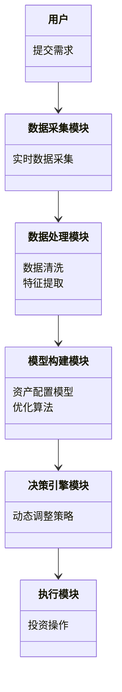

                 


# 智能资产配置策略动态调整系统

## 关键词：智能资产配置，动态调整，人工智能，金融投资，算法优化

## 摘要：本文介绍了一种基于人工智能的智能资产配置策略动态调整系统，结合遗传算法和强化学习等技术，通过实时数据分析和市场预测，实现对投资组合的自动优化和动态调整。文章从系统背景、核心概念、算法原理、数学模型、系统架构、项目实战等多个维度展开分析，详细阐述了系统的实现过程和应用场景，最后给出了最佳实践和未来展望。

---

# 第一部分: 背景介绍

## 第1章: 问题背景

### 1.1 传统资产配置方法的局限性
传统的资产配置方法通常基于历史数据和固定规则，例如均值-方差模型和现代投资组合理论（MPT）。然而，这些方法存在以下问题：
1. **静态性**：传统方法通常假设市场环境不变，无法应对市场波动和突发事件。
2. **人为干扰**：手动调整投资组合需要大量经验和时间，容易受到主观因素影响。
3. **计算复杂性**：随着资产种类和市场的复杂化，传统优化方法在计算效率和精度上存在瓶颈。

### 1.2 动态调整的必要性
资产配置的核心目标是最大化收益并最小化风险。然而，市场环境的变化（如经济周期、政策调整、突发事件等）会显著影响资产的收益和风险特征。因此，需要一种能够实时感知市场变化并快速响应的动态调整机制。

### 1.3 智能化资产配置的机遇与挑战
人工智能技术的发展为资产配置提供了新的可能性，尤其是在数据处理、模式识别和决策优化方面。然而，智能化资产配置也面临以下挑战：
1. **数据质量**：需要大量高质量的市场数据支持模型训练和决策。
2. **模型稳定性**：智能模型需要在不同市场条件下保持稳定性和鲁棒性。
3. **监管合规**：智能资产配置系统需要符合金融监管要求，确保透明性和合规性。

---

## 第2章: 核心概念与系统架构

### 2.1 核心概念
智能资产配置策略动态调整系统的核心概念包括：
1. **资产配置模型**：基于历史数据和市场特征，构建资产配置的数学模型。
2. **动态调整机制**：根据实时市场数据和用户需求，动态调整资产配置比例。
3. **智能优化算法**：利用人工智能算法（如遗传算法、强化学习等）优化资产配置策略。

### 2.2 系统架构
系统的整体架构包括以下几个模块：
1. **数据采集模块**：实时采集市场数据、用户需求和外部事件。
2. **数据处理模块**：对数据进行清洗、特征提取和预处理。
3. **模型构建模块**：基于数据构建资产配置模型和优化算法。
4. **决策引擎模块**：根据模型输出生成动态调整策略。
5. **执行模块**：将调整策略转化为具体的投资操作。

### 2.3 ER实体关系图
```mermaid
er
  actor: 用户
  system: 智能资产配置系统
  asset: 资产
  strategy: 配置策略
  adjustment: 调整记录
  actor --> system: 提交配置需求
  system --> asset: 选择资产
  system --> strategy: 制定策略
  system --> adjustment: 记录调整
```

---

## 第3章: 算法原理与实现

### 3.1 算法原理
智能资产配置策略动态调整系统主要采用以下算法：
1. **遗传算法**：用于优化资产配置比例。
2. **强化学习**：用于动态调整投资策略。

#### 遗传算法流程
```mermaid
graph TD
    A[开始] --> B[初始化参数]
    B --> C[计算当前状态]
    C --> D[选择动作]
    D --> E[执行动作]
    E --> F[评估收益]
    F --> G[更新参数]
    G --> H[判断是否终止]
    H --> A[继续] 或者 H --> 结束
```

#### 强化学习流程
```mermaid
graph TD
    A[开始] --> B[初始化环境]
    B --> C[选择动作]
    C --> D[执行动作]
    D --> E[获取奖励]
    E --> F[更新策略]
    F --> G[判断是否终止]
    G --> A[继续] 或者 G --> 结束
```

### 3.2 算法实现代码
```python
def genetic_algorithm(population, fitness_func, mutation_rate):
    while True:
        population = evaluate(population, fitness_func)
        if stopping_criteria():
            break
        population = mutate(population, mutation_rate)
    return population

def强化学习算法(agent, environment, num_episodes):
    for episode in range(num_episodes):
        state = environment.reset()
        while not done:
            action = agent.act(state)
            next_state, reward, done = environment.step(action)
            agent.remember(state, action, reward, next_state, done)
            agent.learn()
    return agent
```

---

## 第4章: 数学模型与公式

### 4.1 优化模型
智能资产配置的优化目标可以表示为：
$$
\text{maximize } \mu \cdot w - 0.5 \cdot w^T \cdot \Sigma \cdot w
$$
其中，$w$ 是资产权重向量，$\mu$ 是资产收益向量，$\Sigma$ 是资产收益的协方差矩阵。

### 4.2 动态调整公式
基于强化学习的动态调整公式可以表示为：
$$
Q(s, a) = r + \gamma \cdot \max_{a'} Q(s', a')
$$
其中，$s$ 是当前状态，$a$ 是动作，$r$ 是奖励，$\gamma$ 是折扣因子。

---

## 第5章: 系统分析与架构设计

### 5.1 系统功能设计
系统的功能模块包括：
1. 数据采集与处理
2. 资产配置模型构建
3. 动态调整策略生成
4. 投资组合优化
5. 风险评估与监控

### 5.2 系统架构设计


### 5.3 系统接口设计
系统的接口设计包括：
1. 用户接口（API）：接收用户需求和市场数据。
2. 数据接口：与数据源（如股票市场、基金平台）对接。
3. 执行接口：与投资执行系统对接。

---

## 第6章: 项目实战

### 6.1 环境安装
需要安装以下工具和库：
- Python 3.8+
- NumPy, Pandas, Scikit-learn
- TensorFlow 或 PyTorch
- Matplotlib 或 Seaborn

### 6.2 核心代码实现
```python
import numpy as np
import pandas as pd
from sklearn.model_selection import train_test_split
from tensorflow.keras.models import Sequential
from tensorflow.keras.layers import Dense, LSTM

# 数据加载与处理
data = pd.read_csv('market_data.csv')
X = data.drop('label', axis=1).values
y = data['label'].values

X_train, X_test, y_train, y_test = train_test_split(X, y, test_size=0.2)

# 模型构建
model = Sequential()
model.add(LSTM(64, input_shape=(X.shape[1], 1)))
model.add(Dense(1, activation='sigmoid'))
model.compile(loss='binary_crossentropy', optimizer='adam', metrics=['accuracy'])

# 训练模型
model.fit(X_train, y_train, epochs=10, batch_size=32, validation_data=(X_test, y_test))
```

### 6.3 案例分析
通过一个具体案例（如股票投资组合优化）展示系统的实际应用，并分析其效果和优劣。

---

## 第7章: 最佳实践与未来展望

### 7.1 最佳实践
1. **数据质量控制**：确保数据的准确性和完整性。
2. **模型调优**：根据实际效果不断优化算法和模型参数。
3. **风险控制**：建立有效的风险监控机制，防止重大损失。

### 7.2 小结
智能资产配置策略动态调整系统通过结合人工智能技术，显著提高了资产配置的效率和准确性，为投资者提供了更灵活和智能的投资工具。

### 7.3 未来展望
未来，随着人工智能和大数据技术的进一步发展，智能资产配置系统将更加智能化和个性化，能够更好地适应复杂多变的市场环境。

---

通过以上分析，我们全面探讨了智能资产配置策略动态调整系统的实现方法和应用场景，希望为相关领域的研究和实践提供参考和借鉴。

