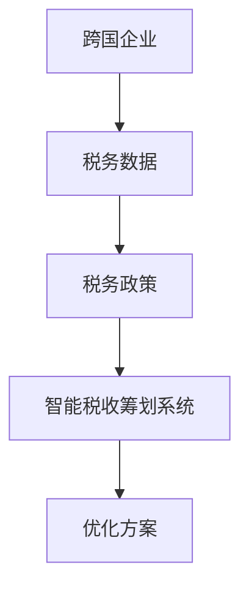
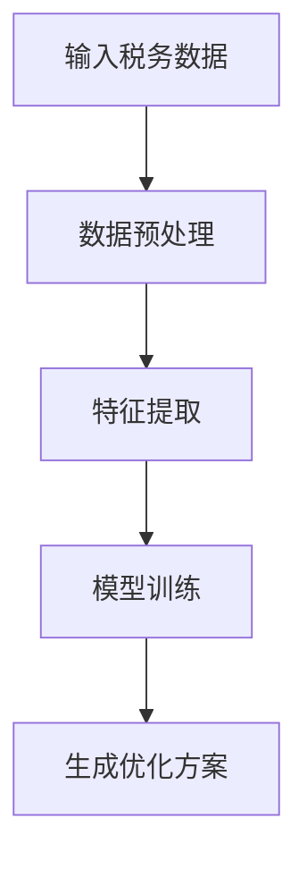
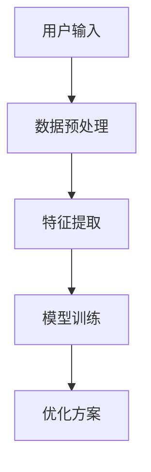

                 


# 智能跨国税收筹划方案生成器

## 关键词：跨国税收筹划、智能税收优化、人工智能、机器学习、自然语言处理

## 摘要：
智能跨国税收筹划方案生成器通过结合人工智能技术，如机器学习和自然语言处理，优化跨国企业的税务规划。本文将详细探讨其背景、原理、系统架构及实际应用，提供技术实现和案例分析，帮助读者理解如何利用AI技术提升税务效率。

---

## 目录大纲

### 第一部分: 背景介绍

#### 第1章: 跨国税收筹划的背景与挑战

- **1.1 跨国税收筹划的背景**
  - 全球化背景下的跨国企业税务问题
  - 跨国税收筹划的核心概念
  - 跨国税收筹划的法律与政策框架

- **1.2 跨国税收筹划的主要挑战**
  - 税收政策的复杂性
  - 跨国税务合规性要求
  - 税务风险与合规性平衡

#### 第2章: 智能税收筹划的核心概念与联系

- **2.1 智能税收筹划系统的核心原理**
  - 数据驱动的税务分析
  - 机器学习在税务优化中的应用
  - 自然语言处理在税务文档中的应用

- **2.2 核心概念对比分析**
  - 传统税收筹划与智能税收筹划的对比
  - 数据驱动与规则驱动的对比
  - 不同国家税务政策的对比

- **2.3 实体关系图（ER图）**
  ```mermaid
  graph TD
      A[跨国企业] --> B[税务数据]
      B --> C[税务政策]
      C --> D[智能税收筹划系统]
      D --> E[优化方案]
  ```

### 第二部分: 算法原理讲解

#### 第3章: 智能跨国税收筹划算法原理

- **3.1 算法流程**
  ```mermaid
  graph TD
      A[输入税务数据] --> B[数据预处理]
      B --> C[特征提取]
      C --> D[模型训练]
      D --> E[生成优化方案]
  ```

- **3.2 机器学习模型实现**
  ```python
  class TaxOptimizer:
      def __init__(self, data):
          self.data = data
          self.model = self.train_model()

      def train_model(self):
          # 训练机器学习模型
          pass

      def optimize_tax(self, input_data):
          # 应用模型生成优化方案
          pass
  ```

- **3.3 数学模型与公式**
  - 税务优化的数学模型
  $$ \text{目标函数} = \sum_{i=1}^{n} w_i x_i $$
  其中，$w_i$ 是权重，$x_i$ 是特征向量。

### 第三部分: 系统分析与架构设计

#### 第4章: 智能跨国税收筹划系统分析

- **4.1 问题场景介绍**
  - 跨国企业面临的税务问题
  - 智能系统的目标

- **4.2 系统功能设计**
  - 数据采集模块
  - 数据分析模块
  - 优化方案生成模块

- **4.3 系统架构设计**
  ```mermaid
  graph TD
      A[用户输入] --> B[数据预处理]
      B --> C[特征提取]
      C --> D[模型训练]
      D --> E[优化方案]
  ```

### 第四部分: 项目实战

#### 第5章: 智能跨国税收筹划方案生成器的实现

- **5.1 环境安装**
  - 安装Python和相关库
  - 安装机器学习框架（如TensorFlow）

- **5.2 核心代码实现**
  ```python
  import pandas as pd
  from sklearn.model import Model

  def preprocess_data(data):
      # 数据预处理
      return processed_data

  def train_model(data):
      # 训练模型
      return model

  def generate_optimization方案(model, input_data):
      # 生成优化方案
      return optimization方案
  ```

- **5.3 案例分析与解读**
  - 具体案例分析
  - 优化方案的展示与解读

### 第五部分: 总结与展望

#### 第6章: 总结与展望

- **6.1 最佳实践 tips**
  - 数据质量的重要性
  - 模型选择的策略

- **6.2 项目小结**
  - 项目实现的关键点
  - 可能遇到的问题及解决方案

- **6.3 注意事项**
  - 数据隐私保护
  - 模型的可解释性

- **6.4 拓展阅读**
  - 推荐的相关书籍和资源

---

## 文章正文

### 第1章: 跨国税收筹划的背景与挑战

#### 1.1 跨国税收筹划的背景

随着全球化的发展，跨国企业在全球范围内运营，面临复杂的税务环境。跨国税收筹划的核心是通过合法手段优化税务负担，提高企业利润。然而，不同国家的税收政策差异大，合规性要求高，传统方法难以应对。

#### 1.2 跨国税收筹划的主要挑战

1. **税收政策的复杂性**：各国税法差异大，需深入理解。
2. **税务合规性要求**：跨国企业需遵守多个国家的税务法规。
3. **税务风险与合规性平衡**：如何在优化税务的同时，避免合规风险。

---

### 第2章: 智能税收筹划的核心概念与联系

#### 2.1 智能税收筹划系统的核心原理

智能税收筹划利用数据驱动的方法，结合机器学习和自然语言处理，自动分析税务数据，生成优化方案。

#### 2.2 核心概念对比分析

通过对比分析，智能方法在数据处理和模型优化上更具优势。

#### 2.3 实体关系图（ER图）



---

### 第3章: 智能跨国税收筹划算法原理

#### 3.1 算法流程



#### 3.2 机器学习模型实现

```python
class TaxOptimizer:
    def __init__(self, data):
        self.data = data
        self.model = self.train_model()

    def train_model(self):
        # 训练机器学习模型
        pass

    def optimize_tax(self, input_data):
        # 应用模型生成优化方案
        pass
```

#### 3.3 数学模型与公式

税务优化的数学模型：
$$ \text{目标函数} = \sum_{i=1}^{n} w_i x_i $$

---

### 第4章: 智能跨国税收筹划系统分析

#### 4.1 问题场景介绍

跨国企业在税务规划中面临复杂性，智能系统帮助优化。

#### 4.2 系统功能设计

- 数据采集模块
- 数据分析模块
- 优化方案生成模块

#### 4.3 系统架构设计



---

### 第5章: 智能跨国税收筹划方案生成器的实现

#### 5.1 环境安装

安装必要的Python库和机器学习框架。

#### 5.2 核心代码实现

```python
import pandas as pd
from sklearn.model import Model

def preprocess_data(data):
    # 数据预处理
    return processed_data

def train_model(data):
    # 训练模型
    return model

def generate_optimization方案(model, input_data):
    # 生成优化方案
    return optimization方案
```

#### 5.3 案例分析与解读

具体案例分析，展示优化方案的生成过程。

---

### 第6章: 总结与展望

#### 6.1 最佳实践 tips

- 数据质量的重要性
- 模型的可解释性

#### 6.2 项目小结

总结项目实现的关键点和经验教训。

#### 6.3 注意事项

- 数据隐私保护
- 模型的可解释性

#### 6.4 拓展阅读

推荐相关书籍和资源，供进一步学习。

---

通过以上步骤，我们可以系统地构建智能跨国税收筹划方案生成器，利用人工智能技术优化税务规划，帮助跨国企业提升效率和合规性。

