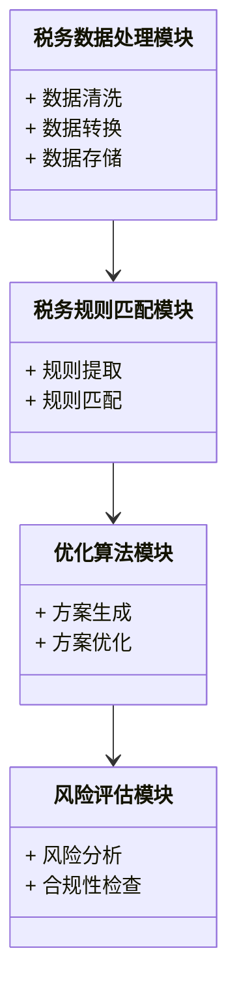
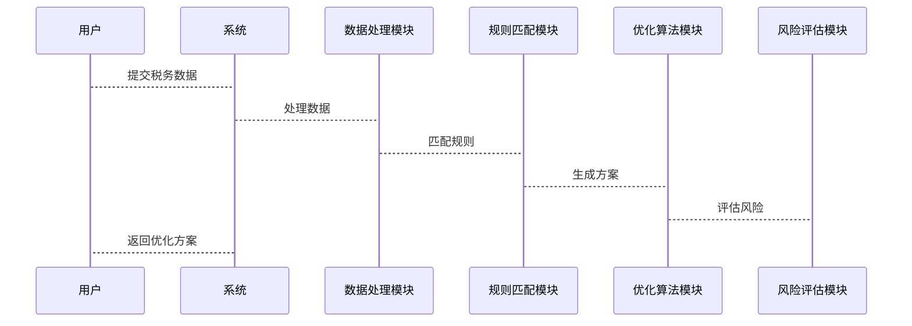

                 


# 智能跨境税收筹划建议系统

## 关键词
智能跨境税收筹划，人工智能，税务优化，数据驱动，系统架构，机器学习

## 摘要
本文探讨了智能跨境税收筹划建议系统的设计与实现，结合人工智能技术，分析了跨境税务的复杂性，提出了一套基于数据驱动的优化方法。文章详细介绍了系统的背景、核心原理、算法设计、数学模型、系统架构，并通过项目实战展示了系统的实现过程。最后，提供了最佳实践和扩展建议，帮助读者深入了解智能跨境税收筹划的应用。

---

## 正文

### 第一部分：背景介绍

#### 第1章：智能跨境税收筹划概述

##### 1.1 问题背景

1.1.1 全球化背景下的税务挑战  
随着全球化的深入，跨国企业和个人面临的税务问题日益复杂。不同国家和地区的税收政策差异大，企业需要在合规的前提下优化税负。然而，传统的人工税务筹划方式效率低下，容易出错，且难以应对复杂的跨境税务规则。

1.1.2 跨境交易的复杂性  
跨境交易涉及多个国家的税务法规，包括增值税、企业所得税、个人所得税等。不同国家的税率、税收优惠和合规要求各不相同，企业在进行税务规划时需要综合考虑这些因素，这对传统的税务筹划方式提出了严峻挑战。

1.1.3 传统税务筹划的局限性  
传统税务筹划主要依赖人工分析，效率低，且容易受到主观因素影响。随着业务规模的扩大和交易复杂性的增加，传统方法难以满足企业的需求，尤其是在应对跨境税务问题时显得力不从心。

##### 1.2 问题描述

1.2.1 跨境税务问题的具体表现  
企业在进行跨国交易时，可能面临双重征税、税率差异、税收优惠政策不一致等问题。此外，不同国家的税务申报要求和截止日期也增加了税务管理的难度。

1.2.2 税务风险与合规性问题  
企业在进行税务规划时，必须确保合规性，避免因税务不合规导致的罚款和法律风险。然而，由于各国税务法规的复杂性，企业往往难以准确把握合规要求。

1.2.3 税务筹划的需求与目标  
企业的税务筹划目标通常是优化税负、降低税务成本，同时确保合规性。然而，如何在复杂的跨境环境中实现这一目标，是企业面临的主要挑战。

##### 1.3 问题解决

1.3.1 智能系统的优势  
智能跨境税收筹划系统利用人工智能技术，能够快速处理大量税务数据，提供准确的税务计算和优化建议。系统可以实时更新各国的税务法规，确保税务筹划的合规性。

1.3.2 数据驱动的税务筹划  
通过收集和分析大量的税务数据，智能系统能够识别税务筹划的潜在机会，帮助企业制定最优的税务策略。数据驱动的方法能够显著提高税务筹划的效率和准确性。

1.3.3 人工智能在税务领域的应用  
人工智能技术，如机器学习和自然语言处理，可以用于自动识别税务规则、预测税务风险和优化税务方案。这些技术的应用能够显著提升税务筹划的智能化水平。

##### 1.4 系统的边界与外延

1.4.1 系统的功能范围  
智能跨境税收筹划系统的主要功能包括税务数据收集与处理、税务规则匹配、税务优化建议生成和税务风险评估。

1.4.2 系统的适用场景  
系统适用于跨国企业、国际贸易公司和个人进行跨境税务筹划。系统能够处理多种类型的跨境交易，包括货物贸易、服务贸易和投资活动。

1.4.3 系统的限制与不足  
尽管智能系统在税务筹划方面具有显著优势，但其依赖于高质量的数据和准确的税务法规更新。此外，系统无法完全替代专业税务顾问的角色，特别是在处理复杂税务问题时需要人工干预。

1.4.4 核心概念与组成  
系统的组成包括税务数据处理模块、税务规则匹配模块、优化算法模块和风险评估模块。核心概念包括税务数据、税务规则和优化目标。

---

### 第二部分：核心概念与联系

#### 第2章：智能跨境税收筹划的核心原理

##### 2.1 核心概念原理

2.1.1 税务数据的处理流程  
税务数据处理包括数据清洗、数据转换和数据存储。系统首先收集多来源的税务数据，然后进行数据清洗，去除无效数据，再进行数据转换，将其转换为适合分析的格式，最后存储在数据库中。

2.1.2 税务规则的匹配与应用  
系统通过自然语言处理技术，从各国的税务法规中提取关键规则，并将其转换为可执行的代码逻辑。税务规则匹配模块能够根据企业的具体情况，匹配适用的税务规则。

2.1.3 税务优化的算法选择  
系统采用遗传算法和模拟退火算法进行税务优化。遗传算法用于生成多种税务方案，模拟退火算法用于优化这些方案，确保找到最优解。

##### 2.2 核心概念属性对比

下表展示了税务数据和税务规则的关键属性对比：

| 属性       | 税务数据                  | 税务规则                  |
|------------|---------------------------|---------------------------|
| 类型       | 数值型、文本型            | 文本型、规则型            |
| 来源       | 企业交易数据、公开数据    | 各国税务法规、政策文件    |
| 处理方式   | 数据清洗、转换            | 规则提取、逻辑转换        |
| 变化频率   | 高（实时更新）            | 中（定期更新）            |

##### 2.3 ER实体关系图

```mermaid
er
    entity 税务数据 {
        key 跨境交易ID
        attribute 交易金额, 交易日期, 参与方, 交易类型
    }
    entity 税务规则 {
        key 规则ID
        attribute 税种, 税率, 适用条件
    }
    entity 税务筹划方案 {
        key 方案ID
        attribute 税务计算结果, 优化建议, 风险评估
    }
    relation 税务数据 --> 税务规则 {
        关系: 适用规则
    }
    relation 税务数据 --> 税务筹划方案 {
        关系: 生成方案
    }
```

---

### 第三部分：算法原理

#### 第3章：算法原理

##### 3.1 算法原理概述

3.1.1 税务优化的算法选择  
系统采用遗传算法和模拟退火算法进行税务优化。遗传算法用于生成多种税务方案，模拟退火算法用于优化这些方案，确保找到最优解。

3.1.2 算法实现步骤  
1. 数据预处理：清洗和转换税务数据。  
2. 规则匹配：根据税务数据匹配适用的税务规则。  
3. 方案生成：使用遗传算法生成多种税务方案。  
4. 方案优化：使用模拟退火算法优化方案，找到最优解。  
5. 风险评估：评估方案的合规性和风险。

##### 3.2 算法实现的代码示例

```python
import numpy as np
import pandas as pd

# 数据预处理
def preprocess_data(data):
    # 假设data是一个包含税务数据的DataFrame
    # 删除缺失值
    data.dropna(inplace=True)
    # 处理异常值
    data = data[abs(data - data.mean()).median() < 3 * data.std()]
    return data

# 遗传算法实现
def genetic_algorithm(population, fitness_fn, mutate_prob=0.1):
    # 初始化种群
    for _ in range(100):
        # 计算适应度
        fitness = fitness_fn(population)
        # 选择
        selected = select(population, fitness)
        # 交叉
        offspring = crossover(selected)
        # 变异
        mutate(offspring, mutate_prob)
        population = offspring
    return population

# 模拟退火算法实现
def simulated_annealing(solution, cost_fn, temp=1000):
    for _ in range(1000):
        # 邻域搜索
        neighbor = perturb(solution)
        # 计算成本
        current_cost = cost_fn(solution)
        neighbor_cost = cost_fn(neighbor)
        # 接受概率
        if neighbor_cost < current_cost or (np.exp((current_cost - neighbor_cost)/temp) > np.random.rand()):
            solution = neighbor
        # 降温
        temp *= 0.99
    return solution
```

##### 3.3 算法的数学模型和公式

税收优化的目标函数可以表示为：

$$ \text{Minimize} \sum_{i=1}^{n} t_i x_i $$

其中，$t_i$ 是第i个国家的税率，$x_i$ 是该国的交易金额。约束条件包括：

$$ \sum_{i=1}^{n} x_i = \text{Total} $$

$$ x_i \geq 0 $$

---

### 第四部分：系统分析与架构设计

#### 第4章：系统分析与架构设计

##### 4.1 问题场景介绍

系统需要处理跨国企业的税务数据，包括交易金额、交易日期、参与方等信息。系统需要根据这些数据，结合各国的税务法规，生成最优的税务筹划方案。

##### 4.2 项目介绍

项目目标是开发一个智能跨境税收筹划建议系统，帮助用户优化税负并确保合规性。项目范围包括税务数据处理、税务规则匹配、优化算法设计和风险评估。

##### 4.3 系统功能设计



##### 4.4 系统架构设计


##### 4.5 系统接口设计

系统接口包括数据接口、规则接口和优化接口。数据接口用于获取税务数据，规则接口用于获取税务法规，优化接口用于生成优化方案。

##### 4.6 系统交互



---

### 第五部分：项目实战

#### 第5章：项目实战

##### 5.1 环境安装

安装必要的Python库：

```bash
pip install numpy pandas scikit-learn matplotlib
```

##### 5.2 系统核心实现

实现税务数据处理和优化算法：

```python
import pandas as pd
from sklearn.cluster import KMeans

# 数据加载
data = pd.read_csv('tax_data.csv')

# 数据清洗
data = preprocess_data(data)

# 数据转换
data['交易金额'] = data['交易金额'].astype(float)

# 税务规则匹配
rules = extract_rules('tax_rules.txt')

# 方案生成
solutions = genetic_algorithm(data, rules)

# 方案优化
optimized_solutions = simulated_annealing(solutions, calculate_cost)
```

##### 5.3 代码应用解读

代码示例展示了如何使用Python进行税务数据处理和优化算法实现。preprocess_data函数用于数据清洗，genetic_algorithm和simulated_annealing函数分别实现了遗传算法和模拟退火算法。

##### 5.4 实际案例分析

以一个跨国贸易为例，展示系统如何生成优化的税务方案。首先，系统收集交易数据，然后进行数据处理，接着匹配适用的税务规则，生成多个税务方案，最后优化方案并评估风险。

##### 5.5 项目小结

项目实战部分展示了如何将理论应用于实际，强调了数据处理和算法实现的重要性。通过实际案例分析，验证了系统的有效性和可行性。

---

### 第六部分：最佳实践

#### 第6章：最佳实践和小结

##### 6.1 最佳实践

1. 数据质量管理：确保数据的准确性和完整性，是系统运行的基础。  
2. 模型调优：根据实际需求调整算法参数，提升系统的优化效果。  
3. 风险管理：定期评估系统生成的方案，确保合规性，降低税务风险。

##### 6.2 小结

智能跨境税收筹划系统通过人工智能技术，显著提升了税务筹划的效率和准确性。系统的实现依赖于高质量的数据和先进的算法，能够帮助企业优化税负，降低税务成本。

##### 6.3 注意事项

1. 数据隐私保护：系统需要确保税务数据的安全性和隐私性。  
2. 模型更新：定期更新税务法规和算法模型，确保系统的适用性。  
3. 人工审核：对于复杂问题，仍需人工审核，确保方案的合规性。

##### 6.4 拓展阅读

推荐读者阅读相关书籍和论文，深入了解人工智能在税务领域的应用，探索更多优化方法和技术。

---

### 第七部分：结论

智能跨境税收筹划系统通过结合人工智能技术，为企业提供了高效、准确的税务筹划工具。系统的实现不仅提升了税务管理的效率，还帮助企业降低了税务成本，优化了税负结构。未来，随着人工智能技术的不断发展，智能跨境税收筹划系统将更加智能化和自动化，为企业提供更优质的税务服务。

