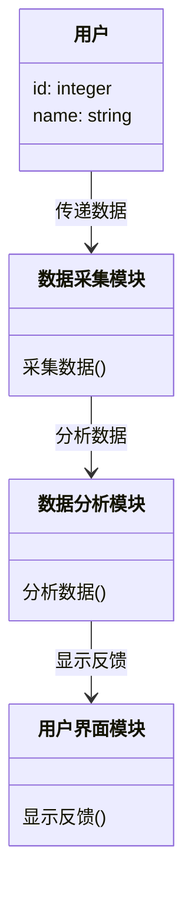

                 


# 智能跳绳：AI Agent的有氧运动效果分析

---

## 关键词：
AI Agent, 智能跳绳, 有氧运动, 数据分析, 运动效果, 实时反馈, 健康科技

---

## 摘要：
本文探讨AI Agent在智能跳绳中的应用，分析有氧运动效果的关键因素。通过背景介绍、AI Agent核心原理、数据驱动的运动效果分析、系统架构设计、项目实战及最佳实践，系统性地解析智能跳绳如何借助AI技术提升运动效果。文章结合数学模型、算法流程图和代码实现，深入浅出地展示AI在有氧运动分析中的实际应用。

---

## 第一部分：智能跳绳与AI Agent的背景介绍

### 第1章：问题背景与解决方案

#### 1.1 问题背景
- **当代运动数据分析的挑战**：传统运动数据分析依赖人工记录，存在数据碎片化、分析滞后等问题。
- **智能跳绳的发展历程**：从机械跳绳到智能设备，逐步融入传感器和AI技术，实现数据实时采集与分析。
- **AI Agent在运动分析中的作用**：AI Agent通过实时感知、决策和反馈，优化运动效果。

#### 1.2 问题描述
- **传统跳绳运动的局限性**：无法实时反馈运动数据，难以量化运动效果。
- **智能跳绳的数据采集问题**：传感器精度、数据处理效率等问题影响用户体验。
- **有氧运动效果分析的难点**：运动数据的多样性与复杂性导致分析难度大。

#### 1.3 问题解决
- **AI Agent在智能跳绳中的应用**：通过AI算法实时分析跳绳速度、次数等数据，提供个性化建议。
- **数据驱动的运动效果分析**：利用机器学习模型预测运动效果，优化运动计划。
- **实时反馈机制**：通过AI Agent即时纠正用户的运动姿势，提高运动效率。

#### 1.4 边界与外延
- **智能跳绳的适用场景**：适用于个人健身、运动训练等场景。
- **AI Agent的能力边界**：受限于传感器精度和算法模型，目前主要支持基本的有氧运动分析。
- **有氧运动效果分析的范围界定**：主要关注跳绳速度、次数和时间，未来可扩展至其他运动数据。

#### 1.5 概念结构与核心要素
- **智能跳绳的核心组成**：传感器、数据处理模块、AI Agent、用户界面。
- **AI Agent的功能模块**：感知模块（数据采集）、决策模块（数据分析）、执行模块（反馈）。
- **有氧运动效果分析的关键指标**：跳绳速度、次数、时间、心率、姿态等。

---

## 第二部分：智能跳绳与AI Agent的核心概念与联系

### 第2章：AI Agent的核心原理

#### 2.1 AI Agent的基本原理
- **AI Agent的定义与分类**：AI Agent是能够感知环境、自主决策并执行任务的智能体。分为简单反射型、基于模型的反应型、目标驱动型和效用驱动型。
- **感知、决策、执行的流程**：
  1. **感知**：通过传感器获取跳绳速度、次数、心率等数据。
  2. **决策**：基于机器学习模型分析数据，生成运动建议。
  3. **执行**：通过反馈机制指导用户调整运动节奏。

#### 2.2 智能跳绳的数据采集与处理
- **数据采集的方式与技术**：使用加速度传感器、心率传感器等采集运动数据。
- **数据预处理的方法**：去除噪声、标准化数据、数据平滑处理。
- **数据特征的提取与分析**：提取跳绳速度、持续时间、心率变化等特征，分析运动强度。

#### 2.3 AI Agent与智能跳绳的交互机制
- **用户输入的处理**：AI Agent接收用户的运动数据并解析。
- **AI Agent的反馈机制**：实时反馈运动建议，如调整速度、提醒休息。
- **实时数据分析与运动建议**：通过算法分析数据，提供个性化运动建议。

#### 2.4 核心概念属性对比

| 智能跳绳 | AI Agent |
|----------|-----------|
| 数据采集 | 感知模块 |
| 数据处理 | 决策模块 |
| 反馈机制 | 执行模块 |
| 运动效果 | 数据分析 |

#### 2.5 实体关系图
```mermaid
er
actor User {
  name: string
  id: integer
}
actor AI-Agent {
  name: string
  id: integer
}
actor Sensor {
  type: string
  id: integer
}
```

---

## 第三部分：智能跳绳的有氧运动效果分析

### 第3章：数据驱动的运动效果分析

#### 3.1 数据分析方法
- **时间序列分析**：分析跳绳速度随时间的变化趋势。
- **聚类分析**：将用户分为不同运动水平的群体，提供个性化建议。
- **回归分析**：建立运动效果预测模型。

#### 3.2 数学模型
- **时间序列分析模型**：
  $$ ARIMA(p, d, q) $$
  其中，p为自回归阶数，d为差分阶数，q为移动平均阶数。

- **跳跃次数与时间的关系**：
  $$ 跳跃次数 = \frac{时间}{每次跳跃时间} $$

#### 3.3 数据可视化
- 使用折线图展示跳跃速度随时间的变化。
- 使用柱状图比较不同用户的运动数据。

#### 3.4 实际案例分析
- 案例：一名用户连续跳绳10分钟，AI Agent分析其速度变化，提供调整建议。

---

## 第四部分：系统分析与架构设计

### 第4章：系统架构设计

#### 4.1 问题场景介绍
- 用户使用智能跳绳进行有氧运动，AI Agent实时分析数据，提供反馈。

#### 4.2 系统功能设计
- **功能模块**：
  - 数据采集模块：采集跳绳数据。
  - 数据分析模块：分析运动数据，生成反馈建议。
  - 用户界面模块：显示反馈信息。

- **领域模型**：


#### 4.3 系统架构设计
- **分层架构**：
  - 数据采集层：传感器采集数据。
  - 数据处理层：预处理和特征提取。
  - 应用层：AI Agent分析数据并生成反馈。
  - 用户界面层：显示反馈信息。

- **架构图**：


#### 4.4 接口设计与交互流程
- **接口设计**：
  - 数据采集接口：REST API。
  - 数据分析接口：提供实时反馈建议。
- **交互流程**：
  1. 用户开始跳绳。
  2. 传感器采集数据。
  3. 数据处理模块分析数据。
  4. AI Agent生成反馈建议。
  5. 用户界面显示反馈。

---

## 第五部分：项目实战

### 第5章：环境安装与核心代码实现

#### 5.1 环境安装
- **Python环境**：安装Python 3.8及以上版本。
- **依赖库安装**：
  ```bash
  pip install numpy pandas scikit-learn matplotlib
  ```

#### 5.2 核心代码实现
- **数据采集模块**：
  ```python
  import numpy as np

  def collect_data(samples=100):
      # 模拟传感器数据
      return np.random.normal(100, 10, samples)
  ```

- **数据分析模块**：
  ```python
  from sklearn.linear_model import LinearRegression

  def analyze_data(data):
      model = LinearRegression()
      model.fit(np.arange(len(data)).reshape(-1,1), data)
      return model.predict(np.arange(len(data)).reshape(-1,1))
  ```

#### 5.3 代码应用解读与分析
- 数据采集模块通过随机数模拟传感器数据，分析模块使用线性回归预测运动趋势。

#### 5.4 实际案例分析
- 分析一名用户的跳绳数据，展示AI Agent如何优化其运动计划。

---

## 第六部分：最佳实践

### 第6章：注意事项与建议

#### 6.1 注意事项
- 数据隐私保护：确保用户数据的安全性。
- 算法优化：定期更新模型以提高准确性。

#### 6.2 实践建议
- 定期校准传感器，确保数据准确性。
- 提供多种运动模式，满足不同用户需求。

#### 6.3 总结
AI Agent在智能跳绳中的应用显著提升了有氧运动的效果分析能力，未来可扩展至更多运动类型。

#### 6.4 拓展阅读
- 推荐阅读《机器学习实战》和《深度学习入门》。

---

## 结语
通过本文的详细分析，读者可以全面了解AI Agent在智能跳绳中的应用及其对有氧运动效果的影响。希望本文能为相关领域的研究者和爱好者提供有价值的参考。

