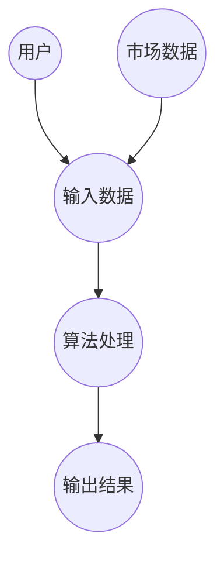
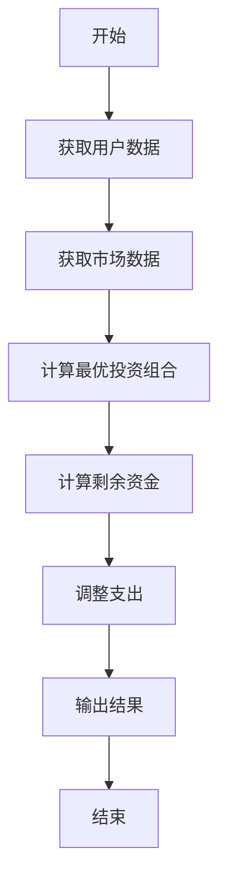
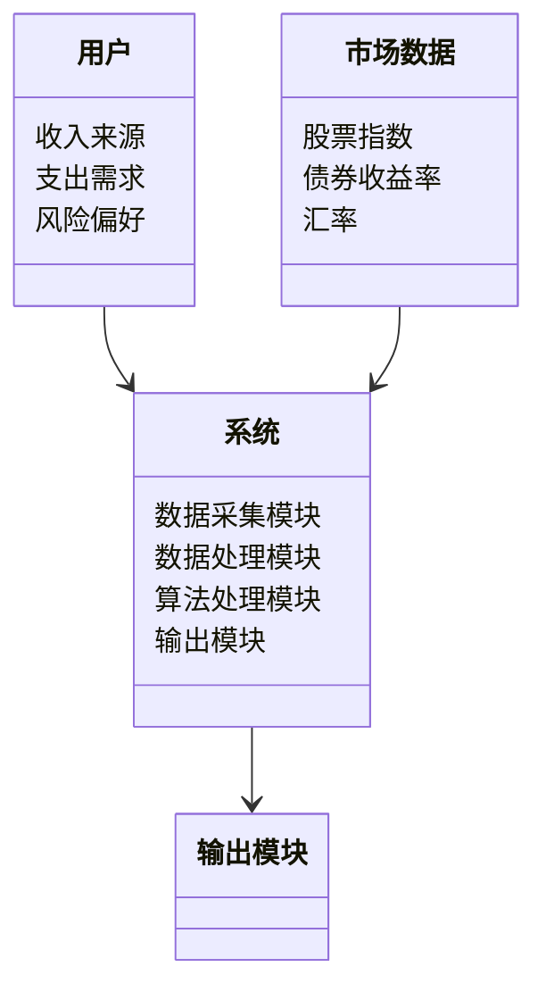
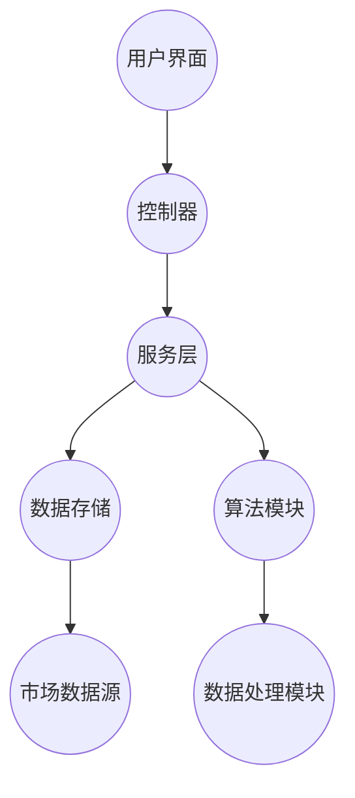
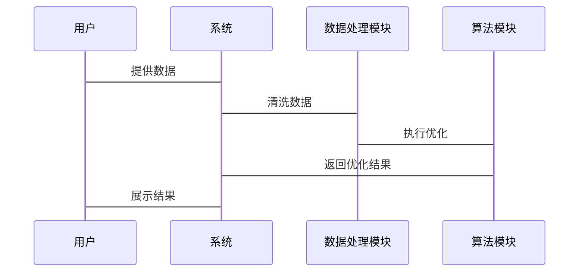

                 


# 智能退休收入规划动态调整器

> 关键词：退休收入规划、动态调整、智能算法、系统架构、项目实战

> 摘要：智能退休收入规划动态调整器是一种基于先进算法和实时数据分析的工具，能够根据市场变化和个人情况自动调整退休收入规划。本文从背景、核心概念、算法原理、系统架构、项目实战等多个方面详细讲解该工具的实现与应用。

## 第一部分: 智能退休收入规划动态调整器的背景与核心概念

### 第1章: 退休收入规划的背景与问题

#### 1.1 退休收入规划的重要性
##### 1.1.1 退休收入规划的定义与目标
退休收入规划是指为确保退休后生活质量，合理安排收入来源和支出，以维持稳定生活水平的过程。其目标是确保在退休期间，收入能够覆盖基本生活开支、医疗费用及其他潜在支出，同时最大化资产的保值与增值。

##### 1.1.2 当前退休收入规划的主要挑战
传统退休收入规划方法依赖于固定利率和假设，难以应对实际中的市场波动、通货膨胀和个人支出变化。此外，人们寿命延长和医疗费用增加也加剧了规划的复杂性。

##### 1.1.3 智能化规划的必要性与优势
智能化规划能够实时跟踪市场变化和用户需求，动态调整收入策略，提高规划的准确性和适应性。

#### 1.2 退休收入规划的核心问题
##### 1.2.1 收入来源的多样性与复杂性
退休收入可能来自多种来源，如养老金、投资收益、房租收入等，这些来源的波动性不同，管理复杂。

##### 1.2.2 消费支出的动态变化
生活成本随时间变化，通货膨胀、医疗费用增加等因素影响支出需求。

##### 1.2.3 经济环境的不确定性
市场波动、政策变化等外部因素增加了退休规划的难度。

#### 1.3 智能退休收入规划动态调整器的定义与特点
##### 1.3.1 动态调整器的核心功能
实时监控市场和用户数据，自动调整收入分配策略，确保规划的可行性和最优性。

##### 1.3.2 智能算法的应用场景
通过机器学习和优化算法，动态调整投资组合和支出分配。

##### 1.3.3 用户需求与系统目标的匹配
系统根据用户的风险承受能力、收入目标和支出需求，提供个性化建议。

### 第2章: 智能退休收入规划动态调整器的核心概念

#### 2.1 数据流与信息处理
##### 2.1.1 用户数据的采集与分析
收集用户的收入来源、支出情况、风险偏好等信息。

##### 2.1.2 市场数据的实时获取与处理
获取股票市场、债券市场等实时数据，分析市场趋势。

##### 2.1.3 系统输入与输出的关系
系统根据输入数据生成优化后的收入分配方案。

#### 2.2 算法与规则引擎
##### 2.2.1 动态调整算法的原理
基于当前市场和用户数据，优化收入分配策略。

##### 2.2.2 规则引擎的核心逻辑
根据预设规则，自动调整收入分配方案。

##### 2.2.3 算法与规则的可配置性
用户可以根据需求调整规则和参数。

#### 2.3 实体关系与数据流
##### 2.3.1 用户、市场、系统的关系图（Mermaid图）
```mermaid
graph LR
    User -> System
    Market -> System
    System -> Output
```

##### 2.3.2 数据流的可视化（Mermaid图）


---

## 第二部分: 智能退休收入规划动态调整器的算法原理

### 第3章: 动态调整算法的核心原理

#### 3.1 算法概述
动态调整算法基于当前市场和用户数据，实时优化退休收入分配。

#### 3.2 数学模型与公式
##### 3.2.1 投资组合优化模型
使用马科维茨投资组合理论，最小化风险，最大化收益。
$$
\min_{w} \sigma^2(w) \\
\text{subject to} \quad w^T \mu = \text{target return}
$$
其中，\( w \) 是投资权重向量，\( \mu \) 是预期收益向量，\( \sigma^2(w) \) 是投资组合的方差。

##### 3.2.2 支出调整模型
根据剩余资金和生活需求，动态调整支出。
$$
\text{支出} = \min(\text{可用资金}, \text{需求支出})
$$

#### 3.3 算法实现步骤（Mermaid流程图）


#### 3.4 Python代码实现
```python
import numpy as np
import pandas as pd
from scipy.optimize import minimize

def portfolio_optimization(risk_free_rate, returns, covariance):
    n = len(returns)
    # 定义目标函数
    def objective(weights):
        return np.dot(weights.T, np.dot(covariance, weights))
    # 约束条件：权重之和为1，预期收益为用户目标
    constraints = [
        {'type': 'eq', 'fun': lambda w: np.sum(w) - 1},
        {'type': 'eq', 'fun': lambda w: np.dot(returns.T, w) - target_return}
    ]
    # 求解
    result = minimize(objective, np.ones(n)/n, method='SLSQP', constraints=constraints)
    return result.x

# 示例数据
risk_free_rate = 0.02
returns = np.array([0.05, 0.07, 0.03])
covariance = np.array([[0.02, 0.01, 0.005],
                        [0.01, 0.03, 0.01],
                        [0.005, 0.01, 0.02]])
target_return = 0.05

weights = portfolio_optimization(risk_free_rate, returns, covariance)
print("Optimal weights:", weights)
```

---

## 第三部分: 智能退休收入规划动态调整器的系统架构设计

### 第4章: 系统分析与架构设计

#### 4.1 系统功能模块设计
##### 4.1.1 数据采集模块
收集用户数据和市场数据。

##### 4.1.2 数据处理模块
清洗和预处理数据，确保数据质量。

##### 4.1.3 算法处理模块
执行投资组合优化和支出调整。

##### 4.1.4 输出模块
生成并展示优化结果。

#### 4.2 领域模型设计（Mermaid类图）


#### 4.3 系统架构设计（Mermaid架构图）


#### 4.4 接口设计与交互流程图（Mermaid序列图）


---

## 第四部分: 智能退休收入规划动态调整器的项目实战

### 第5章: 项目实战

#### 5.1 环境搭建
安装必要的Python库，如NumPy、Pandas、Scipy等。

#### 5.2 核心代码实现
##### 5.2.1 数据采集模块
```python
import requests
import json

def get_market_data(api_key):
    url = f"https://api.example.com/market-data?api_key={api_key}"
    response = requests.get(url)
    return json.loads(response.text)
```

##### 5.2.2 算法处理模块
```python
def dynamic_adjustment(user_data, market_data):
    # 实现动态调整算法
    return optimized_plan
```

##### 5.2.3 输出模块
```python
def display_results(plan):
    print("优化后的收入分配:", plan)
```

#### 5.3 案例分析
假设用户A有100万元的退休基金，年支出需求为4万元，风险偏好为中等。市场数据包括股票收益率5%，债券收益率3%，现金收益率2%。

运行系统后，系统会优化投资组合，例如：投资股票40%，债券30%，现金30%，以平衡风险和收益。

#### 5.4 小结
通过实际案例，展示了系统的强大功能和实用性。

---

## 第五部分: 智能退休收入规划动态调整器的最佳实践

### 第6章: 最佳实践

#### 6.1 小结
系统通过智能算法和实时数据分析，显著提高了退休收入规划的效率和准确性。

#### 6.2 注意事项
- 定期更新市场数据和用户信息。
- 根据个人需求调整系统参数。
- 注意数据隐私和安全。

#### 6.3 拓展阅读
- 《投资学原理》
- 《Python机器学习实战》
- 《系统架构设计》

---

## 第六章: 结语

智能退休收入规划动态调整器通过技术创新，为退休规划提供了新的解决方案。随着技术的不断发展，系统将更加智能化和个性化，帮助更多人实现高品质的退休生活。

---

希望这篇技术博客文章能满足您的需求！如果需要进一步修改或补充，请随时告诉我。

