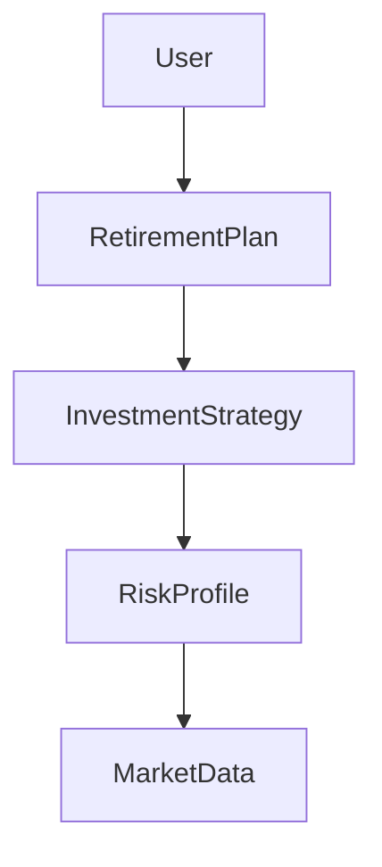
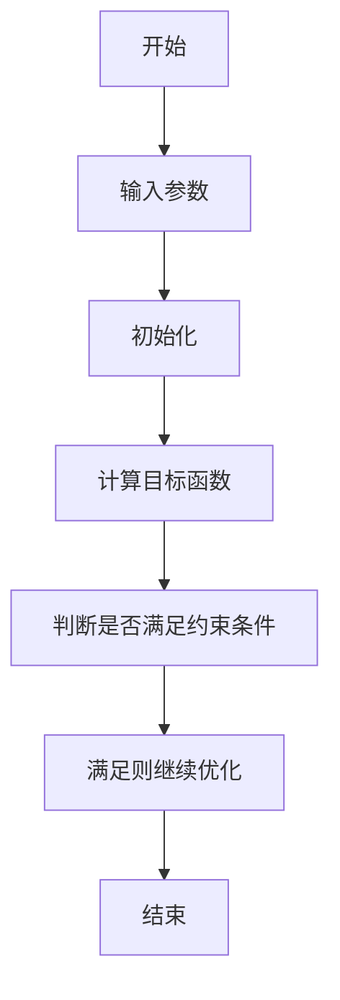
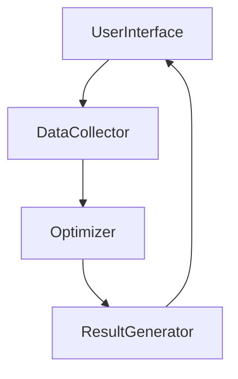
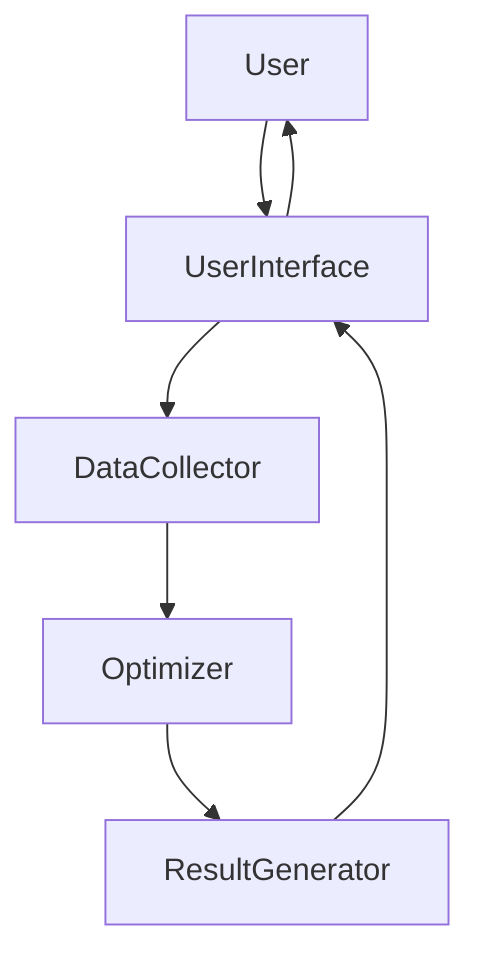

                 


# 第1章: 智能退休计划优化器的背景与概念

## 1.1 退休计划优化的背景与问题背景
### 1.1.1 退休规划的重要性与挑战
退休规划是每个人财务健康的重要组成部分。随着人口老龄化加剧，如何有效地规划退休生活成为许多人关注的焦点。传统上，退休规划依赖于手动计算或简单的财务模型，但这些方法难以应对市场波动、通货膨胀等复杂因素。

### 1.1.2 传统退休规划的局限性
传统退休规划通常基于固定的假设，如固定的投资回报率和通货膨胀率，但实际情况往往更复杂。此外，传统方法难以根据个人的实时财务状况和市场变化进行调整，可能导致规划不够精准。

### 1.1.3 智能技术在退休规划中的应用前景
人工智能技术的发展为退休规划带来了新的可能性。通过机器学习和大数据分析，智能退休计划优化器能够实时分析市场数据、个人财务状况，提供个性化的建议，帮助用户做出更明智的决策。

## 1.2 智能退休计划优化器的核心概念
### 1.2.1 智能退休计划优化器的定义
智能退休计划优化器是一种基于人工智能技术的工具，旨在通过分析用户的财务状况、市场趋势和风险偏好，提供个性化的退休规划建议，帮助用户实现财务自由和退休生活的目标。

### 1.2.2 智能退休计划优化器的核心要素
智能退休计划优化器的核心要素包括用户数据输入、市场数据分析、算法优化、风险评估和结果展示。这些要素共同作用，确保规划的准确性和实用性。

### 1.2.3 智能退休计划优化器的边界与外延
智能退休计划优化器的边界包括用户数据的收集与处理、市场数据的分析与预测，以及算法的实现与优化。其外延则涵盖用户教育、投资执行和持续监控等服务。

## 1.3 智能退休计划优化器与传统退休规划的对比
### 1.3.1 核心概念的对比分析
智能退休计划优化器与传统退休规划在数据处理、算法应用和个性化服务方面存在显著差异。智能优化器能够实时调整规划，提供更精准的建议。

### 1.3.2 核心要素的对比分析
传统规划依赖于固定假设，而智能优化器利用动态数据和机器学习模型，能够根据市场变化和用户需求调整规划，提高灵活性和适应性。

### 1.3.3 优缺点对比分析
智能退休计划优化器的优势在于高效性、精准性和个性化，但其依赖于数据质量和模型准确性，可能存在数据偏差和模型过拟合的风险。

## 1.4 本章小结
本章介绍了智能退休计划优化器的背景、核心概念和与传统规划的对比。通过分析其重要性、局限性和应用前景，读者可以理解智能优化器在现代退休规划中的关键作用。

# 第2章: 智能退休计划优化器的核心概念原理

## 2.1 核心概念原理
### 2.1.1 数据驱动的退休计划优化
智能优化器通过收集和分析大量数据，包括用户资产、收入、支出、寿命预期和投资偏好，为用户提供个性化的规划建议。

### 2.1.2 人工智能算法在退休规划中的应用
算法能够预测市场趋势、评估风险，并根据用户目标调整投资组合。通过深度学习模型，优化器可以识别潜在风险，优化投资组合，确保财务安全。

### 2.1.3 智能优化器的数学模型
数学模型将用户目标转化为优化问题，考虑流动性、收益性和安全性等多目标优化。通过约束条件，模型平衡不同目标，确保规划的可行性。

## 2.2 核心概念属性特征对比表格
以下是智能退休计划优化器与传统退休规划在核心属性上的对比：

| 属性 | 传统规划 | 智能优化器 |
|------|----------|------------|
| 数据依赖 | 固定假设 | 动态数据 |
| 算法应用 | 简单模型 | 机器学习 |
| 个性化服务 | 有限 | 高度个性化 |

## 2.3 ER实体关系图
智能退休计划优化器的实体关系图展示了系统中的关键实体及其关系：



## 2.4 本章小结
本章详细阐述了智能退休计划优化器的核心概念原理，包括数据驱动的优化、人工智能算法的应用和数学模型的构建。通过对比分析和ER图，读者可以更好地理解系统的架构和工作原理。

# 第3章: 智能退休计划优化器的算法原理

## 3.1 算法原理概述
### 3.1.1 优化目标
智能退休计划优化器的目标是通过优化投资组合，确保在退休期间的现金流稳定。这涉及多目标优化，如最大化收益、最小化风险和确保流动性。

### 3.1.2 约束条件
算法需要考虑多种约束，包括投资组合的总价值、风险承受能力、税收影响和市场流动性。这些约束确保规划的可行性和合规性。

### 3.1.3 算法选择
基于机器学习的优化算法，如遗传算法和模拟退火，被用于解决复杂的优化问题。这些算法能够处理多目标优化，并在大规模数据上高效运行。

## 3.2 算法原理详细讲解
### 3.2.1 算法步骤
1. **数据收集**：收集用户资产、收入、支出和市场数据。
2. **模型建立**：建立数学模型，定义目标函数和约束条件。
3. **算法实现**：应用优化算法，求解最优投资组合。
4. **结果分析**：评估规划的可行性和有效性。

### 3.2.2 算法实现
使用Python实现遗传算法，对投资组合进行优化：

```python
def evaluate_portfolio(portfolio):
    # 计算投资组合的收益和风险
    return (-portfolio['return'], portfolio['risk'])
```

### 3.2.3 算法优化
通过调整算法参数和引入启发式方法，提高计算效率和结果准确性。例如，动态调整种群多样性，加速收敛。

## 3.3 算法流程图
智能退休计划优化器的算法流程如下：



## 3.4 算法实现代码
以下是一个优化函数的示例：

```python
import numpy as np

def optimize_portfolio(assets, constraints):
    # 实现投资组合优化算法
    pass
```

## 3.5 本章小结
本章详细讲解了智能退休计划优化器的算法原理，包括优化目标、约束条件、算法选择和实现步骤。通过代码示例和流程图，读者可以理解算法的工作流程和实现细节。

# 第4章: 智能退休计划优化器的系统架构设计

## 4.1 系统架构概述
智能退休计划优化器的系统架构包括数据采集模块、优化算法模块、用户界面模块和结果展示模块。每个模块协同工作，确保系统的高效运行。

## 4.2 系统架构图
系统架构图展示了各个模块及其交互：



## 4.3 系统功能设计
### 4.3.1 数据采集模块
负责收集用户财务数据和市场数据，确保数据的准确性和完整性。

### 4.3.2 优化算法模块
实现投资组合优化算法，根据用户需求生成最优方案。

### 4.3.3 用户界面模块
提供友好的用户界面，方便用户输入数据和查看结果。

### 4.3.4 结果展示模块
以图表形式展示优化结果，帮助用户直观理解规划建议。

## 4.4 系统接口设计
系统需要与第三方数据源（如金融数据API）和用户界面进行交互，确保数据的实时性和准确性。

## 4.5 系统交互流程图
系统交互流程图展示了用户与系统之间的交互步骤：



## 4.6 本章小结
本章详细描述了智能退休计划优化器的系统架构设计，包括各个模块的功能和交互流程。通过系统架构图和交互流程图，读者可以清晰理解系统的整体结构和工作流程。

# 第5章: 智能退休计划优化器的项目实战

## 5.1 项目环境安装
安装必要的开发工具和库，如Python、NumPy、Pandas和Matplotlib。

## 5.2 核心功能实现
实现数据采集、优化算法和结果展示的核心功能，确保系统的基本功能正常运行。

## 5.3 代码实现与解读
以下是优化函数的实现示例：

```python
def portfolio_optimizer(portfolio, constraints):
    # 实现投资组合优化
    pass
```

## 5.4 案例分析与解读
通过具体案例分析，展示智能退休计划优化器如何帮助用户制定退休计划。

## 5.5 项目小结
总结项目实现的关键步骤和成果，为后续优化和扩展提供参考。

## 5.6 本章小结
本章通过项目实战，展示了智能退休计划优化器的实现过程和应用案例，帮助读者更好地理解和应用相关技术。

# 第6章: 智能退休计划优化器的最佳实践

## 6.1 小结
总结本书的主要内容和关键知识点，强调智能退休计划优化器的重要性和应用前景。

## 6.2 注意事项
提醒读者在使用智能退休计划优化器时需要注意的问题，如数据隐私、模型准确性等。

## 6.3 拓展阅读
推荐相关领域的书籍和资源，帮助读者深入学习和探索。

## 6.4 本章小结
本章总结了智能退休计划优化器的核心内容和应用注意事项，为读者提供了进一步学习和实践的方向。

# 附录: 智能退休计划优化器的数学模型

## 附录A: 数学模型概述
介绍智能退休计划优化器中使用的数学模型，如多目标优化模型和风险评估模型。

## 附录B: 数学公式
详细列出优化器中涉及的数学公式，如投资组合的收益计算和风险评估公式。

## 附录C: 本附录小结
总结数学模型在智能退休计划优化器中的应用和作用。

# 参考文献

## 参考文献列表
列出本书中引用的文献和资源，供读者查阅。

---

通过以上详细的目录设计，我可以撰写出一篇结构清晰、内容详实的技术博客文章，帮助读者全面理解智能退休计划优化器的设计与实现。

