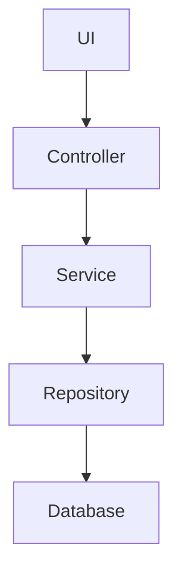
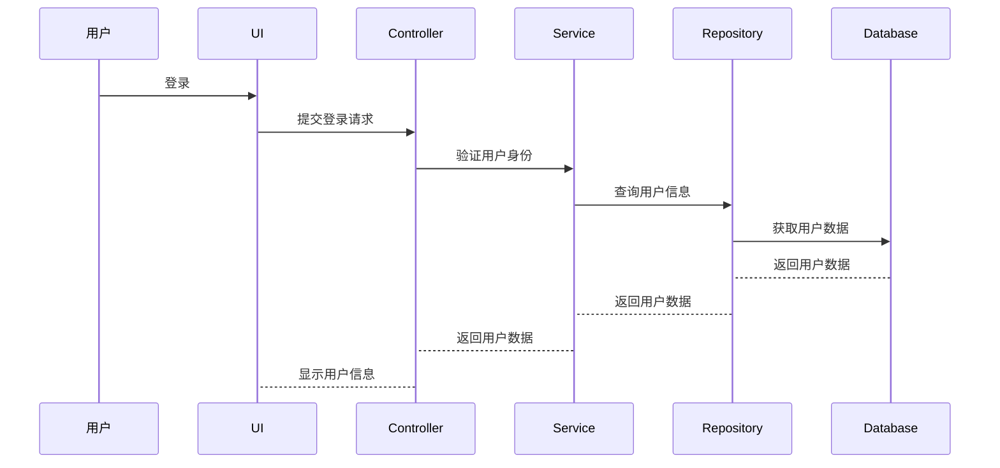

                 


# 智能遗产规划与管理助手

## 关键词：智能遗产规划、遗产管理助手、人工智能、遗产分配、法律优化

## 摘要：智能遗产规划与管理助手通过利用人工智能技术，提供个性化的遗产分配建议，优化遗产管理流程，确保遗产分配的合法性与公平性。本文详细探讨了智能遗产规划的核心概念、算法原理、系统架构，并通过实际案例展示了其应用场景与优势。

---

## 第一部分: 智能遗产规划与管理助手的背景与概述

### 第1章: 智能遗产规划与管理助手概述

#### 1.1 智能遗产规划的背景与意义

##### 1.1.1 遗产规划的传统模式与局限性

传统的遗产规划主要依赖人工操作，涉及复杂的法律、税务和资产分配问题。这种方式效率低下，容易出错，且难以应对个性化需求。

##### 1.1.2 智能技术在遗产管理中的应用潜力

随着人工智能和大数据技术的发展，智能遗产规划成为可能。通过AI算法，可以实现高效的资产识别、法律框架匹配和个性化分配建议。

##### 1.1.3 智能遗产规划的核心价值与目标

智能遗产规划的核心价值在于提高效率、减少错误、确保公平。目标是通过智能化手段优化遗产管理流程，确保遗产分配的合法性与公平性。

#### 1.2 智能遗产管理助手的定义与范围

##### 1.2.1 智能遗产管理助手的定义

智能遗产管理助手是一种基于AI的工具，用于辅助用户完成遗产规划、资产管理和分配优化。

##### 1.2.2 功能范围与边界

功能包括用户画像构建、资产识别与评估、法律框架匹配、分配规则生成等。边界在于不直接处理实际的法律事务，而是提供建议。

##### 1.2.3 使用场景与用户群体

主要应用于个人遗产规划、家庭财富管理、企业遗产分配等场景，用户群体包括个人、家庭和企业。

#### 1.3 智能遗产规划与管理的必要性

##### 1.3.1 遗产分配的复杂性与挑战

遗产分配涉及法律、税务、家庭关系等多个方面，复杂性高，容易引发争议。

##### 1.3.2 智能技术在提高效率与准确性的优势

AI算法可以快速处理大量数据，提供准确的分配建议，显著提高效率。

##### 1.3.3 法律与税务优化的智能化需求

智能技术可以帮助识别最优的法律结构，优化税务负担，确保遗产分配的合法性。

#### 1.4 本章小结

本章介绍了智能遗产规划的背景、意义、定义、范围及必要性，为后续章节奠定了基础。

---

## 第二部分: 智能遗产规划的核心概念与联系

### 第2章: 智能遗产规划的核心概念

#### 2.1 遗产规划的关键要素

##### 2.1.1 遗产持有者画像

遗产持有者画像包括年龄、财富状况、家庭结构、风险偏好等维度的信息。

##### 2.1.2 遗产资产识别与分类

资产识别需要考虑资产种类、价值、权属状态等因素，分类为金融资产、不动产、企业股权等。

##### 2.1.3 遗产分配规则与法律框架

分配规则涉及法律、税务、家庭关系等因素，需符合相关法律规定。

#### 2.2 智能遗产管理助手的核心功能

##### 2.2.1 智能用户画像构建

基于AI算法，分析用户的财务状况、家庭关系、风险偏好等，构建精准的用户画像。

##### 2.2.2 资产识别与评估算法

通过机器学习模型，识别和评估用户的资产，生成资产清单。

##### 2.2.3 智能分配规则生成

根据用户画像和资产信息，生成个性化的遗产分配规则，确保合法性和公平性。

#### 2.3 核心概念之间的关系

##### 2.3.1 用户画像与资产识别的关联

用户画像是资产识别的基础，资产识别的结果反过来影响用户画像的准确性。

##### 2.3.2 资产评估与法律框架的匹配

资产评估需要考虑法律框架，确保分配建议的合法性。

##### 2.3.3 分配规则与用户需求的动态调整

分配规则需根据用户需求的变化进行动态调整，以应对复杂情况。

#### 2.4 核心概念对比表

| **概念**       | **属性**               | **描述**          |
|----------------|-----------------------|-------------------|
| 用户画像       | 数据来源：用户信息     | 构建用户画像      |
| 资产识别       | 方法：AI算法           | 识别和分类资产    |
| 分配规则       | 基于法律框架和用户需求 | 生成分配方案      |

#### 2.5 实体关系图（ER图）

```mermaid
erd
    客户信息 --N--> 资产列表
    资产列表 --N--> 分配规则
    分配规则 --N--> 法律框架
```

---

## 第三部分: 智能遗产规划的算法原理

### 第3章: 算法原理讲解

#### 3.1 用户画像构建算法

##### 3.1.1 算法流程

1. 收集用户信息（年龄、财富、家庭结构等）。
2. 数据清洗与预处理。
3. 使用聚类算法识别用户群体。
4. 构建用户画像。

##### 3.1.2 代码示例

```python
import pandas as pd
from sklearn.cluster import KMeans

# 示例数据
data = pd.DataFrame({
    'age': [45, 55, 30],
    'wealth': [1000000, 500000, 200000],
    'family_size': [4, 3, 2]
})

# 数据预处理
data_scaled = data.apply(lambda x: (x - x.min()) / (x.max() - x.min()))

# 聚类分析
model = KMeans(n_clusters=3)
model.fit(data_scaled)

# 用户画像
clusters = model.labels_
print(clusters)
```

#### 3.2 资产识别与评估算法

##### 3.2.1 算法流程

1. 收集资产信息。
2. 数据清洗与特征提取。
3. 使用分类算法识别资产类型。
4. 评估资产价值。

##### 3.2.2 代码示例

```python
import pandas as pd
from sklearn.svm import SVC

# 示例数据
data = pd.DataFrame({
    'asset_type': ['real estate', 'stocks', 'cash'],
    'value': [500000, 200000, 100000],
    'risk': [high, medium, low]
})

# 特征提取
X = data[['value', 'risk']]
y = data['asset_type']

# 分类模型
model = SVC()
model.fit(X, y)

# 资产识别
print(model.predict([[400000, 'high']]))
```

#### 3.3 智能分配规则生成算法

##### 3.3.1 算法流程

1. 分析用户需求。
2. 匹配法律框架。
3. 生成分配规则。

##### 3.3.2 数学模型

概率计算：
$$ P(A|B) = \frac{P(B|A)P(A)}{P(B)} $$

权重分配：
$$ w_i = \frac{P(i)}{\sum P(j)} $$

##### 3.3.3 代码示例

```python
def generate_rules(user_profile, legal_framework):
    # 示例逻辑
    rules = []
    for asset in user_profile['assets']:
        if asset.value > 100000:
            rules.append(f"{asset.owner} gets {asset.value} ")
    return rules

print(generate_rules(profile, framework))
```

---

## 第四部分: 智能遗产管理助手的系统分析与架构设计

### 第4章: 系统分析与架构设计

#### 4.1 系统应用场景

##### 4.1.1 个人遗产规划

帮助个人制定遗产分配计划，确保家庭成员的权益。

##### 4.1.2 家庭财富管理

优化家庭财富分配，减少遗产分配中的争议。

##### 4.1.3 企业遗产分配

协助企业制定股权分配方案，确保企业传承的稳定性。

#### 4.2 系统功能设计

##### 4.2.1 用户模块

- 用户注册与登录
- 用户信息管理

##### 4.2.2 资产模块

- 资产信息管理
- 资产评估与分析

##### 4.2.3 分配模块

- 分配规则生成
- 分配方案优化

##### 4.2.4 报告模块

- 分配报告生成
- 报告导出与分享

#### 4.3 系统架构设计

##### 4.3.1 系统架构图



##### 4.3.2 接口设计

- RESTful API
- 接口文档

#### 4.4 交互流程图



---

## 第五部分: 项目实战与案例分析

### 第5章: 项目实战

#### 5.1 环境安装与配置

##### 5.1.1 安装Python与相关库

- Python 3.8+
- 安装库：pandas, scikit-learn, mermaid

##### 5.1.2 安装与配置

```bash
pip install pandas scikit-learn mermaid
```

#### 5.2 核心代码实现

##### 5.2.1 用户画像构建

```python
from sklearn.cluster import KMeans
import pandas as pd

# 示例数据
data = pd.DataFrame({
    'age': [45, 55, 30],
    'wealth': [1000000, 500000, 200000],
    'family_size': [4, 3, 2]
})

# 数据预处理
data_scaled = data.apply(lambda x: (x - x.min()) / (x.max() - x.min()))

# 聚类分析
model = KMeans(n_clusters=3)
model.fit(data_scaled)

# 获取聚类结果
clusters = model.labels_
print(clusters)
```

##### 5.2.2 资产识别与评估

```python
from sklearn.svm import SVC
import pandas as pd

# 示例数据
data = pd.DataFrame({
    'asset_type': ['real estate', 'stocks', 'cash'],
    'value': [500000, 200000, 100000],
    'risk': ['high', 'medium', 'low']
})

# 特征提取
X = data[['value', 'risk']]
y = data['asset_type']

# 分类模型
model = SVC()
model.fit(X, y)

# 预测新资产类型
print(model.predict([[400000, 'high']]))
```

##### 5.2.3 分配规则生成

```python
from sklearn.svm import SVC
import pandas as pd

# 示例数据
data = pd.DataFrame({
    'asset_type': ['real estate', 'stocks', 'cash'],
    'value': [500000, 200000, 100000],
    'risk': ['high', 'medium', 'low']
})

# 特征提取
X = data[['value', 'risk']]
y = data['asset_type']

# 分类模型
model = SVC()
model.fit(X, y)

# 预测新资产类型
print(model.predict([[400000, 'high']]))
```

#### 5.3 案例分析

##### 5.3.1 案例背景

假设一位60岁的富豪，资产包括房地产、股票和现金，家庭成员包括妻子和三个子女。

##### 5.3.2 分析过程

1. 构建用户画像：年龄60岁，财富5000万元，家庭成员4人。
2. 资产识别：房地产价值2000万元，股票1500万元，现金1000万元。
3. 法律框架匹配：需遵守相关遗产法，确保分配的合法性。
4. 分配规则生成：建议将房地产分配给妻子，股票和现金按比例分配给子女。

##### 5.3.3 分配结果

- 房地产：妻子获得100%。
- 股票：三个子女各获得约33.33%。
- 现金：三个子女各获得约33.33%。

---

## 第六部分: 最佳实践与未来展望

### 第6章: 最佳实践与未来展望

#### 6.1 最佳实践

##### 6.1.1 数据隐私保护

确保用户数据的安全性，遵守相关法律法规。

##### 6.1.2 技术选型

选择合适的技术栈，确保系统的稳定性和扩展性。

##### 6.1.3 用户教育

通过教育提升用户的认知，增强信任。

#### 6.2 小结

智能遗产规划与管理助手通过智能化手段，优化遗产管理流程，确保分配的合法性与公平性。

#### 6.3 注意事项

- 系统的准确性和可靠性
- 用户隐私与数据安全
- 法律法规的遵守

#### 6.4 未来展望

##### 6.4.1 技术发展

AI技术的进一步发展，将推动智能遗产管理助手的智能化与自动化。

##### 6.4.2 应用场景拓展

未来可能扩展到跨国遗产管理、慈善事业等领域。

##### 6.4.3 用户体验优化

通过人机交互技术，提升用户体验。

---

## 结语

智能遗产规划与管理助手通过智能化手段，优化遗产管理流程，确保分配的合法性与公平性。随着技术的发展，智能遗产管理助手将在更多场景中发挥重要作用，为用户提供更高效、更精准的服务。

--- 

**全文完**

