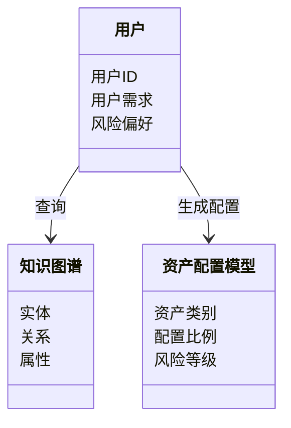
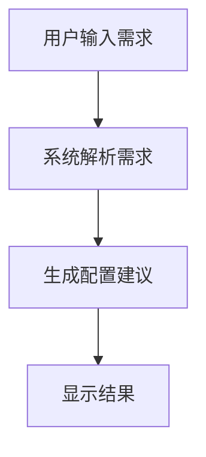

                 


```markdown
# 智能金融顾问系统的设计与实现

> 关键词：智能金融顾问，自然语言处理，知识图谱，机器学习，资产配置，风险评估

> 摘要：智能金融顾问系统是一种结合人工智能技术的金融咨询服务系统，通过自然语言处理、知识图谱和机器学习等技术，为用户提供个性化的金融咨询服务。本文详细阐述了智能金融顾问系统的设计与实现过程，包括系统背景、核心概念、算法原理、系统架构以及项目实战等内容。

---

## 第一部分：智能金融顾问系统背景与概述

### 第1章：智能金融顾问系统概述

#### 1.1 智能金融顾问的背景与意义

##### 1.1.1 传统金融顾问服务的局限性
传统的金融顾问服务依赖于人工咨询，存在效率低、成本高、覆盖面有限等问题。金融顾问需要具备丰富的金融知识和经验，但数量有限，难以满足大量用户的需求。

##### 1.1.2 智能化转型的必要性
随着人工智能技术的发展，智能金融顾问系统能够通过自动化技术提供高效、低成本的金融服务，满足用户个性化的金融需求。智能化转型能够显著提高服务效率，降低成本，并扩大服务范围。

##### 1.1.3 智能金融顾问的核心价值
智能金融顾问系统通过自动化处理和分析大量金融数据，为用户提供精准的金融建议，帮助用户做出明智的投资决策。其核心价值在于提升用户体验、降低服务成本以及扩大服务范围。

#### 1.2 智能金融顾问系统的定义与特点

##### 1.2.1 系统定义
智能金融顾问系统是一种基于人工智能技术的金融咨询服务系统，能够通过自然语言处理、知识图谱和机器学习等技术，为用户提供个性化的金融建议。

##### 1.2.2 系统主要特点
- **智能化**：利用人工智能技术实现自动化咨询和决策支持。
- **个性化**：根据用户需求和风险偏好提供定制化的金融建议。
- **高效性**：通过自动化处理提高服务效率，降低人工成本。
- **可扩展性**：能够适应不同用户群体和金融市场的变化。

#### 1.3 系统的核心功能模块

##### 1.3.1 用户需求分析模块
通过自然语言处理技术分析用户的需求和风险偏好，生成个性化的资产配置建议。

##### 1.3.2 资产配置建议模块
基于历史数据和机器学习模型，为用户推荐最优的资产配置方案。

##### 1.3.3 风险评估与预警模块
实时监控市场动态和用户资产状况，评估潜在风险并发出预警。

#### 1.4 本章小结
本章介绍了智能金融顾问系统的背景、定义、特点和核心功能模块，为后续章节的深入分析奠定了基础。

---

## 第二部分：智能金融顾问系统的核心概念与原理

### 第2章：智能金融顾问系统的核心概念

#### 2.1 自然语言处理在金融咨询中的应用

##### 2.1.1 NLP技术的基本原理
自然语言处理（NLP）通过计算机理解、处理和生成人类语言。在金融咨询中，NLP技术用于解析用户的咨询内容，提取关键信息。

##### 2.1.2 金融文本信息抽取
通过NLP技术从金融文本中提取关键信息，如公司财务数据、市场动态等。

##### 2.1.3 对话生成机制
基于NLP的对话生成技术，系统能够自动生成与用户相关的金融咨询对话。

#### 2.2 知识图谱构建与金融数据管理

##### 2.2.1 知识图谱的定义与特点
知识图谱是一种结构化数据的表示方式，能够将分散的金融数据组织成一个统一的知识网络。

##### 2.2.2 金融知识图谱的构建方法
通过数据清洗、实体识别和关系抽取等步骤，构建金融领域的知识图谱。

##### 2.2.3 数据管理与存储方案
采用分布式存储和高效查询技术，确保知识图谱的高效管理和快速查询。

#### 2.3 机器学习在资产配置中的应用

##### 2.3.1 机器学习的基本原理
机器学习通过数据训练模型，使其能够从数据中学习规律并做出预测。

##### 2.3.2 资产配置的数学模型
基于机器学习的资产配置模型，如均值-方差模型和风险中性模型，帮助用户优化资产配置。

##### 2.3.3 基于ML的风险评估方法
利用机器学习算法，评估投资组合的风险，并制定风险控制策略。

### 第3章：智能金融顾问系统的原理分析

#### 3.1 系统整体架构

##### 3.1.1 分层架构设计
智能金融顾问系统采用分层架构，包括用户层、业务逻辑层和数据访问层。

##### 3.1.2 模块化设计原则
系统功能模块化设计，如用户需求分析模块、资产配置建议模块等，确保各模块独立且相互协作。

##### 3.1.3 系统可扩展性分析
系统架构设计充分考虑扩展性，便于未来功能的增加和性能的优化。

#### 3.2 核心算法原理

##### 3.2.1 NLP模型训练流程
- 数据清洗与预处理
- 选择合适的NLP模型（如BERT、GPT）
- 模型训练与调优
- 模型评估与优化

##### 3.2.2 知识图谱构建算法
- 实体识别与关系抽取
- 知识图谱构建与存储
- 知识图谱查询与应用

##### 3.2.3 资产配置优化算法
- 数据收集与预处理
- 模型训练与优化
- 资产配置建议生成

#### 3.3 系统流程图

##### 3.3.1 用户交互流程
用户通过系统输入需求，系统解析需求并生成相应的金融建议。

##### 3.3.2 数据处理流程
数据清洗、特征提取、模型训练等步骤，确保数据的准确性和可用性。

##### 3.3.3 模型推理流程
基于训练好的模型，系统快速响应用户的咨询请求，生成相应的金融建议。

---

## 第三部分：智能金融顾问系统的算法实现

### 第4章：自然语言处理算法实现

#### 4.1 NLP模型训练

##### 4.1.1 数据预处理
对金融文本进行清洗、分词、去停用词等预处理步骤，确保数据质量。

##### 4.1.2 模型选择与训练
选择合适的NLP模型（如BERT）进行训练，优化模型参数以提高性能。

##### 4.1.3 模型调优与评估
通过交叉验证和超参数调优，提高模型的准确性和稳定性。

#### 4.2 对话生成算法

##### 4.2.1 基于RNN的对话生成
使用循环神经网络（RNN）生成连续的对话流，适用于长对话场景。

##### 4.2.2 基于Transformer的对话生成
利用Transformer模型进行对话生成，提升对话的流畅性和准确性。

##### 4.2.3 对话策略优化
通过强化学习优化对话策略，提升用户体验。

### 第5章：机器学习算法实现

#### 5.1 资产配置优化算法

##### 5.1.1 基于遗传算法的优化
使用遗传算法搜索最优的资产配置方案。

##### 5.1.2 基于强化学习的优化
通过强化学习框架，动态优化资产配置策略。

##### 5.1.3 基于随机森林的风险评估
利用随机森林模型评估投资组合的风险，并制定相应的风险控制策略。

#### 5.2 风险评估与预警算法

##### 5.2.1 市场风险评估
基于历史数据和市场动态，评估投资组合的市场风险。

##### 5.2.2 信用风险评估
通过分析信用评级和历史违约数据，评估信用风险。

##### 5.2.3 风险预警机制
实时监控市场动态和用户资产状况，评估潜在风险并发出预警。

---

## 第四部分：系统分析与架构设计方案

### 第6章：系统分析与架构设计

#### 6.1 问题场景介绍

##### 6.1.1 用户需求分析
用户需要个性化的金融建议，要求系统能够快速响应并提供准确的建议。

##### 6.1.2 系统功能需求
包括用户需求分析、资产配置建议、风险评估与预警等功能。

#### 6.2 系统功能设计

##### 6.2.1 领域模型类图
使用Mermaid绘制领域模型类图，展示系统各模块之间的关系。



#### 6.3 系统架构设计

##### 6.3.1 系统架构图
使用Mermaid绘制系统架构图，展示系统的分层架构。

```mermaid
client
    <-- [HTTP 请求]
    server
        --> [JSON 数据]
        --> 数据库
```

#### 6.4 系统接口设计

##### 6.4.1 API接口设计
定义系统API接口，如RESTful API，确保系统与其他模块的交互顺利进行。

##### 6.4.2 接口文档
提供详细的接口文档，包括接口描述、请求格式、返回格式等。

#### 6.5 系统交互流程图

##### 6.5.1 用户交互流程
使用Mermaid绘制用户与系统之间的交互流程图。



---

## 第五部分：项目实战

### 第7章：项目实战与案例分析

#### 7.1 环境安装

##### 7.1.1 安装Python
安装Python 3.x及以上版本，确保环境稳定。

##### 7.1.2 安装相关库
安装必要的Python库，如TensorFlow、Keras、NLTK、networkx等。

#### 7.2 系统核心实现源代码

##### 7.2.1 NLP模块代码
```python
import tensorflow as tf
from tensorflow.keras import layers

model = tf.keras.Sequential()
model.add(layers.Embedding(input_dim=10000, output_dim=16))
model.add(layers.SimpleRNN(units=32))
model.add(layers.Dense(1, activation='sigmoid'))
model.compile(optimizer='adam', loss='binary_crossentropy', metrics=['accuracy'])
```

##### 7.2.2 机器学习模块代码
```python
import pandas as pd
from sklearn.ensemble import RandomForestClassifier

# 假设 df 是数据集，'label' 是目标变量
model = RandomForestClassifier(n_estimators=100)
model.fit(df.drop('label', axis=1), df['label'])
```

#### 7.3 代码解读与分析

##### 7.3.1 NLP模块解读
上述代码实现了一个基于RNN的文本分类模型，适用于金融文本的分类任务。

##### 7.3.2 机器学习模块解读
使用随机森林模型进行分类，适用于资产配置和风险评估任务。

#### 7.4 实际案例分析

##### 7.4.1 案例一：资产配置建议
用户输入风险偏好，系统生成最优的资产配置建议。

##### 7.4.2 案例二：风险评估
用户输入投资组合信息，系统评估潜在风险并发出预警。

#### 7.5 项目小结
本章通过实际案例展示了智能金融顾问系统的实现过程，验证了系统的可行性和实用性。

---

## 第六部分：最佳实践与总结

### 第8章：最佳实践与总结

#### 8.1 小结
总结全文内容，回顾智能金融顾问系统的实现过程和关键点。

#### 8.2 注意事项
在实际应用中需要注意数据隐私、模型优化和系统稳定性等问题。

#### 8.3 拓展阅读
推荐相关领域的书籍和论文，供读者进一步学习和研究。

---

## 参考文献

- 书籍1：《深度学习》
- 书籍2：《自然语言处理实战》
- 论文1：基于Transformer的对话生成研究
- 论文2：机器学习在金融风险管理中的应用

---

## 附录

### 附录A：数学公式

#### 1. 风险评估模型
$$ \text{风险值} = \alpha \times \text{资产价值} + \beta \times \text{市场波动} $$

#### 2. 资产配置优化
$$ \text{最优配置} = \argmin_{w} \left( w^T \Sigma w - \lambda w^T \mu \right) $$

### 附录B：代码示例

#### 1. NLP模块代码
```python
import tensorflow as tf
from tensorflow.keras import layers

model = tf.keras.Sequential()
model.add(layers.Embedding(input_dim=10000, output_dim=16))
model.add(layers.SimpleRNN(units=32))
model.add(layers.Dense(1, activation='sigmoid'))
model.compile(optimizer='adam', loss='binary_crossentropy', metrics=['accuracy'])
```

#### 2. 机器学习模块代码
```python
import pandas as pd
from sklearn.ensemble import RandomForestClassifier

# 假设 df 是数据集，'label' 是目标变量
model = RandomForestClassifier(n_estimators=100)
model.fit(df.drop('label', axis=1), df['label'])
```

---

## 作者简介

---

## 版权信息

---

通过以上目录结构，您可以根据实际需求扩展每个章节的内容，添加更多细节和具体实现步骤，确保文章内容详实且具有深度。
```

