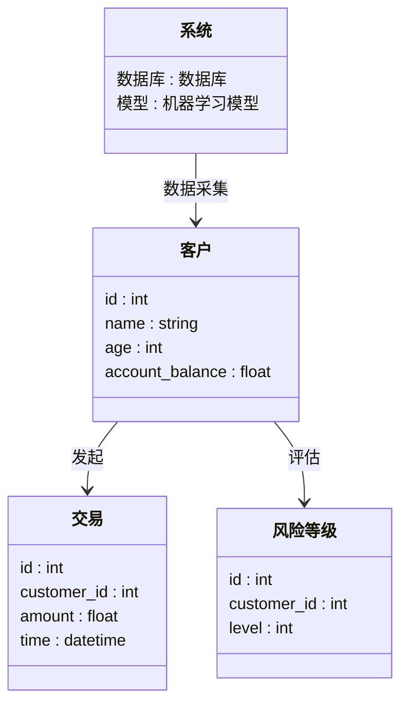

                 


# 智能银行客户流失预防系统

> 关键词：智能银行、客户流失、机器学习、预测系统、数据驱动

> 摘要：本文介绍了一种基于机器学习的智能银行客户流失预防系统，通过数据驱动的方法，预测和分析客户流失的可能性，并提出相应的预防策略。系统结合了客户行为分析、机器学习算法和智能决策机制，帮助银行有效降低客户流失率，提升客户满意度和忠诚度。本文详细探讨了系统的核心概念、算法原理、系统架构设计、项目实现及优化建议。

---

# 目录

## 第1章: 引言

### 1.1 问题背景与目标
1.1.1 银行客户流失问题的背景  
1.1.2 客户流失对银行的影响  
1.1.3 智能系统的目标与意义  

### 1.2 问题描述与解决思路
1.2.1 客户流失的定义与分类  
1.2.2 传统客户流失预测的局限性  
1.2.3 智能系统的核心解决思路  

### 1.3 系统边界与外延
1.3.1 系统的边界定义  
1.3.2 系统的外延与应用场景  
1.3.3 系统与其他模块的交互关系  

---

## 第2章: 智能银行客户流失预防系统的核心概念与联系

### 2.1 核心概念原理
2.1.1 数据驱动的客户行为分析  
2.1.2 机器学习在客户流失预测中的应用  
2.1.3 智能决策系统的实现原理  

### 2.2 核心概念属性对比表
| 概念         | 属性       | 描述                                             |
|--------------|------------|--------------------------------------------------|
| 数据源       | 类型       | 客户交易数据、行为数据、 demographic data      |
| 模型         | 算法       | logistic regression, decision tree, random forest |
| 预测结果     | 输出       | 客户流失概率、风险等级                           |

### 2.3 ER实体关系图
```mermaid
erDiagram
    customer[客户] {
        id : int
        name : string
        age : int
        gender : string
        account_type : string
        transaction_history : string
        last_login_time : datetime
    }
    transaction[交易] {
        id : int
        customer_id : int
        amount : float
        time : datetime
        type : string
    }
    risk_level[风险等级] {
        id : int
        customer_id : int
        level : int
        prediction_time : datetime
    }
    customer --> transaction : 进行
    customer --> risk_level : 评估
```

---

## 第3章: 算法原理

### 3.1 机器学习算法的选择与实现
3.1.1 逻辑回归算法
3.1.2 决策树算法
3.1.3 随机森林算法

### 3.2 算法流程图


### 3.3 逻辑回归的数学模型
逻辑回归的损失函数：
$$ L(y, y') = -\sum_{i=1}^{n} [y_i \ln y'_i + (1-y_i)\ln (1-y'_i)] $$
其中，$y$ 是真实标签，$y'$ 是预测概率。

### 3.4 逻辑回归的Python实现
```python
import numpy as np
from sklearn.linear_model import LogisticRegression

# 数据预处理
X = ...  # 特征矩阵
y = ...  # 标签向量

# 训练模型
model = LogisticRegression()
model.fit(X, y)

# 预测
predicted = model.predict(X)
print(predicted)
```

---

## 第4章: 系统分析与架构设计

### 4.1 系统应用场景
4.1.1 客户行为分析
4.1.2 风险评估
4.1.3 预警通知

### 4.2 系统功能模块设计
#### 4.2.1 领域模型


### 4.3 系统架构设计
#### 4.3.1 系统架构图


### 4.4 系统接口设计
- 输入接口：客户交易数据、行为数据
- 输出接口：客户流失概率、预警信息

### 4.5 交互流程图
```mermaid
sequenceDiagram
    客户 --> API网关 : 发起请求
    API网关 --> 数据库 : 查询客户数据
    并发
    数据库 --> 分析模块 : 提供特征数据
    分析模块 --> 模型服务 : 训练模型
    模型服务 --> 分析模块 : 返回预测结果
    分析模块 --> API网关 : 返回预测结果
    API网关 --> 客户 : 返回预警信息
```

---

## 第5章: 项目实战

### 5.1 环境安装
- Python 3.8+
- Scikit-learn、Pandas、NumPy

### 5.2 核心实现代码
```python
import pandas as pd
from sklearn.model_selection import train_test_split
from sklearn.metrics import accuracy_score

# 数据加载
data = pd.read_csv('customer_data.csv')

# 特征选择
X = data[['age', 'balance', 'transactions']]
y = data['churn']

# 数据分割
X_train, X_test, y_train, y_test = train_test_split(X, y, test_size=0.2)

# 模型训练
model = LogisticRegression()
model.fit(X_train, y_train)

# 模型评估
print("Accuracy:", accuracy_score(y_test, model.predict(X_test)))
```

### 5.3 案例分析
- 数据预处理：处理缺失值、归一化
- 特征工程：选择关键特征（如年龄、账户余额、交易频率）
- 模型训练：使用逻辑回归或随机森林
- 结果分析：预测客户流失概率，制定针对性营销策略

---

## 第6章: 优化与展望

### 6.1 优化建议
- 数据实时更新
- 模型在线更新
- 多模型集成优化

### 6.2 小结
本文详细介绍了智能银行客户流失预防系统的实现过程，从数据预处理、特征选择、模型训练到系统部署，为银行提供了有效的客户流失预测和预防方案。

### 6.3 注意事项
- 数据隐私保护
- 模型解释性
- 系统可扩展性

### 6.4 拓展阅读
- 《机器学习实战》
- 《Python机器学习》
- 相关学术论文推荐

---

## 参考文献

1. 周志华. 《机器学习实战》. 清华大学出版社, 2016.
2. Aurélien Géron. 《Python机器学习》. 人民邮电出版社, 2019.
3. 大数据与人工智能相关学术论文推荐列表

---

通过以上目录结构，您可以逐步展开每个章节的内容，详细探讨智能银行客户流失预防系统的各个方面，确保文章逻辑清晰、内容详实且具有深度。

