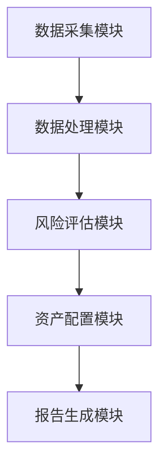
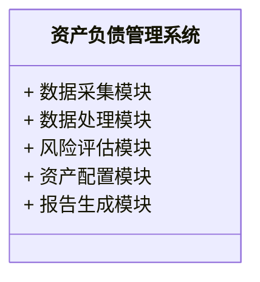
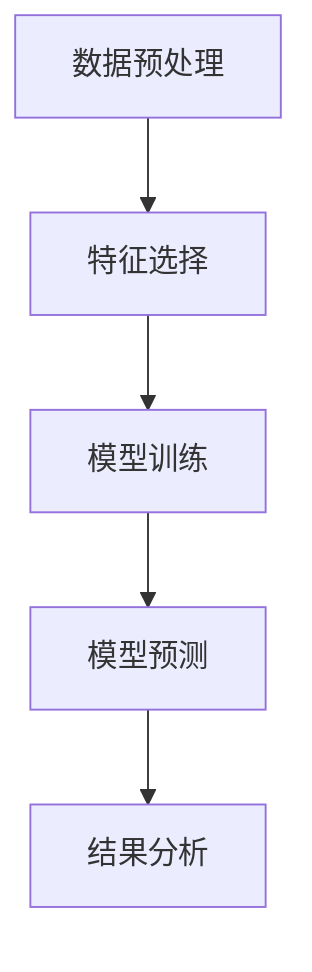

                 


# 《智能银行资产负债管理系统》

---

## 关键词：智能银行, 资产负债管理, 人工智能, 大数据, 系统架构

---

## 摘要：  
本文将详细探讨智能银行资产负债管理系统的构建与实现，从背景、核心概念到系统架构、算法原理，再到项目实战和最佳实践，全面解析智能银行资产负债管理系统的开发过程。通过结合人工智能、大数据和区块链等前沿技术，本文将揭示如何利用智能化手段优化银行资产负债管理流程，提升风险控制能力，实现资产配置的最优解。

---

# 第一部分：智能银行资产负债管理系统的背景与概述

## 第1章：智能银行资产负债管理系统的概述

### 1.1 智能银行的概念与特点  
#### 1.1.1 智能银行的定义  
智能银行是基于人工智能、大数据、区块链等技术，实现银行服务智能化、自动化和个性化的新型银行模式。  

#### 1.1.2 智能银行的核心特点  
- **数据驱动**：通过大数据分析，实时掌握客户需求和市场变化。  
- **智能决策**：利用AI算法进行风险评估、资产配置和交易优化。  
- **自动化服务**：通过自动化流程减少人工干预，提升效率。  
- **安全性高**：结合区块链技术，确保交易安全和数据隐私。  

#### 1.1.3 智能银行与传统银行的对比  
| 特性         | 传统银行                 | 智能银行                 |  
|--------------|--------------------------|--------------------------|  
| 服务模式     | 人工为主                 | 数据驱动、AI辅助           |  
| 决策效率     | 依赖经验                 | 基于数据和模型             |  
| 风险控制     | 事后分析                 | 实时监控和预警             |  

### 1.2 资产负债管理的核心概念  
#### 1.2.1 资产负债管理的定义  
资产负债管理是指通过对银行资产负债表中的资产和负债进行科学配置和管理，以实现银行稳健经营和风险控制的目标。  

#### 1.2.2 资产负债管理的主要目标  
- 优化资产配置，提高资金使用效率。  
- 控制负债规模，降低流动性风险。  
- 管控市场风险，确保资产安全。  

#### 1.2.3 资产负债管理的边界与外延  
- **边界**：仅限于银行内部资产和负债的管理，不涉及外部市场操作。  
- **外延**：通过资产配置优化和风险预警，实现与外部市场的有效联动。  

### 1.3 智能银行资产负债管理系统的必要性  
#### 1.3.1 传统资产负债管理的局限性  
- 依赖人工经验，主观性强，效率低。  
- 数据处理能力有限，难以应对海量数据。  
- 风险预警滞后，难以及时应对市场变化。  

#### 1.3.2 智能化技术在资产负债管理中的优势  
- **数据处理能力强**：能够快速处理海量数据，提高决策效率。  
- **实时监控**：通过实时数据分析，实现风险的即时预警。  
- **精准预测**：利用AI算法，提高资产配置和风险评估的准确性。  

#### 1.3.3 智能银行资产负债管理系统的应用场景  
- **风险评估**：实时评估资产和负债的风险，制定应对策略。  
- **资产配置**：根据市场变化，优化资产配置比例。  
- **交易监控**：实时监控交易行为，防范金融犯罪。  

---

## 第2章：智能银行资产负债管理系统的背景与技术基础  

### 2.1 智能银行发展的技术背景  
#### 2.1.1 人工智能技术的发展  
人工智能技术的进步为智能银行的实现提供了强大的技术支持，特别是在自然语言处理、机器学习和图像识别等领域。  

#### 2.1.2 大数据技术的应用  
大数据技术能够帮助银行高效处理和分析海量数据，为资产负债管理提供精准的决策支持。  

#### 2.1.3 区块链技术的创新  
区块链技术的应用提升了银行交易的安全性和透明度，为智能银行的信用评估和风险控制提供了新的思路。  

### 2.2 银行资产负债管理的传统方法  
#### 2.2.1 资产负债管理的传统流程  
- 数据收集与整理  
- 人工分析与评估  
- 制定管理策略  
- 实施与监控  

#### 2.2.2 传统资产负债管理的优缺点  
- **优点**：经验丰富，策略稳健。  
- **缺点**：效率低下，数据处理能力有限，难以应对复杂市场环境。  

#### 2.2.3 传统方法与智能方法的对比  
| 特性         | 传统方法                 | 智能方法                 |  
|--------------|--------------------------|--------------------------|  
| 数据处理能力 | 有限                     | 强大                     |  
| 决策效率     | 低                       | 高                       |  
| 风险控制     | 粗放                     | 精准                     |  

### 2.3 智能化技术在银行资产负债管理中的应用前景  
#### 2.3.1 AI在风险评估中的应用  
- 利用机器学习模型，实现风险的精准预测和实时预警。  

#### 2.3.2 大数据在资产配置中的作用  
- 通过分析市场数据，优化资产配置比例，提高投资收益。  

#### 2.3.3 区块链在交易安全中的优势  
- 提升交易透明度，降低金融犯罪风险。  

---

## 第3章：智能银行资产负债管理系统的系统架构与核心功能  

### 3.1 系统架构设计  
#### 3.1.1 系统模块划分  
- 数据采集模块  
- 数据处理模块  
- 风险评估模块  
- 资产配置模块  
- 报告生成模块  

#### 3.1.2 系统功能设计  
- 数据采集与清洗  
- 风险评估与预警  
- 资产配置优化  
- 报告生成与分析  

#### 3.1.3 系统架构图（Mermaid）  


### 3.2 核心功能模块  
#### 3.2.1 资产负债数据采集与处理  
- 数据源：银行内部系统、市场数据接口、客户行为数据。  
- 数据清洗：去除冗余数据，填补缺失值，处理异常值。  

#### 3.2.2 风险评估与预警  
- 使用机器学习模型，对资产和负债的风险进行评估和预警。  
- 预警机制：实时监控市场变化，触发预警条件时，发送警报信息。  

#### 3.2.3 资产配置优化  
- 基于市场数据和风险偏好，优化资产配置比例，提高投资收益。  

#### 3.2.4 报告生成与分析  
- 自动生成资产负债管理报告，支持决策者进行战略规划。  

### 3.3 系统功能设计图（Mermaid）  


---

## 第4章：智能银行资产负债管理系统的算法原理  

### 4.1 算法选择与原理  
#### 4.1.1 算法选择  
- 选择基于机器学习的预测模型，用于风险评估和资产配置优化。  

#### 4.1.2 算法原理  
- 使用线性回归模型，预测市场波动对资产价值的影响。  
- 通过随机森林算法，进行风险因子的特征筛选。  

### 4.2 算法流程图（Mermaid）  


### 4.3 算法实现代码  
```python
import pandas as pd
from sklearn.linear_model import LinearRegression

# 数据预处理
data = pd.read_csv('data.csv')
X = data[['资产规模', '负债规模']]
y = data['风险评分']

# 模型训练
model = LinearRegression()
model.fit(X, y)

# 模型预测
new_data = pd.DataFrame({'资产规模': [1000000], '负债规模': [800000]})
predictions = model.predict(new_data)

print('预测风险评分:', predictions[0])
```

### 4.4 算法数学模型  
风险评估模型的数学表达式：  
$$
y = \beta_0 + \beta_1 x_1 + \beta_2 x_2 + \epsilon
$$  
其中，$y$为风险评分，$x_1$和$x_2$分别为资产规模和负债规模，$\beta_0$、$\beta_1$、$\beta_2$为模型系数，$\epsilon$为误差项。  

---

## 第5章：智能银行资产负债管理系统的项目实战  

### 5.1 环境安装与配置  
- 安装Python、Jupyter Notebook、Pandas、Scikit-learn等工具。  

### 5.2 系统核心实现代码  
```python
import pandas as pd
from sklearn.ensemble import RandomForestRegressor

# 数据加载
data = pd.read_csv('data.csv')

# 特征选择
features = ['资产规模', '负债规模', '市场利率']
target = '风险评分'

X = data[features]
y = data[target]

# 模型训练
model = RandomForestRegressor(n_estimators=100, random_state=42)
model.fit(X, y)

# 模型预测
new_data = pd.DataFrame({
    '资产规模': [1200000],
    '负债规模': [900000],
    '市场利率': [5.0]
})

predictions = model.predict(new_data)
print('预测风险评分:', predictions[0])
```

### 5.3 代码功能解读  
- **数据加载**：读取资产负债数据，提取特征和目标变量。  
- **特征选择**：选择对风险评分影响较大的特征。  
- **模型训练**：使用随机森林回归模型进行训练。  
- **模型预测**：基于输入数据，预测风险评分。  

### 5.4 实际案例分析  
- **案例背景**：某银行现有资产规模为1200万元，负债规模为900万元，市场利率为5%。  
- **预测结果**：风险评分为65分（满分100分）。  
- **策略调整**：根据风险评分，调整资产配置比例，降低高风险资产的比例。  

### 5.5 项目小结  
- 通过项目实战，验证了智能银行资产负债管理系统的可行性和有效性。  
- 系统能够准确预测风险评分，为银行决策提供有力支持。  

---

## 第6章：智能银行资产负债管理系统的最佳实践  

### 6.1 最佳实践 tips  
- 定期更新模型参数，确保模型准确性。  
- 建立完善的监控机制，及时发现和处理异常情况。  
- 加强数据安全保护，防止数据泄露和滥用。  

### 6.2 小结  
智能银行资产负债管理系统通过智能化技术的应用，显著提升了银行的管理效率和风险控制能力。  

### 6.3 注意事项  
- 确保数据的准确性和完整性。  
- 定期对系统进行性能优化和功能迭代。  
- 建立健全的应急预案，应对突发事件。  

### 6.4 拓展阅读  
- 推荐阅读《机器学习实战》和《大数据分析与应用》等相关书籍。  
- 关注金融科技创新领域的最新动态和技术趋势。  

---

## 总结  
智能银行资产负债管理系统的开发与应用，标志着银行业在智能化转型中的重要突破。通过本文的详细讲解，读者可以全面了解系统的构建过程、核心技术和实际应用。未来，随着人工智能和大数据技术的进一步发展，智能银行资产负债管理系统将变得更加智能和高效，为银行的稳健发展提供强有力的支持。

