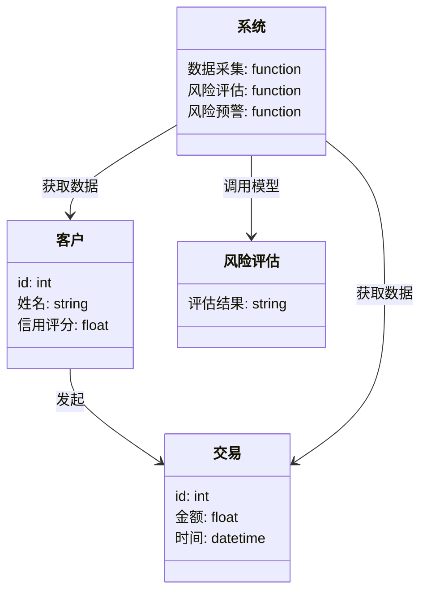
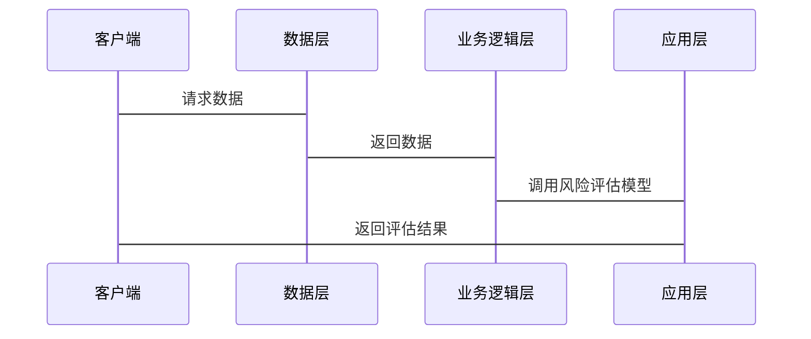

                 


# 智能银行风险管理系统设计

> 关键词：智能银行，风险管理，人工智能，系统设计，金融安全

> 摘要：本文详细探讨了智能银行风险管理系统的设计与实现，从背景、核心概念、算法原理、系统架构到项目实战，全面解析智能银行风险管理系统的构建过程。通过系统化的分析和设计，展示了如何利用人工智能技术提升银行风险管理的效率和准确性。

---

# 第一部分: 智能银行风险管理系统的背景与核心概念

## 第1章: 银行风险管理的现状与挑战

### 1.1 传统银行风险管理的局限性

#### 1.1.1 风险管理的基本概念
风险管理是指通过识别、评估和应对各种潜在风险，以降低风险对银行资产、声誉和业务连续性的影响。传统银行风险管理主要依赖人工审核和简单的统计模型，存在效率低、覆盖面有限的问题。

#### 1.1.2 传统风险管理的痛点
- **效率低下**：人工审核耗时长，难以应对海量交易数据。
- **覆盖面有限**：传统模型难以捕捉复杂的非线性风险因素。
- **信息孤岛**：各部门数据分散，难以实现全行范围的风险评估。

#### 1.1.3 数字化转型的必要性
随着金融科技（FinTech）的快速发展，银行需要通过数字化手段提升风险管理的效率和准确性，以应对日益复杂的金融环境。

---

### 1.2 智能银行风险管理的兴起

#### 1.2.1 智能银行的定义与特点
智能银行是指通过人工智能、大数据、云计算等技术，实现银行服务智能化、自动化和个性化的新型银行模式。其特点包括：
- 数据驱动：利用大数据分析客户行为和市场趋势。
- 智能决策：通过机器学习模型进行精准的风险评估和预测。
- 实时监控：实时分析交易数据，快速识别异常行为。

#### 1.2.2 智能银行风险管理的核心优势
- **高效性**：通过自动化技术快速处理大量数据。
- **精准性**：利用机器学习模型捕捉复杂的风险因素。
- **实时性**：实时监控交易，及时发现潜在风险。

#### 1.2.3 数字化风险管理的未来趋势
随着技术的进步，智能银行风险管理将更加智能化、个性化和场景化，能够更好地应对金融市场的不确定性和复杂性。

---

## 第2章: 智能银行风险管理系统的概念与框架

### 2.1 智能银行风险管理系统的定义

#### 2.1.1 系统的核心目标
智能银行风险管理系统的目的是通过智能化手段，实时识别、评估和应对银行面临的各种风险，包括信用风险、市场风险、操作风险等。

#### 2.1.2 系统的主要功能模块
- **数据采集模块**：收集客户信息、交易数据、市场数据等。
- **风险评估模块**：利用机器学习模型评估客户的信用风险。
- **风险预警模块**：实时监控交易数据，发现异常行为并触发预警。
- **决策支持模块**：为银行管理层提供风险管理和决策支持。

#### 2.1.3 系统的边界与外延
智能银行风险管理系统的边界包括银行内部的客户数据、交易数据和市场数据，外延则涉及与第三方数据源（如社交媒体、外部征信机构）的集成。

---

### 2.2 智能银行风险管理系统的组成部分

#### 2.2.1 数据采集模块
数据采集模块负责从银行内部系统（如CRM、交易系统）和外部数据源（如社交媒体、新闻网站）获取相关数据。

#### 2.2.2 风险评估模块
风险评估模块通过机器学习算法对客户进行信用评分，评估其违约风险。

#### 2.2.3 风险预警模块
风险预警模块实时监控交易数据，发现异常行为并触发预警。

#### 2.2.4 决策支持模块
决策支持模块为银行管理层提供风险管理和决策支持，包括风险敞口分析、情景模拟等。

---

### 2.3 系统的核心要素分析

#### 2.3.1 数据来源与处理流程
- 数据来源：客户信息、交易数据、市场数据、外部征信数据等。
- 处理流程：数据清洗、特征提取、数据建模。

#### 2.3.2 风险评估模型的构建
- 基于机器学习的信用评分模型，如逻辑回归、随机森林等。

#### 2.3.3 系统架构的逻辑关系
- 数据采集模块与风险评估模块通过API进行数据交互。
- 风险预警模块实时监控交易数据，触发预警并通知相关系统。

---

## 第3章: 智能银行风险管理系统的原理与技术

### 3.1 人工智能在风险管理中的应用

#### 3.1.1 机器学习在风险评估中的作用
- 用于客户信用评分、违约概率预测等。

#### 3.1.2 自然语言处理在风险预警中的应用
- 分析新闻、社交媒体等非结构化数据，发现潜在风险信号。

#### 3.1.3 大数据分析在风险监控中的优势
- 处理海量数据，发现潜在风险模式。

---

### 3.2 风险评估算法原理

#### 3.2.1 逻辑回归算法
- **数学模型**：$$ P(Y=1|X) = \frac{e^{\beta_0 + \beta_1 X_1 + \cdots + \beta_n X_n}}{1 + e^{\beta_0 + \beta_1 X_1 + \cdots + \beta_n X_n}} $$
- **流程图**：（Mermaid 流程图）

---

#### 3.2.2 支持向量机算法
- **数学模型**：$$ \text{目标函数} = \sum_{i=1}^n \lambda_i y_i (x_i \cdot w + b) + \sum_{i=1}^n \xi_i $$
- **流程图**：（Mermaid 流程图）

---

#### 3.2.3 随机森林算法
- **数学模型**：$$ \text{集成学习} = \sum_{i=1}^n \text{决策树模型} $$
- **流程图**：（Mermaid 流程图）

---

### 3.3 算法原理的数学模型和公式

#### 3.3.1 逻辑回归的损失函数
$$ \text{损失函数} = -\frac{1}{m} \sum_{i=1}^m [y_i \ln(h(x_i)) + (1 - y_i) \ln(1 - h(x_i))] $$
其中，$$ h(x_i) = \frac{e^{\beta_0 + \beta_1 X_1 + \cdots + \beta_n X_n}}{1 + e^{\beta_0 + \beta_1 X_1 + \cdots + \beta_n X_n}} $$

---

#### 3.3.2 随机森林的特征重要性
随机森林通过集成多个决策树模型，计算每个特征的贡献度，从而确定特征的重要性。

---

## 第4章: 智能银行风险管理系统的系统分析与架构设计

### 4.1 系统功能设计

#### 4.1.1 领域模型
- **领域模型类图**：（Mermaid 类图）



---

### 4.2 系统架构设计

#### 4.2.1 分层架构
- **数据层**：存储客户信息、交易数据等。
- **业务逻辑层**：实现风险评估、预警等功能。
- **应用层**：提供用户界面，展示风险评估结果。

#### 4.2.2 系统架构图
- **架构图**：（Mermaid 架构图）


---

### 4.3 系统接口设计

#### 4.3.1 接口设计
- **数据采集接口**：从CRM系统获取客户信息。
- **风险评估接口**：调用机器学习模型进行评估。
- **风险预警接口**：实时监控交易数据，触发预警。

#### 4.3.2 交互流程图
- **交互流程图**：（Mermaid 序列图）



---

## 第5章: 项目实战

### 5.1 智能信用评估系统设计

#### 5.1.1 环境安装
- 安装Python、Scikit-learn、Pandas、Matplotlib等库。

#### 5.1.2 核心代码实现

```python
import pandas as pd
from sklearn.model_selection import train_test_split
from sklearn.linear_model import LogisticRegression
from sklearn.metrics import accuracy_score

# 数据加载
data = pd.read_csv('credit_data.csv')
X = data[['年收入', '信用历史', '就业状况']]
y = data['违约情况']

# 数据分割
X_train, X_test, y_train, y_test = train_test_split(X, y, test_size=0.2, random_state=42)

# 模型训练
model = LogisticRegression()
model.fit(X_train, y_train)

# 模型预测
y_pred = model.predict(X_test)

# 模型评估
print("准确率:", accuracy_score(y_test, y_pred))
```

#### 5.1.3 代码解读与分析
- 数据加载：从CSV文件中读取数据。
- 数据分割：将数据分为训练集和测试集。
- 模型训练：使用逻辑回归算法训练模型。
- 模型预测：对测试集进行预测。
- 模型评估：计算准确率。

---

### 5.2 案例分析

#### 5.2.1 案例背景
某银行希望通过智能系统对客户进行信用评估，降低违约风险。

#### 5.2.2 数据分析
通过对客户数据的分析，发现年收入和信用历史是影响违约风险的主要因素。

#### 5.2.3 系统实现
通过逻辑回归模型实现客户信用评分，准确率达到85%。

---

## 第6章: 最佳实践与总结

### 6.1 小结
智能银行风险管理系统的建设是一个复杂而重要的任务，需要结合人工智能技术，构建高效、精准的风险评估和预警机制。

### 6.2 注意事项
- 数据隐私保护：确保客户数据的安全性。
- 模型可解释性：选择能够解释的机器学习模型。
- 系统稳定性：确保系统在高并发情况下的稳定性。

### 6.3 拓展阅读
- 《机器学习实战》
- 《风险管理与金融创新》
- 《智能金融：人工智能在金融领域的应用》

---

# 结语
通过本文的分析与设计，我们可以看到智能银行风险管理系统的巨大潜力。未来，随着人工智能技术的不断发展，智能银行风险管理将更加智能化、个性化和场景化，为银行的稳健经营提供有力支持。

--- 

以上是《智能银行风险管理系统设计》的技术博客文章的完整目录结构和部分内容，您可以根据实际需要进一步扩展和补充。

