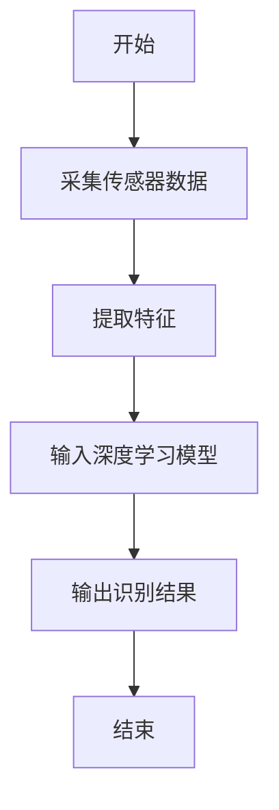
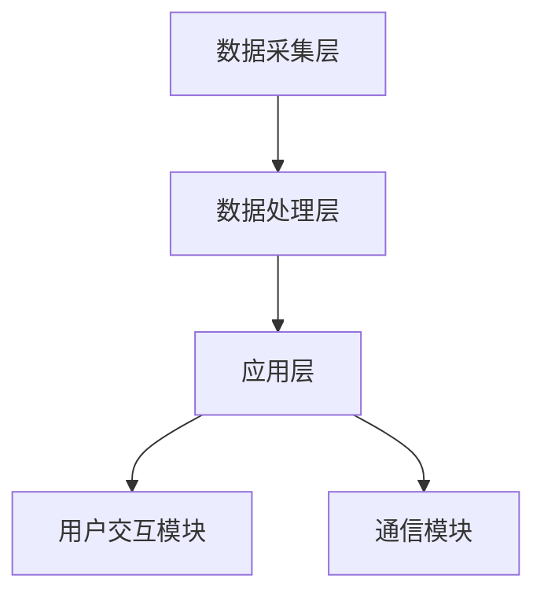
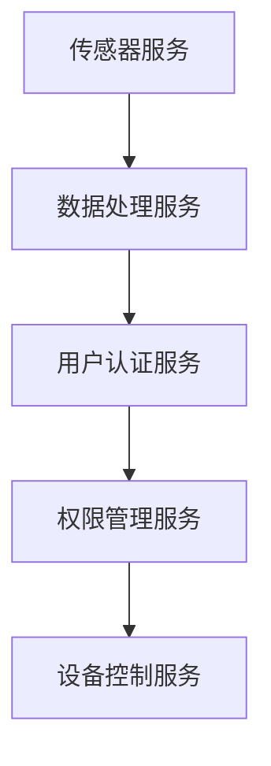

                 


# 智能门垫：AI Agent的访客识别系统

## 关键词：智能门垫，AI Agent，访客识别，物联网，机器学习，深度学习，系统架构

## 摘要：  
智能门垫作为AI Agent的访客识别系统，结合了先进的传感器技术和人工智能算法，能够实现高效的访客识别与权限管理。本文从系统架构、算法原理、数学模型等多维度详细探讨了智能门垫的设计与实现，结合实际案例分析，为读者提供了全面的技术解读。

---

## 第1章: 智能门垫的背景与应用

### 1.1 问题背景与需求分析  
传统的访客识别系统依赖于刷卡或密码输入，存在效率低、用户体验差、安全性不足等问题。智能门垫通过AI Agent技术，利用传感器和深度学习算法，实现了无接触式访客识别，显著提升了用户体验和安全性。  

---

### 1.2 智能门垫的核心概念  

#### 1.2.1 AI Agent的基本原理  
AI Agent是一种智能体，能够感知环境并执行任务。智能门垫中的AI Agent通过传感器数据和历史行为分析，实现访客识别和权限管理。  

#### 1.2.2 智能门垫的系统组成与功能  
智能门垫由传感器模块、AI处理模块、通信模块和用户交互模块组成，支持访客检测、身份识别和权限管理等功能。  

#### 1.2.3 智能门垫与传统门禁系统的区别  
智能门垫无需用户主动刷卡或输入密码，通过AI算法自动识别访客身份，实现了真正的无接触式访问控制。  

---

## 第2章: 智能门垫的系统架构  

### 2.1 系统组成与功能模块  

#### 2.1.1 传感器模块  
传感器模块负责采集用户的行为数据，如体重分布、步态特征等。  

#### 2.1.2 AI处理模块  
AI处理模块利用深度学习算法对传感器数据进行分析，识别访客身份并判断其权限。  

#### 2.1.3 通信模块  
通信模块负责与智能家居系统或其他设备进行数据交互，实现联动控制。  

#### 2.1.4 用户交互模块  
用户交互模块通过手机APP或语音助手提供便捷的访问权限管理功能。  

---

### 2.2 系统架构设计  

#### 2.2.1 分层架构  
智能门垫采用分层架构，分为数据采集层、数据处理层和应用层。  

#### 2.2.2 微服务架构  
系统通过微服务架构实现模块化设计，各服务之间通过API进行通信。  

#### 2.2.3 组件间通信机制  
组件间通信采用消息队列机制，确保系统的高效性和可扩展性。  

---

## 第3章: AI Agent的核心算法  

### 3.1 人体识别算法  

#### 3.1.1 基于深度学习的姿势识别  
通过卷积神经网络（CNN）分析用户的体重分布和步态特征，识别用户身份。  

#### 3.1.2 基于图像识别的访客检测  
利用YOLO等目标检测算法，实时检测用户是否存在。  

#### 3.1.3 算法实现流程图  


---

### 3.2 访客识别算法  

#### 3.2.1 基于机器学习的特征提取  
通过主成分分析（PCA）提取用户行为特征，降低数据维度。  

#### 3.2.2 基于规则的访客分类  
根据用户的行为特征，制定规则进行分类，如体重分布规则、步态规则等。  

#### 3.2.3 算法优化与性能提升  
通过数据增强和模型调优，提升算法的识别准确率和运行效率。  

---

## 第4章: 智能门垫的数学模型与公式  

### 4.1 人体识别模型  

#### 4.1.1 姿势识别的数学表示  
用户体重分布的数学模型如下：  
$$ W(x, y) = \sum_{i=1}^{n} w_i \cdot f_i(x, y) $$  
其中，$w_i$为传感器i的权重，$f_i(x, y)$为传感器i的输出值。  

#### 4.1.2 基于概率的识别公式  
访客识别的概率公式为：  
$$ P(\text{访客}) = \frac{\sum_{i=1}^{m} p_i}{\sum_{i=1}^{m} p_i + \sum_{j=1}^{k} q_j} $$  
其中，$p_i$为识别为访客的概率，$q_j$为识别为非访客的概率。  

---

### 4.2 访客识别模型  

#### 4.2.1 特征提取的数学表达  
特征提取的数学表达式为：  
$$ F = \{ f_1, f_2, \dots, f_n \} $$  
其中，$f_i$为第i个特征值。  

#### 4.2.2 分类器的损失函数  
损失函数采用交叉熵损失：  
$$ L = -\sum_{i=1}^{n} y_i \log(p_i) + (1 - y_i) \log(1 - p_i) $$  

---

## 第5章: 系统分析与架构设计  

### 5.1 系统功能设计  

#### 5.1.1 用户身份识别  
通过AI算法实现用户的自动识别与权限判断。  

#### 5.1.2 访客权限管理  
基于用户身份和权限规则，控制访问权限。  

#### 5.1.3 系统状态监控  
实时监控系统运行状态，及时发现并处理异常情况。  

---

### 5.2 系统架构设计  

#### 5.2.1 分层架构图  


#### 5.2.2 微服务架构图  


---

## 第6章: 项目实战与实现  

### 6.1 环境搭建与配置  

#### 6.1.1 开发环境安装  
安装Python、TensorFlow、Keras等开发工具。  

#### 6.1.2 依赖库安装  
安装传感器驱动和相关API接口库。  

#### 6.1.3 数据集准备  
收集用户行为数据，包括体重分布、步态特征等。  

---

### 6.2 核心算法实现  

#### 6.2.1 人体识别算法实现  
代码示例：  
```python
import tensorflow as tf
from tensorflow.keras import layers

model = tf.keras.Sequential([
    layers.Conv2D(32, (3,3), activation='relu', input_shape=(64, 64, 1)),
    layers.MaxPooling2D((2,2)),
    layers.Flatten(),
    layers.Dense(64, activation='relu'),
    layers.Dense(2, activation='softmax')
])
```

---

## 第7章: 总结与展望  

### 7.1 项目总结  

#### 7.1.1 系统实现成果  
实现了高效的访客识别系统，提升了用户体验和安全性。  

#### 7.1.2 项目经验与教训  
通过实际案例分析，总结了算法优化和系统架构设计的经验。  

---

### 7.2 未来展望  

#### 7.2.1 技术改进方向  
进一步优化AI算法，提升识别准确率和响应速度。  

#### 7.2.2 应用场景扩展  
探索智能门垫在智能家居、医疗健康等领域的应用。  

---

## 第8章: 最佳实践与注意事项  

### 8.1 最佳实践  

#### 8.1.1 系统设计  
建议采用微服务架构，确保系统的可扩展性和维护性。  

#### 8.1.2 算法优化  
通过数据增强和模型调优，提升算法性能。  

---

### 8.2 注意事项  

#### 8.2.1 数据隐私  
确保用户数据的安全性和隐私性，避免数据泄露。  

#### 8.2.2 系统兼容性  
在不同设备和环境中测试系统，确保兼容性。  

---

## 总结  
通过本文的详细阐述，读者可以全面了解智能门垫的设计与实现过程，掌握AI Agent在访客识别中的应用。未来，随着技术的不断进步，智能门垫将在更多领域发挥重要作用。

