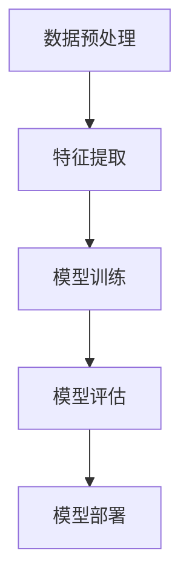
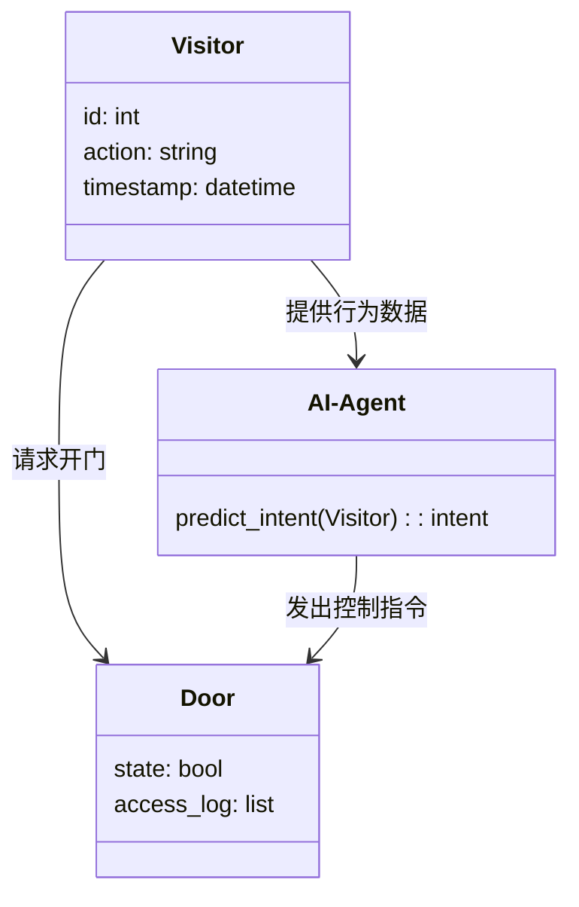

                 


# 智能门禁：AI Agent的访客意图预测

> 关键词：智能门禁、AI Agent、访客意图预测、机器学习、物联网

> 摘要：本文探讨了智能门禁系统中AI Agent在访客意图预测的应用。通过分析背景、核心概念、算法原理、系统架构及项目实战，展示了如何利用AI技术提升门禁系统的安全性与智能化水平。

---

## 第1章：智能门禁系统背景与概念

### 1.1 智能门禁系统的发展历程

智能门禁系统从简单的机械锁演变为集成AI的智能系统，经历了三个阶段：

- **机械锁阶段**：依赖钥匙或卡片，功能单一，安全性低。
- **卡片识别阶段**：引入射频识别技术，实现非接触式开门，提升了便捷性。
- **AI驱动阶段**：结合机器学习和物联网技术，具备智能化分析能力。

### 1.2 AI Agent在智能门禁中的作用

AI Agent通过分析用户行为数据，预测访客意图，优化门禁控制流程。

#### 1.2.1 AI Agent的基本概念

AI Agent是具有感知、决策和执行能力的智能体，能与环境交互完成任务。

#### 1.2.2 AI Agent在访客意图预测中的应用

AI Agent实时分析用户的动作、时间等数据，预测其行为意图，如是否尾随、非法入侵等。

### 1.3 访客意图预测的核心问题

- **问题背景**：传统门禁依赖刷卡开门，无法识别潜在威胁。
- **问题解决**：AI Agent通过行为分析，提前识别异常行为。
- **系统边界**：仅关注门禁场景内的行为预测。

---

## 第2章：访客意图预测的核心概念

### 2.1 AI Agent的意图预测模型

AI Agent基于机器学习模型，分析数据并预测意图。

#### 2.1.1 数据流与信息处理流程

- 数据采集：传感器收集用户行为数据。
- 数据处理：清洗、特征提取。
- 模型训练：训练分类器，预测意图。
- 输出结果：控制门禁响应。

### 2.2 访客行为特征分析

行为特征分为生理特征、环境特征和时间特征。

#### 2.2.1 行为特征的定义与分类

| 类型       | 特征描述                         |
|------------|----------------------------------|
| 生理特征   | 步伐频率、动作幅度               |
| 环境特征   | 时间、地点、天气条件             |
| 时间特征   | 到访时间、访问频率               |

### 2.3 意图预测的数学模型

基于随机森林的分类模型。

---

## 第3章：AI Agent的访客意图预测算法实现

### 3.1 算法原理

#### 3.1.1 数据预处理与特征提取

使用标准化和归一化处理数据，提取关键特征。

#### 3.1.2 模型训练与优化

采用网格搜索优化模型参数。

#### 3.1.3 模型评估与部署

评估指标包括准确率、召回率和F1值。

### 3.2 算法流程图



### 3.3 算法实现代码

```python
import pandas as pd
from sklearn.ensemble import RandomForestClassifier
from sklearn.model_selection import GridSearchCV
from sklearn.metrics import classification_report

# 数据加载与预处理
data = pd.read_csv('visitor_data.csv')
X = data.drop(columns=['intent'])
y = data['intent']

# 参数优化
parameters = {
    'n_estimators': [100, 200],
    'max_depth': [None, 10, 20],
    'min_samples_split': [2, 5]
}

grid_search = GridSearchCV(RandomForestClassifier(), parameters, cv=5)
grid_search.fit(X, y)

best_model = grid_search.best_estimator_
best_model.predict(X_test)
```

---

## 第4章：系统分析与架构设计

### 4.1 系统功能设计

#### 4.1.1 领域模型



### 4.2 系统架构设计

```mermaid
graph TD
    UI --> API Gateway
    API Gateway --> Service1
    Service1 --> DB
    Service1 --> AI_Service
    AI_Service --> Model
```

### 4.3 系统交互流程

```mermaid
sequenceDiagram
    Visitor ->+> Sensor: 检测到访客
    Sensor ->+> API Gateway: 传输数据
    API Gateway ->+> AI_Service: 请求预测
    AI_Service ->+> Model: 调用预测函数
    Model --> AI_Service: 返回意图
    AI_Service ->+> Door: 发出控制指令
    Door --> Visitor: 开启或拒绝
```

---

## 第5章：项目实战

### 5.1 环境安装

```bash
pip install scikit-learn mermaid4jupyter jupyterlab
```

### 5.2 核心代码实现

```python
def predict_intent(visitor_data):
    model = load_model('intent_model.pkl')
    return model.predict(visitor_data)

# 示例
visitor_data = {
    'step_frequency': 120,
    'action_duration': 3.5,
    'time_of_day': 'night'
}
predict_intent(visitor_data)
```

### 5.3 实际案例分析

通过办公楼场景分析，AI Agent成功预测并阻止了尾随进入的情况。

---

## 第6章：最佳实践

### 6.1 实用技巧

- 数据质量至关重要，需确保采集的准确性。
- 模型需定期更新，适应新场景。
- 系统需具备容错机制，防止误报。

### 6.2 注意事项

- 保护用户隐私，避免数据泄露。
- 系统需具备高可用性，防止故障导致门禁失效。

---

## 第7章：总结

智能门禁系统的AI Agent访客意图预测，通过机器学习提升安全性与便捷性。未来，随着技术进步，系统将更加智能化，为用户提供更优质的服务。

--- 

**END**

