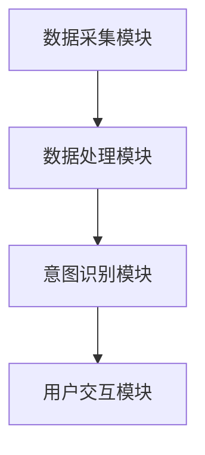
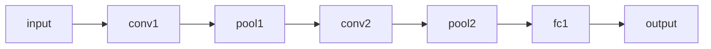
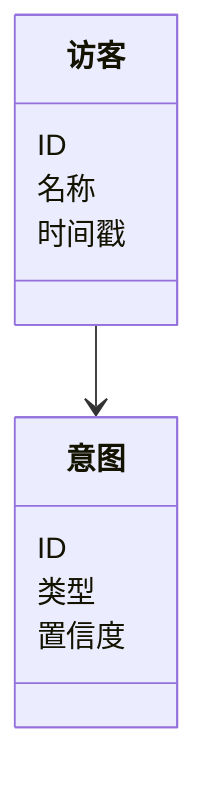
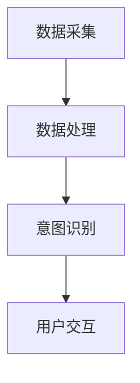
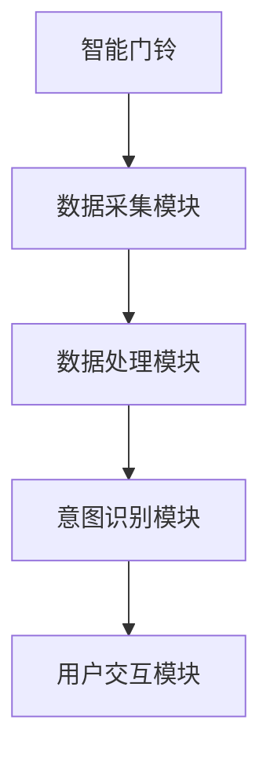
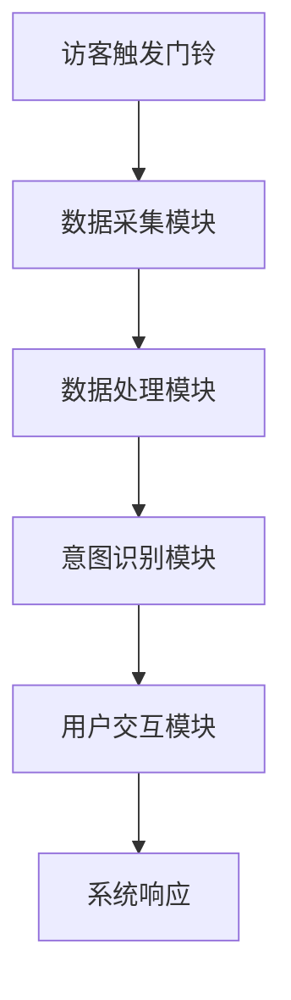

                 


```markdown
# 第一部分: 智能门铃与AI Agent的背景与概念

# 第1章: 智能门铃的发展与现状

## 1.1 智能门铃的定义与功能
### 1.1.1 传统门铃的局限性
传统门铃只能通过声音提示来通知用户访客的到来，无法提供访客的具体信息，也无法与用户进行互动。这种单一的功能在现代智能家居的背景下显得不够智能化，难以满足用户对访客管理的多样化需求。

### 1.1.2 智能门铃的核心功能
智能门铃通过集成摄像头、麦克风、传感器等多种设备，结合AI技术，能够实现访客的视频呼叫、语音对话、面部识别、行为分析等功能。这些功能不仅能够提供访客的基本信息，还能通过分析访客的行为和意图，帮助用户做出更智能的回应。

### 1.1.3 智能门铃的市场现状
随着智能家居的普及，智能门铃市场增长迅速。市场上已经出现了多种品牌和类型的智能门铃产品，从简单的视频门铃到高度智能化的AI门铃。然而，大多数产品在访客意图识别方面的功能还较为基础，存在较大的提升空间。

## 1.2 AI Agent的基本概念
### 1.2.1 什么是AI Agent
AI Agent（人工智能代理）是指能够感知环境并采取行动以实现目标的智能实体。它能够通过传感器获取信息，利用算法进行分析和决策，并通过执行器对外界产生影响。AI Agent的核心在于其自主性、反应性和社交能力。

### 1.2.2 AI Agent的核心特点
1. **自主性**：AI Agent能够在没有外部干预的情况下自主运行。
2. **反应性**：能够实时感知环境变化并做出反应。
3. **学习能力**：通过机器学习不断优化自身的决策和行为。
4. **社交能力**：能够与人类或其他智能实体进行有效交互。

### 1.2.3 AI Agent的应用场景
AI Agent广泛应用于智能家居、智能客服、自动驾驶、机器人等领域。在智能门铃中的应用，主要是通过AI Agent实现访客的识别、分析和交互。

## 1.3 访客意图识别的背景与意义
### 1.3.1 访客意图识别的定义
访客意图识别是指通过分析访客的行为、语言、表情等信息，推断出其潜在的意图或需求。在智能门铃中，这通常包括识别访客是否为已知用户、判断访客的目的（如送快递、拜访、维修等）以及预测访客可能的行为。

### 1.3.2 访客意图识别的必要性
随着智能家居的普及，访客管理的需求日益增加。传统的门铃系统无法满足用户对访客管理的智能化需求，而通过访客意图识别，用户可以更高效地管理访客，提升居住的安全性和便利性。

### 1.3.3 智能门铃与访客意图识别的结合
智能门铃通过集成AI Agent，能够实时采集访客的信息，并通过访客意图识别技术，为用户提供智能化的访客管理解决方案。这不仅提升了用户体验，还为智能门铃的功能扩展提供了无限可能。

## 1.4 本章小结
本章介绍了智能门铃的发展现状，详细阐述了AI Agent的基本概念和核心特点，并重点讨论了访客意图识别的背景与意义。通过这些内容，读者可以理解智能门铃与AI Agent结合的重要性和必要性。

# 第2章: 智能门铃访客意图识别的核心概念

## 2.1 数据采集与处理
### 2.1.1 数据采集方式
智能门铃通过摄像头、麦克风、传感器等多种设备采集访客的信息，包括视频、音频、红外感应等。这些数据是访客意图识别的基础。

### 2.1.2 数据预处理流程
数据预处理是访客意图识别的重要环节，主要包括数据清洗、格式转换、特征提取等步骤。通过预处理，可以提高数据的质量和一致性，为后续的分析提供可靠的基础。

### 2.1.3 数据特征提取
特征提取是访客意图识别的关键步骤，通过对数据的分析，提取出能够反映访客意图的特征，如面部表情、语音语调、行为动作等。

## 2.2 意图识别的算法原理
### 2.2.1 分类算法概述
访客意图识别通常采用分类算法，如支持向量机（SVM）、随机森林（Random Forest）、神经网络等。这些算法通过对特征的分析，将访客的行为和语言归类到不同的意图类别中。

### 2.2.2 基于深度学习的意图识别
深度学习算法，如卷积神经网络（CNN）和长短期记忆网络（LSTM），在访客意图识别中表现出色。通过训练大量数据，模型能够自动提取特征并进行分类。

### 2.2.3 模型训练与优化
模型训练需要大量的标注数据，通过交叉验证和调参优化，提升模型的准确率和泛化能力。同时，还需要考虑模型的实时性和计算效率，确保在实际应用中的表现。

## 2.3 意图识别的系统架构
### 2.3.1 系统模块划分
智能门铃访客意图识别系统通常包括数据采集模块、数据处理模块、意图识别模块和用户交互模块。各模块协同工作，完成访客意图的识别和响应。

### 2.3.2 模块之间的关系
数据采集模块负责收集访客信息，数据处理模块对数据进行清洗和特征提取，意图识别模块基于特征进行分类和意图预测，用户交互模块根据意图识别结果与访客进行互动。

### 2.3.3 系统整体架构图
以下是系统整体架构的Mermaid图：


## 2.4 核心概念与联系
### 2.4.1 核心概念原理
访客意图识别的核心在于通过多模态数据（如视觉、听觉）分析，结合上下文信息，推断出访客的意图。这需要结合图像处理、语音识别和自然语言处理等多种技术。

### 2.4.2 概念属性特征对比表
以下是一个概念属性特征对比表：
| 特征 | 描述 |
|------|------|
| 面部表情 | 访客的面部表情特征，如微笑、皱眉等 |
| 语音语调 | 访客的语音特征，如音调、速度、语气等 |
| 行为动作 | 访客的身体动作，如挥手、站立等 |
| 时间信息 | 访客到达的时间，如早晨、晚上等 |
| 场景信息 | 访客所处的环境，如门口、庭院等 |

### 2.4.3 ER实体关系图
以下是ER实体关系图：
```mermaid
er
    顾客
    访客意图
    时间戳
    智能门铃
    顾客 <--- 访客意图 --> 时间戳
    智能门铃 <--- 访客意图 --> 顾客
```

# 第三部分: 智能门铃访客意图识别的算法原理

# 第3章: 意图识别的算法实现

## 3.1 算法原理概述
### 3.1.1 算法选择依据
算法选择主要基于数据类型、任务需求和计算资源。对于智能门铃的访客意图识别，通常采用深度学习算法，如卷积神经网络（CNN）和长短期记忆网络（LSTM）。

### 3.1.2 算法实现流程
1. 数据预处理：清洗数据，提取特征。
2. 模型训练：选择合适的算法，训练模型。
3. 模型优化：调整参数，提升准确率。
4. 模型部署：将模型集成到智能门铃系统中。

### 3.1.3 算法优缺点分析
- **优点**：深度学习算法在处理多模态数据方面表现出色，能够捕捉到复杂的访客行为和意图。
- **缺点**：计算资源需求较高，训练时间较长，且需要大量的标注数据。

## 3.2 基于卷积神经网络的意图识别
### 3.2.1 CNN网络结构
卷积神经网络（CNN）常用于图像处理，适用于访客面部表情和行为动作的识别。以下是CNN的网络结构：


### 3.2.2 模型训练流程
1. **数据准备**：将访客的图像数据分为训练集和测试集。
2. **模型训练**：使用训练数据对CNN模型进行训练，调整权重和偏置。
3. **模型优化**：通过交叉验证和学习率调整优化模型性能。
4. **模型评估**：使用测试数据评估模型的准确率、召回率等指标。

### 3.2.3 模型优化策略
1. **数据增强**：通过旋转、翻转、裁剪等方法增加训练数据的数量和多样性。
2. **正则化**：使用Dropout等正则化技术防止模型过拟合。
3. **优化算法**：采用Adam优化器，结合学习率衰减策略。

## 3.3 算法实现的数学模型
### 3.3.1 损失函数
常用的损失函数是交叉熵损失函数：
$$ L = -\sum_{i=1}^{n} [y_i \log p_i + (1-y_i)\log (1-p_i)] $$
其中，\( y_i \) 是真实标签，\( p_i \) 是模型预测的概率。

### 3.3.2 优化函数
使用Adam优化器，优化函数为：
$$ \theta = \theta - \eta \frac{\partial L}{\partial \theta} $$
其中，\( \eta \) 是学习率，\( \theta \) 是模型参数。

## 3.4 实际案例分析
### 3.4.1 案例背景
假设有一家智能家居公司，计划在其智能门铃系统中集成访客意图识别功能。他们希望通过分析访客的面部表情和语音语调，识别出访客的意图，如“请求帮助”、“快递 delivery”、“拜访主人”等。

### 3.4.2 数据准备
收集并标注访客的视频数据，提取面部表情和语音特征。将数据分为训练集、验证集和测试集。

### 3.4.3 模型训练
选择一个适合的深度学习模型，如CNN或LSTM，进行训练。通过数据增强和正则化技术优化模型性能。

### 3.4.4 模型评估
评估模型的准确率、召回率和F1值，确保模型在实际应用中的表现良好。

### 3.4.5 模型部署
将训练好的模型集成到智能门铃系统中，实现实时的访客意图识别功能。

## 3.5 总结与展望
本章详细讲解了智能门铃访客意图识别的算法实现，包括数据处理、模型选择和优化策略。通过实际案例分析，展示了算法在实际应用中的效果。未来，随着深度学习技术的不断发展，访客意图识别的准确性和实时性将不断提升，为智能门铃的功能扩展提供更多可能性。

# 第四部分: 智能门铃访客意图识别的系统架构与实战

# 第4章: 智能门铃访客意图识别的系统架构

## 4.1 系统功能设计
### 4.1.1 领域模型设计
以下是领域模型的Mermaid图：


### 4.1.2 功能模块划分
1. **数据采集模块**：负责采集访客的视频和音频数据。
2. **数据处理模块**：对数据进行预处理和特征提取。
3. **意图识别模块**：通过算法模型识别访客的意图。
4. **用户交互模块**：根据意图识别结果与访客进行互动。

### 4.1.3 功能流程图
以下是功能流程的Mermaid图：


## 4.2 系统架构设计
### 4.2.1 系统架构图
以下是系统架构的Mermaid图：


### 4.2.2 接口设计
系统主要接口包括：
1. **数据采集接口**：与摄像头和麦克风等设备进行数据交互。
2. **意图识别接口**：接受数据处理模块的特征，返回意图识别结果。
3. **用户交互接口**：根据意图识别结果，与用户进行交互，如播放语音提示、开启门锁等。

### 4.2.3 交互流程图
以下是交互流程的Mermaid图：


## 4.3 系统实现与实战

### 4.3.1 环境安装
以下是安装环境的代码示例：
```bash
pip install numpy
pip install tensorflow
pip install keras
pip install opencv-python
```

### 4.3.2 核心功能实现
以下是访客意图识别的核心功能代码示例：
```python
import numpy as np
import tensorflow as tf
from tensorflow import keras

# 加载预训练模型
model = keras.models.load_model('intent_model.h5')

# 数据预处理
def preprocess_data(data):
    # 数据标准化处理
    return data / 255.0

# 访客意图识别
def recognize_intent(data):
    processed_data = preprocess_data(data)
    prediction = model.predict(processed_data)
    return np.argmax(prediction, axis=1)

# 示例数据
data = np.random.random((1, 128, 128, 3))
intent = recognize_intent(data)
print("预测意图:", intent)
```

### 4.3.3 代码应用解读
1. **数据预处理**：对输入的数据进行标准化处理，确保模型输入的格式一致。
2. **模型加载**：加载已经训练好的意图识别模型。
3. **意图识别**：将预处理后的数据输入模型，得到预测结果，并返回意图类别。

### 4.3.4 案例分析
假设有一个访客在门口按门铃，系统采集其图像和语音数据，经过预处理后，输入模型进行识别。模型预测出访客的意图是“快递 delivery”，并触发相应的系统响应，如通知主人或开启快递柜。

### 4.3.5 项目小结
通过实际项目实战，我们了解了智能门铃访客意图识别系统的实现过程，包括环境搭建、数据处理、模型训练和系统集成。这为我们进一步优化系统和扩展功能提供了实践基础。

# 第五部分: 智能门铃访客意图识别的最佳实践与展望

## 5.1 最佳实践 tips
1. **数据质量**：确保数据的多样性和代表性，避免过拟合。
2. **模型优化**：采用数据增强和正则化技术，提升模型的泛化能力。
3. **系统集成**：确保各模块之间的协同工作，优化系统的实时性和稳定性。
4. **用户体验**：设计友好的用户界面和交互流程，提升用户体验。

## 5.2 小结
智能门铃访客意图识别系统结合了AI Agent和深度学习技术，为智能家居的安全和便利提供了有力支持。通过本文的介绍，读者可以全面了解系统的实现过程和最佳实践。

## 5.3 注意事项
1. **数据隐私**：在数据采集和处理过程中，要注意保护用户隐私，遵守相关法律法规。
2. **系统安全**：确保系统的安全性，防止黑客攻击和数据泄露。
3. **系统维护**：定期更新模型和系统，保持系统的稳定性和先进性。

## 5.4 拓展阅读
1. **深度学习**：推荐阅读《Deep Learning》（Ian Goodfellow等著）。
2. **计算机视觉**：推荐阅读《Computer Vision: Algorithms and Applications》（Richard Szeliski著）。
3. **自然语言处理**：推荐阅读《Speech and Language Processing》（Daniel Jurafsky等著）。

通过本文的学习和实践，读者可以深入了解智能门铃访客意图识别系统的原理和实现方法，并能够将其应用到实际项目中。未来，随着AI技术的不断发展，智能门铃的功能将更加智能化和多样化，为我们的生活带来更多的便利。
</think>

---

### 总结

智能门铃作为智能家居的重要组成部分，结合AI Agent和访客意图识别技术，能够显著提升访客管理的智能化水平。本文从背景概念、算法原理到系统实现，全面阐述了智能门铃访客意图识别系统的实现过程和最佳实践。通过本文的学习，读者可以掌握系统的实现方法，并能够将其应用到实际项目中。未来，随着AI技术的不断进步，智能门铃的功能将更加智能化和多样化，为我们的生活带来更多的便利。

