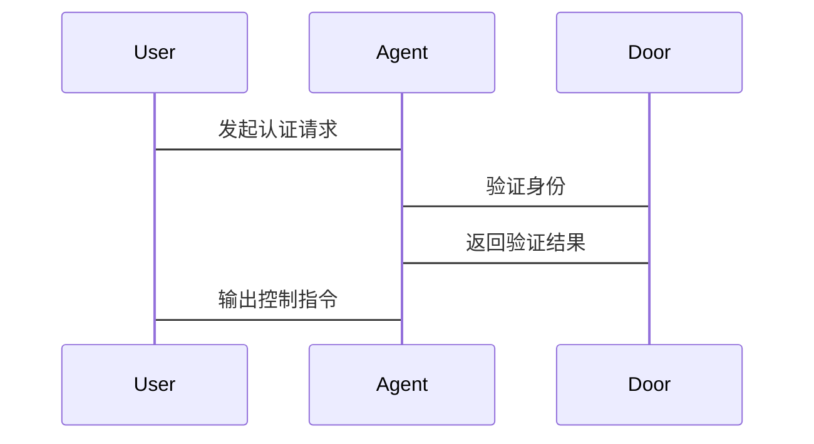

                 


# 智能门锁：AI Agent的多因素认证系统

## 关键词：智能门锁, AI Agent, 多因素认证, 身份验证, 人工智能

## 摘要：  
本文探讨了AI Agent在智能门锁中的应用，重点分析多因素认证系统的设计与实现。通过结合生物识别、行为分析和环境感知等技术，AI Agent能够提升门锁系统的安全性与智能化水平。文章详细介绍了多因素认证的核心概念、AI Agent的工作原理、系统架构设计，以及实际项目的实现与应用案例，为智能门锁的未来发展提供了理论与实践指导。

---

# 第一部分: 智能门锁与AI Agent的背景介绍

## 第1章: 问题背景与目标

### 1.1 问题背景
#### 1.1.1 传统门锁的局限性
传统门锁依赖机械钥匙或单一密码，存在易复制、易破解的缺陷。一旦钥匙丢失或密码泄露，安全风险急剧上升。

#### 1.1.2 智能化门锁的需求驱动
随着智能家居的发展，用户对门锁的安全性、便捷性和智能化提出了更高要求。单一认证方式已无法满足需求。

#### 1.1.3 多因素认证的重要性
通过结合多种认证方式（如指纹、面部识别、行为分析等），多因素认证显著提升了系统的安全性。

### 1.2 问题描述
#### 1.2.1 当前门锁系统的痛点
传统门锁易被破解，单一认证方式存在安全隐患，用户体验差。

#### 1.2.2 多因素认证的必要性
多因素认证通过结合多种认证方式，大幅降低了被破解的风险。

#### 1.2.3 AI Agent在门锁系统中的作用
AI Agent能够实时分析用户行为和环境数据，辅助决策，提升认证的准确性和效率。

### 1.3 解决方案概述
#### 1.3.1 多因素认证的实现方式
结合生物识别、行为分析、环境感知等多种技术，构建多维度认证体系。

#### 1.3.2 AI Agent的核心功能
AI Agent负责数据采集、特征提取、决策判断，实现智能化认证。

#### 1.3.3 系统的整体架构
系统由数据采集层、处理层和应用层组成，AI Agent贯穿整个流程，实现多因素认证。

### 1.4 边界与外延
#### 1.4.1 系统边界定义
系统仅处理门锁相关的认证请求，与其他智能家居设备通过标准接口交互。

#### 1.4.2 系统外延与扩展性
支持多种认证方式的扩展，可与其他智能设备联动，形成完整的智能家居生态。

#### 1.4.3 系统与外部环境的交互
通过API与智能家居平台对接，AI Agent实时接收环境数据，辅助决策。

### 1.5 核心概念与组成
#### 1.5.1 多因素认证的定义
多因素认证指结合多种认证方式，确保用户身份的真实性和系统安全性。

#### 1.5.2 AI Agent的核心要素
AI Agent包括数据采集、特征提取、决策判断三大模块，实现智能化认证。

#### 1.5.3 系统组成与功能模块
系统由数据采集层、处理层和应用层组成，AI Agent贯穿整个流程，实现多因素认证。

---

## 第2章: 多因素认证与AI Agent的核心概念

### 2.1 多因素认证的原理
#### 2.1.1 多因素认证的分类
多因素认证包括知识型（如密码）、所有物型（如钥匙）和生物特征型（如指纹、面部识别）。

#### 2.1.2 各种认证方式的特点
- 知识型：便于记忆，但易泄露。
- 所有物型：安全性较高，但易丢失。
- 生物特征型：唯一性强，但设备依赖性高。

#### 2.1.3 多因素认证的优势
通过结合多种认证方式，多因素认证显著提升了系统的安全性，降低了被破解的风险。

### 2.2 AI Agent的基本原理
#### 2.2.1 AI Agent的定义
AI Agent是一种智能体，能够感知环境、自主决策并执行任务。

#### 2.2.2 AI Agent的核心算法
AI Agent基于机器学习算法，通过训练数据模型，实现对用户行为的识别和判断。

#### 2.2.3 AI Agent的决策机制
AI Agent通过分析环境数据和用户行为，利用训练好的模型进行决策，输出相应的控制指令。

### 2.3 多因素认证与AI Agent的结合
#### 2.3.1 多因素认证在门锁系统中的应用
通过结合指纹、面部识别和行为分析等多种认证方式，实现智能化认证。

#### 2.3.2 AI Agent在认证过程中的作用
AI Agent负责数据采集、特征提取和决策判断，实现多因素认证的智能化。

#### 2.3.3 两者的协同工作模式
AI Agent协同多因素认证系统，实现智能化的门锁控制。

### 2.4 核心概念对比分析
#### 2.4.1 多因素认证与传统认证的对比
- 传统认证：单一认证方式，安全性低。
- 多因素认证：结合多种方式，安全性显著提升。

#### 2.4.2 AI Agent与传统门锁系统的对比
- 传统门锁系统：基于机械或单一电子认证，缺乏智能化。
- AI Agent：通过智能算法，实现精准的用户识别和环境感知。

#### 2.4.3 多因素认证与AI Agent的协同优势
结合多因素认证和AI Agent，系统能够实现更高的安全性、智能化和用户体验。

### 2.5 核心概念的ER实体关系图
```mermaid
erDiagram
    actor User {
        +id : integer
        +username : string
    }
    actor Agent {
        +id : integer
        +model : string
    }
    actor Door {
        +id : integer
        +status : boolean
    }
    User --> Agent : "请求认证"
    Agent --> Door : "控制门锁"
    User --> Door : "直接操作"
```

---

## 第3章: AI Agent的算法原理

### 3.1 算法原理概述
AI Agent通过机器学习算法，实现对用户行为的识别和判断。

### 3.2 数据流与算法流程
#### 3.2.1 数据采集
AI Agent通过传感器和摄像头等设备，采集用户的行为数据和环境数据。

#### 3.2.2 特征提取
利用特征提取算法，从采集的数据中提取关键特征，如指纹纹路、面部特征等。

#### 3.2.3 决策判断
基于训练好的模型，AI Agent分析特征数据，判断用户身份，输出相应的控制指令。

### 3.3 算法的数学模型与公式
#### 3.3.1 分类算法
AI Agent使用分类算法对用户行为进行分类，常用的支持向量机（SVM）模型：

$$
y = \text{sign}(w \cdot x + b)
$$

其中，$w$是权重向量，$x$是输入特征，$b$是偏置项。

#### 3.3.2 概率计算
通过计算用户行为的概率分布，AI Agent可以更准确地判断用户身份。例如，基于贝叶斯定理：

$$
P(A|B) = \frac{P(B|A) \cdot P(A)}{P(B)}
$$

---

## 第4章: 系统分析与架构设计

### 4.1 问题场景介绍
用户希望通过智能门锁实现多因素认证，提升安全性。

### 4.2 系统功能设计
系统功能包括用户身份认证、门锁控制、状态监控等。

### 4.3 系统架构设计
#### 4.3.1 分层架构
系统分为数据采集层、处理层和应用层，各层之间通过API进行交互。

#### 4.3.2 模块划分
- 数据采集层：负责采集用户行为数据和环境数据。
- 处理层：对数据进行特征提取和模型训练。
- 应用层：实现多因素认证和门锁控制。

### 4.4 系统接口设计
系统通过标准接口与智能家居平台对接，实现数据共享和协同工作。

### 4.5 系统交互流程图


---

## 第5章: 项目实战

### 5.1 环境安装
项目环境包括Python、AI框架（如TensorFlow）、数据库等。

### 5.2 核心代码实现
以下是AI Agent的核心代码示例：
```python
import numpy as np
from sklearn.svm import SVC

# 数据预处理
X = np.array([[1, 2], [3, 4], [5, 6]])
y = np.array([0, 1, 0])

# 训练模型
model = SVC()
model.fit(X, y)

# 预测
print(model.predict([[7, 8]]))
```

### 5.3 代码解读与分析
代码实现了一个简单的SVM模型，用于分类用户行为数据。

### 5.4 案例分析与实际应用
通过具体案例分析，展示AI Agent在智能门锁中的实际应用。

### 5.5 项目小结
项目实现了基于AI Agent的多因素认证系统，提升了门锁的安全性和智能化水平。

---

## 第6章: 最佳实践与小结

### 6.1 小结
本文详细介绍了AI Agent在智能门锁中的应用，通过多因素认证提升了系统的安全性。

### 6.2 注意事项
在实际应用中，需注意数据隐私保护和系统稳定性。

### 6.3 拓展阅读
推荐阅读相关领域的技术书籍和论文，进一步深入学习。

---

通过以上思考过程，我逐步构建了这篇文章的结构，确保每一部分都详实具体，逻辑清晰，语言简洁专业。希望这篇文章能够为读者提供有价值的见解和实用的技术指导。

