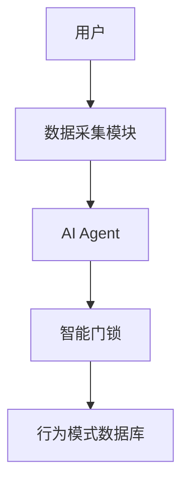
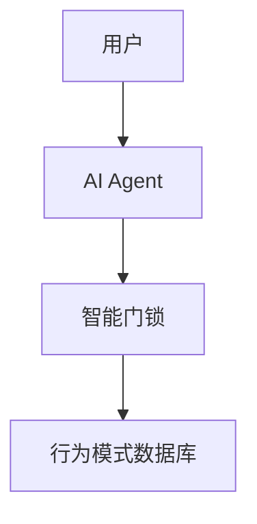
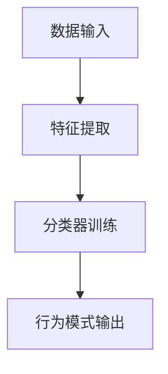
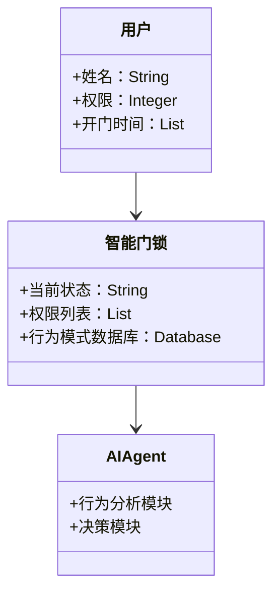
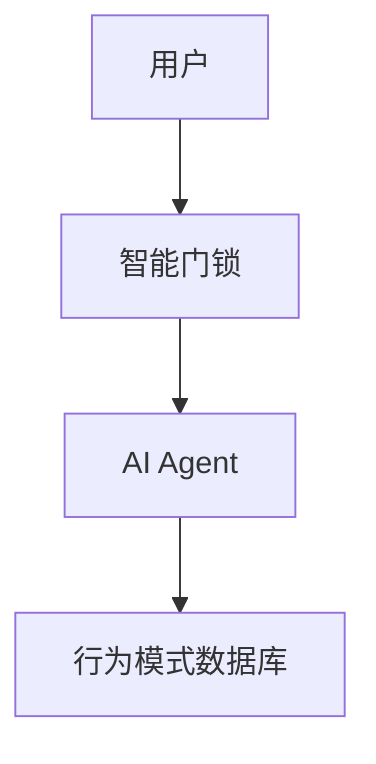
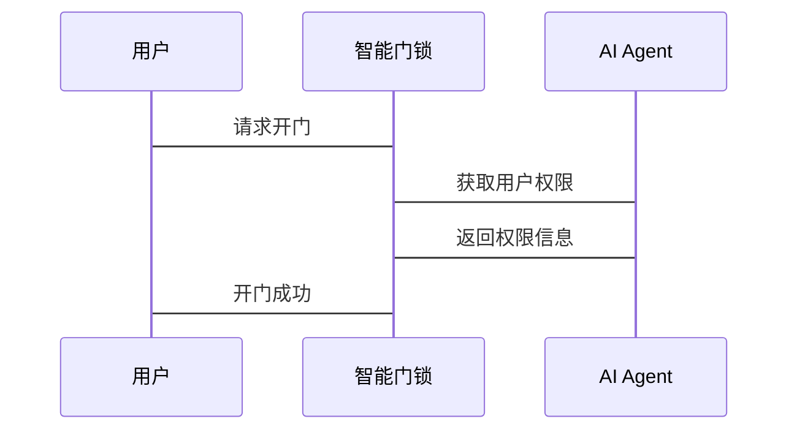

                 


# 智能门锁：AI Agent的家庭成员行为模式分析

## 关键词：智能门锁、AI Agent、家庭成员行为模式、算法原理、系统架构

## 摘要：
智能门锁结合AI Agent的家庭成员行为模式分析，是一种结合物联网和人工智能的创新应用。本文通过分析家庭成员的行为模式，探讨如何利用AI Agent优化智能门锁的功能，提升家庭安全性和智能化水平。文章从背景介绍、核心概念、算法原理、系统架构、项目实战等方面展开，深入分析智能门锁与AI Agent的结合应用，为相关领域的技术人员和研究者提供理论与实践的参考。

---

# 第1章: 智能门锁与AI Agent的背景介绍

## 1.1 问题背景与描述
### 1.1.1 智能门锁的发展历程
传统门锁仅具备基本的机械防盗功能，随着物联网技术的发展，智能门锁逐渐普及。智能门锁通过蓝牙、Wi-Fi、指纹识别等多种方式实现远程开门和权限管理，极大提升了安全性与便利性。然而，如何进一步优化用户体验，使其具备智能化的决策能力，成为当前研究的热点。

### 1.1.2 家庭成员行为模式分析的重要性
家庭成员的行为模式分析是智能门锁智能化升级的关键。通过分析家庭成员的开门时间、频率、习惯等数据，智能门锁可以预测用户的意图，主动提供服务，例如提前开门、异常行为提醒等。这种分析不仅提升了安全性，还能为家庭提供更智能化的服务。

### 1.1.3 AI Agent在智能门锁中的应用价值
AI Agent（人工智能代理）是一种能够感知环境、自主决策并执行任务的智能实体。在智能门锁中，AI Agent可以通过分析用户行为数据，优化门锁的控制策略，例如识别异常行为、自动调整访问权限等。AI Agent的应用使得智能门锁从单纯的“被动防御”工具升级为“主动服务”的智能设备。

## 1.2 问题解决与边界
### 1.2.1 智能门锁行为模式分析的目标
智能门锁行为模式分析的目标是通过数据挖掘和机器学习技术，识别家庭成员的行为特征，优化门锁的控制策略，提升用户体验。例如，通过分析用户的开门时间，智能门锁可以预测用户的到达时间，提前做好准备。

### 1.2.2 AI Agent在家庭场景中的边界与外延
AI Agent在家庭场景中的应用边界主要集中在智能门锁的功能优化和用户行为分析。其外延则包括与其他智能家居设备的联动，例如与智能灯、空调等设备联动，提供更全面的智能化服务。

### 1.2.3 智能门锁系统的功能与性能边界
智能门锁系统的功能包括身份识别、权限管理、远程控制、行为分析等。性能边界主要涉及安全性、响应速度和数据处理能力，需确保系统在高并发和复杂场景下的稳定运行。

## 1.3 核心概念与组成
### 1.3.1 智能门锁的核心组成要素
智能门锁的核心组成包括：
- **身份识别模块**：指纹识别、蓝牙/NFC识别等。
- **权限管理模块**：用户权限设置与管理。
- **远程控制模块**：通过手机APP或智能家居平台远程控制门锁状态。
- **数据采集模块**：采集用户的开门时间、频率等行为数据。

### 1.3.2 AI Agent的定义与属性
AI Agent是一种具备感知、决策和执行能力的智能实体。其核心属性包括：
- **自主性**：能够自主决策。
- **反应性**：能够实时感知环境并做出反应。
- **学习能力**：通过数据学习优化行为模式。

### 1.3.3 系统架构与功能模块关系
智能门锁系统的架构可以分为三层：
1. **感知层**：包括传感器和数据采集模块。
2. **决策层**：AI Agent通过分析数据，生成决策指令。
3. **执行层**：门锁根据决策指令执行相应操作。

---

# 第2章: 核心概念与联系

## 2.1 AI Agent与智能门锁的关系
### 2.1.1 AI Agent的基本原理
AI Agent的基本原理包括数据采集、特征提取、模型训练和决策执行。AI Agent通过采集用户的开门时间、指纹信息等数据，提取特征后，利用机器学习模型进行训练，最终生成决策指令。

### 2.1.2 智能门锁的行为模式分析
智能门锁的行为模式分析包括以下几个步骤：
1. **数据采集**：采集用户的开门时间、指纹信息等。
2. **特征提取**：提取用户的开门频率、时间段等特征。
3. **模型训练**：利用分类算法（如决策树、随机森林）训练模型。
4. **决策执行**：根据模型预测结果，优化门锁的控制策略。

### 2.1.3 两者结合的系统架构
AI Agent与智能门锁的结合架构如下：


## 2.2 核心概念对比分析
### 2.2.1 AI Agent与传统门锁的对比
| 特性 | 传统门锁 | AI Agent结合智能门锁 |
|------|----------|----------------------|
| 功能 | 基本的机械防盗功能 | 支持远程控制、行为分析、智能决策 |
| 安全性 | 靠钥匙或机械锁芯防盗 | 结合指纹识别、蓝牙等多种方式，安全性更高 |
| 智能性 | 无智能性 | 支持AI Agent的智能决策 |

### 2.2.2 行为模式分析的核心要素
行为模式分析的核心要素包括：
- **时间特征**：用户的开门时间、频率。
- **空间特征**：用户的地理位置信息。
- **行为特征**：用户的开门习惯、异常行为。

### 2.2.3 系统功能与用户需求的关系
系统功能需要围绕用户需求展开。例如，用户希望门锁能够自动识别家庭成员，AI Agent可以通过分析用户的开门时间和指纹信息，实现自动开门。

## 2.3 实体关系与架构图
### 2.3.1 ER实体关系图
```mermaid
er
  actor: 用户
  smart_lock: 智能门锁
  agent: AI Agent
  relation: 用户通过AI Agent控制智能门锁
```

### 2.3.2 系统架构图


---

# 第3章: 算法原理与数学模型

## 3.1 算法原理
### 3.1.1 基于AI Agent的行为模式分类
行为模式分类的目标是将用户的行为分为正常行为和异常行为。AI Agent通过分析用户的历史数据，利用分类算法实现行为分类。

### 3.1.2 分类算法的选择与实现
常用的分类算法包括决策树、随机森林、支持向量机（SVM）等。在实际应用中，随机森林算法表现较好，具有较高的准确性和鲁棒性。

### 3.1.3 算法流程图


## 3.2 数学模型与公式
### 3.2.1 分类算法的数学模型
随机森林是一种基于决策树的集成算法，其数学模型如下：
$$ y = \text{sign}(\sum_{i=1}^{n} \text{tree}_i(x)) $$

### 3.2.2 特征提取的数学公式
特征提取可以通过主成分分析（PCA）实现，公式如下：
$$ X_{\text{new}} = X W $$

### 3.2.3 举例说明
假设输入特征向量为 $x = [1, 2, 3]$，权重为 $w = [0.5, 1.0, 0.8]$，则：
$$ f(x) = 0.5 \times 1 + 1.0 \times 2 + 0.8 \times 3 = 2.5 + 2.0 + 2.4 = 6.9 $$

---

# 第4章: 系统分析与架构设计

## 4.1 项目介绍
智能门锁与AI Agent结合的项目旨在通过分析家庭成员的行为模式，优化门锁的控制策略，提升家庭安全性和智能化水平。

## 4.2 系统功能设计
### 4.2.1 领域模型


### 4.2.2 系统架构设计


## 4.3 系统交互设计
### 4.3.1 序列图


---

# 第5章: 项目实战

## 5.1 环境安装
项目环境包括Python 3.8及以上版本、AI框架（如TensorFlow或Scikit-learn）、数据库（如MySQL）。

## 5.2 核心代码实现
以下是基于随机森林算法的行为模式分类代码示例：
```python
from sklearn.ensemble import RandomForestClassifier
from sklearn.model_selection import train_test_split
import pandas as pd

# 加载数据
data = pd.read_csv('door_lock.csv')

# 特征提取
X = data[['time', 'frequency', 'location']]
y = data['label']

# 划分训练集和测试集
X_train, X_test, y_train, y_test = train_test_split(X, y, test_size=0.2)

# 训练模型
model = RandomForestClassifier()
model.fit(X_train, y_train)

# 预测结果
y_pred = model.predict(X_test)
print(y_pred)
```

## 5.3 案例分析
以某家庭为例，分析用户的开门行为：
- **正常行为**：用户每天早上8点和晚上7点开门。
- **异常行为**：用户在深夜11点尝试开门。

AI Agent通过分析用户的行为模式，能够识别异常行为并触发报警。

---

# 第6章: 总结与展望

## 6.1 总结
本文通过分析智能门锁与AI Agent的结合，探讨了家庭成员行为模式分析的实现方法。通过算法和系统设计的优化，智能门锁能够更好地满足用户需求，提升家庭安全性。

## 6.2 展望
未来，智能门锁与AI Agent的结合将更加智能化，可能的应用包括：
- **多模态识别**：结合指纹、人脸、声音等多种识别方式。
- **智能联动**：与智能家居设备联动，提供更全面的服务。
- **边缘计算**：在门锁本地实现部分数据处理，提升响应速度。

---

通过本文的分析，智能门锁与AI Agent的结合不仅提升了家庭安全性，还为智能家居的发展提供了新的思路。希望本文的内容能够为相关领域的研究者和开发者提供参考。

