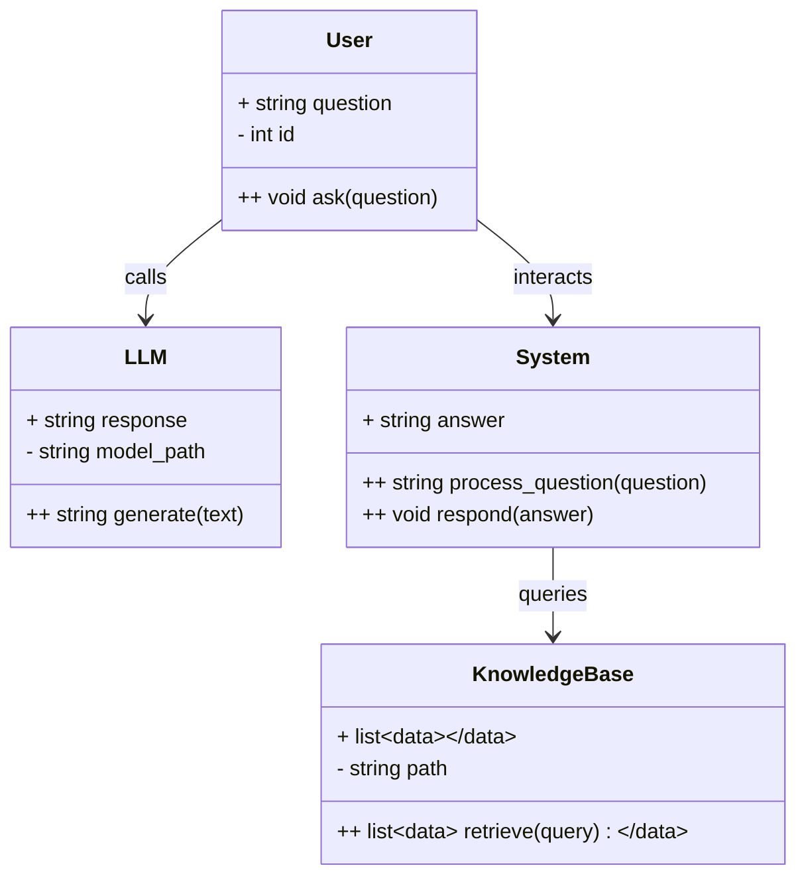
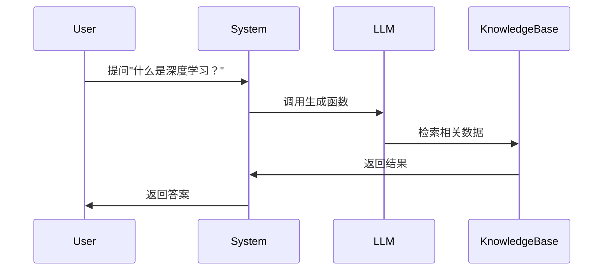

                 


# 智能问答系统AI Agent：基于LLM的精确信息检索

**关键词**：智能问答系统，AI Agent，LLM，信息检索，自然语言处理

**摘要**：本文将详细探讨基于大语言模型（LLM）的智能问答系统AI Agent，分析其在信息检索中的应用，从背景、原理、架构到实战，层层深入，帮助读者全面理解这一技术的核心与实现。

---

## 正文

### 第一部分：背景介绍

#### 1.1 问题背景

智能问答系统（Intelligent Question Answering System）旨在通过自然语言处理技术，为用户提供精准的信息检索服务。传统的问答系统依赖关键词匹配，存在准确性低、无法理解上下文等问题。随着大语言模型（LLM）的发展，智能问答系统逐渐采用基于LLM的技术，能够更准确地理解用户意图，实现更精准的信息检索。

#### 1.2 问题描述

智能问答系统的目标是通过LLM技术，将用户的问题转化为精确的检索查询，返回相关的答案或信息。本文将重点探讨基于LLM的智能问答系统的设计与实现，包括信息检索的精确性、系统的可扩展性以及与AI Agent的结合。

#### 1.3 问题解决

基于LLM的智能问答系统通过自然语言处理技术，能够理解用户的意图，生成准确的检索查询，并从大规模数据中提取相关信息，从而提供更精准的答案。

#### 1.4 系统的边界与外延

智能问答系统AI Agent的边界包括用户问题解析、信息检索、答案生成和反馈机制。其外延则涉及与知识库的集成、多语言支持以及与其他AI服务的结合。

#### 1.5 概念结构与核心要素

智能问答系统AI Agent的核心要素包括：

1. **用户输入**：用户的问题或查询。
2. **LLM模型**：负责理解和生成文本。
3. **信息检索引擎**：从数据源中提取相关信息。
4. **答案生成模块**：将检索到的信息转化为自然语言答案。
5. **反馈机制**：根据用户反馈优化回答质量。

### 第二部分：核心概念与联系

#### 2.1 智能问答系统的定义与特点

智能问答系统是一种基于LLM的自然语言处理技术，能够理解和回答用户的问题。其特点包括：

- **准确性**：基于LLM的深度学习模型，能够理解上下文和意图。
- **实时性**：快速响应用户查询。
- **可扩展性**：支持多种数据源和应用场景。

#### 2.2 AI Agent的定义与特点

AI Agent是一种智能代理，能够感知环境并执行任务。其特点包括：

- **自主性**：能够自主决策。
- **反应性**：实时响应用户请求。
- **目标导向**：根据目标优化行为。

#### 2.3 LLM在问答系统中的作用

LLM通过预训练掌握了大量知识，能够理解和生成人类语言。在问答系统中，LLM用于解析用户问题、生成回答，并优化结果。

#### 2.4 核心概念的联系与对比

##### 2.4.1 智能问答系统与AI Agent的关系

| 智能问答系统 | AI Agent |
|--------------|-----------|
| 专注于回答问题 | 更广泛的应用，包括任务执行 |
| 基于LLM技术 | 可以集成多种技术 |

##### 2.4.2 LLM与其他问答系统技术的对比

| 技术          | 优点                 | 缺点               |
|---------------|----------------------|--------------------|
| 基于规则      | 简单实现             | 无法处理复杂问题   |
| 基于关键词    | 快速检索             | 准确性低           |
| 基于机器学习  | 高准确性             | 需大量数据训练     |
| 基于LLM       | 高准确性，深度理解    | 需大量计算资源     |

#### 2.5 实体关系图

```mermaid
er
  actor: 用户
  question: 用户问题
  system: 智能问答系统
  answer: 系统回答
  llm: LLM模型
  knowledge_base: 知识库
  actor --> question
  question --> system
  system --> llm
  llm --> knowledge_base
  llm --> answer
  system --> answer
```

### 第三部分：算法原理

#### 3.1 基于LLM的问答系统算法

##### 3.1.1 前向传播

模型接收输入，生成概率分布：

$$ p(y|x) = \text{softmax}(Wx + b) $$

##### 3.1.2 反向传播

通过梯度下降优化模型参数：

$$ W := W - \eta \frac{\partial L}{\partial W} $$

##### 3.1.3 实例分析

假设用户问题为“什么是Python？”，LLM生成上下文相关的概率分布，最终输出最可能的答案。

### 第四部分：系统分析与架构设计

#### 4.1 问题场景介绍

用户向AI Agent提问，系统解析问题，调用LLM生成回答，并将结果返回给用户。

#### 4.2 系统功能设计

##### 4.2.1 领域模型



#### 4.3 系统架构设计

##### 4.3.1 架构图

```mermaid
graph TD
    User --> API Gateway
    API Gateway --> Load Balancer
    Load Balancer --> LLM
    Load Balancer --> KnowledgeBase
    LLM --> Response Cache
    Response Cache --> Output
```

#### 4.4 接口设计

##### 4.4.1 系统接口

1. `process_question(question: string) -> string`
2. `generate_response(context: list) -> string`

#### 4.5 系统交互

##### 4.5.1 序列图



### 第五部分：项目实战

#### 5.1 环境安装

1. 安装Python 3.8+
2. 安装相关库：`transformers`, `numpy`

#### 5.2 核心实现

##### 5.2.1 代码实现

```python
from transformers import pipeline

def process_question(question):
    qa_pipeline = pipeline("question-answering")
    answer = qa_pipeline(question=question, context="")[0]['answer']
    return answer

print(process_question("什么是Python？"))
```

#### 5.3 代码解读

- 使用`transformers`库的`question-answering`管道。
- 输入问题，调用LLM生成答案。

#### 5.4 实际案例分析

案例：用户询问“如何安装Python？”，系统调用LLM生成步骤说明。

#### 5.5 项目小结

通过代码实现，展示了基于LLM的问答系统的基本流程：问题输入、模型调用、答案生成。

### 第六部分：最佳实践

#### 6.1 小结

- 理解LLM的工作原理
- 熟悉智能问答系统的架构设计
- 掌握系统实现的关键步骤

#### 6.2 注意事项

- 数据安全与隐私保护
- 系统性能优化
- 模型的可解释性

#### 6.3 未来展望

- 更复杂的模型结构
- 多语言支持
- 实时信息更新

---

**总结**：本文详细介绍了基于LLM的智能问答系统AI Agent，从背景到实现，层层深入，为读者提供了全面的技术指导。通过理论与实践的结合，帮助读者掌握这一前沿技术的核心与应用。

