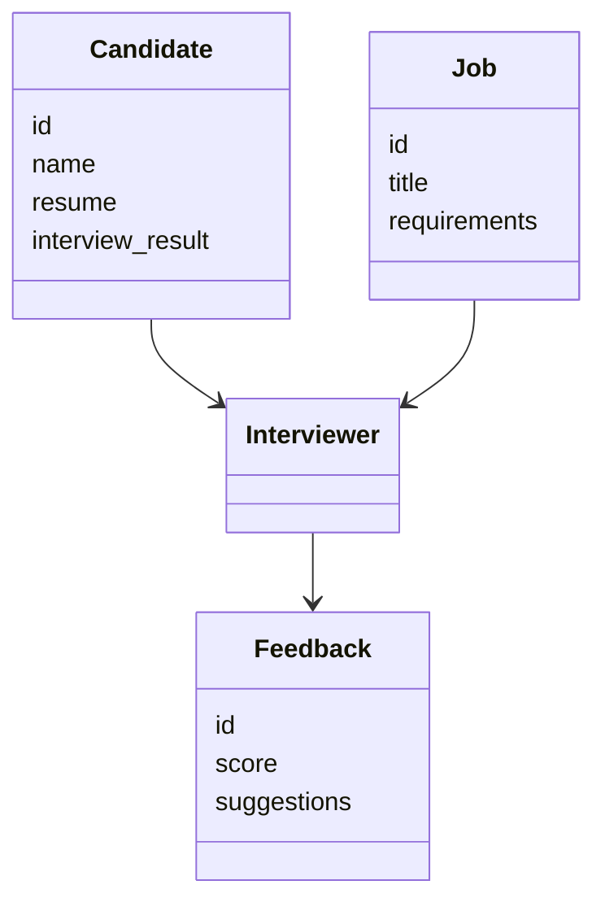
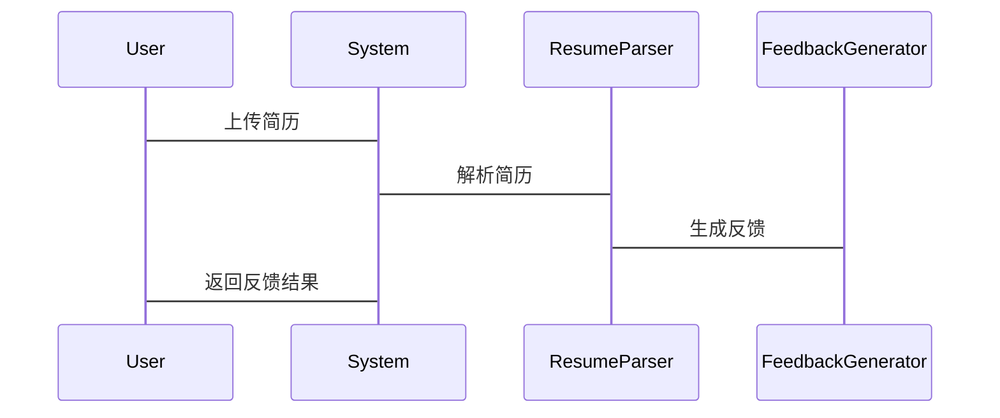

                 


# 智能面试官 AI Agent：LLM 辅助招聘流程

## 关键词
- 智能面试官
- LLM
- 招聘流程
- 自然语言处理
- AI 技术

## 摘要
智能面试官 AI Agent 是一种利用大语言模型（LLM）来优化招聘流程的创新工具。通过分析招聘过程中的痛点，结合 LLM 的自然语言处理能力，智能面试官能够高效地进行简历筛选、面试安排、候选人评估和反馈生成。本文将从背景介绍、核心概念、算法原理、系统架构、项目实战和最佳实践等多个维度详细探讨智能面试官的实现与应用。

---

# 第一部分: 智能面试官 AI Agent 的背景与概念

## 第1章: 智能面试官的定义与背景

### 1.1 智能面试官的定义
#### 1.1.1 智能面试官的核心概念
智能面试官是一种基于大语言模型的 AI 辅助工具，能够模拟人类面试官的功能，自动进行候选人筛选、面试安排和反馈生成。它通过自然语言处理技术理解候选人的回答，并结合岗位需求进行评估。

#### 1.1.2 智能面试官的起源与发展
智能面试官的概念起源于招聘流程的自动化需求。随着 LLM 技术的成熟，智能面试官逐渐从理论走向实践，成为招聘行业的重要工具。

#### 1.1.3 智能面试官与传统招聘方式的对比
- **效率**：智能面试官能够快速处理大量简历，显著提高招聘效率。
- **公平性**：通过标准化的评估流程，减少人为偏见。
- **成本**：降低招聘成本，特别是在初期筛选阶段。

### 1.2 当前招聘流程中的问题与挑战
#### 1.2.1 招聘流程的低效性
传统招聘流程中，HR 需要手动筛选大量简历，耗时且效率低下。

#### 1.2.2 人工面试的局限性
面试官的主观性可能导致评估不公，且难以快速安排多轮面试。

#### 1.2.3 高质量人才筛选的难点
在人才市场竞争激烈的情况下，如何快速识别优秀候选人成为招聘的核心挑战。

### 1.3 智能面试官的必要性与价值
#### 1.3.1 提高招聘效率
通过自动化简历筛选和面试安排，显著减少招聘时间。

#### 1.3.2 降低招聘成本
减少人力投入，特别是在大规模招聘场景中。

#### 1.3.3 提升人才匹配度
通过 LLM 的深度分析能力，提高候选人与岗位的匹配度。

### 1.4 LLM 在智能面试官中的技术基础
#### 1.4.1 大语言模型的基本原理
LLM 基于Transformer 架构，通过自注意力机制捕捉文本中的语义关系。

#### 1.4.2 LLM 在自然语言处理中的应用
LLM 可以进行文本生成、意图识别和实体抽取等任务，适用于招聘中的多种场景。

#### 1.4.3 LLM 在招聘场景中的适用性
LLM 可以处理简历解析、面试对话理解和岗位匹配等任务，显著提升招聘效率。

## 第2章: 智能面试官的核心概念与联系

### 2.1 LLM 的核心原理
#### 2.1.1 注意力机制
注意力机制通过计算输入文本中各词的重要性，帮助模型聚焦关键信息。

#### 2.1.2 解码器结构
解码器通过自回归的方式生成目标文本，适用于对话生成和文本摘要。

#### 2.1.3 模型的训练过程
模型通过大量的招聘文本数据进行预训练，然后通过微调适应特定的招聘任务。

### 2.2 智能面试官的系统架构
#### 2.2.1 系统输入与输出
- **输入**：候选人的简历和面试回答。
- **输出**：岗位匹配度评分和反馈建议。

#### 2.2.2 关键功能模块
- **简历解析模块**：提取简历中的关键信息。
- **对话理解模块**：理解候选人的回答并进行评估。
- **岗位匹配模块**：根据岗位需求生成评分和反馈。

#### 2.2.3 系统组件之间的关系
系统通过模块化设计，各组件协同工作，完成从输入到输出的全过程。

### 2.3 核心概念对比表
| 对比项         | 传统招聘方式               | 智能面试官                 |
|----------------|----------------------------|---------------------------|
| 效率           | 低                         | 高                         |
| 成本           | 高                         | 低                         |
| 公平性         | 受主观影响                 | 标准化评估                 |
| 适用场景       | 适用于少量招聘             | 适用于大规模招聘           |

### 2.4 ER 实体关系图
```mermaid
erd
    Candidate
    Interviewer
    Job
    Feedback

    Candidate -> has -> Resume
    Candidate -> participates -> Interview
    Interview -> belongs to -> Job
    Interview -> generates -> Feedback
```

## 第3章: 智能面试官的算法原理

### 3.1 LLM 的训练过程
#### 3.1.1 前向传播
模型通过输入数据进行前向传播，生成预测结果。

#### 3.1.2 损失计算
通过交叉熵损失函数计算预测结果与真实结果之间的差距。

#### 3.1.3 反向传播
利用反向传播算法更新模型参数，最小化损失函数。

### 3.2 智能面试官的核心算法
```mermaid
graph TD
    A[开始] -> B[输入简历]
    B -> C[解析简历]
    C -> D[生成反馈]
    D -> E[结束]
```

### 3.3 智能面试官的数学模型
交叉熵损失函数：
$$
\text{loss} = -\sum_{i=1}^{n} y_i \log(p_i) + (1 - y_i) \log(1 - p_i)
$$

### 3.4 实际案例分析
通过具体案例展示智能面试官在实际招聘中的应用，包括简历筛选和面试评分的详细过程。

## 第4章: 智能面试官的系统分析与架构设计

### 4.1 招聘流程中的问题场景
#### 4.1.1 简历筛选的低效性
#### 4.1.2 面试安排的复杂性
#### 4.1.3 评估结果的不一致性

### 4.2 项目介绍
智能面试官项目旨在通过技术手段优化招聘流程，提高招聘效率和质量。

### 4.3 系统功能设计
#### 4.3.1 简历解析模块
通过 NLP 技术提取简历中的关键信息，如教育背景和工作经历。

#### 4.3.2 对话理解模块
理解候选人的回答，评估其语言表达能力和岗位匹配度。

#### 4.3.3 岗位匹配模块
根据岗位需求生成评分和反馈建议，帮助 HR 进行最终决策。

### 4.4 系统架构设计


### 4.5 系统接口设计
#### 4.5.1 简历上传接口
候选人在系统中上传简历，系统解析并存储关键信息。

#### 4.5.2 面试安排接口
系统根据岗位需求和候选人信息，自动安排面试时间和形式。

### 4.6 系统交互设计


## 第5章: 智能面试官的项目实战

### 5.1 环境安装
#### 5.1.1 安装 Python 和相关库
安装 Python 和如 transformers、numpy 等必要的库。

### 5.2 系统核心实现
#### 5.2.1 简历解析模块
使用 spaCy 或 NLTK 等工具解析简历文本，提取关键信息。

#### 5.2.2 面试评分模块
基于预训练的 LLM 模型，对候选人的回答进行评分和反馈生成。

### 5.3 代码实现
#### 5.3.1 简历解析示例代码
```python
import spacy

nlp = spacy.load("en_core_web_sm")
text = "John has 5 years of experience in Python development."
doc = nlp(text)
for token in doc:
    print(token.text, token.pos_, token.dep_)
```

#### 5.3.2 面试评分示例代码
```python
from transformers import pipeline

classifier = pipeline("text-classification", model="facebook/roberta-base")
text = "Do you have experience with Python?"
result = classifier(text)
print(result)
```

### 5.4 实际案例分析
通过具体案例分析智能面试官在实际招聘中的应用效果，包括简历筛选和面试评分的详细过程。

### 5.5 项目小结
总结项目实现的关键点和经验教训，为后续优化提供参考。

## 第6章: 智能面试官的最佳实践

### 6.1 小结
智能面试官通过 LLM 技术显著优化了招聘流程，提高了效率和公平性。

### 6.2 注意事项
- **数据隐私**：确保候选人数据的安全和隐私。
- **模型优化**：持续优化 LLM 模型以提高评估准确性。
- **用户体验**：设计友好的用户界面，提升用户体验。

### 6.3 拓展阅读
建议读者进一步阅读相关技术文献和最佳实践，深入理解智能面试官的应用和优化。

---

# 结语
智能面试官 AI Agent 是招聘流程中的重要工具，通过 LLM 技术显著提升了招聘效率和质量。本文从多个维度详细探讨了智能面试官的实现与应用，为读者提供了全面的技术视角和实践指南。

