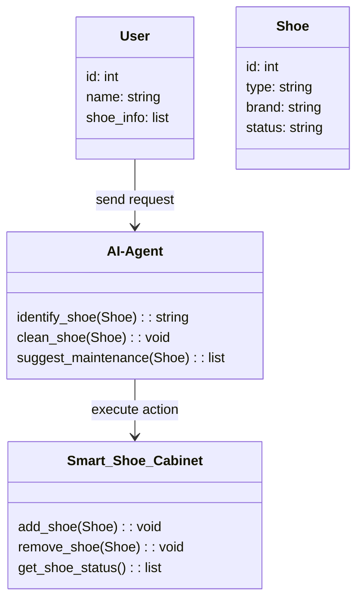
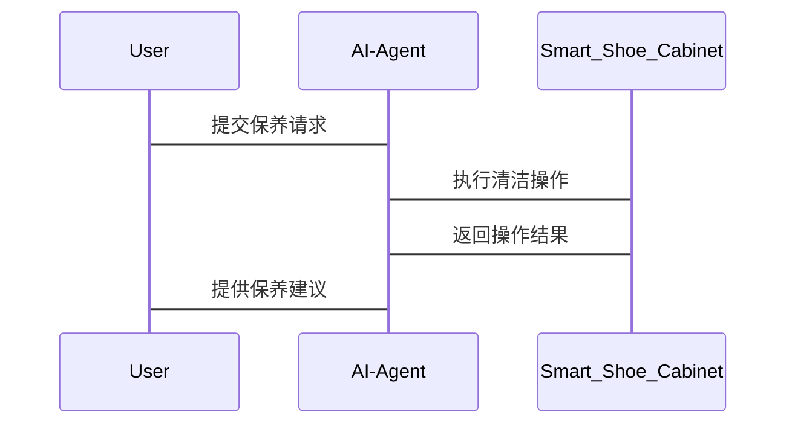

                 


```markdown
# 智能鞋柜：AI Agent的鞋履保养指导

> 关键词：智能鞋柜，AI Agent，鞋履保养，计算机视觉，自然语言处理，算法原理

> 摘要：本文探讨了AI Agent在智能鞋柜中的应用，详细分析了鞋履保养的核心问题，介绍了AI Agent的基本原理，展示了如何利用计算机视觉和自然语言处理技术实现智能识别与分类、自动清洁与保养、智能提醒与建议等核心功能。通过实际案例分析，本文详细讲解了AI Agent的算法原理和系统架构设计，为读者提供了从理论到实践的全面指导。

---

# 第一部分: 智能鞋柜与AI Agent的背景介绍

## 第1章: 智能鞋柜与AI Agent概述

### 1.1 智能鞋柜的发展历程
#### 1.1.1 传统鞋柜的功能与局限性
传统鞋柜的基本功能和其在现代生活中的不足之处。

#### 1.1.2 智能化技术对鞋柜的革新
智能化技术如何改变传统鞋柜的功能和使用体验。

#### 1.1.3 AI Agent在智能鞋柜中的应用前景
AI Agent如何为智能鞋柜带来更智能化的管理和保养功能。

### 1.2 AI Agent的核心概念与特点
#### 1.2.1 AI Agent的定义与分类
AI Agent的定义、类型及其应用场景。

#### 1.2.2 AI Agent的核心特点
智能性、自主性、反应性、社会性等核心特点。

#### 1.2.3 AI Agent与传统自动化系统的区别
对比分析AI Agent与传统自动化系统的差异。

### 1.3 智能鞋柜的市场需求与应用场景
#### 1.3.1 鞋履保养的主要问题与挑战
鞋履保养的主要问题，如材质老化、污渍处理等。

#### 1.3.2 智能鞋柜的目标用户群体
智能鞋柜的主要用户群体及他们的需求特点。

#### 1.3.3 智能鞋柜在不同场景下的应用
家庭、办公室、酒店等不同场景下的应用实例。

## 1.4 本章小结

---

# 第2章: AI Agent在鞋履保养中的核心功能

### 2.1 AI Agent的功能模块解析
#### 2.1.1 智能识别与分类
AI Agent如何通过计算机视觉技术识别鞋履的类型和品牌。

#### 2.1.2 自动清洁与保养
AI Agent如何通过自动化设备完成鞋履的清洁和保养工作。

#### 2.1.3 智能提醒与建议
AI Agent如何根据鞋履的使用情况提供保养建议和提醒。

### 2.2 AI Agent与智能鞋柜的交互流程
#### 2.2.1 用户需求的输入方式
用户如何通过语音、触控或APP等方式与AI Agent交互。

#### 2.2.2 AI Agent的处理逻辑
AI Agent如何分析用户需求并生成相应的保养方案。

#### 2.2.3 结果的反馈与展示
AI Agent如何将处理结果反馈给用户，例如通过APP或语音助手。

### 2.3 AI Agent的算法基础
#### 2.3.1 机器学习与深度学习的结合
机器学习在模式识别中的应用，深度学习在图像处理中的应用。

#### 2.3.2 自然语言处理在用户交互中的应用
自然语言处理技术如何实现用户的意图理解和语义分析。

#### 2.3.3 计算机视觉在鞋履识别中的作用
计算机视觉技术在鞋履分类和状态评估中的应用。

## 2.4 本章小结

---

# 第3章: AI Agent的算法原理与实现

### 3.1 AI Agent的核心算法
#### 3.1.1 机器学习算法的选择与优化
选择合适的机器学习算法（如随机森林、支持向量机）并进行优化。

#### 3.1.2 深度学习模型的构建与训练
使用深度学习模型（如卷积神经网络）进行鞋履图像的分类和识别。

#### 3.1.3 自然语言处理模型的集成
集成自然语言处理模型（如BERT）进行用户意图的理解和生成。

### 3.2 计算机视觉在鞋履识别中的应用
#### 3.2.1 图像识别的基本原理
图像预处理、特征提取、分类器训练等基本步骤。

#### 3.2.2 鞋履分类的算法实现
基于CNN的鞋履分类算法实现，包括数据集的准备、模型的训练与优化。

#### 3.2.3 基于视觉的鞋履状态评估
通过图像分析评估鞋履的磨损程度和清洁状况。

### 3.3 自然语言处理在用户交互中的应用
#### 3.3.1 意图识别的实现
基于NLP技术的用户意图识别，包括意图抽取和分类。

#### 3.3.2 语义理解的优化
优化NLP模型以提高语义理解的准确性和响应速度。

#### 3.3.3 对话系统的构建与优化
构建基于AI Agent的对话系统，实现与用户的自然交互。

### 3.4 算法的数学模型与公式
#### 3.4.1 机器学习的基本公式
例如，线性回归的数学表达式：$y = \beta x + \epsilon$。

#### 3.4.2 深度学习的数学模型
例如，卷积神经网络的数学表达式：
$$
f(x) = \max(0, w \cdot x + b)
$$

---

# 第4章: 系统分析与架构设计方案

### 4.1 问题场景介绍
智能鞋柜在实际应用中面临的主要问题和挑战。

### 4.2 项目介绍
智能鞋柜AI Agent的项目目标、范围和整体架构。

### 4.3 系统功能设计
#### 4.3.1 领域模型（Mermaid类图）


### 4.4 系统架构设计（Mermaid架构图）


### 4.5 系统接口设计
系统接口的设计，包括API定义和数据格式。

### 4.6 系统交互流程（Mermaid序列图）


---

# 第5章: 项目实战

### 5.1 环境安装
项目所需环境的搭建，包括Python版本、依赖库的安装（如TensorFlow、Keras、自然语言处理库等）。

### 5.2 核心代码实现
#### 5.2.1 图像识别与分类代码
使用Keras/TensorFlow实现鞋履分类的代码示例：
```python
import tensorflow as tf
from tensorflow.keras.models import Model
from tensorflow.keras.layers import Dense, Conv2D, MaxPooling2D, Flatten

# 加载数据集
train_dataset = ...
test_dataset = ...

# 构建模型
model = tf.keras.Sequential([
    Conv2D(32, (3,3), activation='relu', input_shape=(150, 150, 3)),
    MaxPooling2D((2,2)),
    Conv2D(64, (3,3), activation='relu'),
    MaxPooling2D((2,2)),
    Flatten(),
    Dense(128, activation='relu'),
    Dense(10, activation='softmax')
])
model.compile(optimizer='adam', loss='sparse_categorical_crossentropy', metrics=['accuracy'])
model.fit(train_dataset, epochs=10, validation_data=test_dataset)
```

#### 5.2.2 自然语言处理代码
使用预训练的NLP模型进行意图识别的代码示例：
```python
from transformers import pipeline

classifier = pipeline("text-classification", model="bert-base-uncased")
result = classifier("我需要清洁我的运动鞋")
print(result)
```

#### 5.2.3 系统交互代码
实现AI Agent与智能鞋柜交互的代码示例：
```python
class AIAgent:
    def __init__(self):
        self.shoe_cabinet = SmartShoeCabinet()

    def process_request(self, request):
        # 分析请求
        response = self.analyze_request(request)
        # 执行操作
        self.shoe_cabinet.execute_operation(response)
        return response

    def analyze_request(self, request):
        # 自然语言处理部分
        pass

    def execute_operation(self, operation):
        # 调用鞋柜模块执行操作
        pass
```

### 5.3 代码解读与分析
详细解读上述代码的功能和实现逻辑。

### 5.4 实际案例分析
通过实际案例分析，展示AI Agent在智能鞋柜中的具体应用和效果。

### 5.5 项目小结

---

# 第6章: 最佳实践与总结

### 6.1 最佳实践 tips
- 数据质量的重要性
- 模型调优的技巧
- 系统设计的优化建议

### 6.2 小结
总结全文的主要内容和关键点。

### 6.3 注意事项
使用AI Agent时需要注意的事项和潜在的问题。

### 6.4 拓展阅读
推荐进一步阅读的相关书籍和资源。

---

# 结语

通过本文的详细讲解，读者可以全面了解AI Agent在智能鞋柜中的应用，掌握相关算法原理和系统设计方法，并通过实际案例分析提升自己的实践能力。未来，随着AI技术的不断发展，智能鞋柜将变得更加智能化和人性化，为用户带来更便捷的鞋履保养体验。
```

