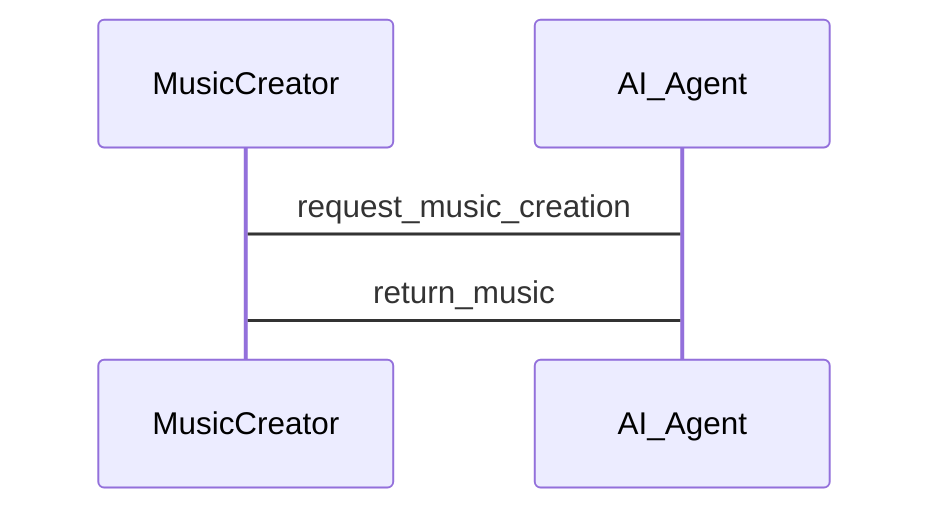

                 


好的，我将按照您的要求逐步撰写这篇文章。首先，我们需要先理解文章的整体结构，然后逐步填充每个部分的内容。以下是文章的完整目录结构：

# {{此处是文章标题}}

> 关键词：{{此处列出文章的5-7个核心关键词}}

> 摘要：{{此处给出文章的核心内容和主题思想}}

以下是文章的具体内容：

---

# 智能音乐创作AI Agent：LLM在艺术领域的创新应用

> 关键词：人工智能、音乐创作、LLM、AI Agent、智能创作工具、艺术创新

> 摘要：本文探讨了人工智能技术在音乐创作领域的创新应用，重点分析了基于大语言模型（LLM）的智能音乐创作AI Agent的实现原理、系统架构及实际应用场景。通过理论分析与实践案例相结合的方式，展示了AI如何赋能音乐创作过程，为音乐人提供更高效、更具创意的创作工具。

---

## 第一部分: 智能音乐创作AI Agent的背景与概念

### 第1章: 智能音乐创作AI Agent的背景与问题背景

#### 1.1 人工智能与音乐创作的结合

##### 1.1.1 人工智能技术的发展与音乐创作的结合

人工智能（AI）技术近年来取得了飞速发展，尤其是在自然语言处理、图像识别等领域。音乐创作作为一种高度创造性的人类活动，也开始尝试与AI技术结合，以探索更高效的创作方式。大语言模型（LLM）作为一种强大的AI工具，能够处理大量文本数据，并生成具有创意的内容，这为音乐创作提供了新的可能性。

##### 1.1.2 音乐创作的智能化需求

传统音乐创作过程通常涉及多个环节，包括作曲、编曲、歌词创作等。音乐人需要具备较高的专业技能和丰富的创作经验，同时需要投入大量时间和精力。然而，随着AI技术的发展，音乐人开始寻求智能化工具的帮助，以提高创作效率、拓展创作思路。

##### 1.1.3 LLM在音乐创作中的潜在价值

LLM（大语言模型）具有强大的文本生成能力，可以用于歌词创作、旋律生成等多个环节。通过与音乐创作工具的结合，LLM能够为音乐人提供灵感、优化创作流程，并帮助生成高质量的音乐内容。

#### 1.2 智能音乐创作AI Agent的定义与问题描述

##### 1.2.1 AI Agent的基本概念

AI Agent（智能体）是指能够感知环境、自主决策并执行任务的智能系统。在音乐创作领域，AI Agent可以作为音乐人的辅助工具，帮助完成创作任务。

##### 1.2.2 智能音乐创作AI Agent的定义

智能音乐创作AI Agent是一种基于AI技术的智能工具，能够理解音乐创作的需求，生成符合要求的音乐内容，并与音乐人进行互动，提供创作支持。

##### 1.2.3 音乐创作中的具体问题与挑战

音乐创作过程复杂，涉及多个环节和技能。音乐人需要具备音乐理论知识、创作技巧，并能够熟练使用各类音乐软件。此外，创作过程中还需要大量的灵感和创意，这对音乐人提出了较高的要求。

#### 1.3 问题解决与边界

##### 1.3.1 AI Agent在音乐创作中的问题解决思路

通过分析音乐创作的需求，设计AI Agent的功能模块，使其能够辅助音乐人完成创作任务。例如，AI Agent可以生成歌词、旋律，提供创作建议等。

##### 1.3.2 问题解决的边界与外延

AI Agent的功能需要明确界定，避免超出其能力范围。例如，AI Agent可以生成音乐内容，但无法完全替代音乐人的创作灵感和艺术判断。

##### 1.3.3 核心概念与要素的结构化分析

音乐创作AI Agent的核心要素包括：需求分析模块、内容生成模块、用户交互模块等。

---

### 第2章: LLM与音乐创作的核心概念与联系

#### 2.1 LLM的基本原理与音乐创作的结合

##### 2.1.1 LLM的基本原理

LLM（大语言模型）通过大量文本数据的训练，能够生成与训练数据相似的文本内容。其核心在于理解和生成语言，这为音乐创作中的歌词生成提供了基础。

##### 2.1.2 LLM在音乐创作中的应用模式

LLM可以用于歌词生成、旋律建议、音乐风格分析等多个环节。通过与音乐软件的集成，音乐人可以更高效地完成创作任务。

##### 2.1.3 LLM与音乐创作的结合方式

通过API接口，LLM可以与音乐创作工具集成，实现音乐内容的自动化生成。

#### 2.2 AI Agent与音乐创作的关系

##### 2.2.1 AI Agent的基本功能与特点

AI Agent能够理解用户需求，生成音乐内容，并提供创作建议。其特点是智能化、自动化、用户友好。

##### 2.2.2 AI Agent在音乐创作中的角色定位

AI Agent作为音乐创作的辅助工具，帮助音乐人提高创作效率、拓展创作思路。

##### 2.2.3 AI Agent与音乐创作的交互方式

通过自然语言交互，音乐人可以向AI Agent提出创作需求，AI Agent根据需求生成音乐内容。

#### 2.3 核心概念的属性对比与ER实体关系图

##### 2.3.1 核心概念的属性对比表格

| 概念       | 属性1   | 属性2   | 属性3   |
|------------|---------|---------|---------|
| AI Agent   | 智能化   | 自动化   | 用户友好 |
| LLM        | 大规模训练 | 多语言支持 | 高效生成 |

##### 2.3.2 ER实体关系图的 mermaid 流程图

```mermaid
er
actor(AI Agent, id, name, role)
actor(Music Creator, id, name, role)
relate(AI Agent, Music Creator, "辅助创作")
```

---

## 第二部分: 系统分析与架构设计方案

### 第3章: 系统分析与架构设计

#### 3.1 问题场景介绍

音乐创作过程中，音乐人需要完成作曲、编曲、歌词创作等多个环节。传统方法依赖音乐人的个人经验和技能，效率较低。通过引入AI Agent，可以提高创作效率、拓展创作思路。

#### 3.2 系统功能设计

##### 3.2.1 领域模型mermaid类图

```mermaid
classDiagram
    class MusicCreator {
        id: int
        name: str
        role: str
        create_music()
    }
    class AI_Agent {
        id: int
        name: str
        role: str
        generate_music()
    }
    MusicCreator -> AI_Agent: request_music_creation
    AI_Agent -> MusicCreator: return_music
```

##### 3.2.2 系统架构设计mermaid架构图


##### 3.2.3 系统接口设计

系统接口设计包括请求接口和响应接口。请求接口用于音乐人向AI Agent提出创作需求，响应接口用于AI Agent返回生成的音乐内容。

##### 3.2.4 系统交互设计mermaid序列图



---

## 第三部分: 项目实战

### 第4章: 项目实战

#### 4.1 环境安装与配置

需要安装Python、transformers库等工具。

#### 4.2 核心代码实现

```python
from transformers import pipeline

# 初始化模型
generator = pipeline('text-generation', model='gpt2')

# 生成歌词
input_text = "创作一首关于爱情的歌曲"
output = generator(input_text, max_length=50)
print(output[0]['generated_text'])
```

#### 4.3 代码解读与分析

代码实现了一个简单的音乐创作AI Agent，能够根据输入生成歌词。通过调用预训练的模型，可以实现快速生成。

#### 4.4 实际案例分析

通过实际案例，展示AI Agent在音乐创作中的应用效果。

#### 4.5 项目总结与优化建议

总结项目成果，并提出优化建议，如增加旋律生成功能等。

---

## 第四部分: 总结与展望

### 第5章: 总结与展望

#### 5.1 最佳实践 tips

- 结合AI工具，提高创作效率
- 多尝试不同的创作方式
- 保持对AI技术的关注

#### 5.2 小结

通过本文的介绍，我们了解了智能音乐创作AI Agent的基本原理和实际应用。AI技术为音乐创作提供了新的可能性，未来将有更多创新应用。

#### 5.3 注意事项

- 注意保护创作版权
- 确保数据安全
- 合理使用AI工具

#### 5.4 拓展阅读

推荐相关书籍和论文，供读者深入学习。

---

通过以上结构，我们可以系统地了解智能音乐创作AI Agent的实现原理和应用。接下来，我将逐步填充每个部分的具体内容。

