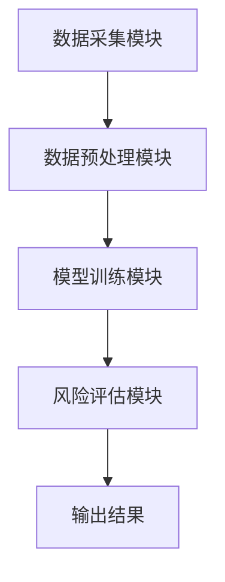

                 


# 智能风险评估AI Agent：LLM在复杂决策中的应用

## 关键词：
- AI Agent
- LLM
- 智能风险评估
- 复杂决策
- 人工智能

## 摘要：
随着人工智能技术的飞速发展，大语言模型（LLM）在智能风险评估中的应用越来越广泛。本文将深入探讨LLM在复杂决策中的应用，介绍智能风险评估AI Agent的基本概念、核心算法、系统架构，并通过实际案例展示其在风险评估中的优势与挑战。文章还提供了详细的算法实现和系统设计，帮助读者全面理解智能风险评估AI Agent的原理与应用。

---

# 第一章：智能风险评估AI Agent的背景介绍

## 1.1 AI Agent的基本概念

### 1.1.1 AI Agent的定义
AI Agent（人工智能代理）是一种能够感知环境、自主决策并执行任务的智能实体。它可以是一个软件程序、机器人或其他智能系统，具备以下核心特征：
- **自主性**：能够在没有外部干预的情况下自主决策。
- **反应性**：能够根据环境变化实时调整行为。
- **目标导向**：以实现特定目标为导向执行任务。

### 1.1.2 AI Agent的核心特征
AI Agent的核心特征包括：
- **感知能力**：通过传感器或数据输入感知环境。
- **推理能力**：基于感知信息进行逻辑推理。
- **决策能力**：根据推理结果制定行动计划。
- **执行能力**：通过执行机构或软件接口完成任务。

### 1.1.3 AI Agent与传统软件的区别
AI Agent与传统软件的区别主要体现在以下几个方面：
- **智能性**：AI Agent具备学习和推理能力，而传统软件通常是基于规则的。
- **自主性**：AI Agent能够自主决策，而传统软件需要外部指令。
- **适应性**：AI Agent能够根据环境变化自适应调整行为，而传统软件通常是静态的。

## 1.2 LLM在AI Agent中的应用

### 1.2.1 LLM的定义与特点
大语言模型（LLM，Large Language Model）是一种基于深度学习的自然语言处理模型，具有以下特点：
- **大规模训练数据**：通常使用海量文本数据进行训练。
- **多任务能力**：能够处理多种自然语言处理任务，如文本生成、翻译、问答等。
- **上下文理解**：能够理解文本的上下文关系，生成连贯的文本。

### 1.2.2 LLM在AI Agent中的作用
在AI Agent中，LLM主要用于以下几个方面：
- **自然语言理解**：帮助AI Agent理解用户输入的自然语言指令。
- **决策支持**：通过生成文本提供决策建议。
- **风险评估**：利用LLM的文本生成能力，对风险进行识别和量化。

### 1.2.3 LLM与智能风险评估的结合
智能风险评估AI Agent通过结合LLM的文本生成能力和传统风险评估方法，实现了对复杂决策场景中的风险进行智能化评估。LLM能够帮助AI Agent生成与风险相关的文本信息，并结合其他数据源进行综合分析。

## 1.3 智能风险评估的定义与特点

### 1.3.1 风险评估的基本概念
风险评估是对可能发生的事件或行为可能导致的损失或负面影响进行分析和评估的过程。

### 1.3.2 智能风险评估的核心要素
智能风险评估的核心要素包括：
- **数据源**：包括文本数据、结构化数据等。
- **模型算法**：包括机器学习模型、统计模型等。
- **决策逻辑**：基于模型输出制定风险评估结果。

### 1.3.3 智能风险评估与传统风险评估的区别
智能风险评估与传统风险评估的主要区别在于：
- **智能化**：智能风险评估利用AI技术进行自动化分析，而传统风险评估通常是基于人工或简单的规则进行。
- **数据处理能力**：智能风险评估能够处理海量数据，而传统风险评估通常依赖于有限的数据源。
- **实时性**：智能风险评估能够实时更新评估结果，而传统风险评估通常是静态的。

---

# 第二章：智能风险评估的理论基础

## 2.1 风险评估的数学模型

### 2.1.1 风险评估的基本数学模型
风险评估的基本数学模型可以表示为：
$$ \text{风险值} = f(\text{风险因素}) $$
其中，$f$ 是一个函数，表示风险因素与风险值之间的关系。

### 2.1.2 概率论在风险评估中的应用
概率论是风险评估的重要工具之一。常见的概率分布包括：
- **均匀分布**：所有可能的结果概率相等。
- **正态分布**：数据呈钟形曲线分布。
- **贝叶斯分布**：基于先验概率和条件概率进行推断。

### 2.1.3 统计学习方法在风险评估中的应用
统计学习方法包括回归分析、聚类分析、分类分析等，用于从数据中提取风险特征。

## 2.2 LLM在风险评估中的应用原理

### 2.2.1 LLM的文本生成机制
LLM通过生成文本的方式来模拟人类的决策过程。其文本生成机制包括：
- **编码器**：将输入文本编码为向量表示。
- **解码器**：根据编码器生成的向量生成输出文本。

### 2.2.2 LLM在风险识别中的应用
LLM可以用于识别潜在风险因素。例如，通过对文本数据进行分析，识别出可能的风险事件。

### 2.2.3 LLM在风险量化中的应用
LLM可以通过生成文本描述风险的影响程度，并结合其他数据源进行风险量化。

---

# 第三章：智能风险评估的核心算法

## 3.1 基于LLM的风险评估模型

### 3.1.1 模型的输入与输出
- **输入**：风险相关的文本数据。
- **输出**：风险评估结果。

### 3.1.2 模型的训练过程
模型的训练过程包括：
1. 数据预处理：清洗和标注数据。
2. 模型训练：使用训练数据训练LLM模型。
3. 模型优化：通过调整超参数优化模型性能。

### 3.1.3 模型的推理过程
模型的推理过程包括：
1. 输入风险相关的文本数据。
2. 模型生成风险评估结果。

## 3.2 基于LLM的风险评估算法实现

### 3.2.1 算法的数学模型
算法的数学模型可以表示为：
$$ P(\text{风险事件}) = \text{LLM}(\text{输入数据}) $$

### 3.2.2 算法的实现步骤
1. 数据预处理：清洗和标注数据。
2. 模型训练：使用训练数据训练LLM模型。
3. 模型推理：输入风险相关的文本数据，生成风险评估结果。

### 3.2.3 算法的优化方法
- **数据增强**：通过数据增强技术提高模型的泛化能力。
- **超参数优化**：通过调整超参数优化模型性能。

---

# 第四章：智能风险评估系统的架构设计

## 4.1 系统的整体架构

### 4.1.1 系统功能模块
系统功能模块包括：
- **数据采集模块**：负责采集风险相关的数据。
- **模型训练模块**：负责训练LLM模型。
- **风险评估模块**：负责生成风险评估结果。

### 4.1.2 系统架构图


---

# 第五章：项目实战

## 5.1 环境安装

### 5.1.1 安装Python环境
使用Python 3.8及以上版本。

### 5.1.2 安装必要的库
安装以下库：
- `transformers`
- `torch`

## 5.2 系统核心实现源代码

### 5.2.1 数据预处理代码
```python
from transformers import AutoTokenizer, AutoModelForCausalLM
import torch

tokenizer = AutoTokenizer.from_pretrained('gpt2')
model = AutoModelForCausalLM.from_pretrained('gpt2')

def generate_risk_assessment(text):
    inputs = tokenizer(text, return_tensors='np')
    outputs = model.generate(**inputs)
    return tokenizer.decode(outputs[0], skip_special_tokens=True)
```

### 5.2.2 风险评估代码
```python
import torch
from transformers import AutoTokenizer, AutoModelForCausalLM

tokenizer = AutoTokenizer.from_pretrained('gpt2')
model = AutoModelForCausalLM.from_pretrained('gpt2')

def assess_risk(text):
    inputs = tokenizer(text, return_tensors='pt')
    outputs = model.generate(**inputs)
    return tokenizer.decode(outputs[0], skip_special_tokens=True)
```

## 5.3 实际案例分析

### 5.3.1 案例背景
假设我们需要对一个金融交易进行风险评估。

### 5.3.2 案例分析
输入文本：`"Please assess the risk of a financial transaction with the following details: amount=100000, recipient=unknown company."`

### 5.3.3 代码实现
```python
text = "Please assess the risk of a financial transaction with the following details: amount=100000, recipient=unknown company."
print(assess_risk(text))
```

### 5.3.4 模型输出
```
The risk level is high due to the unknown recipient and large transaction amount.
```

---

# 第六章：扩展内容

## 6.1 最佳实践 tips
- 确保数据质量和多样性。
- 定期更新模型和数据。
- 结合多种算法进行综合评估。

## 6.2 小结
本文详细介绍了智能风险评估AI Agent的背景、理论基础、核心算法和系统架构，并通过实际案例展示了其在风险评估中的应用。

## 6.3 注意事项
- 模型的泛化能力有限，需要结合具体场景进行调整。
- 数据隐私和安全问题需要高度重视。

## 6.4 拓展阅读
- 《Large Language Models in Risk Assessment》
- 《AI Agent for Decision Making》

---

通过以上内容，读者可以全面了解智能风险评估AI Agent的原理和应用，并能够通过实际案例掌握其在复杂决策中的具体应用。

