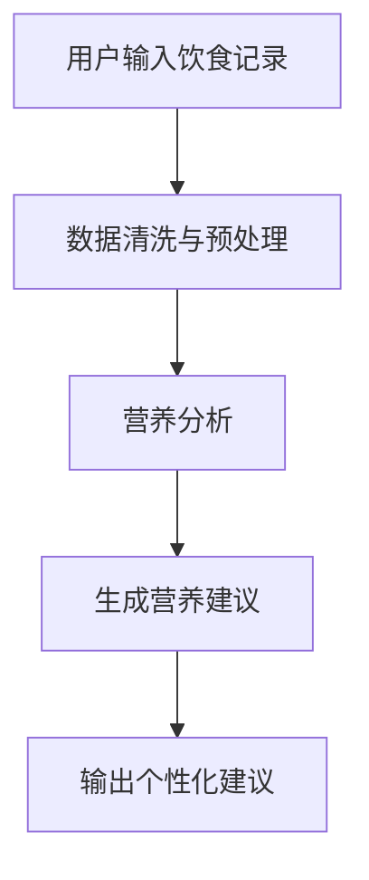
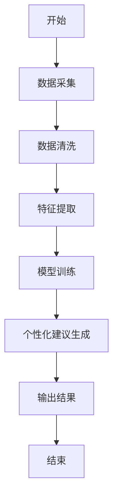
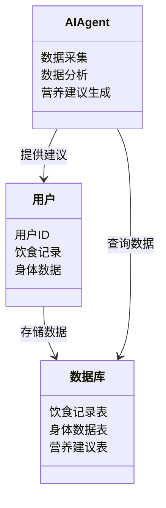

                 


# 智能餐桌：AI Agent的营养均衡建议

## 关键词
AI Agent, 营养均衡, 个性化饮食, 人工智能, 健康管理

## 摘要
随着人工智能技术的快速发展，AI Agent在健康管理领域的应用越来越广泛。本文探讨了AI Agent如何通过分析用户的饮食习惯和营养需求，提供个性化的营养均衡建议。文章详细介绍了AI Agent的核心原理、算法模型、系统架构，并通过项目实战展示了如何实现智能餐桌系统。最后，文章总结了AI Agent在营养均衡建议中的优势与挑战，为读者提供了全面的视角。

---

## 第一部分：背景与概念

### 第1章：AI Agent与营养均衡概述

#### 1.1 问题背景
营养失衡是一个普遍存在的健康问题，尤其是在快节奏的现代生活中，人们往往忽视了饮食的均衡性。AI Agent作为一种智能助手，能够通过数据分析和机器学习算法，为用户提供个性化的营养建议。

**1.1.1 营养失衡的现状与挑战**
- 近年来，由于生活方式的改变，营养失衡问题日益严重。
- 许多人由于工作压力大、时间紧张，无法保证每天摄入足够的营养。
- 营养失衡可能导致多种健康问题，如肥胖、糖尿病等。

**1.1.2 AI在健康领域的应用潜力**
- AI技术在健康管理领域的应用越来越广泛，尤其是在个性化建议方面。
- AI Agent可以通过分析用户的饮食习惯、身体数据等信息，提供科学的建议。

**1.1.3 智能餐桌的定义与目标**
- 智能餐桌是指通过AI技术实现的，能够为用户提供营养均衡建议的智能系统。
- 目标是帮助用户制定合理的饮食计划，改善营养失衡问题。

#### 1.2 问题描述
AI Agent在营养均衡建议中的作用主要体现在以下几个方面：
- 数据采集与处理：通过收集用户的饮食习惯、身体数据等信息。
- 算法分析：利用机器学习算法对数据进行分析，生成个性化的营养建议。
- 个性化建议：根据用户的营养需求，推荐适合的饮食方案。

#### 1.3 问题解决
**1.3.1 AI Agent的核心功能**
- 数据采集与处理
- 营养分析与建议生成
- 个性化饮食计划推荐

**1.3.2 数据采集与处理流程**
1. 收集用户的饮食记录。
2. 通过传感器或问卷收集身体数据。
3. 数据清洗与预处理。
4. 数据分析与建模。

**1.3.3 智能建议生成机制**
1. 根据用户的饮食习惯和营养需求，生成个性化建议。
2. 结合用户口味偏好，推荐适合的食谱。

#### 1.4 边界与外延
**1.4.1 适用场景与限制**
- 适用于个人用户和家庭用户。
- 适用于普通人群，不适用于特殊疾病患者。

**1.4.2 与其他健康工具的区分**
- 区别于传统的营养计算器，AI Agent能够提供个性化的建议。
- 区别于健康管理App，AI Agent具有更强的智能化和个性化。

**1.4.3 未来扩展方向**
- 集成更多的健康数据，如运动数据、基因信息等。
- 提供更全面的健康建议，如运动计划、生活习惯建议等。

#### 1.5 概念结构与核心要素
**1.5.1 核心概念属性对比表**
| 概念       | 描述                                                                 |
|------------|----------------------------------------------------------------------|
| AI Agent   | 能够根据用户数据提供个性化建议的智能系统                             |
| 营养均衡   | 指摄入的营养素比例合理，满足身体需求                                |
| 个性化饮食 | 根据个人需求制定的饮食计划                                          |

**1.5.2 ER实体关系图**
```mermaid
er
    %%{init: 'flowchart TD'}
    A[用户] --> B[饮食记录]
    A --> C[身体数据]
    B --> D[营养分析]
    C --> D
    D --> E[营养建议]
```

**1.5.3 Mermaid流程图**


---

## 第二部分：AI Agent的核心原理

### 第2章：AI Agent的原理与算法

#### 2.1 核心概念与原理
AI Agent通过机器学习算法分析用户的饮食数据，生成营养均衡建议。其核心原理包括数据采集、特征提取、模型训练和个性化推荐。

**2.1.1 AI Agent的基本原理**
- 数据采集：通过问卷或传感器收集用户的饮食和身体数据。
- 特征提取：将数据转化为模型可识别的特征。
- 模型训练：利用机器学习算法训练模型，生成营养建议。
- 个性化推荐：根据用户需求，推荐适合的食谱或饮食计划。

#### 2.2 算法原理讲解
**2.2.1 Mermaid流程图：营养均衡算法**


**2.2.2 Python代码示例**
```python
import pandas as pd
from sklearn.model_selection import train_test_split
from sklearn.ensemble import RandomForestClassifier

# 数据加载与预处理
data = pd.read_csv('nutrition_data.csv')
X = data.drop('label', axis=1)
y = data['label']

# 划分训练集和测试集
X_train, X_test, y_train, y_test = train_test_split(X, y, test_size=0.2)

# 模型训练
model = RandomForestClassifier()
model.fit(X_train, y_train)

# 预测与评估
accuracy = model.score(X_test, y_test)
print(f'Accuracy: {accuracy}')
```

**2.2.3 数学模型与公式**
- 营养均衡模型的数学表达式如下：
$$ \text{目标函数} = \sum_{i=1}^{n} w_i x_i $$
其中，\( w_i \) 是营养素 \( i \) 的权重，\( x_i \) 是摄入量。
- 个性化饮食建议生成公式：
$$ \text{建议} = \argmax_{j} \sum_{i=1}^{m} a_{ij} $$
其中，\( a_{ij} \) 是第 \( j \) 个食谱在第 \( i \) 个营养素上的得分。

---

#### 2.3 数学模型与公式
**2.3.1 营养均衡优化模型**
$$ \text{目标函数} = \sum_{i=1}^{n} w_i x_i $$
其中，\( w_i \) 是营养素 \( i \) 的权重，\( x_i \) 是摄入量。

**2.3.2 个性化饮食建议生成公式**
$$ \text{建议} = \argmax_{j} \sum_{i=1}^{m} a_{ij} $$
其中，\( a_{ij} \) 是第 \( j \) 个食谱在第 \( i \) 个营养素上的得分。

---

## 第三部分：系统分析与架构设计方案

### 第3章：系统分析与架构设计

#### 3.1 问题场景介绍
智能餐桌系统需要解决用户营养失衡的问题，通过AI Agent提供个性化的饮食建议。

#### 3.2 系统功能设计
**3.2.1 领域模型Mermaid类图**


#### 3.3 系统架构设计
**3.3.1 Mermaid架构图**
```mermaid
C4Context
    用户
    AI Agent
    数据库
    API Gateway
    用户通过API Gateway向AI Agent发送请求，AI Agent处理后通过API Gateway返回结果，数据存储在数据库中。
```

#### 3.4 系统接口与交互
**3.4.1 Mermaid序列图**
```mermaid
sequenceDiagram
    用户 -> API Gateway: 发送饮食记录
    API Gateway -> AI Agent: 转发请求
    AI Agent -> 数据库: 查询历史数据
    AI Agent -> API Gateway: 返回营养建议
    用户 <- API Gateway: 收到建议
```

---

## 第四部分：项目实战

### 第4章：项目实战

#### 4.1 环境安装
- Python 3.8及以上版本
- Jupyter Notebook
- 必要的Python库（如pandas、scikit-learn）

#### 4.2 系统核心实现源代码
```python
import pandas as pd
from sklearn.ensemble import RandomForestClassifier
from sklearn.metrics import accuracy_score

# 加载数据
data = pd.read_csv('nutrition_data.csv')
X = data.drop('label', axis=1)
y = data['label']

# 划分训练集和测试集
X_train, X_test, y_train, y_test = train_test_split(X, y, test_size=0.2)

# 模型训练
model = RandomForestClassifier()
model.fit(X_train, y_train)

# 预测与评估
y_pred = model.predict(X_test)
print(f'Accuracy: {accuracy_score(y_test, y_pred)}')
```

#### 4.3 代码应用解读与分析
- 数据加载与预处理：读取CSV文件，提取特征和标签。
- 模型训练：使用随机森林算法训练模型。
- 模型评估：计算准确率，评估模型性能。

#### 4.4 实际案例分析
假设用户A的饮食记录如下：
- 米饭：200g
- 菜：500g
- 肉：100g
- 奶制品：50g

AI Agent会根据这些数据，推荐适合的饮食建议，如增加蛋白质摄入，减少碳水化合物摄入。

---

## 第五部分：总结与展望

### 第5章：总结与展望

#### 5.1 最佳实践tips
- 定期更新模型，保证数据的准确性。
- 提供多样化的食谱，满足不同用户的需求。
- 注意保护用户隐私，确保数据安全。

#### 5.2 小结
本文详细介绍了AI Agent在营养均衡建议中的应用，从背景到实现，全面覆盖了相关知识点。通过项目实战，读者可以深入了解AI Agent的核心原理和实现方法。

#### 5.3 注意事项
- 确保数据的准确性和完整性。
- 定期更新模型，适应用户需求的变化。
- 注意用户隐私保护，避免数据泄露。

#### 5.4 拓展阅读
- 推荐阅读《机器学习实战》、《深度学习入门》等书籍。
- 关注最新的AI技术动态，了解AI在健康管理领域的最新应用。

---

通过本文的学习，读者可以全面了解AI Agent在营养均衡建议中的应用，掌握相关的技术原理和实现方法。希望本文能够为读者在健康管理领域提供有价值的参考。

