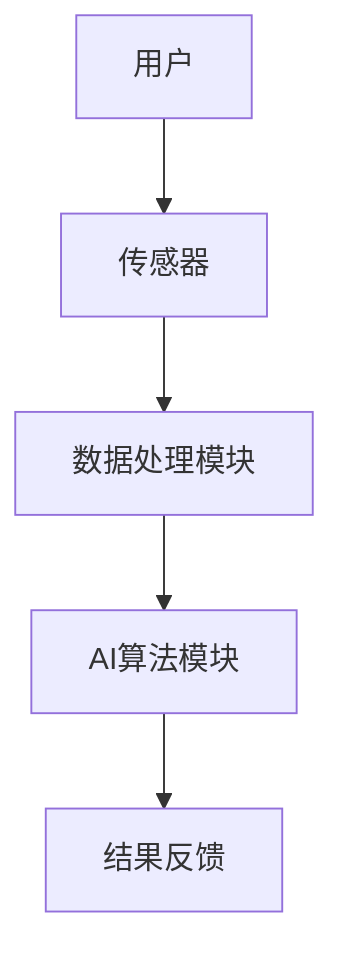

                 


# 智能餐盘：AI Agent的膳食均衡指导系统

## 关键词：
- AI Agent
- 膳食均衡
- 智能餐盘
- 机器学习
- 健康管理

## 摘要：
智能餐盘是一种结合AI技术的膳食均衡指导系统，通过AI Agent分析用户的饮食习惯，提供个性化的营养建议和健康指导。本文详细探讨了智能餐盘的核心概念、算法原理、系统架构及项目实现，展示了AI技术在健康领域的重要应用。

## 第一部分：背景介绍

### 第1章：智能餐盘的背景与问题背景
#### 1.1 问题背景
随着生活水平的提高，健康问题日益受到关注。然而，许多人由于缺乏营养知识，导致饮食不均衡，引发多种健康问题。传统的膳食指导系统依赖人工输入和固定规则，难以满足个性化需求。

#### 1.2 问题描述
膳食均衡是保持健康的重要因素，但现有系统难以实时反馈和个性化指导。AI技术的发展为解决这一问题提供了可能。

#### 1.3 问题解决
智能餐盘通过AI Agent实时分析饮食数据，提供个性化建议，帮助用户实现膳食均衡。

#### 1.4 系统的边界与外延
系统功能包括数据采集、分析、反馈，边界明确，扩展性强。

#### 1.5 核心要素与概念结构
系统由用户、餐盘传感器、AI Agent组成，用户需求是核心。

## 第二部分：核心概念与联系

### 第2章：AI Agent与膳食均衡的核心概念
#### 2.1 AI Agent的基本原理
AI Agent通过传感器数据和机器学习算法，实时分析并做出决策。

#### 2.2 膳食均衡的科学依据
基于营养学，系统分析食物种类和比例，确保均衡。

#### 2.3 系统的核心要素
包括数据采集、分析算法、用户反馈模块。

#### 2.4 实体关系图
```mermaid
er
actor: 用户
actor: 餐盘传感器
actor: AI Agent
```

## 第三部分：算法原理讲解

### 第3章：AI Agent的算法原理
#### 3.1 数据收集与处理
使用餐盘传感器采集食物数据，预处理提取特征。

#### 3.2 算法选择与实现
采用机器学习分类算法，训练模型识别食物类别。

#### 3.3 算法流程图
```mermaid
g
stages = ["开始", "数据采集", "预处理", "模型训练", "决策输出", "结束"]
steps = [
  { id: "开始", "next": "数据采集" },
  { id: "数据采集", "next": "预处理" },
  { id: "预处理", "next": "模型训练" },
  { id: "模型训练", "next": "决策输出" },
  { id: "决策输出", "next": "结束" }
]
```

#### 3.4 Python代码实现
```python
import numpy as np
from sklearn import tree

# 数据集
X = np.array([[50, 100], [150, 200], [250, 300]])
y = np.array([0, 1, 2])

# 训练模型
model = tree.DecisionTreeClassifier()
model.fit(X, y)

# 预测
new_data = np.array([[100, 150]])
prediction = model.predict(new_data)
print(prediction)
```

## 第四部分：数学模型与公式

### 第4章：数学模型
#### 4.1 营养均衡模型
$$ \text{总热量} = \sum_{i=1}^{n} \text{热量}_i $$

#### 4.2 线性规划模型
$$ \text{目标函数} = \sum_{i=1}^{n} c_i x_i $$
$$ \text{约束条件} = \{ x_i \geq 0, \sum x_i \leq 1000 \} $$

## 第五部分：系统分析与架构设计

### 第5章：系统架构设计
#### 5.1 问题场景
用户使用智能餐盘，系统实时分析饮食，提供指导。

#### 5.2 系统功能设计
用户需求分析、数据采集、模型训练、结果反馈。

#### 5.3 系统架构图


## 第六部分：项目实战

### 第6章：项目实战
#### 6.1 环境安装
安装Python、机器学习库。

#### 6.2 核心代码实现
传感器数据处理和模型训练代码。

#### 6.3 代码解读
详细解读代码功能和实现逻辑。

#### 6.4 案例分析
通过具体案例展示系统运行和效果。

## 第七部分：总结与展望

### 第7章：总结与展望
#### 7.1 最佳实践
建议使用传感器和机器学习算法。

#### 7.2 小结
智能餐盘有效解决了膳食均衡问题，具有广阔前景。

#### 7.3 注意事项
数据隐私和系统维护需注意。

#### 7.4 拓展阅读
推荐相关书籍和文献。

通过以上步骤，智能餐盘系统得以实现，展示了AI技术在健康领域的强大应用潜力。

