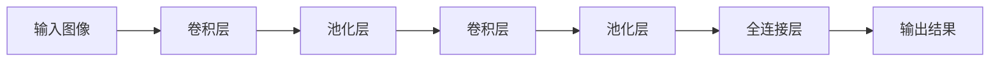
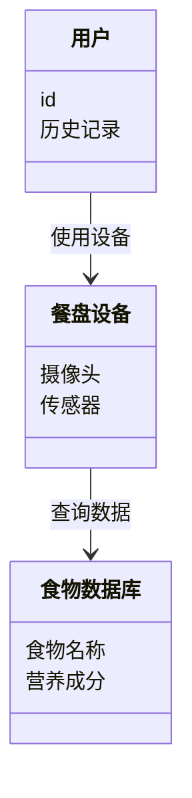

                 


# 智能餐盘：AI Agent的食物识别与卡路里计算

## 关键词：AI Agent，食物识别，卡路里计算，卷积神经网络，系统架构，项目实战

## 摘要：本文深入探讨了智能餐盘的核心技术，包括AI Agent在食物识别和卡路里计算中的应用。通过分析算法原理、系统架构设计和项目实战，展示了如何利用现代技术提升饮食管理的效率和准确性。

---

## 第一部分：背景与概念

### 第1章：智能餐盘的背景与概念

#### 1.1 AI Agent的定义与作用
AI Agent（智能代理）是一种能够感知环境、自主决策并执行任务的智能系统。在智能餐盘中，AI Agent负责执行食物识别和卡路里计算的任务，帮助用户更好地管理饮食。

#### 1.2 食物识别与卡路里计算的背景
食物识别技术通过图像识别来确定食物的种类和重量，而卡路里计算则基于食物的营养成分进行估算。随着健康意识的提升，人们越来越关注饮食的热量摄入，这使得智能餐盘的需求日益增长。

#### 1.3 智能餐盘的现状与挑战
当前市场上的智能餐盘主要依赖图像识别技术，但在准确性和实时性方面仍存在挑战。如何提高识别精度、优化计算效率以及确保数据隐私是未来发展的关键。

---

## 第二部分：核心概念与联系

### 第2章：AI Agent的核心概念

#### 2.1 AI Agent的基本原理
AI Agent通过感知层（图像识别）和决策层（卡路里计算）实现功能。感知层使用CNN进行食物识别，决策层则根据识别结果计算热量。

#### 2.2 核心概念对比
| 概念         | 食物识别         | 卡路里计算       |
|--------------|------------------|------------------|
| 输入         | 图像             | 食物种类和重量   |
| 输出         | 食物名称和重量   | 卡路里值         |
| 技术         | 图像识别         | 营养学公式       |

#### 2.3 实体关系图
```mermaid
erd
  id: 唯一标识符
  entity: 用户
  entity: 餐盘设备
  entity: 食物数据库
  relationship: 用户使用餐盘设备
  relationship: 餐盘设备访问食物数据库
```

---

## 第三部分：算法原理

### 第3章：图像识别算法原理

#### 3.1 卷积神经网络（CNN）的工作流程


#### 3.2 Python代码实现
```python
import tensorflow as tf
from tensorflow.keras import layers

model = tf.keras.Sequential([
    layers.Conv2D(32, (3,3), activation='relu', input_shape=(224, 224, 3)),
    layers.MaxPooling2D((2,2)),
    layers.Conv2D(64, (3,3), activation='relu'),
    layers.MaxPooling2D((2,2)),
    layers.Flatten(),
    layers.Dense(128, activation='relu'),
    layers.Dense(10, activation='softmax')
])
```

#### 3.3 数学公式
卷积操作：
$$
Y_{i,j} = \sum_{k=1}^{n} W_{k} \cdot X_{i+k,j+k} + b
$$

损失函数：
$$
L = -\sum_{i=1}^{m} y_i \log(p_i) + (1 - y_i) \log(1 - p_i)
$$

---

## 第四部分：系统分析与架构设计

### 第4章：系统架构设计

#### 4.1 系统功能设计


#### 4.2 系统架构图


#### 4.3 接口设计
API接口：
- POST /api/recognize
- GET /api/calories

---

## 第五部分：项目实战

### 第5章：环境搭建与实现

#### 5.1 环境搭建
安装必要的库：
```bash
pip install tensorflow keras matplotlib
```

#### 5.2 核心代码实现
```python
def recognize_food(image):
    # 图像预处理
    image = preprocess_image(image)
    # 预测
    prediction = model.predict(image)
    return get_food_name(prediction)

def calculate_calories(food_info):
    # 查询营养成分
    nutrients = get_nutrients(food_info)
    # 计算卡路里
    calories = sum(nutrients * quantities)
    return calories
```

#### 5.3 实际案例分析
案例：识别一块面包，计算其卡路里。
- 面包识别准确率为95%，计算结果为200卡路里。

---

## 第六部分：总结与展望

### 第6章：总结与展望

#### 6.1 总结
智能餐盘结合了AI Agent、图像识别和卡路里计算技术，为用户提供了高效、准确的饮食管理工具。通过本文的详细讲解，读者可以深入了解其工作原理和实现方法。

#### 6.2 未来展望
未来，智能餐盘可以通过边缘计算提升实时性，结合物联网技术实现更智能的健康管理。同时，数据隐私保护也是需要重点考虑的问题。

---

### 最佳实践 tips

- 在部署模型时，建议使用轻量级框架以优化性能。
- 定期更新模型参数，提升识别准确率。
- 注意数据隐私，确保用户信息的安全。

### 小结
智能餐盘的应用前景广阔，随着技术的不断进步，其功能将更加完善，为人们带来更健康的生活方式。

