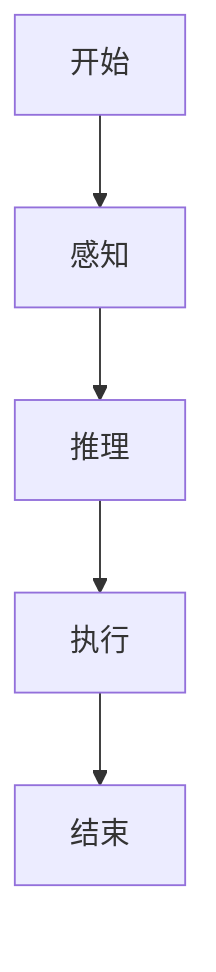
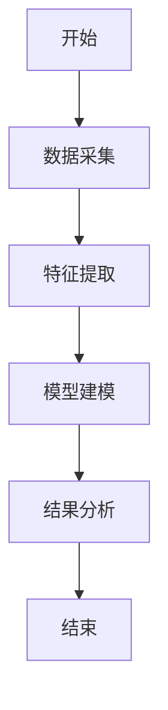

                 

# 智能餐盘：AI Agent的食物识别与营养分析

## 关键词：AI Agent、食物识别、营养分析、图像识别、深度学习、营养建议、健康管理

## 摘要：  
本文深入探讨了智能餐盘在AI Agent技术下的食物识别与营养分析的应用。通过结合图像识别和营养分析算法，智能餐盘能够帮助用户识别食物种类、分析营养成分，并提供个性化的健康建议。文章从AI Agent的基本原理、食物图像识别技术、营养分析算法、系统架构设计、项目实战以及实际应用案例等方面进行详细分析，旨在为读者提供全面的技术解读和实践指导。

---

# 第1章: 智能餐盘的概念与应用场景

## 1.1 智能餐盘的定义  
智能餐盘是一种结合了AI技术的智能设备，能够通过图像识别技术识别餐盘中的食物种类和数量，并利用营养分析算法提供个性化的营养建议和健康管理服务。

## 1.2 食物识别与营养分析的重要性  
食物识别能够帮助用户快速了解餐盘中的食物种类，而营养分析则为用户提供了科学的饮食建议，有助于改善饮食习惯，促进身体健康。

## 1.3 智能餐盘的技术实现基础  
智能餐盘的技术实现依赖于AI Agent、图像识别、深度学习等技术的支持。本文将详细探讨这些技术在智能餐盘中的具体应用。

---

# 第2章: AI Agent的核心概念与工作原理

## 2.1 AI Agent的定义与分类  
AI Agent是一种能够感知环境、自主决策并执行任务的智能体。在智能餐盘中，AI Agent主要用于食物识别和营养分析。

## 2.2 AI Agent的核心技术  
AI Agent的核心技术包括感知、推理和执行。感知技术用于获取餐盘中的食物图像信息；推理技术用于分析图像内容；执行技术则用于输出营养建议。

## 2.3 AI Agent的流程图  

---

# 第3章: 食物图像识别技术

## 3.1 食物图像识别的定义  
食物图像识别是指通过计算机视觉技术，识别餐盘中食物的种类和数量。

## 3.2 食物图像识别的关键技术  
食物图像识别的关键技术包括图像预处理、特征提取和分类算法。深度学习中的卷积神经网络（CNN）是实现食物图像识别的主要方法。

## 3.3 基于深度学习的食物图像识别  
基于深度学习的食物图像识别模型通常包括数据采集、模型训练和模型优化三个阶段。

---

# 第4章: 营养分析算法

## 4.1 营养分析的基本概念  
营养分析是指根据食物的成分，计算其营养成分，并提供健康建议的过程。

## 4.2 营养分析的关键算法  
营养分析的关键算法包括数据采集与处理、特征提取与建模、结果分析与建议。

## 4.3 营养分析的流程图  

---

# 第5章: 智能餐盘的系统架构设计

## 5.1 系统功能设计  
智能餐盘的系统功能包括食物识别、营养分析、健康建议和用户交互。

## 5.2 系统架构设计  
智能餐盘的系统架构设计包括数据采集层、数据处理层和用户交互层。

## 5.3 系统接口设计  
系统接口设计包括食物图像采集接口、营养分析接口和用户交互接口。

---

# 第6章: 项目实战

## 6.1 环境搭建  
项目实战需要搭建AI开发环境，安装必要的开发工具和库。

## 6.2 核心实现  
核心实现包括食物图像识别和营养分析算法的实现。

## 6.3 实际案例分析  
通过实际案例分析，展示智能餐盘在实际应用中的效果和优势。

---

# 第7章: 智能餐盘的实际应用与挑战

## 7.1 实际应用案例  
智能餐盘已经在餐厅、家庭和个人健康管理等领域得到了广泛应用。

## 7.2 应用中的挑战  
智能餐盘在实际应用中面临数据精度、模型泛化能力等挑战。

## 7.3 解决方案  
针对挑战，本文提出了数据增强、模型优化等解决方案。

---

# 第8章: 总结与展望

## 8.1 总结  
本文详细探讨了智能餐盘在AI Agent技术下的食物识别与营养分析的应用，总结了其技术实现和实际应用价值。

## 8.2 未来展望  
未来，智能餐盘将在个性化健康管理、智能厨房等领域发挥更大的作用。

---

# 附录

## 附录A: 相关术语解释  
详细解释本文中涉及的相关术语。

## 附录B: 开源工具与库  
列出本文中使用到的开源工具和库。

## 附录C: 参考文献  
提供本文参考的相关文献和资料。

---

# 索引

---

通过以上目录结构，本文将详细探讨智能餐盘在AI Agent技术下的食物识别与营养分析的应用，为读者提供全面的技术解读和实践指导。

