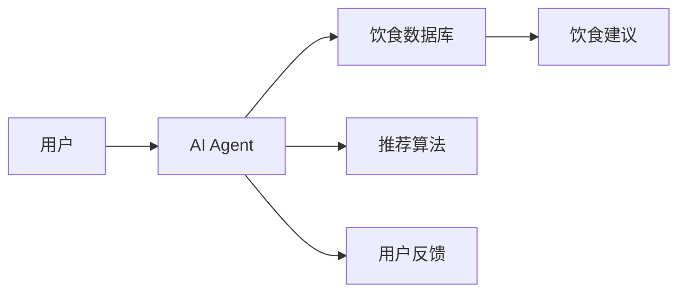

                 

# 智能餐盘：AI Agent的饮食均衡建议系统

## 关键词：AI Agent，饮食均衡，推荐算法，系统架构，深度学习

## 摘要：  
智能餐盘系统通过AI Agent技术，结合饮食数据库和用户反馈，提供个性化的饮食均衡建议。本文详细介绍了系统的背景、核心概念、推荐算法、系统架构，并通过项目实战展示了系统的实现过程，最后总结了最佳实践和未来发展。

---

# 第1章: 智能餐盘系统背景介绍

## 1.1 问题背景与描述

### 1.1.1 饮食不均衡问题的现状  
现代生活中，由于快节奏和饮食习惯的改变，许多人面临饮食不均衡的问题。饮食不均衡可能导致肥胖、营养缺乏等多种健康问题。根据世界卫生组织的数据，全球约有20亿人面临营养不良的问题，其中超过20%的人是由于饮食结构不合理导致的。

### 1.1.2 当前饮食建议系统的痛点  
传统的饮食建议系统通常基于固定的食谱或简单的营养计算，缺乏个性化和实时性。用户需要手动输入饮食数据，且建议的饮食方案可能不符合个人口味和饮食习惯。此外，现有系统难以实时调整建议，无法满足用户的动态需求。

### 1.1.3 AI Agent在饮食建议中的应用潜力  
AI Agent（人工智能代理）是一种能够自主决策和执行任务的智能体。通过结合饮食数据库和用户反馈，AI Agent可以实时分析用户的饮食习惯，提供个性化的饮食建议，并根据用户的反馈不断优化建议方案。AI Agent的应用使得饮食建议系统更加智能化和个性化。

### 1.1.4 系统边界与核心要素  
智能餐盘系统的边界包括用户输入的饮食数据、AI Agent的处理逻辑和输出的饮食建议。系统的核心要素包括：  
1. **用户数据**：用户的饮食记录、健康状况和口味偏好。  
2. **饮食数据库**：包含各类食物的营养成分和健康建议。  
3. **AI Agent**：负责数据处理、推荐算法和结果优化。  
4. **反馈机制**：用户对饮食建议的反馈用于改进系统。

### 1.1.5 系统的核心要素组成结构  

---

## 1.2 系统边界与外延

### 1.2.1 系统边界  
智能餐盘系统的边界包括用户端和系统处理端。用户端负责输入饮食数据和接收建议，系统处理端负责数据处理和算法计算。

### 1.2.2 系统外延  
系统外延包括与外部数据源（如健康监测设备）的连接，以及与其他健康管理系统（如健身应用）的集成。

---

## 1.3 系统的功能模块

### 1.3.1 数据采集模块  
负责采集用户的饮食数据，包括食物种类、摄入量和用餐时间。

### 1.3.2 数据处理模块  
对采集的数据进行清洗和预处理，确保数据的准确性和一致性。

### 1.3.3 推荐模块  
基于推荐算法生成个性化的饮食建议。

### 1.3.4 反馈模块  
收集用户的反馈，优化推荐算法。

---

## 1.4 系统的核心要素与组成结构

### 1.4.1 用户数据  
用户的饮食记录、健康状况和口味偏好是系统的核心输入数据。

### 1.4.2 饮食数据库  
包含各类食物的营养成分和健康建议，是系统的重要数据来源。

### 1.4.3 AI Agent  
负责数据处理、推荐算法和结果优化，是系统的核心模块。

### 1.4.4 反馈机制  
用户对饮食建议的反馈用于改进系统，确保推荐结果的准确性和用户满意度。

---

## 总结  
智能餐盘系统通过AI Agent技术，结合饮食数据库和用户反馈，提供个性化的饮食均衡建议。系统的核心要素包括用户数据、饮食数据库、AI Agent和反馈机制。通过这些要素的协同作用，系统能够实时分析用户的饮食习惯，提供科学合理的饮食建议，并根据用户的反馈不断优化推荐方案。

