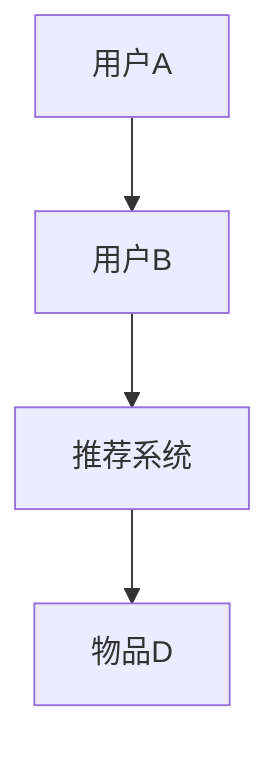
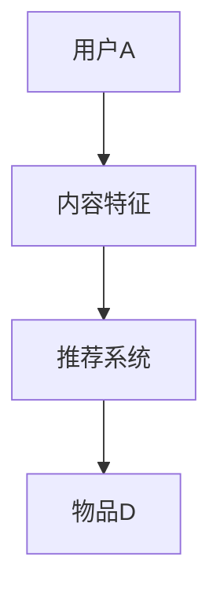
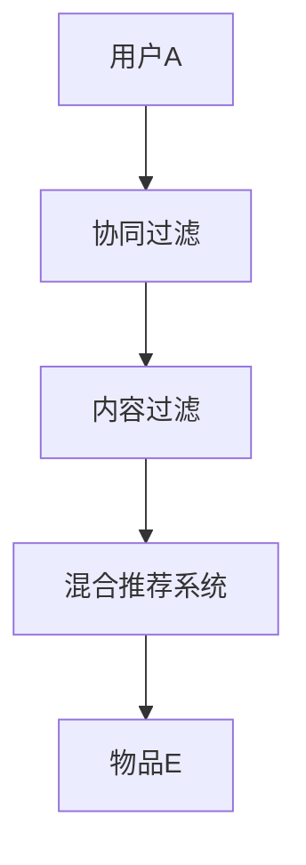
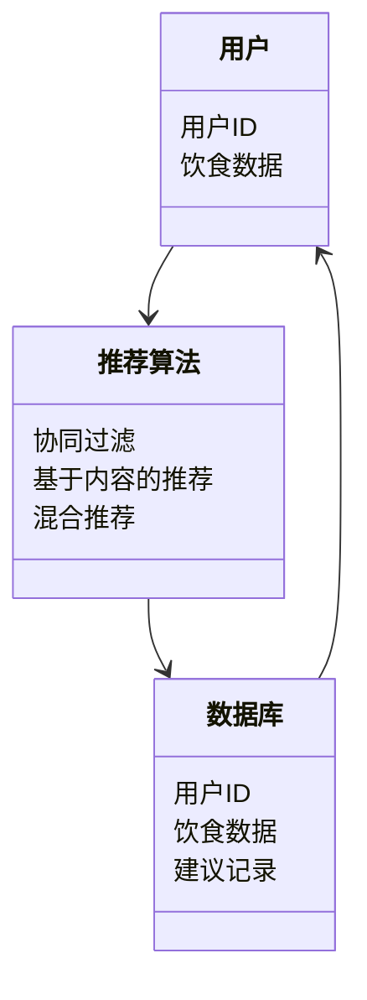
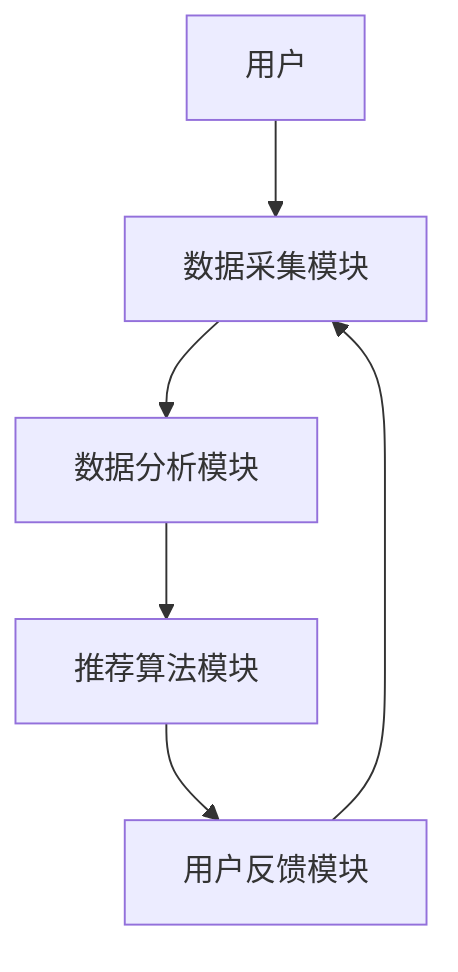
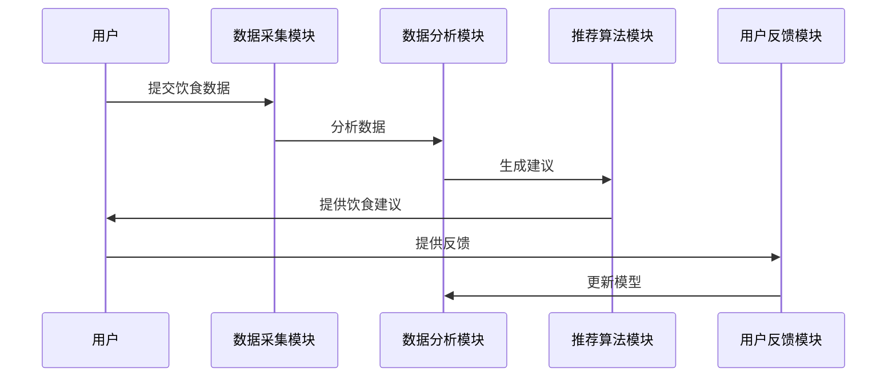

                 


# 智能餐盘：AI Agent的饮食平衡建议

## 关键词：智能餐盘，AI Agent，饮食平衡，个性化推荐，健康饮食

## 摘要：本文探讨了AI Agent在饮食健康中的应用，介绍了智能餐盘的设计原理和实现方法。通过详细分析饮食平衡的核心概念、推荐算法、数学模型、系统架构，结合项目实战，展示了如何利用AI技术实现个性化的饮食建议。本文还提供了最佳实践和未来发展方向的建议，为读者提供全面的技术指导。

---

## 第一部分：背景介绍

### 第1章：智能餐盘的背景与问题背景

#### 1.1 问题背景

- **1.1.1 当前饮食问题的现状**
  - 随着现代生活的快节奏，人们饮食不规律，导致营养失衡、肥胖、慢性病等问题。
  - 饮食结构单一，缺乏对营养均衡的关注。

- **1.1.2 饮食失衡对健康的影响**
  - 营养缺乏或过剩导致免疫力下降、亚健康状态。
  - 长期饮食不均衡可能导致糖尿病、高血压等慢性疾病。

- **1.1.3 人工智能在饮食健康中的应用潜力**
  - AI技术能够分析大量数据，提供个性化的饮食建议。
  - 通过AI Agent实时监测饮食情况，调整建议，帮助用户实现饮食平衡。

#### 1.2 AI Agent的核心概念

- **1.2.1 AI Agent的定义与特点**
  - AI Agent是一个智能体，能够感知环境、自主决策并执行任务。
  - 具有学习能力、适应性、实时性和个性化推荐的特点。

- **1.2.2 AI Agent在饮食健康中的应用**
  - 收集用户的饮食数据，分析营养摄入情况。
  - 根据用户需求，推荐合适的饮食计划和食谱。

- **1.2.3 智能餐盘的定义与目标**
  - 智能餐盘是一个结合AI技术的设备，能够监测饮食、提供个性化建议。
  - 目标是帮助用户实现饮食平衡，提高健康水平。

#### 1.3 智能餐盘的意义与价值

- **1.3.1 提高饮食健康意识**
  - 通过智能餐盘的实时反馈，增强用户的健康意识。
  - 提供科学的饮食指导，帮助用户养成良好的饮食习惯。

- **1.3.2 个性化饮食建议的重要性**
  - 根据用户的年龄、性别、体重、健康状况等因素，提供定制化的饮食计划。
  - 解决传统饮食建议一刀切的问题，提高用户体验。

- **1.3.3 智能餐盘的技术创新**
  - 结合物联网和AI技术，实现智能化的饮食管理。
  - 通过数据分析和机器学习，不断优化推荐算法，提升建议的准确性。

#### 1.4 本章小结

- 本章介绍了智能餐盘的背景和问题背景，解释了AI Agent在饮食健康中的应用潜力。
- 强调了智能餐盘的重要性和创新性，为后续章节的深入分析奠定了基础。

---

## 第二部分：核心概念与联系

### 第2章：AI Agent与饮食平衡的核心概念

#### 2.1 AI Agent的核心原理

- **2.1.1 AI Agent的基本工作原理**
  - AI Agent通过传感器、数据库等获取环境信息。
  - 利用机器学习算法分析数据，生成决策，并执行相应的动作。

- **2.1.2 AI Agent在饮食健康中的应用逻辑**
  - 收集用户的饮食数据，如摄入的热量、营养成分等。
  - 分析数据，识别饮食中的不足或过剩。
  - 根据分析结果，生成个性化的饮食建议。

- **2.1.3 AI Agent的决策机制**
  - 基于规则的决策：根据预设的规则生成建议。
  - 基于学习的决策：利用机器学习模型，根据用户数据生成动态建议。

#### 2.2 饮食平衡的核心概念

- **2.2.1 饮食平衡的定义与标准**
  - 饮食平衡指摄入的营养成分种类和数量合理，满足身体需求。
  - 标准包括热量摄入与消耗平衡、宏量营养素（碳水化合物、蛋白质、脂肪）和微量营养素（维生素、矿物质）的均衡。

- **2.2.2 饮食结构的优化方法**
  - 根据用户的健康目标（如减重、增肌）调整饮食结构。
  - 采用多样化的饮食，确保摄入各种营养成分。

- **2.2.3 营养学的基本原理**
  - 食物中主要营养成分的作用：碳水化合物提供能量，蛋白质修复组织，脂肪提供必需脂肪酸。
  - 微量营养素的必要性：维生素和矿物质对身体功能至关重要。

#### 2.3 智能餐盘的系统架构

- **2.3.1 系统组成与功能模块**
  - 数据采集模块：通过传感器记录用户的饮食数据。
  - 数据分析模块：利用机器学习算法分析数据，生成饮食建议。
  - 用户交互模块：通过应用程序与用户互动，提供反馈。

- **2.3.2 系统输入与输出**
  - 输入：用户的饮食数据（如食物种类、摄入量）。
  - 输出：个性化的饮食建议、营养分析报告。

- **2.3.3 系统的核心算法与数据流**
  - 核心算法：协同过滤、基于内容的推荐。
  - 数据流：从数据采集到分析，再到输出建议的流程。

#### 2.4 核心概念对比分析

- **2.4.1 AI Agent与传统的饮食建议方法对比**

| 对比维度         | AI Agent饮食建议 | 传统饮食建议 |
|------------------|------------------|--------------|
| 数据分析能力     | 强大的数据处理能力 | 依赖经验法则   |
| 个性化程度       | 高度个性化        | 较低           |
| 实时性           | 实时反馈          | 延时较大       |
| 可扩展性         | 高                | 较低           |

- **2.4.2 智能餐盘与传统餐盘对比**

| 对比维度         | 智能餐盘         | 传统餐盘      |
|------------------|------------------|---------------|
| 功能             | 实时监测饮食     | 仅盛放食物     |
| 智能性           | 配备AI技术       | 无智能功能     |
| 用户交互         | 提供个性化建议   | 无交互         |
| 健康指导         | 提供营养分析     | 无法提供建议   |

---

## 第三部分：算法原理讲解

### 第3章：推荐算法的实现原理

#### 3.1 协同过滤推荐算法

- **3.1.1 协同过滤算法的流程**



- **3.1.2 协同过滤算法的Python实现**

```python
def collaborative_filtering(user_id, user_matrix):
    # 找到与目标用户相似的用户
    similar_users = find_similar_users(user_id, user_matrix)
    # 计算推荐分数
    recommendations = []
    for user in similar_users:
        for item in user_matrix[user]:
            if item not in recommendations:
                recommendations.append(item)
    return recommendations
```

- **3.1.3 协同过滤算法的优缺点**

| 优点             | 缺点             |
|------------------|------------------|
| 实现简单           | 对冷启动问题敏感   |
| 推荐结果相关性高   | 计算复杂度高       |

#### 3.2 基于内容的推荐算法

- **3.2.1 基于内容的推荐算法的流程**



- **3.2.2 基于内容的推荐算法的Python实现**

```python
from sklearn.feature_extraction.text import TfidfVectorizer
import numpy as np

def content_based_recommendation(user_profile, item_profiles):
    vectorizer = TfidfVectorizer()
    user_vector = vectorizer.fit_transform([user_profile])
    item_vectors = vectorizer.transform(item_profiles)
    similarity_scores = np.dot(user_vector.toarray(), item_vectors.toarray())
    recommendations = sorted(range(len(similarity_scores)), key=lambda i: similarity_scores[i], reverse=True)
    return recommendations
```

- **3.2.3 基于内容的推荐算法的优缺点**

| 优点             | 缺点             |
|------------------|------------------|
| 对冷启动问题鲁棒   | 需要高质量的内容特征 |
| 推荐结果可解释     | 特定内容类型的推荐效果有限 |

#### 3.3 混合推荐算法

- **3.3.1 混合推荐算法的流程**



- **3.3.2 混合推荐算法的Python实现**

```python
def hybrid_recommendation(user_id, user_matrix, item_profiles):
    collaborative_recs = collaborative_filtering(user_id, user_matrix)
    content_recs = content_based_recommendation(user_id, item_profiles)
    # 综合推荐
    hybrid_recs = []
    for rec in collaborative_recs:
        if rec not in hybrid_recs:
            hybrid_recs.append(rec)
    for rec in content_recs:
        if rec not in hybrid_recs:
            hybrid_recs.append(rec)
    return hybrid_recs
```

---

## 第四部分：数学模型

### 第4章：饮食推荐的数学模型

#### 4.1 饮食推荐的数学模型建立

- **4.1.1 用户偏好矩阵**

$$
\text{偏好矩阵} = X \times Y
$$

- **4.1.2 食物营养矩阵**

$$
\text{营养矩阵} = M \times N
$$

#### 4.2 矩阵分解模型

- **4.2.1 矩阵分解的数学表达**

$$
X = U \times V^T
$$

- **4.2.2 矩阵分解的应用**

$$
U = \text{用户特征向量}, V = \text{物品特征向量}
$$

#### 4.3 饮食推荐的概率模型

- **4.3.1 饮食推荐的概率计算**

$$
P(\text{推荐} | \text{用户}, \text{物品}) = \frac{\text{相似度}}{\text{相似度} + \text{偏差}}
$$

---

## 第五部分：系统分析与架构设计方案

### 第5章：系统架构设计

#### 5.1 问题场景介绍

- 用户通过智能餐盘记录饮食，系统分析数据，提供个性化建议。

#### 5.2 项目介绍

- 智能餐盘系统的目标是帮助用户实现饮食平衡。

#### 5.3 系统功能设计



#### 5.4 系统架构设计



#### 5.5 系统接口设计

- 数据采集接口：记录用户的饮食数据。
- 数据分析接口：分析数据，生成饮食建议。
- 用户反馈接口：收集用户的反馈，优化推荐算法。

#### 5.6 系统交互设计



---

## 第六部分：项目实战

### 第6章：智能餐盘的实现

#### 6.1 环境安装

- 安装Python、机器学习库（如scikit-learn、TensorFlow）。
- 安装数据库（如MySQL）和相关连接库。

#### 6.2 系统核心实现

- 数据采集模块：使用传感器或API记录用户的饮食数据。
- 数据分析模块：利用机器学习算法分析数据，生成饮食建议。
- 推荐算法模块：实现协同过滤和基于内容的推荐算法。

#### 6.3 代码实现与解读

- 数据采集代码：

```python
import sqlite3

conn = sqlite3.connect('diet.db')
cursor = conn.cursor()
cursor.execute('''CREATE TABLE diet_data
                 (id INTEGER PRIMARY KEY,
                  user_id TEXT,
                  food TEXT,
                  calories INTEGER)''')
conn.commit()
conn.close()
```

- 推荐算法代码：

```python
from sklearn.metrics.pairwise import cosine_similarity

def similar_users(user_id, user_matrix):
    user_vector = user_matrix[user_id]
    similarities = {}
    for user in user_matrix:
        if user != user_id:
            user_vector_other = user_matrix[user]
            similarity = cosine_similarity([user_vector], [user_vector_other])[0,0]
            similarities[user] = similarity
    return sorted(similarities.items(), key=lambda x: x[1], reverse=True)
```

#### 6.4 实际案例分析

- 案例：用户A的饮食数据，系统推荐低脂高蛋白的饮食计划。

---

## 第七部分：最佳实践与总结

### 第7章：总结与展望

#### 7.1 总结

- 本文详细介绍了智能餐盘的设计原理和实现方法。
- 探讨了AI Agent在饮食健康中的应用，展示了如何利用技术实现个性化的饮食建议。

#### 7.2 最佳实践 tips

- 定期更新用户数据，优化推荐算法。
- 注意数据隐私，确保用户信息的安全。
- 结合用户的反馈，不断改进系统。

#### 7.3 未来发展方向

- 结合物联网和边缘计算，实现更实时的饮食监测。
- 利用生成式AI，提供多样化的食谱建议。
- 拓展更多健康指标，如运动数据、生理指标，提供更全面的健康管理。

---

## 参考文献

（此处列出相关的书籍、论文和技术文档）

---

通过以上结构，本文系统地介绍了智能餐盘的设计与实现，从背景到技术细节，再到项目实战，为读者提供了全面的技术指导。希望本文能够帮助读者理解AI在饮食健康中的应用，并激发更多创新和实践。

