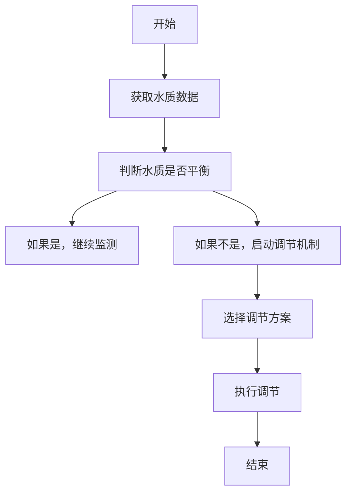
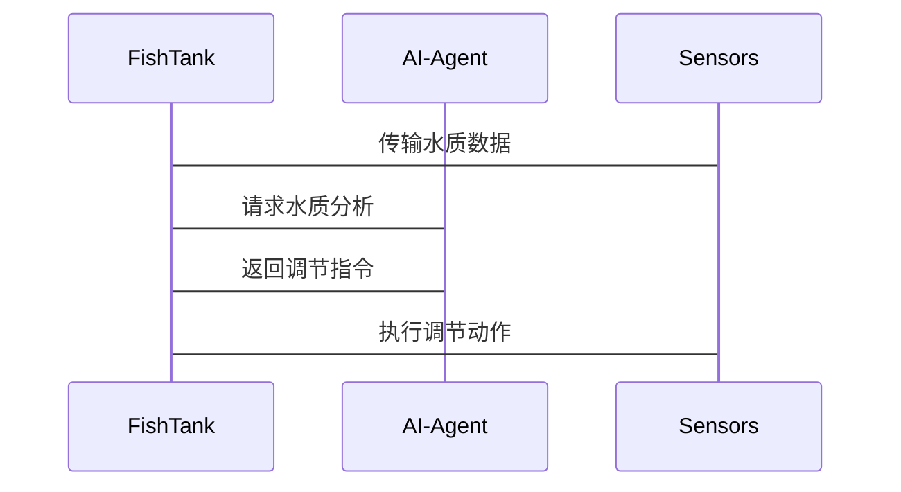

                 


# 智能鱼缸：AI Agent的水质平衡维护

> 关键词：智能鱼缸，AI Agent，水质平衡，算法原理，系统架构

> 摘要：本文探讨了AI Agent在智能鱼缸水质管理中的应用，分析了水质平衡的核心要素，详细讲解了AI Agent的算法原理，并通过系统架构设计和项目实战展示了如何实现智能鱼缸的水质优化。

---

## 第一部分：智能鱼缸与AI Agent概述

### 第1章：背景介绍

#### 1.1 问题背景与描述
智能鱼缸的水质管理是一个复杂的系统工程，传统方法依赖人工监测和调节，存在效率低、精度差的问题。AI Agent通过自动化感知、决策和执行，能够实时优化水质，为水族爱好者提供智能化的解决方案。

#### 1.2 智能鱼缸的核心概念
- **AI Agent**：智能代理，能够感知环境、做出决策并执行动作。
- **水质平衡**：通过调节温度、氧气含量等参数，确保水质适宜鱼类生存。

#### 1.3 问题解决与边界
- **数学模型**：建立水质参数与调节动作之间的数学关系。
- **系统边界**：定义系统关注的范围，如仅考虑温度和氧气含量。

### 1.4 本章小结
本章介绍了智能鱼缸的背景、核心概念和实现路径，为后续章节奠定了基础。

---

## 第二部分：AI Agent的核心原理与算法

### 第2章：AI Agent的核心概念与联系

#### 2.1 核心概念原理
- **感知层**：通过传感器获取水质数据。
- **决策层**：基于数据做出调节决策。
- **执行层**：通过执行器调整水质。

#### 2.2 核心概念属性对比
| 层次 | 输入 | 输出 | 功能 |
|------|------|------|------|
| 感知层 | 水质数据 | 水质状态 | 监测水质 |
| 决策层 | 水质状态 | 调节策略 | 决策调节方案 |
| 执行层 | 调节策略 | 实际调节 | 执行调节 |

#### 2.3 ER实体关系图
```mermaid
entity WaterQuality {
    id
    temperature
    oxygen
    time
}
```

### 第3章：AI Agent的算法原理

#### 3.1 算法原理概述
- **PID控制算法**：通过比例、积分、微分调节，实现稳定控制。
- **机器学习模型**：利用历史数据训练模型，预测水质变化。

#### 3.2 算法流程图


#### 3.3 算法实现代码
```python
def get_water_quality():
    # 获取水质数据
    return sensor_data

def is_balanced(water_quality):
    # 判断水质是否平衡
    return water_quality within acceptable_range

def adjust_water_quality(water_quality):
    # 启动调节机制
    if water_quality['temperature'] > target:
        decrease_heating()
    if water_quality['oxygen'] < target:
        increase_aeration()
```

#### 3.4 数学模型与公式
- **PID控制公式**：
  $$ e = r - y $$
  $$ u = K_p e + K_i \int e dt + K_d \frac{de}{dt} $$

---

## 第三部分：系统架构与实现

### 第4章：系统架构设计

#### 4.1 问题场景介绍
智能鱼缸系统需要实时监测和调节水质，确保鱼类生存环境稳定。

#### 4.2 系统功能设计
- **感知层**：温度传感器、溶解氧传感器。
- **决策层**：AI Agent算法。
- **执行层**：加热器、气泵。

#### 4.3 系统架构设计


#### 4.4 系统接口设计
- **输入接口**：传感器数据。
- **输出接口**：调节指令。

#### 4.5 系统交互流程图


---

## 第四部分：项目实战

### 第5章：项目实战

#### 5.1 环境搭建
- **硬件**：Raspberry Pi、传感器、执行器。
- **软件**：Python、机器学习库。

#### 5.2 系统核心实现
```python
import time
from sensor_library import TemperatureSensor, OxygenSensor
from actuator_library import Heater, Aerator

class AI-Agent:
    def __init__(self):
        self.temp_sensor = TemperatureSensor()
        self.oxy_sensor = OxygenSensor()
        self.heater = Heater()
        self.aerator = Aerator()
        self.target_temp = 25  # °C
        self.target_oxy = 8  # mg/L

    def get_water_quality(self):
        return {
            'temperature': self.temp_sensor.read(),
            'oxygen': self.oxy_sensor.read()
        }

    def is_balanced(self, water_quality):
        return (self.target_temp - 1 <= water_quality['temperature'] <= self.target_temp + 1 and
                self.target_oxy - 1 <= water_quality['oxygen'] <= self.target_oxy + 1)

    def adjust_water_quality(self, water_quality):
        if water_quality['temperature'] > self.target_temp + 1:
            self.heater.adjust('lower')
        if water_quality['oxygen'] < self.target_oxy - 1:
            self.aerator.adjust('increase')
```

#### 5.3 案例分析
通过实际数据展示系统如何实时调节水质，确保温度和氧气含量在目标范围内。

---

## 第五部分：最佳实践与小结

### 第6章：小结与注意事项

#### 6.1 小结
本文详细介绍了智能鱼缸中AI Agent的实现，包括算法原理、系统架构和项目实战。

#### 6.2 注意事项
- 硬件选择要考虑精度和稳定性。
- 调试过程中需不断优化算法参数。

### 6.3 扩展阅读
推荐学习PID控制、机器学习在环境监控中的应用。

---

通过以上结构，本文全面介绍了智能鱼缸中AI Agent的水质平衡维护，帮助读者理解其技术原理和实现方法。

