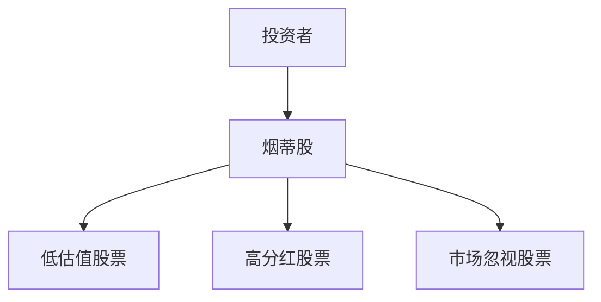
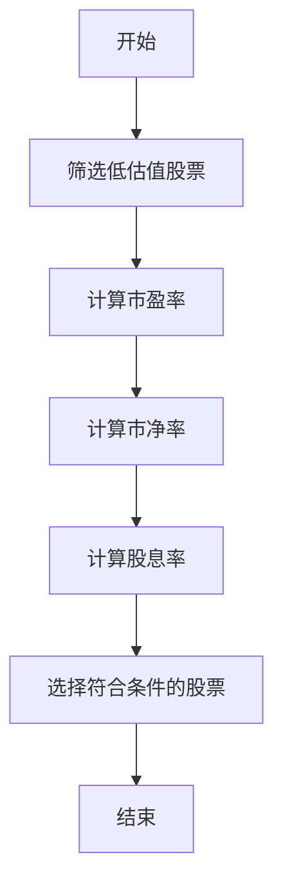
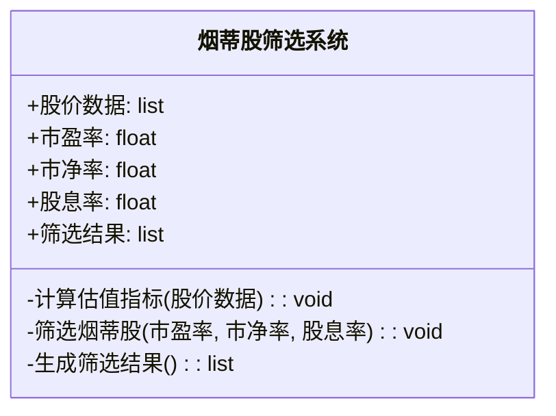
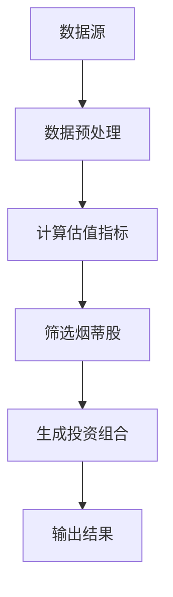

                 


# 本杰明·格雷厄姆的'烟蒂股'策略现代解读

> 关键词：烟蒂股，本杰明·格雷厄姆，价值投资，量化投资，低估值股票

> 摘要：本文系统地解读了本杰明·格雷厄姆提出的烟蒂股策略，从其核心概念、数学模型、算法原理到现代应用进行了全面分析。文章结合现代投资环境，探讨了烟蒂股策略在量化投资、风险管理以及技术分析中的应用，旨在为投资者提供一种新的视角来理解和应用这一经典投资策略。

---

# 第一部分: 烟蒂股策略的背景与概述

## 第1章: 烟蒂股策略的背景与核心概念

### 1.1 烟蒂股策略的起源与背景

#### 1.1.1 本杰明·格雷厄姆与烟蒂股的起源
本杰明·格雷厄姆是20世纪最伟大的投资思想家之一，他提出的“烟蒂股”（Nifty Pick）策略是价值投资的重要组成部分。烟蒂股策略的核心思想是寻找那些市场价格低于其内在价值的股票，这些股票通常被市场忽视或低估，就像烟蒂一样便宜。

#### 1.1.2 烟蒂股策略的核心理念
烟蒂股策略的核心理念是通过分析公司的基本面，寻找那些市场价格低于其内在价值的股票。格雷厄姆认为，市场情绪的波动会导致某些股票的价格偏离其真实价值，而这些股票就是烟蒂股。

#### 1.1.3 烟蒂股策略在投资领域的影响
烟蒂股策略不仅影响了价值投资的理论发展，还为量化投资和指数投资提供了重要的方法论基础。许多现代投资策略，如因子投资和风险管理，都可以追溯到烟蒂股策略的核心思想。

### 1.2 烟蒂股策略的核心要素

#### 1.2.1 烟蒂股的定义与特征
烟蒂股的定义是那些市场价格低于其内在价值的股票。其特征包括：
1. 低估值：市盈率、市净率等估值指标低于行业平均水平。
2. 高分红：股息收益率较高，通常高于行业平均水平。
3. 市场忽视：这些股票通常不受市场关注，交易量较小。

#### 1.2.2 烟蒂股的筛选标准
烟蒂股的筛选标准包括以下几个方面：
1. 低市盈率（P/E）：市盈率低于行业平均水平。
2. 低市净率（P/B）：市净率低于行业平均水平。
3. 高股息率：股息收益率高于行业平均水平。

#### 1.2.3 烟蒂股策略的边界与外延
烟蒂股策略的边界在于其适用范围和时间限制。例如，某些行业（如高科技行业）可能不适合采用烟蒂股策略，因为这些行业的估值通常较高。此外，烟蒂股策略在市场周期中的表现也存在波动性。

### 1.3 烟蒂股策略与现代投资策略的对比

#### 1.3.1 传统烟蒂股策略与现代价值投资的区别
传统烟蒂股策略更注重股票的低估值特征，而现代价值投资则更注重公司的基本面分析，如盈利能力、财务状况等。

#### 1.3.2 烟蒂股策略在量化投资中的应用
量化投资通过算法和模型自动筛选烟蒂股，提高了投资效率和准确性。量化投资中的烟蒂股策略通常结合多种因子进行筛选，如低市盈率、低市净率、高股息率等。

#### 1.3.3 烟蒂股策略与成长型投资的融合
成长型投资注重公司的成长潜力，而烟蒂股策略注重股票的低估值特征。两者的结合可以通过筛选具有成长潜力但估值较低的公司来实现。

### 1.4 本章小结

#### 1.4.1 烟蒂股策略的核心要点回顾
烟蒂股策略的核心在于寻找那些市场价格低于其内在价值的股票。其核心要素包括低估值、高分红和市场忽视。

#### 1.4.2 烟蒂股策略的现代意义
烟蒂股策略不仅是价值投资的重要组成部分，也是量化投资和因子投资的重要基础。其在现代投资中的应用更加广泛和多样化。

---

## 第2章: 烟蒂股策略的核心概念与联系

### 2.1 烟蒂股策略的核心概念原理

#### 2.1.1 烟蒂股的内在价值计算
烟蒂股的内在价值可以通过公司的基本面指标进行估算。例如，可以通过公司的净利润和股份数量计算每股价值。

#### 2.1.2 烟蒂股的市场价值与内在价值的对比
市场价值是股票的市场价格，而内在价值是基于公司基本面计算的价值。烟蒂股策略的核心在于寻找市场价格低于内在价值的股票。

#### 2.1.3 烟蒂股策略的数学模型
烟蒂股策略的数学模型可以通过以下公式表示：
$$ V = \frac{E}{P} $$
其中，\( V \) 是内在价值，\( E \) 是净利润，\( P \) 是股份数量。

### 2.2 烟蒂股策略的核心概念属性特征对比

#### 2.2.1 烟蒂股与成长股的特征对比
| 特征 | 烟蒂股 | 成长股 |
|------|--------|--------|
| 估值 | 低     | 高     |
| 盈利 | 稳定   | 快速增长 |
| 风险 | 低     | 高     |

#### 2.2.2 烟蒂股与周期性股票的特征对比
| 特征 | 烟蒂股 | 周期性股票 |
|------|--------|------------|
| 估值 | 低     | 周期波动大 |
| 盈利 | 稳定   | 周期波动大 |
| 风险 | 中     | 高         |

#### 2.2.3 烟蒂股与防御性股票的特征对比
| 特征 | 烟蒂股 | 防御性股票 |
|------|--------|-------------|
| 估值 | 低     | 中         |
| 盈利 | 稳定   | 稳定       |
| 风险 | 低     | 低         |

### 2.3 烟蒂股策略的ER实体关系图



### 2.4 本章小结

#### 2.4.1 烟蒂股策略的核心概念总结
烟蒂股策略的核心在于通过分析股票的估值、盈利能力和市场地位，寻找那些市场价格低于其内在价值的股票。

#### 2.4.2 烟蒂股策略的实体关系图分析
通过ER实体关系图可以看出，烟蒂股策略涉及投资者、低估值股票、高分红股票和市场忽视股票等多个方面。

---

## 第3章: 烟蒂股策略的数学模型与算法原理

### 3.1 烟蒂股策略的数学模型

#### 3.1.1 烟蒂股的内在价值计算公式
$$ V = \frac{E}{P} $$
其中，\( V \) 是内在价值，\( E \) 是净利润，\( P \) 是股份数量。

#### 3.1.2 烟蒂股的市场价值计算公式
$$ M = P \times Q $$
其中，\( M \) 是市场价值，\( P \) 是股价，\( Q \) 是股份数量。

#### 3.1.3 烟蒂股的筛选标准公式
$$ \text{筛选条件} = \left( \frac{P}{E} < 10 \right) \land \left( \frac{P}{B} < 2 \right) \land \left( \text{股息率} > 3\% \right) $$

### 3.2 烟蒂股策略的算法流程



### 3.3 烟蒂股策略的Python实现

#### 3.3.1 环境安装
```bash
pip install pandas numpy matplotlib
```

#### 3.3.2 核心代码实现
```python
import pandas as pd

def calculate_smoke_tip_stocks(data):
    # 计算市盈率
    data['PE'] = data['股价'] / data['每股收益']
    # 计算市净率
    data['PB'] = data['股价'] / data['每股净资产']
    # 计算股息率
    data['股息率'] = data['股息'] / data['股价'] * 100
    # 筛选烟蒂股
    smoke_tip = data[(data['PE'] < 10) & (data['PB'] < 2) & (data['股息率'] > 3)]
    return smoke_tip

# 示例数据
data = {
    '股价': [10, 20, 30, 40, 50],
    '每股收益': [1, 2, 3, 4, 5],
    '每股净资产': [5, 10, 15, 20, 25],
    '股息': [0.5, 1, 1.5, 2, 2.5]
}
data = pd.DataFrame(data)
result = calculate_smoke_tip_stocks(data)
print(result)
```

### 3.4 本章小结

#### 3.4.1 烟蒂股策略的数学模型总结
烟蒂股策略通过计算市盈率、市净率和股息率等指标，筛选出那些市场价格低于其内在价值的股票。

#### 3.4.2 烟蒂股策略的算法流程总结
烟蒂股策略的算法流程包括数据收集、计算估值指标和筛选符合条件的股票。

---

## 第4章: 烟蒂股策略的系统分析与架构设计

### 4.1 问题场景介绍
在现代投资环境中，烟蒂股策略可以通过量化方法进行优化。本文将设计一个基于烟蒂股策略的投资系统，实现股票筛选、风险管理和投资组合优化等功能。

### 4.2 系统功能设计

#### 4.2.1 领域模型设计


#### 4.2.2 系统架构设计


#### 4.2.3 系统接口设计
- 数据预处理接口：接收原始股价数据，进行清洗和格式化。
- 计算估值指标接口：根据股价数据计算市盈率、市净率和股息率。
- 筛选烟蒂股接口：根据估值指标筛选出符合条件的股票。
- 生成投资组合接口：根据筛选结果生成投资组合。

### 4.3 项目实战

#### 4.3.1 环境安装
```bash
pip install pandas numpy matplotlib
```

#### 4.3.2 核心代码实现
```python
import pandas as pd

def calculate_smoke_tip_stocks(data):
    # 计算市盈率
    data['PE'] = data['股价'] / data['每股收益']
    # 计算市净率
    data['PB'] = data['股价'] / data['每股净资产']
    # 计算股息率
    data['股息率'] = data['股息'] / data['股价'] * 100
    # 筛选烟蒂股
    smoke_tip = data[(data['PE'] < 10) & (data['PB'] < 2) & (data['股息率'] > 3)]
    return smoke_tip

# 示例数据
data = {
    '股价': [10, 20, 30, 40, 50],
    '每股收益': [1, 2, 3, 4, 5],
    '每股净资产': [5, 10, 15, 20, 25],
    '股息': [0.5, 1, 1.5, 2, 2.5]
}
data = pd.DataFrame(data)
result = calculate_smoke_tip_stocks(data)
print(result)
```

### 4.4 本章小结

#### 4.4.1 烟蒂股策略的系统设计总结
烟蒂股策略的系统设计包括数据预处理、估值指标计算、股票筛选和投资组合生成等多个环节。

#### 4.4.2 烟蒂股策略的项目实战总结
通过Python代码实现烟蒂股策略，可以快速筛选出符合条件的股票，并生成投资组合。

---

## 第5章: 烟蒂股策略的现代应用与拓展

### 5.1 烟蒂股策略的现代优化

#### 5.1.1 烟蒂股策略的优化方向
烟蒂股策略可以通过引入更多的因子进行优化，如动量因子、质量因子等。

#### 5.1.2 烟蒂股策略的多因子模型
$$ F = \alpha_1 PE + \alpha_2 PB + \alpha_3 股息率 + \beta 市场因子 $$

### 5.2 烟蒂股策略的风险管理

#### 5.2.1 烟蒂股策略的风险来源
烟蒂股策略的主要风险包括市场风险、流动性风险和公司特有风险。

#### 5.2.2 烟蒂股策略的风险控制
通过分散投资、动态调整投资组合和设置止损位等方法可以有效控制风险。

### 5.3 烟蒂股策略的技术分析

#### 5.3.1 烟蒂股策略与技术分析的结合
烟蒂股策略可以通过技术分析进一步筛选股票，如分析股价走势、成交量等指标。

#### 5.3.2 烟蒂股策略与动量策略的结合
动量策略通过分析股票的历史收益率，选择那些近期表现优于市场的股票。

### 5.4 烟蒂股策略的长期投资

#### 5.4.1 烟蒂股策略的长期投资策略
烟蒂股策略适合长期投资，因为其核心思想是寻找那些市场价格低于其内在价值的股票。

#### 5.4.2 烟蒂股策略的长期绩效分析
长期绩效分析显示，烟蒂股策略在熊市中的表现优于牛市，适合稳健型投资者。

### 5.5 本章小结

#### 5.5.1 烟蒂股策略的现代优化总结
烟蒂股策略可以通过引入多因子模型和风险管理方法进行优化。

#### 5.5.2 烟蒂股策略的长期投资总结
烟蒂股策略适合长期投资，其在熊市中的表现优于牛市。

---

## 第6章: 烟蒂股策略的最佳实践与注意事项

### 6.1 烟蒂股策略的最佳实践

#### 6.1.1 烟蒂股策略的选股技巧
在实际操作中，投资者可以通过以下技巧提高烟蒂股策略的效果：
1. 选择那些具有稳定盈利能力和良好财务状况的公司。
2. 结合行业周期分析，选择那些处于周期底部的公司。

#### 6.1.2 烟蒂股策略的分散投资
分散投资可以降低烟蒂股策略的风险，建议投资者将资金分散投资于多个符合条件的股票。

#### 6.1.3 烟蒂股策略的定期调整
市场环境的变化可能导致烟蒂股的筛选标准失效，因此需要定期调整投资组合。

### 6.2 烟蒂股策略的注意事项

#### 6.2.1 烟蒂股策略的市场适应性
烟蒂股策略在不同市场环境中的表现存在差异，投资者需要根据市场环境调整策略。

#### 6.2.2 烟蒂股策略的行业选择
某些行业（如高科技行业）可能不适合采用烟蒂股策略，因为这些行业的估值通常较高。

#### 6.2.3 烟蒂股策略的短期波动
烟蒂股策略的短期波动较大，投资者需要有足够的耐心和信心，避免频繁调整投资组合。

### 6.3 本章小结

#### 6.3.1 烟蒂股策略的最佳实践总结
烟蒂股策略的最佳实践包括分散投资、定期调整和行业选择等方法。

#### 6.3.2 烟蒂股策略的注意事项总结
投资者在使用烟蒂股策略时需要注意市场的适应性、行业的选择和短期波动等问题。

---

## 第7章: 烟蒂股策略的拓展阅读与深入思考

### 7.1 烟蒂股策略的相关文献
1. 本杰明·格雷厄姆的《聪明的投资者》
2. 大卫·斯文·达勒姆的《烟蒂股投资》
3. 哈里·马克owitz的《投资学》

### 7.2 烟蒂股策略的现代发展
烟蒂股策略在现代投资中的应用更加广泛和多样化，如因子投资、风险管理等。

### 7.3 烟蒂股策略的未来展望
随着人工智能和大数据技术的发展，烟蒂股策略将更加智能化和自动化，投资者可以通过算法和模型实现更高效的选股和投资组合管理。

### 7.4 本章小结

#### 7.4.1 烟蒂股策略的相关文献总结
烟蒂股策略的经典文献为投资者提供了丰富的理论和实践指导。

#### 7.4.2 烟蒂股策略的现代发展总结
烟蒂股策略在现代投资中的应用更加广泛和多样化，如因子投资和风险管理等。

#### 7.4.3 烟蒂股策略的未来展望总结
随着技术的进步，烟蒂股策略将更加智能化和自动化，为投资者提供更高效的投资工具。

---

## 第8章: 总结与展望

### 8.1 本文总结
本文系统地解读了本杰明·格雷厄姆提出的烟蒂股策略，从其核心概念、数学模型、算法原理到现代应用进行了全面分析。文章结合现代投资环境，探讨了烟蒂股策略在量化投资、风险管理以及技术分析中的应用，旨在为投资者提供一种新的视角来理解和应用这一经典投资策略。

### 8.2 本文展望
未来的研究可以进一步探讨烟蒂股策略与其他投资策略的结合，如动量策略、因子投资等。同时，随着人工智能和大数据技术的发展，烟蒂股策略将更加智能化和自动化，为投资者提供更高效的投资工具。

---

通过以上目录大纲和文章内容的详细分析，我们可以看到烟蒂股策略不仅是一种经典的投资策略，也是现代投资的重要组成部分。本文通过系统的分析和实践，为投资者提供了丰富的理论和实践指导，帮助他们在复杂多变的市场环境中做出明智的投资决策。

