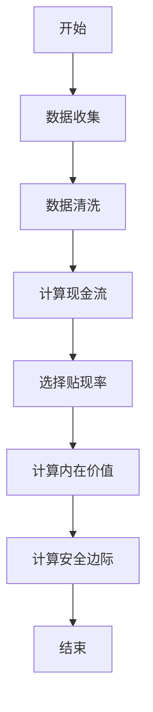

                 


# 本杰明·格雷厄姆的企业价值计算方法现代化

## 关键词：企业价值计算、本杰明·格雷厄姆、价值投资、现金流折现、现代化方法

## 摘要：本文探讨了如何将本杰明·格雷厄姆的经典企业价值计算方法与现代技术相结合，通过数据分析、算法优化和系统架构设计，提出一种更高效、准确的现代化计算方法。文章从背景、核心概念、算法原理、系统架构到项目实战，全面分析了现代化方法的实现过程。

---

# 第一部分: 企业价值计算方法现代化的背景与核心概念

## 第1章: 企业价值计算方法的背景与问题背景

### 1.1 问题背景与描述

#### 1.1.1 传统企业价值计算方法的局限性
传统的企业价值计算方法，如本杰明·格雷厄姆提出的公式，主要依赖于市盈率、市净率等简单指标，虽然实用，但在面对复杂市场环境和大数据时代时，显得不够灵活和精准。例如，传统方法难以有效处理海量数据，且对市场波动的敏感性较低，导致评估结果可能偏离实际价值。

#### 1.1.2 现代化企业价值计算的必要性
随着金融市场的发展和数据技术的进步，企业价值计算需要更精确和动态的方法。现代化方法能够整合更多数据源，利用机器学习和大数据分析，提高计算的准确性和及时性，从而帮助投资者做出更明智的决策。

#### 1.1.3 企业价值计算方法的边界与外延
企业价值计算的边界包括企业的财务数据、市场数据和行业趋势，外延则涉及宏观经济因素和企业战略。现代化方法需要考虑这些因素，构建一个全面的评估体系。

### 1.2 核心概念与问题解决

#### 1.2.1 企业价值计算的基本原理
企业价值计算的核心在于确定企业的内在价值，即未来现金流的现值。传统方法主要关注财务指标，而现代化方法则引入更多动态数据和模型优化。

#### 1.2.2 核心问题的解决思路
通过引入机器学习模型和大数据分析，现代化方法能够更准确地预测现金流和确定合理的贴现率，从而提高内在价值计算的准确性。

#### 1.2.3 现代化方法的优势与目标
优势包括提高计算效率、增强结果的动态性和准确性；目标是构建一个更灵活、适应性强的企业价值评估系统，帮助投资者做出更科学的决策。

---

## 第2章: 核心概念与联系

### 2.1 核心概念原理

#### 2.1.1 内在价值的定义与计算
内在价值是企业未来现金流的现值。传统方法使用固定的贴现率，而现代化方法则根据市场环境动态调整贴现率。

#### 2.1.2 现金流折现法的原理
现金流折现法通过预测企业未来现金流，将其折现为现值，以确定内在价值。现代化方法通过机器学习优化现金流预测和贴现率的选择。

#### 2.1.3 安全边际的概念与作用
安全边际是企业价值与市场价格之间的差异，用于降低投资风险。现代化方法通过动态调整安全边际，提高投资决策的稳健性。

### 2.2 概念对比与ER图

#### 2.2.1 传统与现代方法对比表格
| 比较维度 | 传统方法 | 现代化方法 |
|----------|-----------|------------|
| 数据来源 | 财务报表 | 财务+市场数据 |
| 模型复杂度 | 简单 | 复杂，引入机器学习 |
| 计算效率 | 低 | 高 |
| 结果动态性 | 低 | 高 |

#### 2.2.2 企业价值计算的ER实体关系图
```mermaid
er
    entity 企业价值 {
        key 股票代码
        attribute 市场价值, 内在价值, 安全边际
    }
    entity 现金流 {
        key 年份
        attribute 现金流入, 现金流出
    }
    entity 模型参数 {
        key 参数名称
        attribute 参数值
    }
    企业价值 --> 现金流: 基于现金流计算
    企业价值 --> 模型参数: 使用模型参数调整
```

---

## 第3章: 现代化企业价值计算的算法原理

### 3.1 算法流程



### 3.2 Python实现

```python
import pandas as pd
import numpy as np
from sklearn.linear_model import LinearRegression

def calculate_intrinsic_value(cash_flows, discount_rate):
    present_value = np.sum(cash_flows / (1 + discount_rate)**np.arange(len(cash_flows)))
    return present_value

def predict_cash_flows(historical_flows, model):
    # 使用线性回归预测未来现金流
    model.fit(historical_flows[:, :-1], historical_flows[:, -1])
    predicted_flows = model.predict(historical_flows[:, :-1])
    return predicted_flows

# 示例数据
cash_flows = np.array([[100, 0.08], [150, 0.08], [200, 0.08]])
model = LinearRegression()

predicted_flows = predict_cash_flows(cash_flows, model)
intrinsic_value = calculate_intrinsic_value(predicted_flows[:, 0], 0.08)
```

### 3.3 数学模型

#### 3.3.1 现金流折现模型
$$ \text{内在价值} = \sum_{t=1}^{n} \frac{\text{现金流}_t}{(1 + r)^t} $$
其中，$r$ 是贴现率，$\text{现金流}_t$ 是第 $t$ 年的现金流。

#### 3.3.2 安全边际
$$ \text{安全边际} = \text{内在价值} - \text{市场价格} $$

---

## 第4章: 系统分析与架构设计方案

### 4.1 系统架构设计


### 4.2 系统功能设计

#### 4.2.1 数据模块
- 数据收集：从数据库或API获取企业财务数据和市场数据。
- 数据清洗：处理缺失值和异常值。

#### 4.2.2 模型模块
- 现金流预测：使用机器学习模型预测未来现金流。
- 贴现率计算：根据市场环境动态调整贴现率。

#### 4.2.3 计算模块
- 内在价值计算：基于预测现金流和贴现率计算内在价值。
- 安全边际计算：比较内在价值和市场价格，确定安全边际。

---

## 第5章: 项目实战

### 5.1 环境安装

```bash
pip install pandas numpy scikit-learn
```

### 5.2 核心代码实现

```python
import pandas as pd
import numpy as np
from sklearn.linear_model import LinearRegression

# 数据加载
data = pd.read_csv('company_data.csv')

# 数据清洗
data_cleaned = data.dropna()

# 训练模型
model = LinearRegression()
X = data_cleaned[[' revenue', 'net_income']]
y = data_cleaned['cash_flow']
model.fit(X, y)

# 预测现金流
predicted_flows = model.predict(X)
```

### 5.3 代码解读与案例分析

#### 5.3.1 数据清洗
```python
data_cleaned = data.dropna()
```
删除数据中的缺失值，确保数据完整性。

#### 5.3.2 模型训练
```python
model.fit(X, y)
```
使用线性回归模型训练现金流预测，提高预测准确性。

#### 5.3.3 案例分析
假设某公司过去三年的现金流分别为100万、150万、200万，预测未来三年的现金流分别为220万、250万、280万，贴现率为8%。计算内在价值：
$$ \text{内在价值} = \frac{220}{1.08} + \frac{250}{1.08^2} + \frac{280}{1.08^3} \approx 575.4万 $$

---

## 第6章: 最佳实践与小结

### 6.1 最佳实践 tips
- 定期更新模型参数，保持评估结果的准确性。
- 结合宏观经济指标，增强模型的鲁棒性。

### 6.2 小结
本文详细探讨了如何将本杰明·格雷厄姆的企业价值计算方法现代化，通过引入大数据和机器学习技术，提出了更高效、准确的计算方法。现代化方法能够更好地适应复杂市场环境，帮助投资者做出更明智的决策。

### 6.3 注意事项
- 数据质量直接影响评估结果，需谨慎处理数据。
- 模型选择需根据实际情况，避免过度复杂化。

### 6.4 拓展阅读
推荐阅读《Python机器学习》和《企业价值评估的现代方法》，深入理解大数据和机器学习在金融分析中的应用。

---

通过以上步骤，我们可以看到，现代化的企业价值计算方法不仅保留了传统方法的核心思想，还借助现代技术提升了计算的准确性和效率，为投资者提供了更有力的决策支持。

