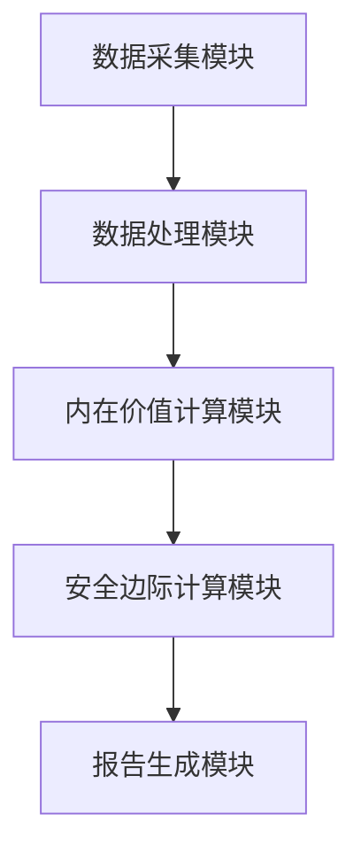

                 


# 本杰明·格雷厄姆的工作资本分析技巧

## 关键词：本杰明·格雷厄姆，工作资本分析，价值投资，安全边际，内在价值，投资决策

## 摘要：  
本杰明·格雷厄姆是价值投资领域的先驱，他的工作资本分析技巧为投资者提供了评估企业内在价值和制定投资决策的重要方法。本文详细探讨了格雷厄姆的工作资本分析的核心概念、分析技巧、系统架构、数学模型以及实际应用案例，帮助读者深入了解并掌握这一经典的投资分析方法。

---

## 第一章: 本杰明·格雷厄姆与工作资本分析的背景

### 1.1 本杰明·格雷厄姆的生平简介  
本杰明·格雷厄姆（Benjamin Graham）是20世纪最著名的价值投资者之一，被誉为“价值投资之父”。他于1894年出生在美国纽约，早年通过自学掌握了许多金融知识。他在1924年出版的《证券分析》一书中首次系统地提出了价值投资的理念，并在实践中取得了巨大的成功。

#### 1.1.1 本杰明·格雷厄姆的早年经历  
格雷厄姆在青少年时期对股票投资产生了浓厚的兴趣，并通过研究股票市场开始了自己的投资生涯。他在哥伦比亚大学获得了经济学学士学位，并在毕业后进入华尔街工作，逐渐积累了丰富的投资经验。

#### 1.1.2 格雷厄姆的投资理念形成  
在早期的投资实践中，格雷厄姆意识到市场波动对企业价值的影响。他认为，股票价格的波动并不完全反映企业的实际价值，而是在短期内受到市场情绪的影响。因此，他提出了以企业内在价值为核心的投资理念。

#### 1.1.3 格雷厄姆对价值投资的贡献  
格雷厄姆是价值投资的奠基人，他提出的“安全边际”和“内在价值”概念为后来的价值投资理论奠定了基础。他的思想影响了包括沃伦·巴菲特在内的众多投资者。

### 1.2 工作资本分析的背景与意义  
工作资本分析是格雷厄姆投资体系中的重要组成部分，它通过对企业财务状况的深入分析，评估企业的内在价值和投资潜力。

#### 1.2.1 工作资本的定义与作用  
工作资本（Working Capital）是指企业在日常经营活动中所需的流动资金，包括现金、应收账款、存货等流动资产减去流动负债的部分。工作资本的健康状况直接关系到企业的运营能力和抗风险能力。

#### 1.2.2 工作资本分析在投资决策中的作用  
通过分析企业的流动资产和流动负债，工作资本分析能够帮助投资者评估企业的短期偿债能力和财务健康状况，从而做出更明智的投资决策。

#### 1.2.3 格雷厄姆工作资本分析的独特性  
格雷厄姆的工作资本分析不仅关注企业的财务数据，还强调对企业未来现金流的预测和内在价值的评估。这种方法使得投资者能够更好地识别被低估的企业，从而获得长期稳定的收益。

---

## 第二章: 工作资本分析的核心概念

### 2.1 工作资本的定义与构成  
工作资本是企业在日常经营活动中所需的流动资金，其构成主要包括流动资产和流动负债。

#### 2.1.1 工作资本的定义  
工作资本=流动资产-流动负债

#### 2.1.2 工作资本的构成要素  
- 流动资产：包括现金、应收账款、存货等。  
- 流动负债：包括应付账款、短期借款等。  

#### 2.1.3 工作资本与企业价值的关系  
工作资本是企业维持日常运营的重要基础，充足的流动资金能够确保企业顺利开展业务并应对突发情况。

### 2.2 格雷厄姆工作资本分析的原理  
格雷厄姆的工作资本分析基于对企业财务状况的深入研究，通过计算内在价值和安全边际来评估投资标的的价值。

#### 2.2.1 内在价值的计算方法  
内在价值=企业未来现金流的现值  
$$ V = \sum_{t=1}^{n} \frac{CF_t}{(1+r)^t} $$  
其中，CF_t是第t年的现金流，r是折现率。

#### 2.2.2 格雷厄姆公式  
格雷厄姆提出了著名的公式：  
$$ 内在价值 = \frac{净利润 \times 市盈率}{增长系数} $$  
这一公式可以帮助投资者估算企业的内在价值。

#### 2.2.3 安全边际的计算  
安全边际=内在价值 - 市场价格  
安全边际的存在意味着企业的股票价格低于其实际价值，为投资者提供了较高的安全性和潜在的收益空间。

### 2.3 格雷厄姆工作资本分析的步骤  
1. 收集企业的财务数据。  
2. 计算企业的内在价值。  
3. 评估企业的安全边际。  
4. 做出投资决策。

---

## 第三章: 格雷厄姆工作资本分析的技巧

### 3.1 计算企业的内在价值  
内在价值的计算是格雷厄姆工作资本分析的核心内容之一。

#### 3.1.1 净利润与市盈率的关系  
市盈率（P/E）=股价/每股净利润  
通过分析市盈率，投资者可以评估企业的估值是否合理。

#### 3.1.2 格雷厄姆公式在实际中的应用  
以某公司为例，假设其净利润为1000万元，市盈率为15，增长系数为8%。  
$$ V = \frac{1000 \times 15}{0.08} = 18750万元 $$  
这表明该公司的内在价值为18750万元，若市场价格低于此值，则具有投资价值。

### 3.2 评估安全边际  
安全边际的评估可以帮助投资者识别低估的股票。

#### 3.2.1 安全边际的计算公式  
$$ 安全边际 = 内在价值 - 市场价格 $$  
如果安全边际为正，说明股票价格被低估，值得买入。

#### 3.2.2 安全边际的意义  
安全边际的存在为投资者提供了风险缓冲，能够在市场波动中保护资本不受损失。

### 3.3 识别投资机会  
通过分析企业的内在价值和安全边际，投资者可以识别出具有投资价值的标的。

#### 3.3.1 选择低估企业  
寻找市场价格低于内在价值的企业，这些企业具有长期增值的潜力。

#### 3.3.2 评估企业的财务健康状况  
通过分析企业的流动资产和流动负债，评估其短期偿债能力和财务健康状况。

### 3.4 管理投资风险  
格雷厄姆强调分散投资的重要性，以降低整体投资组合的风险。

#### 3.4.1 分散投资  
通过投资于多个行业和不同规模的企业，降低特定行业或企业的风险。

#### 3.4.2 定期评估  
定期重新评估投资组合的内在价值和安全边际，根据市场变化调整投资策略。

---

## 第四章: 格雷厄姆工作资本分析的系统架构

### 4.1 系统设计  
为了实现格雷厄姆工作资本分析的自动化，可以设计一个基于Python的分析系统。

#### 4.1.1 系统功能模块  
- 数据采集模块：从财务报表中提取流动资产和流动负债数据。  
- 内在价值计算模块：根据公式计算企业的内在价值。  
- 安全边际计算模块：计算安全边际并生成报告。  

#### 4.1.2 系统架构图  


### 4.2 接口设计  
系统需要与财务数据源对接，获取企业的财务数据。

#### 4.2.1 数据接口  
- 输入接口：接受企业的财务数据，包括流动资产和流动负债。  
- 输出接口：输出内在价值和安全边际的计算结果。  

#### 4.2.2 接口交互流程  
1. 数据采集模块接收企业的财务数据。  
2. 数据处理模块对数据进行清洗和转换。  
3. 内在价值计算模块根据公式计算内在价值。  
4. 安全边际计算模块计算安全边际并生成报告。  

---

## 第五章: 数学模型与公式

### 5.1 内在价值的数学模型  
$$ V = \sum_{t=1}^{n} \frac{CF_t}{(1+r)^t} $$  
其中，CF_t是第t年的现金流，r是折现率。

### 5.2 安全边际的计算公式  
$$ 安全边际 = 内在价值 - 市场价格 $$  

### 5.3 格雷厄姆公式的应用  
$$ 内在价值 = \frac{净利润 \times 市盈率}{增长系数} $$  

---

## 第六章: 项目实战

### 6.1 环境安装  
需要安装Python和相关库，如pandas、numpy等。

### 6.2 核心代码实现  
```python
def calculate_intrinsic_value(net_profit, pe_ratio, growth_factor):
    return (net_profit * pe_ratio) / growth_factor

def calculate_margin_of_safety(intrinsic_value, market_price):
    return intrinsic_value - market_price
```

### 6.3 案例分析  
以某公司为例，计算其内在价值和安全边际。

---

## 第七章: 最佳实践

### 7.1 小结  
格雷厄姆的工作资本分析方法为投资者提供了科学的投资决策依据。

### 7.2 注意事项  
- 选择低估企业时，需结合企业的财务状况和行业前景。  
- 安全边际的计算需基于合理的折现率和增长系数。  

### 7.3 拓展阅读  
推荐阅读格雷厄姆的《证券分析》和《聪明的投资者》，深入理解价值投资的理念和方法。

---

## 总结  
本杰明·格雷厄姆的工作资本分析技巧为投资者提供了评估企业内在价值和制定投资决策的重要方法。通过系统的分析和实战案例，读者可以更好地理解和应用这一经典的投资分析方法。

