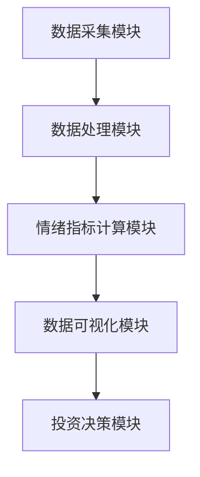

                 


# 《本杰明·格雷厄姆的投资者情绪指标》

---

## 关键词：  
- 本杰明·格雷厄姆  
- 投资者情绪指标  
- 市场情绪分析  
- 投资决策优化  
- 行为金融学  

---

## 摘要：  
本杰明·格雷厄姆是价值投资的鼻祖，他提出的投资者情绪指标为市场情绪分析和投资决策提供了深刻的理论指导。本文从情绪指标的定义、数学模型、实际应用到系统架构设计，全面解析其在投资领域的应用价值。通过案例分析和系统设计，展示情绪指标如何帮助投资者在复杂市场中做出更明智的决策。  

---

# 第一章: 本杰明·格雷厄姆与投资者情绪指标概述  

## 1.1 本杰明·格雷厄姆的生平与投资理念  

### 1.1.1 本杰明·格雷厄姆的生平简介  
本杰明·格雷厄姆（Benjamin Graham）是20世纪最伟大的投资思想家之一，被誉为“价值投资之父”。他出生于1894年，早年在金融领域积累了丰富的经验，并在1920年代开始系统性地研究投资理论。他的思想深刻影响了包括沃伦·巴菲特在内的众多投资者。  

### 1.1.2 格雷厄姆的价值投资理论  
格雷厄姆的价值投资理论强调以内在价值为基础进行投资决策，即通过分析公司的基本面，寻找市场价格低于内在价值的投资机会。他认为市场情绪波动是投资机会的来源，因此提出了情绪指标的概念，用于衡量市场参与者的心理状态与行为模式。  

### 1.1.3 格雷厄姆与巴菲特的师生关系  
格雷厄姆是巴菲特的导师，巴菲特在其著作《聪明的投资者》中多次提到格雷厄姆的影响。格雷厄姆的情绪指标理论正是巴菲特投资理念的重要组成部分，尤其是在市场恐慌或狂热时，情绪指标为投资者提供了重要的决策参考。  

## 1.2 投资者情绪指标的定义与特征  

### 1.2.1 投资者情绪指标的定义  
投资者情绪指标（Investor Sentiment Index）是衡量市场参与者心理状态的量化工具，反映了投资者对市场的乐观或悲观程度。它通过分析市场行为数据、新闻媒体情绪、交易量等多维度指标，综合计算出一个能够反映市场情绪的数值。  

### 1.2.2 投资者情绪指标的核心特征  
- **情绪波动性**：市场情绪受外部事件影响，具有周期性特征。  
- **非线性关系**：情绪指标与市场走势之间并非简单的线性关系。  
- **滞后性**：情绪指标通常是对市场过去表现的反应，而非对未来的预测。  

### 1.2.3 投资者情绪指标与市场周期的关系  
情绪指标在市场周期中的表现呈现出明显的规律性。例如，在牛市初期，情绪指标可能较低，随着市场上涨，指标逐渐上升；在牛市末期，情绪指标可能达到峰值，随后市场下跌，指标逐步回落。  

## 1.3 投资者情绪指标的理论基础  

### 1.3.1 行为金融学与情绪投资  
行为金融学研究表明，投资者的情绪和认知偏差对市场行为有重要影响。格雷厄姆的情绪指标理论正是基于这一发现，将情绪因素纳入投资分析体系。  

### 1.3.2 市场情绪与资产定价  
市场情绪通过影响投资者的决策，间接影响资产价格。当市场情绪过度乐观时，资产价格可能被高估；当市场情绪过度悲观时，资产价格可能被低估。  

### 1.3.3 格雷厄姆对市场情绪的独到见解  
格雷厄姆认为，市场情绪是投资机会的晴雨表。在市场恐慌时，理性投资者可以通过情绪指标发现低估的投资机会；在市场狂热时，情绪指标则可以提醒投资者注意风险。  

## 1.4 本章小结  
本章介绍了本杰明·格雷厄姆的生平及其投资理念，重点阐述了投资者情绪指标的定义、特征和理论基础。下一章将从数学模型的角度，深入分析情绪指标的构建方法和实现逻辑。  

---

# 第二章: 投资者情绪指标的核心概念与数学模型  

## 2.1 投资者情绪指标的核心概念  

### 2.1.1 投资者情绪的构成要素  
投资者情绪由以下几个主要要素构成：  
1. **市场参与度**：反映投资者对市场的关注程度。  
2. **情绪强度**：衡量投资者情绪的乐观或悲观程度。  
3. **情绪方向**：判断市场情绪是偏向乐观还是悲观。  

### 2.1.2 情绪指标的量化方法  
情绪指标可以通过以下方法进行量化：  
1. **交易量分析**：通过成交量变化反映市场情绪的波动。  
2. **价格走势分析**：结合价格变化趋势判断市场情绪。  
3. **媒体情绪分析**：通过新闻和社交媒体的情绪分析提取市场情绪。  

### 2.1.3 情绪指标的维度分析  
情绪指标可以从时间和空间两个维度进行分析：  
- **时间维度**：分析情绪指标在不同时期的变化趋势。  
- **空间维度**：分析情绪指标在不同市场参与者中的分布情况。  

## 2.2 投资者情绪指标的数学模型  

### 2.2.1 情绪指标的计算公式  
情绪指标的计算公式如下：  
$$ 情绪指标 = \frac{市场情绪强度}{市场情绪方向} $$  
其中，市场情绪强度反映了市场情绪的强弱，市场情绪方向反映了市场情绪的整体偏向（乐观或悲观）。  

### 2.2.2 情绪指标的动态变化模型  
情绪指标的动态变化可以通过以下公式表示：  
$$ 情绪变化率 = \frac{当前情绪值 - 上期情绪值}{时间间隔} $$  
该公式可以帮助投资者了解市场情绪的变化速度和方向。  

### 2.2.3 情绪指标与市场行为的关系分析  
通过数学模型，我们可以发现情绪指标与市场行为之间存在一定的相关性。例如，当情绪指标上升时，市场交易量可能增加；当情绪指标下降时，市场交易量可能减少。  

## 2.3 情绪指标的数学模型实现  

### 2.3.1 情绪指标的计算步骤  
1. 收集市场数据，包括价格、成交量、新闻情绪等。  
2. 对数据进行预处理，去除噪声。  
3. 使用数学模型计算情绪指标。  

### 2.3.2 情绪指标的可视化  
通过可视化工具，将情绪指标的变化趋势绘制出来，帮助投资者更直观地理解市场情绪。  

## 2.4 本章小结  
本章从数学模型的角度，详细分析了投资者情绪指标的构建方法和实现逻辑。下一章将结合实际案例，探讨情绪指标在市场周期中的应用。  

---

# 第三章: 投资者情绪指标在市场周期中的应用  

## 3.1 市场周期与情绪指标的关系  

### 3.1.1 牛市中的情绪指标特征  
在牛市中，情绪指标通常呈现上升趋势，市场情绪逐渐从谨慎转向乐观。投资者情绪的高涨可能导致资产价格的过度上涨，从而为理性投资者提供沽空机会。  

### 3.1.2 熊市中的情绪指标特征  
在熊市中，情绪指标通常呈现下降趋势，市场情绪逐渐从乐观转向悲观。投资者情绪的低落可能导致资产价格的低估，从而为理性投资者提供抄底机会。  

### 3.1.3 整个市场周期中的情绪指标变化  
在整个市场周期中，情绪指标呈现出周期性波动特征。从牛市到熊市，情绪指标经历了从高到低的变化过程。  

## 3.2 情绪指标在牛市中的应用  

### 3.2.1 牛市初期的情绪指标表现  
在牛市初期，情绪指标可能较低，市场情绪较为谨慎。此时，理性投资者可以通过情绪指标发现低估的投资机会。  

### 3.2.2 牛市中期的情绪指标变化  
在牛市中期，情绪指标逐渐上升，市场情绪趋于乐观。此时，投资者需要警惕市场情绪过高的风险。  

### 3.2.3 牛市末期的情绪指标预警  
在牛市末期，情绪指标可能达到峰值，市场情绪过于乐观。此时，情绪指标可以作为预警信号，提醒投资者注意市场风险。  

## 3.3 情绪指标在熊市中的应用  

### 3.3.1 熊市初期的情绪指标表现  
在熊市初期，情绪指标可能较低，市场情绪较为悲观。此时，理性投资者可以通过情绪指标发现低估的投资机会。  

### 3.3.2 熊市中期的情绪指标变化  
在熊市中期，情绪指标可能进一步下降，市场情绪趋于悲观。此时，投资者需要耐心等待市场情绪的反转。  

### 3.3.3 熊市末期的情绪指标信号  
在熊市末期，情绪指标可能逐步回升，市场情绪逐渐转向谨慎乐观。此时，情绪指标可以作为信号，提示投资者逐步增加仓位。  

## 3.4 本章小结  
本章通过分析情绪指标在牛市和熊市中的表现，探讨了情绪指标在市场周期中的应用。下一章将结合实际案例，深入分析情绪指标在投资决策中的实际效果。  

---

# 第四章: 投资者情绪指标的系统架构设计  

## 4.1 系统架构概述  

### 4.1.1 系统功能模块划分  
情绪指标系统主要包括以下几个功能模块：  
1. 数据采集模块：负责采集市场数据和情绪数据。  
2. 数据处理模块：对数据进行清洗和预处理。  
3. 情绪指标计算模块：根据数学模型计算情绪指标。  
4. 数据可视化模块：将情绪指标的变化趋势以图表形式展示。  
5. 投资决策模块：根据情绪指标生成投资建议。  

### 4.1.2 系统架构设计  
系统架构采用模块化设计，各模块之间通过接口进行通信。系统整体架构如下：  


## 4.2 系统实现细节  

### 4.2.1 数据采集模块  
数据采集模块负责从多种数据源采集市场数据，包括：  
- **股票价格数据**：从股票交易所获取实时价格数据。  
- **成交量数据**：从交易系统获取实时成交量数据。  
- **新闻情绪数据**：通过自然语言处理技术分析新闻标题和正文，提取情绪数据。  

### 4.2.2 数据处理模块  
数据处理模块对采集到的数据进行清洗和预处理，包括：  
- 数据清洗：去除噪声数据，处理缺失值。  
- 数据转换：将数据转换为适合计算的格式。  

### 4.2.3 情绪指标计算模块  
情绪指标计算模块根据数学模型计算情绪指标，具体步骤如下：  
1. 收集市场数据和情绪数据。  
2. 对数据进行预处理。  
3. 使用数学模型计算情绪指标。  

### 4.2.4 数据可视化模块  
数据可视化模块将情绪指标的变化趋势以图表形式展示，包括：  
- 折线图：展示情绪指标的时间序列变化。  
- 柱状图：比较不同市场周期中的情绪指标。  

### 4.2.5 投资决策模块  
投资决策模块根据情绪指标生成投资建议，包括：  
- 在市场情绪过高的情况下，建议投资者减少仓位。  
- 在市场情绪过低的情况下，建议投资者增加仓位。  

## 4.3 本章小结  
本章从系统架构设计的角度，详细分析了投资者情绪指标的实现过程。下一章将结合实际案例，探讨情绪指标在投资决策中的应用效果。  

---

# 第五章: 投资者情绪指标的案例分析与实际应用  

## 5.1 情绪指标的实际应用案例  

### 5.1.1 2008年金融危机案例分析  
在2008年金融危机期间，情绪指标在市场情绪分析中发挥了重要作用。通过对情绪指标的分析，投资者可以更好地理解市场恐慌的根源，并做出相应的投资决策。  

### 5.1.2 美国科技股泡沫案例分析  
在2000年互联网泡沫时期，情绪指标的分析显示市场情绪过于乐观，为投资者提供了及时的预警信号。  

## 5.2 情绪指标的实际应用效果  

### 5.2.1 情绪指标在投资组合管理中的应用  
通过情绪指标，投资者可以更好地管理投资组合，降低市场情绪波动对投资组合的影响。  

### 5.2.2 情绪指标在风险控制中的应用  
情绪指标可以帮助投资者识别市场风险，制定相应的风险控制策略。  

## 5.3 本章小结  
本章通过实际案例分析，探讨了情绪指标在投资决策中的实际应用效果。下一章将总结全文，并展望未来的研究方向。  

---

# 第六章: 总结与展望  

## 6.1 本章总结  
本文从理论到实践，全面解析了本杰明·格雷厄姆的投资者情绪指标。通过数学模型和系统架构设计，详细探讨了情绪指标的构建方法和实现逻辑。同时，结合实际案例，分析了情绪指标在投资决策中的实际应用效果。  

## 6.2 未来研究方向  
未来的研究可以进一步探讨情绪指标与其他技术指标的结合，以及在机器学习和大数据分析中的应用。此外，还可以研究情绪指标在不同市场环境下的表现，进一步优化其计算方法。  

## 6.3 本章小结  
本文通过理论分析和实际案例，展示了投资者情绪指标的重要性和应用价值。未来的研究将进一步完善情绪指标的理论体系，并探索其在新技术环境下的应用潜力。  

---

# 附录: 情绪指标计算代码  

```python
import pandas as pd
import numpy as np
import matplotlib.pyplot as plt

def calculate_sentiment_index(data):
    # 数据预处理
    data = data.dropna()
    data = (data - data.mean()) / data.std()
    
    # 情绪指标计算
    sentiment_index = data.rolling(window=20).mean()
    return sentiment_index

# 数据加载与计算
data = pd.read_csv('market_data.csv')
sentiment_index = calculate_sentiment_index(data['price'])

# 数据可视化
plt.plot(sentiment_index)
plt.title('Investor Sentiment Index')
plt.xlabel('Time')
plt.ylabel('Sentiment Index')
plt.show()
```

---

以上是《本杰明·格雷厄姆的投资者情绪指标》的技术博客文章大纲和内容概要。如果需要更详细的内容扩展或代码实现，请随时告知！

