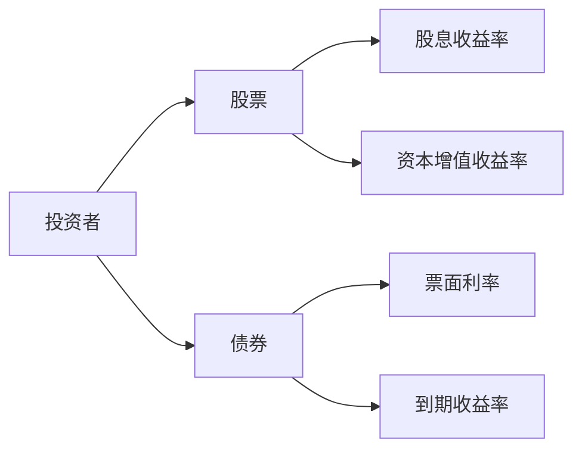

                 


# 本杰明·格雷厄姆的股债收益率比较分析

> 关键词：股债收益率，投资策略，本杰明·格雷厄姆，股票收益率，债券收益率，资产配置，风险管理

> 摘要：本文从本杰明·格雷厄姆的投资理念出发，系统地分析了股票和债券收益率的计算方法、比较方法及其在资产配置中的应用。通过详细的数学公式、算法原理和实际案例分析，帮助投资者更好地理解股债收益率的差异和优劣，从而做出更明智的投资决策。

---

# 第1章: 股债收益率比较分析的背景介绍

## 1.1 股债收益率的基本概念

### 1.1.1 股票收益率的定义与计算公式
股票收益率是指投资者持有股票期间获得的收益与初始投资的比率。常用的股票收益率计算公式包括：

$$
\text{股息收益率} = \frac{\text{每股股息}}{\text{股价}} \times 100\%
$$

$$
\text{资本增值收益率} = \frac{\text{最终股价} - \text{初始股价}}{\text{初始股价}} \times 100\%
$$

### 1.1.2 债券收益率的定义与计算公式
债券收益率是指债券票面利率与其市场价格的比率。常用的债券收益率计算公式包括：

$$
\text{票面利率} = \frac{\text{债券票面价值} \times \text{票面利率}}{100}
$$

$$
\text{到期收益率} = \left( \frac{\text{面值} - \text{购买价格} + \text{利息}}{\text{购买价格}} \right) \times \left( \frac{1}{\text{期限}} \right) \times 100\%
$$

### 1.1.3 股债收益率比较的必要性
通过比较股票和债券的收益率，投资者可以更好地理解不同资产的风险和收益特征，从而制定合理的资产配置策略。

## 1.2 股债收益率比较的历史背景

### 1.2.1 本杰明·格雷厄姆的投资理念
本杰明·格雷厄姆是价值投资的鼻祖，他强调以低于内在价值的价格购买股票，并注重安全边际。他的投资理念为股债收益率比较分析提供了理论基础。

### 1.2.2 股债收益率比较的理论基础
格雷厄姆认为，股票和债券的收益率可以通过比较它们的内在价值和市场价格来评估。这种比较有助于投资者识别低估的资产。

### 1.2.3 现代金融市场的股债收益率分析
在现代金融市场中，股债收益率比较分析已经成为资产配置的重要工具。通过比较股票和债券的收益率，投资者可以更好地分散风险并优化收益。

## 1.3 股债收益率比较的重要性

### 1.3.1 投资者如何通过股债收益率进行决策
投资者可以通过比较股票和债券的收益率，选择收益更高、风险更可控的资产。

### 1.3.2 股债收益率比较对风险管理的意义
股债收益率比较可以帮助投资者识别市场的波动风险，并在不同资产之间进行动态调整。

### 1.3.3 股债收益率比较对资产配置的影响
通过股债收益率的比较，投资者可以优化资产配置，降低整体投资组合的风险，同时提高收益。

---

# 第2章: 股债收益率的核心概念与联系

## 2.1 股票收益率的计算与分析

### 2.1.1 股票收益率的计算公式
股票收益率可以通过股息收益率和资本增值收益率来衡量。公式如下：

$$
\text{股息收益率} = \frac{\text{每股股息}}{\text{股价}} \times 100\%
$$

$$
\text{资本增值收益率} = \frac{\text{最终股价} - \text{初始股价}}{\text{初始股价}} \times 100\%
$$

### 2.1.2 股票收益率的类型与特点
股票收益率分为股息收益率和资本增值收益率。股息收益率反映股票的分红能力，资本增值收益率反映股票的增值潜力。

### 2.1.3 股票收益率与股价波动的关系
股票收益率与股价波动密切相关。高收益率的股票通常伴随着较高的波动性。

## 2.2 债券收益率的计算与分析

### 2.2.1 债券收益率的计算公式
债券收益率包括票面利率和到期收益率。公式如下：

$$
\text{票面利率} = \frac{\text{债券票面价值} \times \text{票面利率}}{100}
$$

$$
\text{到期收益率} = \left( \frac{\text{面值} - \text{购买价格} + \text{利息}}{\text{购买价格}} \right) \times \left( \frac{1}{\text{期限}} \right) \times 100\%
$$

### 2.2.2 债券收益率的类型与特点
债券收益率包括票面利率和到期收益率。票面利率是债券的票面收益，到期收益率是债券的预期总收益。

### 2.2.3 债券收益率与债券价格的关系
债券收益率与债券价格呈负相关关系。当债券价格上升时，收益率下降，反之亦然。

## 2.3 股债收益率的比较与联系

### 2.3.1 股票与债券收益率的对比分析
通过比较股票和债券的收益率，投资者可以评估不同资产的风险和收益。

### 2.3.2 股票与债券收益率的相互影响
股票和债券收益率的波动通常呈负相关关系，这为投资者提供了分散风险的机会。

### 2.3.3 股债收益率比较的综合评价模型
通过综合股息收益率、资本增值收益率和债券到期收益率，可以构建一个股债收益率比较的综合评价模型。

## 2.4 股债收益率比较的属性特征对比表格

| 属性          | 股票收益率         | 债券收益率         |
|---------------|------------------|------------------|
| 计算方式       | 股息收益率 + 资本增值收益率 | 票面利率 + 到期收益率 |
| 风险           | 较高              | 较低              |
| 收益稳定性      | 不稳定            | 较稳定            |
| 投资期限       | 中长期            | 中短期            |
| 影响因素       | 公司盈利、市场情绪 | 利率水平、信用风险 |

## 2.5 股债收益率比较的ER实体关系图



---

# 第3章: 股债收益率比较的算法原理

## 3.1 股票与债券收益率的计算算法

### 3.1.1 股票收益率的计算算法
股票收益率的计算算法如下：

1. 收集股票的历史价格数据。
2. 计算股息收益率和资本增值收益率。
3. 对比不同股票的收益率，选择收益更高的股票。

### 3.1.2 债券收益率的计算算法
债券收益率的计算算法如下：

1. 收集债券的面值、票面利率和市场价格。
2. 计算债券的票面利率和到期收益率。
3. 对比不同债券的收益率，选择收益更高的债券。

## 3.2 股债收益率比较的算法流程图


## 3.3 股债收益率比较的数学模型

### 3.3.1 股票收益率的数学模型
$$
\text{股息收益率} = \frac{\text{每股股息}}{\text{股价}} \times 100\%
$$

$$
\text{资本增值收益率} = \frac{\text{最终股价} - \text{初始股价}}{\text{初始股价}} \times 100\%
$$

### 3.3.2 债券收益率的数学模型
$$
\text{票面利率} = \frac{\text{债券票面价值} \times \text{票面利率}}{100}
$$

$$
\text{到期收益率} = \left( \frac{\text{面值} - \text{购买价格} + \text{利息}}{\text{购买价格}} \right) \times \left( \frac{1}{\text{期限}} \right) \times 100\%
$$

---

# 第4章: 股债收益率比较的系统分析与架构设计

## 4.1 系统功能设计

### 4.1.1 需求分析
系统需要实现股票和债券收益率的计算、比较和可视化功能。

### 4.1.2 系统功能模块
1. 数据输入模块
2. 收益率计算模块
3. 比较分析模块
4. 可视化展示模块

## 4.2 系统架构设计


## 4.3 系统接口设计
系统接口设计包括数据输入接口、计算接口和可视化接口。

## 4.4 系统交互流程图


---

# 第5章: 股债收益率比较的项目实战

## 5.1 项目环境安装

### 5.1.1 安装Python环境
使用Anaconda或PyCharm安装Python环境。

### 5.1.2 安装依赖库
安装pandas、numpy、matplotlib等依赖库。

## 5.2 系统核心实现源代码

```python
import pandas as pd
import numpy as np
import matplotlib.pyplot as plt

# 股票收益率计算
def stock_yield(price, dividend):
    return dividend / price * 100

# 债券收益率计算
def bond_yield(face_value, coupon_rate, price, years):
    return ((face_value - price) / price + (face_value * coupon_rate / 100)) / years * 100

# 示例数据
stock_price = 100
stock_dividend = 5
bond_face_value = 1000
bond_coupon_rate = 5
bond_price = 950
bond_years = 5

# 计算收益率
stock_yield_value = stock_yield(stock_price, stock_dividend)
bond_yield_value = bond_yield(bond_face_value, bond_coupon_rate, bond_price, bond_years)

print("股票收益率:", stock_yield_value)
print("债券收益率:", bond_yield_value)

# 可视化
plt.bar(['股票', '债券'], [stock_yield_value, bond_yield_value])
plt.title('股债收益率比较')
plt.ylabel('收益率 (%)')
plt.show()
```

## 5.3 代码应用解读与分析
上述代码展示了如何计算股票和债券的收益率，并通过柱状图进行可视化比较。

## 5.4 实际案例分析

### 5.4.1 案例背景
假设投资者有100万元资金，可以选择投资股票或债券。

### 5.4.2 数据分析
股票收益率为8%，债券收益率为5%。

### 5.4.3 投资建议
由于股票收益率更高，投资者可以选择投资股票以获得更高的收益。

## 5.5 项目小结
通过实际案例分析，可以发现股债收益率比较在投资决策中的重要性。

---

# 第6章: 股债收益率比较的最佳实践与注意事项

## 6.1 最佳实践

### 6.1.1 定期更新数据
定期更新股票和债券的收益率数据，确保分析结果的准确性。

### 6.1.2 结合市场环境
结合市场环境和经济周期，动态调整资产配置。

### 6.1.3 优化模型
根据市场变化优化股债收益率比较的模型，提高分析的准确性。

## 6.2 小结

## 6.3 注意事项

### 6.3.1 数据的准确性
确保数据来源可靠，避免因数据错误导致分析偏差。

### 6.3.2 模型的适用性
根据具体投资目标选择合适的股债收益率比较模型。

### 6.3.3 风险管理
合理分散投资风险，避免过度依赖单一资产。

## 6.4 拓展阅读
推荐阅读《股票与债券投资策略》等书籍，深入理解股债收益率的比较与应用。

---

# 附录: 参考文献与工具

## 附录A: 参考文献

1. 本杰明·格雷厄姆《证券分析》
2. 米希尔·A·达尔·莫迪凯《投资组合》
3. 约翰·C·弗伦奇《投资学》

## 附录B: 工具与资源

1. Python编程语言
2. Pandas、NumPy、Matplotlib等Python库
3. 数据获取工具（如Yahoo Finance API）

---

# 结语

通过本文的详细分析，读者可以全面了解股债收益率的比较方法及其在投资决策中的应用。希望本文能为投资者提供有价值的参考，帮助他们在复杂的金融市场中做出更明智的投资决策。

