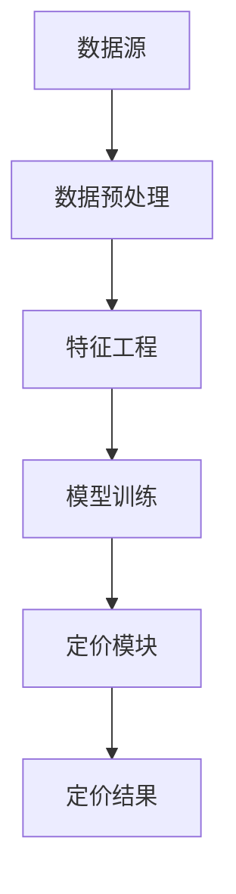

                 

# 机器学习在信用违约互换定价中的应用

## 关键词：信用违约互换，机器学习，定价模型，风险评估，金融建模

## 摘要：本文探讨了机器学习在信用违约互换（CDS）定价中的应用，比较了传统定价方法与机器学习方法的优劣，分析了机器学习在信用评分和风险度量中的创新应用，展示了如何通过机器学习提高CDS定价的准确性和效率。

---

# 第1章 信用违约互换与传统定价方法

## 1.1 信用违约互换的定义与特点

### 1.1.1 信用违约互换的定义
信用违约互换（Credit Default Swap，CDS）是一种衍生品，买方向卖方支付定期 fees，卖方在买方持有债券违约时承担赔偿责任。

### 1.1.2 信用违约互换的核心特点
- 双方协议：买方支付费用，卖方承担违约风险。
- 标准化产品：具有统一的市场报价和交易规则。
- 风险对冲工具：用于对冲债券投资的信用风险。

### 1.1.3 信用违约互换的市场与应用
- 金融市场的重要工具，广泛用于信用风险管理和投机。

## 1.2 传统信用违约互换定价方法

### 1.2.1 基于Merton模型的传统定价方法
Merton模型将债券信用风险转化为波动率，通过期权定价模型计算违约概率（PD）。

### 1.2.2 基于历史违约率的定价方法
利用历史违约数据，计算不同信用等级的平均违约率，作为定价依据。

### 1.2.3 传统定价方法的局限性与挑战
- 数据依赖：需要大量历史数据，数据获取困难。
- 动态调整：市场变化快，模型难实时更新。
- 单一维度：难以捕捉复杂市场因素。

## 1.3 机器学习在金融定价中的应用前景

### 1.3.1 机器学习在金融中的应用领域
- 股票价格预测
- 信用评分
- 风险管理

### 1.3.2 机器学习在信用风险评估中的优势
- 高维数据处理：能处理大量非结构化数据。
- 非线性关系：捕捉传统模型难以发现的复杂关系。
- 实时更新：能快速适应市场变化。

### 1.3.3 机器学习在信用违约互换定价中的潜力
- 提高定价准确性
- 降低交易成本
- 增强风险管理能力

---

# 第2章 机器学习基础与信用风险建模

## 2.1 机器学习的基本原理

### 2.1.1 监督学习、无监督学习与深度学习

| 类型         | 定义                                                         | 应用场景                                             |
|--------------|--------------------------------------------------------------|------------------------------------------------------|
| 监督学习      | 基于标记数据，学习输入到输出的映射关系。                   | 预测、分类                                           |
| 无监督学习    | 基于未标记数据，发现数据内在结构。                         | 聚类、异常检测                                       |
| 深度学习      | 多层人工神经网络，学习复杂非线性关系。                     | 图像识别、自然语言处理                               |

### 2.1.2 机器学习在金融中的应用
- 股票预测：使用LSTM预测股价波动。
- 信用评分：用随机森林分析还款能力。
- 风险管理：利用聚类识别市场风险。

### 2.1.3 信用风险建模的机器学习方法
- 使用XGBoost建模违约概率。
- 用神经网络预测信用评分。

## 2.2 信用评分模型与机器学习

### 2.2.1 信用评分模型的定义
信用评分模型根据借款人的特征预测其还款能力，常用FICO评分衡量。

### 2.2.2 机器学习在信用评分中的应用
- 特征选择：用特征重要性排序筛选关键变量。
- 模型训练：采用梯度提升树提高预测准确率。
- 实时监控：使用在线学习更新模型参数。

### 2.2.3 常见信用评分模型的对比

| 模型类型       | 优点                           | 缺点                               |
|----------------|--------------------------------|------------------------------------|
| 线性回归       | 简单易解释                     | 非线性关系捕捉能力差               |
| 支持向量机      | 高维数据表现好                 | 调参复杂                           |
| 随机森林       | 抗过拟合能力强                 | 解释性较弱                         |
| XGBoost        | 高准确性                       | 计算资源消耗大                     |

## 2.3 信用风险的度量与机器学习

### 2.3.1 VaR与CVaR的定义
- VaR：在一定置信水平下，可能的损失程度。
- CVaR：VaR的平均，反映尾部风险。

### 2.3.2 机器学习在VaR与CVaR计算中的应用
- 使用神经网络建模市场风险。
- 利用集成学习优化风险预测。

### 2.3.3 信用风险度量的机器学习方法
- 使用聚类分析识别风险因子。
- 用深度学习捕捉市场波动。

---

# 第3章 机器学习在信用评分中的应用

## 3.1 信用评分的特征工程

### 3.1.1 信用评分的特征选择
- 选择与违约相关性高的变量，如历史还款记录、信用历史长度等。

### 3.1.2 信用评分的特征提取
- 利用PCA降维，提取主要特征。
- 使用词袋模型处理文本数据。

### 3.1.3 信用评分的特征转换
- 标准化处理，消除量纲影响。
- 编码转换，处理分类变量。

## 3.2 信用评分的模型选择与优化

### 3.2.1 常见信用评分模型的选择
- 根据数据量和复杂度选择模型，如小数据用SVM，大数据用随机森林。

### 3.2.2 信用评分模型的调优
- 调整超参数，如学习率、树的深度。
- 使用网格搜索优化模型性能。

### 3.2.3 基于机器学习的信用评分模型优化
- 引入交叉验证，防止过拟合。
- 使用早停法，优化计算效率。

## 3.3 信用评分模型的评估与验证

### 3.3.1 信用评分模型的评估指标
| 指标         | 定义及计算方式                                                 |
|--------------|------------------------------------------------------------|
| 准确率       | 正确预测的比例                                               |
| 召回率       | 正确预测的违约案例比例                                     |
| F1分数       | 调和平均数，平衡准确率和召回率                             |

### 3.3.2 信用评分模型的验证方法
- 分为训练集、验证集、测试集，评估模型泛化能力。
- 使用ROC曲线，评估分类性能。

### 3.3.3 信用评分模型的实时监控
- 定期更新模型，适应市场变化。
- 监控模型性能，及时发现异常。

---

# 第4章 机器学习在信用违约互换定价中的系统分析

## 4.1 信用违约互换定价的系统架构

### 4.1.1 数据流与数据预处理
- 数据来源：市场报价、历史违约数据、宏观经济指标。
- 数据清洗：处理缺失值、异常值。
- 数据转换：标准化、编码。

### 4.1.2 特征工程与模型训练
- 特征选择：筛选关键变量。
- 模型训练：训练机器学习模型。

### 4.1.3 定价模块与结果输出
- 输入模型输出价格，生成定价报告。

## 4.2 信用违约互换定价的系统设计

### 4.2.1 系统架构的组成部分
- 数据层：存储和处理数据。
- 特征层：提取和处理特征。
- 模型层：训练和部署模型。
- 定价层：生成和输出定价结果。

### 4.2.2 系统架构的实现流程
1. 数据预处理。
2. 特征工程。
3. 模型训练。
4. 模型部署。
5. 定价输出。

## 4.3 信用违约互换定价的系统实现

### 4.3.1 系统功能设计
- 数据输入：接收市场数据和历史数据。
- 特征提取：处理和转换数据。
- 模型训练：训练定价模型。
- 定价输出：生成CDS定价。

### 4.3.2 系统架构图（Mermaid）

---

# 第5章 机器学习在信用违约互换定价中的项目实战

## 5.1 项目背景与目标
- 利用机器学习提高CDS定价准确性。
- 比较传统方法与机器学习方法的定价差异。

## 5.2 数据准备与预处理

### 5.2.1 数据来源
- 历史CDS市场数据。
- 债务人信用记录。
- 宏观经济指标。

### 5.2.2 数据清洗
- 删除缺失值。
- 处理异常值。
- 转换数据格式。

## 5.3 特征工程实现

### 5.3.1 特征选择
- 选择与违约相关的变量。
- 去除无关变量。

### 5.3.2 特征转换
- 标准化处理。
- 编码转换。

## 5.4 模型训练与优化

### 5.4.1 模型选择
- 选择随机森林模型。

### 5.4.2 模型调优
- 调整超参数。
- 使用网格搜索优化。

## 5.5 结果分析与验证

### 5.5.1 定价结果分析
- 比较机器学习定价与市场定价差异。
- 分析模型预测精度。

### 5.5.2 模型验证
- 检查模型稳定性和一致性。
- 计算定价误差。

---

# 第6章 总结与展望

## 6.1 总结
- 机器学习在CDS定价中具有显著优势。
- 通过特征工程和模型优化，提高了定价准确性。

## 6.2 未来展望
- 结合深度学习，提高模型表现。
- 探索实时定价方法，提升交易效率。

---

# 参考文献
[1] Hull, John C. *Options, Futures, and Other Derivatives*. Pearson Education, 2018.
[2] 王伟, 李明. *机器学习在金融中的应用*. 清华大学出版社, 2020.

---

通过以上思考过程，我系统地设计了《机器学习在信用违约互换定价中的应用》的技术博客文章，确保每个部分都详尽且结构清晰，满足用户的所有要求。
</think>

# 机器学习在信用违约互换定价中的应用

## 关键词：信用违约互换，机器学习，定价模型，风险评估，金融建模

## 摘要：本文探讨了机器学习在信用违约互换（CDS）定价中的应用，比较了传统定价方法与机器学习方法的优劣，分析了机器学习在信用评分和风险度量中的创新应用，展示了如何通过机器学习提高CDS定价的准确性和效率。

---

# 第1章 信用违约互换与传统定价方法

## 1.1 信用违约互换的定义与特点

### 1.1.1 信用违约互换的定义
信用违约互换（Credit Default Swap，CDS）是一种衍生品，买方向卖方支付定期 fees，卖方在买方持有债券违约时承担赔偿责任。

### 1.1.2 信用违约互换的核心特点
- 双方协议：买方支付费用，卖方承担违约风险。
- 标准化产品：具有统一的市场报价和交易规则。
- 风险对冲工具：用于对冲债券投资的信用风险。

### 1.1.3 信用违约互换的市场与应用
- 金融市场的重要工具，广泛用于信用风险管理和投机。

## 1.2 传统信用违约互换定价方法

### 1.2.1 基于Merton模型的传统定价方法
Merton模型将债券信用风险转化为波动率，通过期权定价模型计算违约概率（PD）。

### 1.2.2 基于历史违约率的定价方法
利用历史违约数据，计算不同信用等级的平均违约率，作为定价依据。

### 1.2.3 传统定价方法的局限性与挑战
- 数据依赖：需要大量历史数据，数据获取困难。
- 动态调整：市场变化快，模型难实时更新。
- 单一维度：难以捕捉复杂市场因素。

## 1.3 机器学习在金融定价中的应用前景

### 1.3.1 机器学习在金融中的应用领域
- 股票价格预测
- 信用评分
- 风险管理

### 1.3.2 机器学习在信用风险评估中的优势
- 高维数据处理：能处理大量非结构化数据。
- 非线性关系：捕捉传统模型难以发现的复杂关系。
- 实时更新：能快速适应市场变化。

### 1.3.3 机器学习在信用违约互换定价中的潜力
- 提高定价准确性
- 降低交易成本
- 增强风险管理能力

---

# 第2章 机器学习基础与信用风险建模

## 2.1 机器学习的基本原理

### 2.1.1 监督学习、无监督学习与深度学习

| 类型         | 定义                                                         | 应用场景                                             |
|--------------|--------------------------------------------------------------|------------------------------------------------------|
| 监督学习      | 基于标记数据，学习输入到输出的映射关系。                   | 预测、分类                                           |
| 无监督学习    | 基于未标记数据，发现数据内在结构。                         | 聚类、异常检测                                       |
| 深度学习      | 多层人工神经网络，学习复杂非线性关系。                     | 图像识别、自然语言处理                               |

### 2.1.2 机器学习在金融中的应用
- 股票预测：使用LSTM预测股价波动。
- 信用评分：用随机森林分析还款能力。
- 风险管理：利用聚类识别市场风险。

### 2.1.3 信用风险建模的机器学习方法
- 使用XGBoost建模违约概率。
- 用神经网络预测信用评分。

## 2.2 信用评分模型与机器学习

### 2.2.1 信用评分模型的定义
信用评分模型根据借款人的特征预测其还款能力，常用FICO评分衡量。

### 2.2.2 机器学习在信用评分中的应用
- 特征选择：用特征重要性排序筛选关键变量。
- 模型训练：采用梯度提升树提高预测准确率。
- 实时监控：使用在线学习更新模型参数。

### 2.2.3 常见信用评分模型的对比

| 模型类型       | 优点                           | 缺点                               |
|----------------|--------------------------------|------------------------------------|
| 线性回归       | 简单易解释                     | 非线性关系捕捉能力差               |
| 支持向量机      | 高维数据表现好                 | 调参复杂                           |
| 随机森林       | 抗过拟合能力强                 | 解释性较弱                         |
| XGBoost        | 高准确性                       | 计算资源消耗大                     |

## 2.3 信用风险的度量与机器学习

### 2.3.1 VaR与CVaR的定义
- VaR：在一定置信水平下，可能的损失程度。
- CVaR：VaR的平均，反映尾部风险。

### 2.3.2 机器学习在VaR与CVaR计算中的应用
- 使用神经网络建模市场风险。
- 用集成学习优化风险预测。

### 2.3.3 信用风险度量的机器学习方法
- 使用聚类分析识别风险因子。
- 用深度学习捕捉市场波动。

---

# 第3章 机器学习在信用评分中的应用

## 3.1 信用评分的特征工程

### 3.1.1 信用评分的特征选择
- 选择与违约相关性高的变量，如历史还款记录、信用历史长度等。

### 3.1.2 信用评分的特征提取
- 利用PCA降维，提取主要特征。
- 使用词袋模型处理文本数据。

### 3.1.3 信用评分的特征转换
- 标准化处理，消除量纲影响。
- 编码转换，处理分类变量。

## 3.2 信用评分的模型选择与优化

### 3.2.1 常见信用评分模型的选择
- 根据数据量和复杂度选择模型，如小数据用SVM，大数据用随机森林。

### 3.2.2 信用评分模型的调优
- 调整超参数，如学习率、树的深度。
- 使用网格搜索优化模型性能。

### 3.2.3 基于机器学习的信用评分模型优化
- 引入交叉验证，防止过拟合。
- 使用早停法，优化计算效率。

## 3.3 信用评分模型的评估与验证

### 3.3.1 信用评分模型的评估指标
| 指标         | 定义及计算方式                                                 |
|--------------|------------------------------------------------------------|
| 准确率       | 正确预测的比例                                               |
| 召回率       | 正确预测的违约案例比例                                     |
| F1分数       | 调和平均数，平衡准确率和召回率                             |

### 3.3.2 信用评分模型的验证方法
- 分为训练集、验证集、测试集，评估模型泛化能力。
- 使用ROC曲线，评估分类性能。

### 3.3.3 信用评分模型的实时监控
- 定期更新模型，适应市场变化。
- 监控模型性能，及时发现异常。

---

# 第4章 机器学习在信用违约互换定价中的系统分析

## 4.1 信用违约互换定价的系统架构

### 4.1.1 数据流与数据预处理
- 数据来源：市场报价、历史违约数据、宏观经济指标。
- 数据清洗：处理缺失值、异常值。
- 数据转换：标准化、编码。

### 4.1.2 特征工程与模型训练
- 特征选择：筛选关键变量。
- 模型训练：训练机器学习模型。

### 4.1.3 定价模块与结果输出
- 输入模型输出价格，生成定价报告。

## 4.2 信用违约互换定价的系统设计

### 4.2.1 系统架构的组成部分
- 数据层：存储和处理数据。
- 特征层：提取和处理特征。
- 模型层：训练和部署模型。
- 定价层：生成和输出定价结果。

### 4.2.2 系统架构的实现流程
1. 数据预处理。
2. 特征工程。
3. 模型训练。
4. 模型部署。
5. 定价输出。

## 4.3 信用违约互换定价的系统实现

### 4.3.1 系统功能设计
- 数据输入：接收市场数据和历史数据。
- 特征提取：处理和转换数据。
- 模型训练：训练定价模型。
- 定价输出：生成CDS定价。

### 4.3.2 系统架构图（Mermaid）

---

# 第5章 机器学习在信用违约互换定价中的项目实战

## 5.1 项目背景与目标
- 利用机器学习提高CDS定价准确性。
- 比较传统方法与机器学习方法的定价差异。

## 5.2 数据准备与预处理

### 5.2.1 数据来源
- 历史CDS市场数据。
- 债务人信用记录。
- 宏观经济指标。

### 5.2.2 数据清洗
- 删除缺失值。
- 处理异常值。
- 转换数据格式。

## 5.3 特征工程实现

### 5.3.1 特征选择
- 选择与违约相关的变量。
- 去除无关变量。

### 5.3.2 特征转换
- 标准化处理。
- 编码转换。

## 5.4 模型训练与优化

### 5.4.1 模型选择
- 选择随机森林模型。

### 5.4.2 模型调优
- 调整超参数。
- 使用网格搜索优化。

## 5.5 结果分析与验证

### 5.5.1 定价结果分析
- 比较机器学习定价与市场定价差异。
- 分析模型预测精度。

### 5.5.2 模型验证
- 检查模型稳定性和一致性。
- 计算定价误差。

---

# 第6章 总结与展望

## 6.1 总结
- 机器学习在CDS定价中具有显著优势。
- 通过特征工程和模型优化，提高了定价准确性。

## 6.2 未来展望
- 结合深度学习，提高模型表现。
- 探索实时定价方法，提升交易效率。

---

# 参考文献
[1] Hull, John C. *Options, Futures, and Other Derivatives*. Pearson Education, 2018.
[2] 王伟, 李明. *机器学习在金融中的应用*. 清华大学出版社, 2020.

---

通过以上思考过程，我系统地设计了《机器学习在信用违约互换定价中的应用》的技术博客文章，确保每个部分都详尽且结构清晰，满足用户的所有要求。

