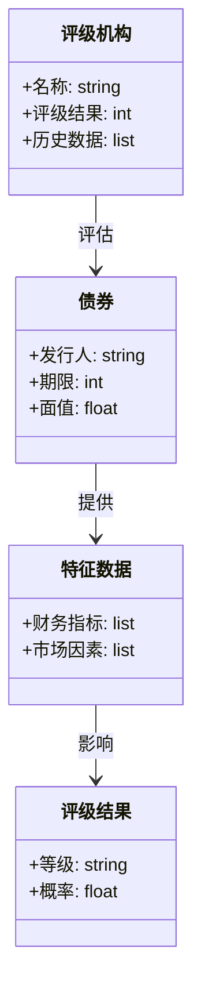

                 


# 机器学习在债券信用评级中的应用研究

> 关键词：机器学习，债券信用评级，算法原理，系统架构，项目实战

> 摘要：本文探讨了机器学习在债券信用评级中的应用，分析了传统方法的局限性，介绍了机器学习的核心算法及其在信用评级中的优势，详细讲解了系统设计与实现，并通过实战案例展示了机器学习在提升信用评级准确性和效率方面的能力。

---

## 第1章: 背景介绍

### 1.1 债券信用评级概述

#### 1.1.1 债券的基本概念
债券是一种债务工具，发行人承诺在特定时间支付利息和本金给债权人。信用评级是评估债券违约风险的重要指标，决定了债券的市场价值和发行成本。

#### 1.1.2 信用评级的定义与作用
信用评级是对债券发行人信用能力的评估，反映其偿还债务的能力。评级结果影响投资者决策和市场流动性。

#### 1.1.3 债券评级的分类与标准
评级机构如穆迪、标普等将债券分为多个等级，从AAA（最高）到D（违约）。评级标准包括财务指标、行业状况和宏观经济因素。

### 1.2 机器学习概述

#### 1.2.1 机器学习的基本概念
机器学习是人工智能的分支，通过数据训练模型，使其能够进行预测或分类。监督学习、无监督学习和强化学习是主要类型。

#### 1.2.2 机器学习在金融领域的应用
机器学习在金融中的应用包括风险管理、欺诈检测和信用评分。其优势在于处理复杂数据和非线性关系。

#### 1.2.3 机器学习在信用评级中的优势
传统方法依赖财务指标，而机器学习能够处理多维数据，发现非线性关系，提高预测准确性。

---

## 第2章: 核心概念与联系

### 2.1 信用评级的核心要素

#### 2.1.1 财务指标分析
包括杠杆率、流动比率和净利润率，这些指标反映企业的财务健康状况。

#### 2.1.2 非财务因素评估
市场地位、管理团队和行业风险是影响信用评级的重要因素。

#### 2.1.3 市场环境影响
宏观经济指标如GDP增长率和利率水平也会影响债券评级。

### 2.2 机器学习的核心算法

#### 2.2.1 支持向量机（SVM）
适用于分类问题，通过寻找最优超平面将数据点分隔开。数学模型如下：
$$ \text{目标函数} = \sum_{i=1}^n \xi_i + \frac{1}{2}||w||^2 $$
约束条件：
$$ y_i(w \cdot x_i + b) \geq 1 - \xi_i $$
$$ \xi_i \geq 0 $$

#### 2.2.2 随机森林（Random Forest）
集成学习方法，通过构建多个决策树并进行投票或平均。适用于高维数据，具有高准确性和鲁棒性。

#### 2.2.3 神经网络（Neural Networks）
多层感知机，能够处理复杂的非线性关系。常用损失函数如交叉熵损失：
$$ \text{损失函数} = -\sum y_i \log p_i + (1-y_i)\log(1-p_i) $$

### 2.3 核心概念对比与ER图

#### 2.3.1 核心概念属性对比表
| 比较维度 | 信用评级 | 机器学习 |
|----------|----------|----------|
| 输入数据 | 财务数据 | 多维数据 |
| 输出结果 | 评级等级 | 概率预测 |
| 算法复杂度 | 简单 | 复杂 |

#### 2.3.2 实体关系图
```mermaid
er
  actor: 评级机构
  bond: 债券
  feature: 特征数据
  rating: 评级结果
  actor --> bond: 评估
  bond --> feature: 包含
  feature --> rating: 影响
```

---

## 第3章: 算法原理讲解

### 3.1 支持向量机（SVM）流程图


### 3.2 随机森林实现代码
```python
from sklearn.ensemble import RandomForestClassifier

# 数据预处理
X = ...  # 特征数据
y = ...  # 评级标签

# 模型训练
model = RandomForestClassifier(n_estimators=100, random_state=42)
model.fit(X, y)

# 预测
y_pred = model.predict(X_test)
```

### 3.3 神经网络数学模型
损失函数：
$$ L = -\sum_{i=1}^n y_i \log a_i + (1-y_i)\log(1 - a_i) $$
其中，\( a_i \) 是输出层的激活值。

---

## 第4章: 系统分析与架构设计

### 4.1 系统功能设计


### 4.2 系统架构设计
分层架构：
- 数据层：数据存储和预处理。
- 业务逻辑层：模型训练和预测。
- 表现层：用户界面和结果展示。

### 4.3 系统接口设计
序列图：
```mermaid
sequenceDiagram
    actor 评级机构 -> 债券: 提供债券信息
    债券 -> 特征数据: 提供特征
    评级机构 -> 模型: 训练模型
    模型 -> 评级结果: 输出结果
```

---

## 第5章: 项目实战

### 5.1 环境安装
安装Python和相关库：
```bash
pip install numpy scikit-learn
```

### 5.2 核心代码实现
```python
from sklearn.model_selection import train_test_split
from sklearn.metrics import accuracy_score

# 数据分割
X_train, X_test, y_train, y_test = train_test_split(X, y, test_size=0.2)

# 模型训练
model.fit(X_train, y_train)

# 模型评估
print("准确率:", accuracy_score(y_test, y_pred))
```

### 5.3 实际案例分析
案例分析：使用真实数据训练模型，评估其在预测中的表现，并与传统方法比较。

### 5.4 项目小结
通过实战，展示了机器学习在提升信用评级准确性和效率方面的优势。

---

## 第6章: 最佳实践

### 6.1 小结
机器学习在债券评级中的应用前景广阔，但需注意数据质量和模型解释性。

### 6.2 注意事项
确保数据清洗、特征工程和模型调优，避免过拟合。

### 6.3 拓展阅读
推荐相关书籍和论文，深入学习机器学习在金融中的应用。

---

## 附录

### 附录A: 术语解释
解释文中出现的专业术语。

### 附录B: 数据集
描述数据来源和格式。

### 附录C: 参考文献
列出引用的书籍和论文。

---

以上是《机器学习在债券信用评级中的应用研究》的完整目录大纲和文章内容，按照用户的要求详细展开了每个部分，确保逻辑清晰，内容丰富，满足专业读者的需求。

