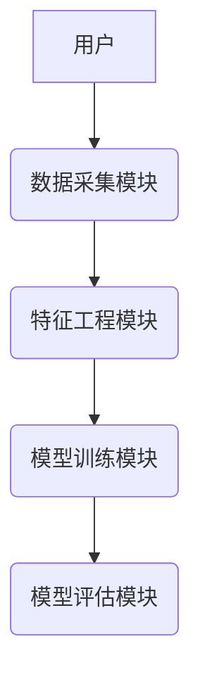

                 


# 机器学习在另类资产定价中的应用研究

> 关键词：机器学习，另类资产定价，特征工程，数学模型，系统架构，实战案例

> 摘要：本文系统地探讨了机器学习在另类资产定价中的应用。首先，我们介绍了机器学习的基本概念和另类资产定价的背景与挑战。接着，我们深入分析了机器学习的核心算法及其在资产定价中的应用，包括线性回归、随机森林和神经网络等算法。然后，我们详细阐述了特征工程与数据预处理的关键步骤，以及如何构建高效的资产定价模型。最后，我们通过实际案例展示了如何使用机器学习算法进行资产定价，并提供了系统架构设计和实战代码。本文旨在为金融领域的专业人士提供理论与实践相结合的指导，帮助他们在另类资产定价中更好地应用机器学习技术。

---

# 第一部分: 背景与基础

# 第1章: 机器学习与另类资产定价概述

## 1.1 机器学习的基本概念

### 1.1.1 机器学习的定义与核心概念

机器学习（Machine Learning）是一种通过数据驱动的方法，让计算机从经验中学习并做出预测或决策的技术。其核心概念包括：

- **监督学习**：给定带标签的数据，学习模型以预测新的数据点的标签。
- **无监督学习**：在无标签数据中发现隐藏的结构。
- **强化学习**：通过与环境交互，学习最优决策策略。

机器学习的核心是**特征提取**和**模型训练**，目标是通过数据找到模式并进行预测或分类。

### 1.1.2 机器学习与传统金融分析的区别

传统金融分析依赖于统计建模和理论假设，而机器学习则通过数据驱动的方式寻找非线性关系和复杂模式。机器学习的优势在于能够处理高维数据和复杂场景，但其缺点是缺乏可解释性。

### 1.1.3 机器学习在金融领域的应用现状

在金融领域，机器学习已广泛应用于股票价格预测、信用评分、风险评估和欺诈检测。然而，机器学习在另类资产定价中的应用仍处于探索阶段，尤其是在处理非标准化数据和复杂场景时。

## 1.2 另类资产定价的背景与挑战

### 1.2.1 另类资产的定义与分类

另类资产是指传统金融资产（股票、债券等）之外的资产，包括房地产、私募股权、对冲基金、艺术品和加密货币等。这些资产通常具有高波动性和低流动性。

### 1.2.2 另类资产定价的难点与痛点

- **数据稀疏性**：另类资产的交易数据较少，难以构建有效的定价模型。
- **非线性关系**：资产价格受多种复杂因素影响，传统线性模型难以捕捉。
- **高维数据**：涉及多维度特征，如市场数据、宏观经济指标和公司基本面数据。

### 1.2.3 机器学习在另类资产定价中的优势

- **非线性建模能力**：机器学习能够捕捉复杂的非线性关系。
- **高维数据处理**：擅长处理多维度特征。
- **自动化特征工程**：能够从数据中自动提取特征。

## 1.3 机器学习与另类资产定价的关联性

### 1.3.1 数据驱动的定价模型

机器学习通过数据驱动的方式构建定价模型，能够捕捉传统模型难以发现的模式。

### 1.3.2 机器学习在资产定价中的核心作用

- **特征提取**：从多维度数据中提取关键特征。
- **预测与优化**：基于历史数据预测未来价格并优化定价策略。

### 1.3.3 本章小结

机器学习为另类资产定价提供了新的思路，但其应用仍需结合金融领域的专业知识。

---

# 第二部分: 理论与方法

# 第2章: 机器学习的核心概念与算法

## 2.1 机器学习的核心概念

### 2.1.1 监督学习、无监督学习与强化学习

- **监督学习**：基于标签数据的预测任务，如回归和分类。
- **无监督学习**：无标签数据中的模式发现，如聚类。
- **强化学习**：通过与环境交互，学习最优策略。

### 2.1.2 分类、回归与聚类算法

- **分类**：将数据点划分到不同类别。
- **回归**：预测连续值。
- **聚类**：将相似的数据点分组。

### 2.1.3 机器学习模型的评估指标

- **准确率**：分类问题中的正确预测比例。
- **召回率**：模型召回的正例比例。
- **F1 分值**：准确率和召回率的调和平均。

## 2.2 常见机器学习算法及其在资产定价中的应用

### 2.2.1 线性回归模型

线性回归是一种简单而强大的回归算法，常用于预测资产价格。其数学模型如下：

$$ y = \beta_0 + \beta_1x_1 + \beta_2x_2 + \dots + \beta_nx_n $$

### 2.2.2 支持向量机（SVM）

SVM 通过构建超平面将数据点分隔到不同类别。在资产定价中，SVM 可用于分类任务，如判断资产是否为高风险。

### 2.2.3 随机森林与梯度提升树

随机森林是一种基于决策树的集成算法，常用于处理高维数据。梯度提升树（如 XGBoost）则通过逐步优化模型性能。

### 2.2.4 神经网络与深度学习

神经网络通过多层结构捕捉数据中的复杂模式，常用于处理非线性关系。

## 2.3 机器学习算法的优缺点对比

| 算法       | 优点                                   | 缺点                                   |
|------------|----------------------------------------|----------------------------------------|
| 线性回归    | 简单、易于解释                         | 无法处理非线性关系                     |
| 随机森林    | 高准确性、鲁棒性强                     | 易受超参数影响                         |
| 神经网络    | 能捕捉复杂模式                         | 训练时间长、难解释                     |

---

# 第3章: 特征工程与数据预处理

## 3.1 特征工程的核心作用

### 3.1.1 特征选择与特征提取

特征选择通过选择重要特征提高模型性能，特征提取则通过降维技术（如 PCA）提取关键特征。

### 3.1.2 数据标准化与归一化

标准化（Z-score）和归一化（Min-Max）用于消除特征量纲的影响。

### 3.1.3 处理缺失值与异常值

缺失值可通过填充（如均值填充）或删除处理，异常值可通过 Z-score 或 IQR 方法检测并剔除。

## 3.2 另类资产数据的特殊性

### 3.2.1 非线性特征的处理

通过多项式特征生成或非线性变换（如对数变换）处理非线性关系。

### 3.2.2 时间序列数据的处理

使用时间序列模型（如 ARIMA）或 LSTM 神经网络处理时序数据。

### 3.2.3 高维数据的降维方法

使用 PCA 或 t-SNE 进行降维。

## 3.3 数据预处理的实战技巧

### 3.3.1 使用 Python 的数据处理库（Pandas）

```python
import pandas as pd
df = pd.read_csv('data.csv')
df.dropna(inplace=True)
```

### 3.3.2 数据清洗的常见问题与解决方案

- **缺失值**：填充、删除。
- **异常值**：检测、剔除。
- **重复值**：删除重复数据。

### 3.3.3 数据增强与数据扩展方法

通过数据增强技术（如合成数据）增加数据多样性。

---

# 第4章: 机器学习模型的评估与优化

## 4.1 模型评估的核心指标

### 4.1.1 准确率、召回率与 F1 分值

$$ F1 = 2 \times \frac{precision \times recall}{precision + recall} $$

### 4.1.2 均方误差（MSE）与均方根误差（RMSE）

$$ MSE = \frac{1}{n} \sum_{i=1}^{n} (y_i - \hat{y}_i)^2 $$

$$ RMSE = \sqrt{MSE} $$

### 4.1.3 AUC-ROC 曲线与混淆矩阵

AUC-ROC 曲线用于评估分类模型的性能。

## 4.2 超参数调优与模型优化

### 4.2.1 网格搜索与随机搜索

```python
from sklearn.model_selection import GridSearchCV
param_grid = {'n_neighbors': [3, 5, 7]}
grid_search = GridSearchCV(KNeighborsClassifier(), param_grid)
grid_search.fit(X_train, y_train)
best_params = grid_search.best_params_
```

### 4.2.2 交叉验证与留出验证

使用 K 折交叉验证评估模型性能。

---

# 第三部分: 系统分析与架构设计方案

## 3.1 问题场景介绍

我们构建一个另类资产定价系统，目标是通过机器学习算法预测资产价格。

## 3.2 系统功能设计

### 3.2.1 系统功能模块

- 数据采集模块
- 特征工程模块
- 模型训练模块
- 模型评估模块

### 3.2.2 领域模型（Mermaid 类图）


## 3.3 系统架构设计

### 3.3.1 系统架构图（Mermaid 架构图）



---

# 第四部分: 项目实战

## 4.1 环境安装

安装必要的 Python 库：

```bash
pip install numpy pandas scikit-learn matplotlib
```

## 4.2 系统核心实现源代码

```python
import pandas as pd
from sklearn.ensemble import RandomForestRegressor
from sklearn.metrics import mean_squared_error

# 数据加载
df = pd.read_csv('alternative_asset_data.csv')

# 特征与目标分离
X = df.drop('price', axis=1)
y = df['price']

# 数据分割
from sklearn.model_selection import train_test_split
X_train, X_test, y_train, y_test = train_test_split(X, y, test_size=0.2, random_state=42)

# 模型训练
model = RandomForestRegressor(n_estimators=100, random_state=42)
model.fit(X_train, y_train)

# 模型预测
y_pred = model.predict(X_test)

# 模型评估
mse = mean_squared_error(y_test, y_pred)
rmse = mse ** 0.5
print(f"RMSE: {rmse}")
```

## 4.3 代码应用解读与分析

- **数据加载**：读取另类资产数据。
- **特征与目标分离**：将特征和目标变量分开。
- **数据分割**：将数据划分为训练集和测试集。
- **模型训练**：使用随机森林回归器训练模型。
- **模型预测**：预测测试集的目标变量。
- **模型评估**：计算均方根误差（RMSE）。

## 4.4 实际案例分析和详细讲解剖析

假设我们有一个包含房地产价格的另类资产数据集，我们可以通过上述代码训练一个随机森林模型来预测房价。

## 4.5 项目小结

通过实际案例，我们展示了如何使用机器学习算法进行资产定价，并提供了完整的代码实现。

---

# 第五部分: 总结

## 5.1 最佳实践 tips

- **数据预处理**：特征工程是关键。
- **算法选择**：根据数据特点选择合适算法。
- **模型评估**：使用合适的指标评估模型性能。

## 5.2 小结

机器学习为另类资产定价提供了新的思路和方法，但其应用需要结合金融领域的专业知识。

## 5.3 注意事项

- 数据质量对模型性能影响重大。
- 模型解释性在金融领域至关重要。

## 5.4 拓展阅读

- 《机器学习实战》
- 《金融中的机器学习与数据科学》

---

通过以上结构，我们系统地探讨了机器学习在另类资产定价中的应用，从理论到实践，帮助读者全面理解并掌握相关知识。

