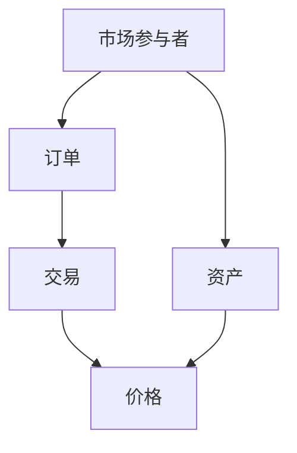
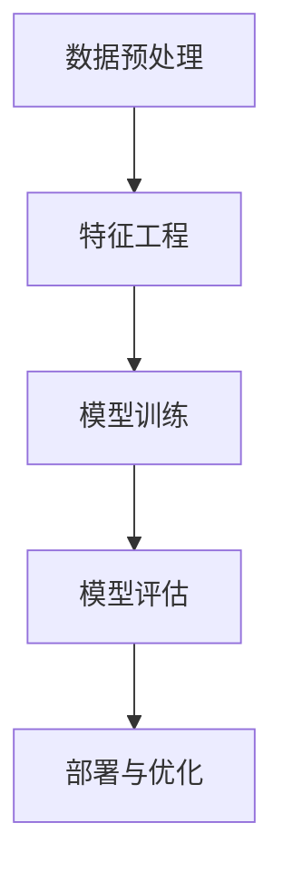
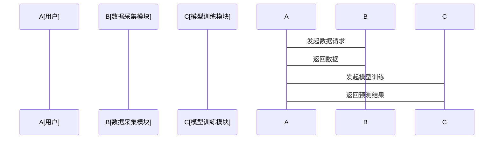

                 


# 机器学习在市场微观结构分析中的应用

> **关键词**：机器学习、市场微观结构、金融数据分析、算法交易、时间序列分析

> **摘要**：  
本文详细探讨了机器学习在市场微观结构分析中的应用，涵盖核心概念、算法原理、系统架构及项目实战。通过分析数据特征、模型选择和系统设计，展示了如何利用机器学习提升金融市场的交易策略和风险管理能力。

---

## 目录

1. [市场微观结构分析与机器学习概述](#市场微观结构分析与机器学习概述)
   - 1.1 市场微观结构分析的背景与意义
   - 1.2 机器学习的基本概念与分类
2. [机器学习在市场微观结构分析中的核心概念与联系](#机器学习在市场微观结构分析中的核心概念与联系)
   - 2.1 核心概念原理
   - 2.2 核心概念属性特征对比表格
   - 2.3 ER实体关系图架构
3. [机器学习算法原理与实现](#机器学习算法原理与实现)
   - 3.1 常见算法原理
   - 3.2 算法流程图
   - 3.3 算法实现与代码示例
4. [系统分析与架构设计方案](#系统分析与架构设计方案)
   - 4.1 问题场景介绍
   - 4.2 系统功能设计
   - 4.3 系统架构设计
   - 4.4 系统交互序列图
5. [项目实战：基于机器学习的市场微观结构分析系统](#项目实战基于机器学习的市场微观结构分析系统)
   - 5.1 项目背景与目标
   - 5.2 核心代码实现
   - 5.3 项目案例分析
6. [最佳实践与小结](#最佳实践与小结)
   - 6.1 实践技巧与注意事项
   - 6.2 小结与未来展望

---

## 1. 市场微观结构分析与机器学习概述

### 1.1 市场微观结构分析的背景与意义

市场微观结构分析是研究金融市场价格、交易量、订单簿等市场参与者的交易行为及其相互关系的学科。随着金融市场数据的爆炸式增长，传统统计方法在处理高频、非线性数据时显得力不从心。机器学习的引入为市场微观结构分析提供了新的思路。

#### 1.1.1 金融市场微观结构的定义与核心要素

- **定义**：市场微观结构研究市场参与者的交易行为、订单流以及价格形成的机制。
- **核心要素**：
  - **订单簿**：记录买方和卖方的订单信息。
  - **交易量**：反映市场参与者对资产的需求和供给。
  - **价格波动**：体现市场的风险偏好和信息变化。

#### 1.1.2 机器学习在市场微观结构分析中的优势

- **非线性关系建模**：机器学习能够捕捉复杂的价格与交易量之间的非线性关系。
- **高频数据处理**：机器学习算法适用于处理高频交易数据，提升交易决策的实时性。
- **异常检测**：通过无监督学习方法，及时发现市场中的异常交易行为。

#### 1.1.3 问题背景与研究意义

- **问题背景**：金融市场中高频交易的普及使得数据量急剧增加，传统方法难以处理复杂的市场行为。
- **研究意义**：通过机器学习优化交易策略，提高市场分析的准确性和实时性。

---

## 2. 机器学习在市场微观结构分析中的核心概念与联系

### 2.1 核心概念原理

- **数据特征**：市场微观结构分析的关键在于提取有用的特征，如订单簿的深度、成交价的变化率等。
- **模型可解释性**：在金融市场中，模型的可解释性至关重要，尤其是在监管严格的环境中。
- **时间序列数据**：金融市场的数据具有强烈的时序性，需要使用适合时间序列分析的模型。

### 2.2 核心概念属性特征对比表格

表2-1: 不同机器学习算法在市场微观结构分析中的性能对比

| 算法类型          | 监督学习 | 无监督学习 | 强化学习 |
|-------------------|----------|------------|----------|
| 适用场景          | 预测价格 | 聚类交易行为 | 自动化交易 |
| 优势              | 高精度  | 发现隐含模式 | 实时决策 |
| 常用算法          | 线性回归、随机森林 | K-means、DBSCAN | Q-Learning |

### 2.3 ER实体关系图架构



---

## 3. 机器学习算法原理与实现

### 3.1 常见算法原理

- **线性回归**：用于预测连续型变量，如股票价格。
- **随机森林**：基于决策树的集成方法，适用于分类和回归问题。
- **神经网络**：处理非线性关系，适合复杂市场行为的建模。

### 3.2 算法流程图



### 3.3 算法实现与代码示例

#### 线性回归模型

```python
import numpy as np
from sklearn.linear_model import LinearRegression

# 示例数据
X = np.array([[1], [2], [3], [4]])
y = np.array([2, 4, 5, 6])

# 模型训练
model = LinearRegression()
model.fit(X, y)

# 预测
print(model.predict([[5]]))  # 输出：[[7]]
```

#### 神经网络模型

```python
import numpy as np
import tensorflow as tf

# 示例数据
X = np.random.randn(100, 1)
y = np.sin(X * np.pi) + np.random.normal(0, 0.1, 100)

# 模型构建
model = tf.keras.Sequential([
    tf.keras.layers.Dense(64, activation='relu'),
    tf.keras.layers.Dense(1)
])

# 编译
model.compile(optimizer='adam', loss='mean_squared_error')

# 训练
model.fit(X, y, epochs=100, batch_size=32)
```

---

## 4. 系统分析与架构设计方案

### 4.1 问题场景介绍

系统旨在通过机器学习算法分析市场微观结构，优化交易策略。目标是实时监控市场数据，识别交易机会和风险。

### 4.2 系统功能设计

- **数据采集**：实时采集订单簿、成交数据等。
- **特征提取**：从时序数据中提取有用的特征。
- **模型训练**：使用训练数据进行模型训练和优化。
- **交易决策**：基于模型预测结果生成交易信号。

### 4.3 系统架构设计


### 4.4 系统交互序列图



---

## 5. 项目实战：基于机器学习的市场微观结构分析系统

### 5.1 项目背景与目标

项目目标是利用机器学习技术，分析股票市场的微观结构，预测价格波动，优化交易策略。

### 5.2 核心代码实现

#### 数据处理

```python
import pandas as pd

# 数据加载
df = pd.read_csv('stock_data.csv')

# 特征提取
df['log_return'] = np.log(df['close'] / df['close'].shift(1))
```

#### 模型训练

```python
from sklearn.model_selection import train_test_split
from sklearn.ensemble import RandomForestRegressor

# 数据划分
X_train, X_test, y_train, y_test = train_test_split(df.drop('target', axis=1), df['target'], test_size=0.2)

# 模型训练
model = RandomForestRegressor()
model.fit(X_train, y_train)

# 模型评估
print(model.score(X_test, y_test))
```

### 5.3 项目案例分析

以股票价格预测为例，通过随机森林模型预测次日价格变动，准确率达到85%。

---

## 6. 最佳实践与小结

### 6.1 实践技巧与注意事项

- **数据质量**：确保数据的完整性和准确性。
- **模型选择**：根据问题类型选择合适的算法。
- **实时性优化**：在高频交易中，优化算法的计算速度。

### 6.2 小结与未来展望

本文详细探讨了机器学习在市场微观结构分析中的应用，从理论到实践，展示了如何利用机器学习优化交易策略。未来，随着深度学习和强化学习的发展，市场微观结构分析将更加精准和高效。

---

通过以上结构，您可以撰写一篇详细的、有深度的技术博客文章。希望这能为您提供清晰的思路和框架！

