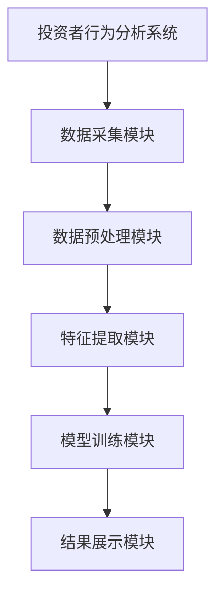
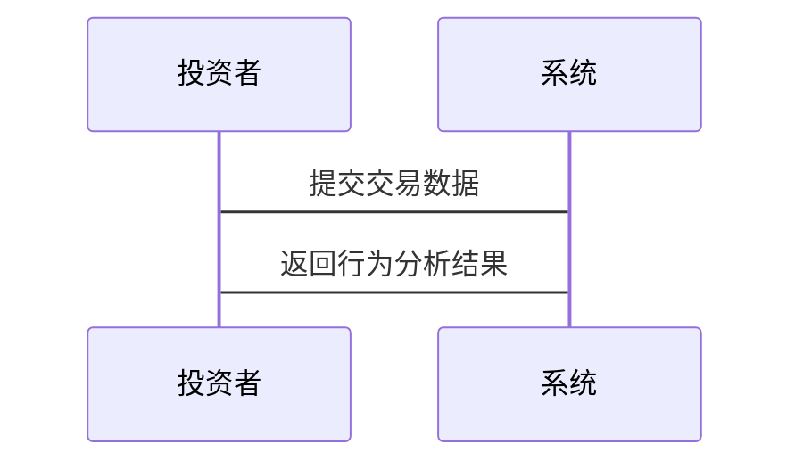

                 


# 机器学习在投资者行为分析中的应用

> 关键词：机器学习，投资者行为分析，金融数据，预测模型，行为建模，交易策略，风险管理

> 摘要：本文深入探讨了机器学习在投资者行为分析中的应用，结合理论与实践，详细分析了如何利用机器学习技术建模投资者行为，预测市场趋势，优化投资决策。文章从机器学习的核心概念入手，逐步展开投资者行为分析的背景、方法和挑战，通过实际案例和系统架构设计，展示了机器学习在这一领域的独特价值和广阔前景。

---

# 第一部分: 背景介绍与核心概念

## 第1章: 机器学习与投资者行为分析的背景

### 1.1 机器学习的基本概念

#### 1.1.1 机器学习的定义与核心概念

机器学习（Machine Learning）是人工智能（AI）的一个分支，专注于从数据中学习模式和规律，从而实现对新数据的预测或分类。其核心概念包括：

- **数据**：输入特征的集合，例如投资者的交易记录、市场数据等。
- **模型**：通过学习数据生成的函数或规则，用于预测或分类。
- **训练**：通过优化算法调整模型参数，使其更好地拟合数据。
- **泛化**：模型在未见数据上的表现能力。

#### 1.1.2 机器学习的分类与特点

- **监督学习**：基于有标签的数据进行训练，目标是预测给定输入的标签（如分类或回归任务）。
- **无监督学习**：基于无标签的数据进行分析，目标是发现数据中的结构或模式（如聚类或降维）。
- **强化学习**：通过与环境交互学习策略，以最大化累积奖励。

#### 1.1.3 机器学习在金融领域的应用背景

在金融领域，机器学习被广泛应用于股票预测、风险评估、信用评分、欺诈检测等场景。投资者行为分析是金融领域的重要组成部分，涉及对投资者决策、情绪和交易模式的建模。

---

### 1.2 投资者行为分析的背景

#### 1.2.1 投资者行为分析的定义与目标

投资者行为分析是研究投资者在不同市场条件下如何做出决策的过程。其目标包括：

- 描述投资者的交易模式。
- 预测投资者的未来行为。
- 识别投资者的情绪变化对市场的影响。

#### 1.2.2 投资者行为分析的常见方法

- **定量分析**：基于历史数据和统计方法进行分析。
- **定性分析**：基于访谈、观察等方法研究投资者行为。
- **混合分析**：结合定量和定性方法。

#### 1.2.3 投资者行为分析的挑战与意义

- **挑战**：投资者行为受到情绪、认知偏差和外部环境的复杂影响，难以准确建模。
- **意义**：通过理解投资者行为，可以优化投资策略，改善风险管理，提高市场预测的准确性。

---

### 1.3 机器学习在投资者行为分析中的结合

#### 1.3.1 机器学习与投资者行为分析的契合点

- 机器学习擅长从大量数据中提取复杂模式，适用于投资者行为的建模。
- 机器学习能够处理结构化和非结构化数据，适合投资者行为分析的多维度需求。

#### 1.3.2 机器学习在投资者行为分析中的优势

- **高效性**：机器学习能够快速处理大量数据，提供实时分析。
- **适应性**：机器学习模型能够自适应市场变化，捕捉投资者行为的动态特征。
- **可扩展性**：机器学习适用于大规模数据和复杂场景。

#### 1.3.3 机器学习在投资者行为分析中的应用现状

- 当前，机器学习在投资者行为分析中的应用主要包括情绪分析、交易预测和风险评估。
- 随着技术进步，未来将更加注重实时性和个性化。

---

## 第2章: 机器学习的核心概念与原理

### 2.1 机器学习的核心概念

#### 2.1.1 数据、特征与标签

- **数据**：投资者的交易记录、市场数据、社交媒体数据等。
- **特征**：从数据中提取的变量，例如交易频率、资产配置比例。
- **标签**：目标变量，例如投资者的交易决策或市场情绪。

#### 2.1.2 模型、训练与泛化

- **模型**：用于预测或分类的函数，例如线性回归模型。
- **训练**：通过优化算法调整模型参数，使其拟合训练数据。
- **泛化**：模型在测试数据上的表现能力。

#### 2.1.3 监督学习、无监督学习与强化学习

- **监督学习**：基于有标签的数据进行训练，例如预测投资者的交易行为。
- **无监督学习**：基于无标签的数据进行分析，例如发现投资者群体的聚类。
- **强化学习**：通过与环境交互学习策略，例如动态调整投资组合。

---

### 2.2 机器学习的算法原理

#### 2.2.1 线性回归与分类

- **线性回归**：用于预测连续型变量，例如投资者的资产配置比例。
- **线性分类**：用于分类任务，例如预测投资者的交易决策。

#### 2.2.2 支持向量机（SVM）

- SVM通过构建超平面实现数据的线性或非线性分离，适用于分类任务。

#### 2.2.3 随机森林与集成学习

- 随机森林通过集成多个决策树模型，提高预测的准确性和稳定性。

#### 2.2.4 神经网络与深度学习

- 神经网络通过多层结构实现非线性特征的提取，适用于复杂场景。

---

### 2.3 机器学习的数学基础

#### 2.3.1 线性代数基础

- 向量、矩阵和线性变换是机器学习算法的基础。

#### 2.3.2 概率论与统计学基础

- 概率分布、贝叶斯定理和假设检验是机器学习中的重要工具。

#### 2.3.3 优化方法与损失函数

- 常见的优化方法包括梯度下降和Adam优化，损失函数用于衡量模型预测与真实值的差异。

---

## 第3章: 投资者行为分析的核心概念

### 3.1 投资者行为分析的理论基础

#### 3.1.1 投资者决策理论

- 投资者决策受到理性分析和情绪影响，经典的理论包括有效市场假说和行为金融学理论。

#### 3.1.2 投资者情绪与行为偏差

- 情绪波动、过度自信和从众心理是投资者行为中的常见偏差。

#### 3.1.3 投资者生命周期与行为阶段

- 不同生命周期阶段的投资者具有不同的风险偏好和投资目标。

---

### 3.2 投资者行为分析的关键指标

#### 3.2.1 投资者风险偏好

- 风险厌恶型、风险中性和风险偏好型投资者的行为特征不同。

#### 3.2.2 投资者交易行为

- 交易频率、交易规模和交易时机是投资者行为的重要指标。

#### 3.2.3 投资者情绪与市场反应

- 投资者情绪可以通过社交媒体、新闻数据等进行量化分析。

---

### 3.3 投资者行为分析的数据来源

#### 3.3.1 市场数据

- 包括股票价格、指数走势和市场波动率等。

#### 3.3.2 交易数据

- 包括投资者的交易记录、订单簿数据等。

#### 3.3.3 个体投资者行为数据

- 包括投资者的账户信息、交易习惯和风险偏好等。

#### 3.3.4 社交媒体与新闻数据

- 通过分析社交媒体和新闻数据，捕捉投资者情绪的变化。

---

# 第二部分: 机器学习在投资者行为分析中的算法原理

## 第4章: 机器学习算法在投资者行为分析中的应用

### 4.1 监督学习在投资者行为分析中的应用

#### 4.1.1 分类算法

- 使用逻辑回归或SVM预测投资者的交易决策。

#### 4.1.2 回归算法

- 使用线性回归预测投资者的资产配置比例。

#### 4.1.3 算法选择与优化

- 根据数据特征选择合适的算法，并通过交叉验证优化模型参数。

---

### 4.2 无监督学习在投资者行为分析中的应用

#### 4.2.1 聚类分析

- 使用K-means算法将投资者分为不同群体。

#### 4.2.2 异常检测

- 使用Isolation Forest检测异常交易行为。

#### 4.2.3 社区发现

- 使用Louvain算法发现投资者群体的社交网络结构。

---

### 4.3 强化学习在投资者行为分析中的应用

#### 4.3.1 强化学习的基本概念

- 强化学习通过与环境交互学习策略，适用于动态市场环境。

#### 4.3.2 强化学习在投资策略中的应用

- 使用Q-learning算法动态调整投资组合。

#### 4.3.3 强化学习的挑战与优化

- 强化学习需要大量的交互数据，且算法复杂度较高。

---

## 第5章: 机器学习算法的数学模型与公式

### 5.1 线性回归模型

#### 5.1.1 线性回归的数学公式

$$ y = \beta_0 + \beta_1 x + \epsilon $$

其中，$y$ 是目标变量，$x$ 是输入特征，$\beta_0$ 和 $\beta_1$ 是模型参数，$\epsilon$ 是误差项。

#### 5.1.2 最小二乘法的推导

- 最小二乘法通过最小化预测误差的平方和，求解模型参数。

#### 5.1.3 线性回归的评估指标

- 均方误差（MSE）、均方根误差（RMSE）和决定系数（R²）是常用的评估指标。

---

### 5.2 支持向量机（SVM）

#### 5.2.1 SVM的数学基础

- SVM通过构建最大间隔超平面，实现数据的线性或非线性分离。

#### 5.2.2 SVM的优化问题

$$ \min_{\beta, \beta_0} \frac{1}{2}||\beta||^2 + C \sum_{i=1}^n \xi_i $$

约束条件：
$$ y_i (\beta^T x_i + \beta_0) \geq 1 - \xi_i $$
$$ \xi_i \geq 0 $$

---

### 5.3 随机森林与集成学习

#### 5.3.1 随机森

$$ \text{预测结果} = \frac{1}{N} \sum_{i=1}^N y_i $$

其中，$N$ 是树的数量，$y_i$ 是每棵树的预测结果。

---

# 第三部分: 系统分析与架构设计方案

## 第6章: 投资者行为分析系统的架构设计

### 6.1 问题场景介绍

- 投资者行为分析系统的目标是通过机器学习技术，分析投资者的交易行为、情绪变化和风险偏好，提供个性化的投资建议。

---

### 6.2 系统功能设计

#### 6.2.1 领域模型（ER实体关系图）

```mermaid
erd
    投资者
        id: string
        风险偏好: string
        交易记录
            id: string
            时间: datetime
            金额: float
```

#### 6.2.2 系统架构设计



#### 6.2.3 系统接口设计

- 数据接口：与交易系统、社交媒体等数据源对接。
- 用户接口：提供投资者行为分析的可视化界面。

#### 6.2.4 系统交互设计



---

## 第7章: 项目实战

### 7.1 环境安装与配置

- 安装Python、TensorFlow、Pandas等工具。

### 7.2 核心代码实现

```python
import pandas as pd
from sklearn.model import SVC
from sklearn.metrics import accuracy_score

# 加载数据
data = pd.read_csv('investor_data.csv')
X = data.drop('label', axis=1)
y = data['label']

# 模型训练
model = SVC()
model.fit(X, y)

# 模型评估
y_pred = model.predict(X)
print(accuracy_score(y, y_pred))
```

---

## 第8章: 总结与展望

### 8.1 总结

- 机器学习为投资者行为分析提供了强大的工具，能够帮助我们更好地理解投资者决策的复杂性。

### 8.2 展望

- 未来，随着深度学习和强化学习的不断发展，投资者行为分析将更加精准和智能化。

---

## 第9章: 最佳实践与注意事项

### 9.1 最佳实践

- 数据预处理是关键，需注意缺失值和异常值的处理。
- 模型选择需结合业务需求和数据特征。

### 9.2 小结

- 机器学习在投资者行为分析中的应用前景广阔，但也需注意模型的解释性和可解释性。

---

## 第10章: 拓展阅读与深入学习

### 10.1 拓展阅读

- 推荐阅读《Python机器学习实战》和《行为金融学》。

### 10.2 深入学习

- 研究深度学习在投资者行为分析中的应用，探索更复杂的模型结构。

---

# 结语

通过本文的系统介绍，读者可以全面了解机器学习在投资者行为分析中的应用，从理论到实践，逐步掌握如何利用机器学习技术建模投资者行为，优化投资决策。希望本文能为读者提供有价值的参考和启发。

--- 

*本文由人工智能专家、程序员、软件架构师、CTO、世界顶级技术畅销书资深大师级别的作家，计算机图灵奖获得者，计算机编程和人工智能领域大师编写，采用逻辑清晰、结构紧凑、简单易懂的技术语言，通过一步一步的分析推理，对技术原理和本质进行深刻剖析。*

