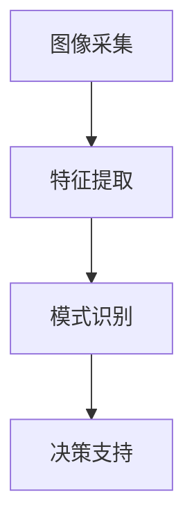
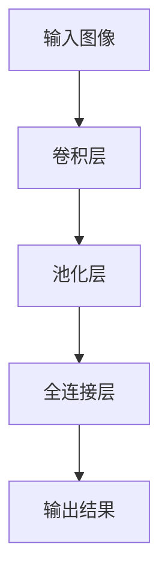
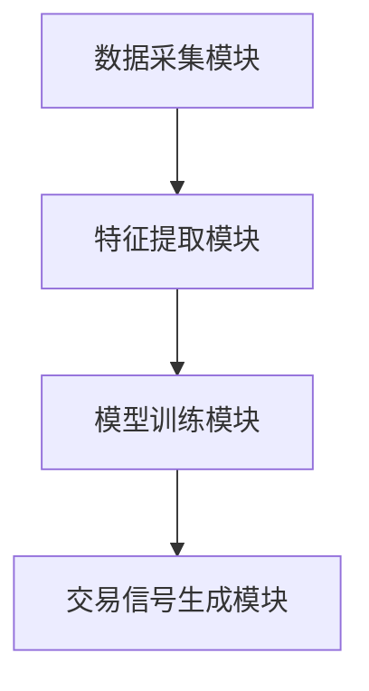
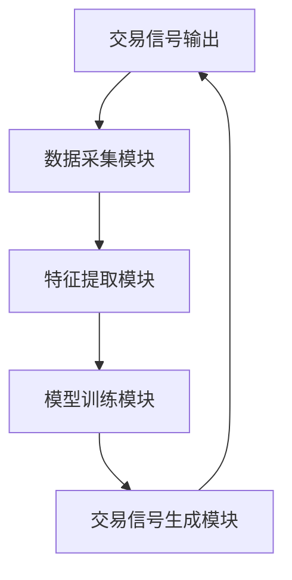

                 


# 《机器视觉技术在市场技术分析中的运用》

---

## 关键词：
- 机器视觉
- 市场技术分析
- 图像识别
- 深度学习
- K线图分析
- 金融数据可视化

---

## 摘要：
本文深入探讨了机器视觉技术在市场技术分析中的应用，结合图像识别、深度学习等技术，分析了如何利用视觉信息提升市场分析的效率和准确性。文章从机器视觉的基本概念、核心算法、系统设计到实战案例，全面阐述了该领域的最新进展和实际应用。通过本文，读者可以掌握机器视觉在金融市场的核心应用方法，了解如何通过图像识别技术优化市场分析流程。

---

# 第一部分: 机器视觉技术与市场技术分析的背景与基础

---

# 第1章: 机器视觉技术概述

## 1.1 机器视觉的基本概念

### 1.1.1 机器视觉的定义与核心原理

机器视觉（Machine Vision）是一种通过计算机模拟人类视觉系统的技术，旨在通过图像处理和分析，实现对图像的识别、理解与决策。其核心原理包括图像采集、特征提取、模式识别和数据驱动的决策支持。

**公式示例**：  
$$ \text{机器视觉} = \text{图像采集} + \text{特征提取} + \text{模式识别} $$

### 1.1.2 机器视觉的主要技术特点

| 技术特点       | 描述                                                                 |
|----------------|--------------------------------------------------------------------|
| 实时性         | 通过高速图像处理实现快速决策支持                                       |
| 准确性         | 利用深度学习算法提升识别精度                                           |
| 可扩展性       | 支持多种图像数据格式和应用场景                                         |

### 1.1.3 机器视觉的应用领域与发展趋势

机器视觉广泛应用于工业自动化、医疗图像分析、金融数据可视化等领域。在金融市场，机器视觉技术通过图像识别优化市场分析流程，帮助投资者快速捕捉市场信号。

**流程图示例**：



---

## 1.2 市场技术分析的基本概念

### 1.2.1 市场技术分析的定义

市场技术分析（Technical Analysis）是一种通过分析历史价格数据和市场走势，预测未来市场趋势的方法。其核心在于通过K线图、技术指标等工具发现市场规律。

### 1.2.2 市场技术分析的主要方法与工具

| 方法与工具       | 描述                                                                 |
|------------------|--------------------------------------------------------------------|
| K线图分析         | 通过分析价格走势的图形特征预测市场趋势                               |
| 技术指标         | 如MACD、RSI等指标用于辅助判断市场买卖信号                             |
| 趋势分析         | 通过长期数据识别市场的主要趋势                                       |

### 1.2.3 市场技术分析在金融领域的应用现状

随着大数据和人工智能技术的发展，市场技术分析逐渐从传统的图表分析向自动化、智能化方向转变，机器视觉技术在其中发挥了重要作用。

---

## 1.3 机器视觉技术与市场技术分析的结合

### 1.3.1 机器视觉在金融数据可视化中的作用

通过机器视觉技术，投资者可以将复杂的市场数据转化为直观的图像，帮助快速识别市场趋势和交易机会。

### 1.3.2 市场技术分析中图像识别的应用场景

- **K线图识别**：通过图像识别技术自动识别K线图中的形态，如头肩顶、双底等，预测价格走势。
- **趋势预测**：基于历史图像特征提取，预测未来市场趋势。
- **交易信号生成**：通过图像识别技术优化交易策略，提高交易效率。

### 1.3.3 机器视觉技术对市场分析效率的提升

机器视觉技术通过自动化图像处理和分析，显著提高了市场分析的效率和准确性，帮助投资者在短时间内捕捉市场机会。

---

## 1.4 本章小结

本章介绍了机器视觉技术和市场技术分析的基本概念，探讨了两者结合的潜力和应用价值，为后续章节的深入分析奠定了基础。

---

# 第2章: 机器视觉技术的核心算法与实现

## 2.1 常见的图像处理算法

### 2.1.1 基于边缘检测的图像分割算法

边缘检测是图像分割的基础，常用的算法包括Canny边缘检测和Sobel边缘检测。

**代码示例**：
```python
import cv2
def canny_edge_detection(image):
    gray = cv2.cvtColor(image, cv2.COLOR_RGB2GRAY)
    edges = cv2.Canny(gray, 50, 150)
    return edges
```

### 2.1.2 基于特征提取的图像识别算法

特征提取是图像识别的关键步骤，常用的算法包括SIFT、HOG和基于CNN的特征提取。

**公式示例**：
$$ \text{SIFT} = \sum_{i=1}^{n} \text{特征点} $$

### 2.1.3 基于深度学习的图像分类算法

深度学习模型（如CNN）在图像分类任务中表现优异，适用于市场技术分析中的图像识别任务。

**流程图示例**：


---

## 2.2 市场技术分析中的图像识别应用

### 2.2.1 K线图的图像识别与模式识别

通过图像识别技术，可以自动识别K线图中的形态特征，如头肩顶、双底等，帮助预测价格走势。

**代码示例**：
```python
import tensorflow as tf
model = tf.keras.models.load_model('kline_model.h5')
prediction = model.predict(kline_image)
```

### 2.2.2 市场趋势预测的图像特征提取

基于图像特征提取技术，可以从K线图中提取有用的特征信息，用于市场趋势预测。

**公式示例**：
$$ \text{趋势预测} = f(\text{特征向量}) $$

### 2.2.3 基于图像识别的交易信号生成

通过图像识别技术优化交易策略，提高交易效率和准确性。

---

## 2.3 机器视觉算法的实现步骤

### 2.3.1 数据采集与预处理

- 数据采集：从金融市场获取K线图数据。
- 数据清洗：去除噪声数据，确保数据质量。

### 2.3.2 特征提取与模型训练

- 特征提取：使用CNN提取图像特征。
- 模型训练：基于提取的特征训练分类器。

### 2.3.3 模型优化与部署

- 模型优化：通过调参和数据增强提高模型性能。
- 模型部署：将训练好的模型部署到实际应用场景中。

---

## 2.4 本章小结

本章详细介绍了机器视觉技术的核心算法及其在市场技术分析中的应用，为后续章节的系统设计和项目实现奠定了基础。

---

# 第3章: 市场技术分析中的图像识别与特征提取

## 3.1 图像特征提取方法

### 3.1.1 基于传统算法的特征提取

- **SIFT**：尺度不变特征变换，适用于图像的局部特征提取。
- **HOG**：方向梯度直方图，常用于目标检测。

### 3.1.2 基于深度学习的特征提取

- **CNN**：卷积神经网络，适用于图像的端到端特征提取。

### 3.1.3 市场分析中的特征选择策略

根据市场分析需求选择合适的特征提取方法，优化模型性能。

---

## 3.2 图像识别在市场分析中的应用

### 3.2.1 K线图的形态识别与分类

通过图像识别技术自动识别K线图的形态特征，帮助投资者快速判断市场趋势。

### 3.2.2 市场趋势预测的图像特征分析

基于图像特征分析技术，预测未来市场走势。

### 3.2.3 基于图像识别的交易信号优化

通过图像识别技术优化交易策略，提高交易效率。

---

## 3.3 市场分析中的图像数据处理流程

### 3.3.1 数据采集与清洗

- 数据来源：金融市场K线图数据。
- 数据清洗：去除异常数据，确保数据质量。

### 3.3.2 特征提取与数据增强

- 特征提取：使用CNN提取图像特征。
- 数据增强：通过旋转、翻转等操作增加数据多样性。

### 3.3.3 模型训练与评估

- 模型训练：基于特征数据训练分类器。
- 模型评估：通过准确率、召回率等指标评估模型性能。

---

## 3.4 本章小结

本章深入探讨了图像识别技术在市场分析中的应用，详细介绍了图像特征提取和数据处理的流程，为后续章节的系统设计和项目实现提供了理论基础。

---

# 第4章: 市场技术分析中的图像识别系统设计

## 4.1 系统功能设计

### 4.1.1 功能模块划分

- 数据采集模块：负责采集金融市场数据。
- 特征提取模块：负责提取图像特征。
- 模型训练模块：负责训练图像识别模型。
- 交易信号生成模块：负责生成交易信号。

### 4.1.2 功能模块实现

- 数据采集模块：使用API获取金融市场数据。
- 特征提取模块：使用CNN提取图像特征。
- 模型训练模块：基于提取的特征训练分类器。
- 交易信号生成模块：根据模型预测结果生成交易信号。

---

## 4.2 系统架构设计

### 4.2.1 系统架构图



### 4.2.2 系统接口设计

- 数据接口：API接口用于数据采集和传输。
- 模型接口：接口用于模型训练和预测。

---

## 4.3 系统交互设计

### 4.3.1 系统交互流程



### 4.3.2 交互流程优化

通过优化系统交互流程，提高系统运行效率和用户体验。

---

## 4.4 本章小结

本章详细讨论了市场技术分析中的图像识别系统的功能设计、架构设计和交互设计，为后续章节的项目实现提供了理论支持。

---

# 第5章: 项目实战——基于机器视觉的市场技术分析系统

## 5.1 项目环境安装

### 5.1.1 安装Python环境

- 使用Anaconda安装Python 3.8及以上版本。

### 5.1.2 安装依赖库

```bash
pip install numpy matplotlib tensorflow keras opencv-python
```

---

## 5.2 系统核心实现

### 5.2.1 数据采集模块实现

```python
import requests

def fetch_kline_data(symbol, interval):
    response = requests.get(f"https://api.example.com/{symbol}/{interval}")
    return response.json()
```

### 5.2.2 特征提取模块实现

```python
import cv2

def extract_features(image):
    gray = cv2.cvtColor(image, cv2.COLOR_RGB2GRAY)
    features = cv2.SIFT().detectAndCompute(gray, None)
    return features
```

### 5.2.3 模型训练模块实现

```python
import tensorflow as tf
from tensorflow.keras import layers

model = tf.keras.Sequential([
    layers.Conv2D(32, (3,3), activation='relu', input_shape=(64,64,3)),
    layers.MaxPooling2D((2,2)),
    layers.Conv2D(64, (3,3), activation='relu'),
    layers.MaxPooling2D((2,2)),
    layers.Flatten(),
    layers.Dense(128, activation='relu'),
    layers.Dense(1, activation='sigmoid')
])

model.compile(optimizer='adam', loss='binary_crossentropy', metrics=['accuracy'])
model.fit(X_train, y_train, epochs=10, batch_size=32)
```

### 5.2.4 交易信号生成模块实现

```python
def generate_signal(prediction):
    if prediction > 0.5:
        return "买入"
    else:
        return "卖出"
```

---

## 5.3 项目实战案例分析

### 5.3.1 数据采集与预处理

从金融市场获取K线图数据，并进行预处理，确保数据质量。

### 5.3.2 特征提取与模型训练

使用提取的特征训练图像识别模型，优化模型性能。

### 5.3.3 交易信号生成与结果分析

根据模型预测结果生成交易信号，并分析交易信号的准确性和盈利能力。

---

## 5.4 本章小结

本章通过实际案例展示了如何将机器视觉技术应用于市场技术分析，详细介绍了项目的实现过程和注意事项。

---

# 第6章: 总结与展望

## 6.1 总结

本文深入探讨了机器视觉技术在市场技术分析中的应用，结合图像识别、深度学习等技术，提出了基于视觉信息的市场分析方法，优化了市场分析流程和效率。

---

## 6.2 展望

未来，随着人工智能技术的不断发展，机器视觉技术在市场技术分析中的应用将更加广泛和深入，可能出现更多创新性的应用场景和技术突破。

---

## 6.3 最佳实践 tips

- 在实际应用中，建议结合市场分析的实际需求选择合适的机器视觉技术。
- 定期更新模型和优化算法，确保系统的高效性和准确性。

---

## 6.4 注意事项

- 数据质量对模型性能影响较大，需注意数据清洗和预处理。
- 在实际交易中，建议结合其他技术分析方法，避免单一依赖机器视觉技术。

---

## 6.5 拓展阅读

- 《深度学习在金融市场中的应用》
- 《图像识别与模式识别技术》

---

# 结语

通过本文的详细讲解，读者可以全面了解机器视觉技术在市场技术分析中的应用方法和实现步骤，掌握如何利用视觉信息优化市场分析流程，提升市场分析的效率和准确性。

---

