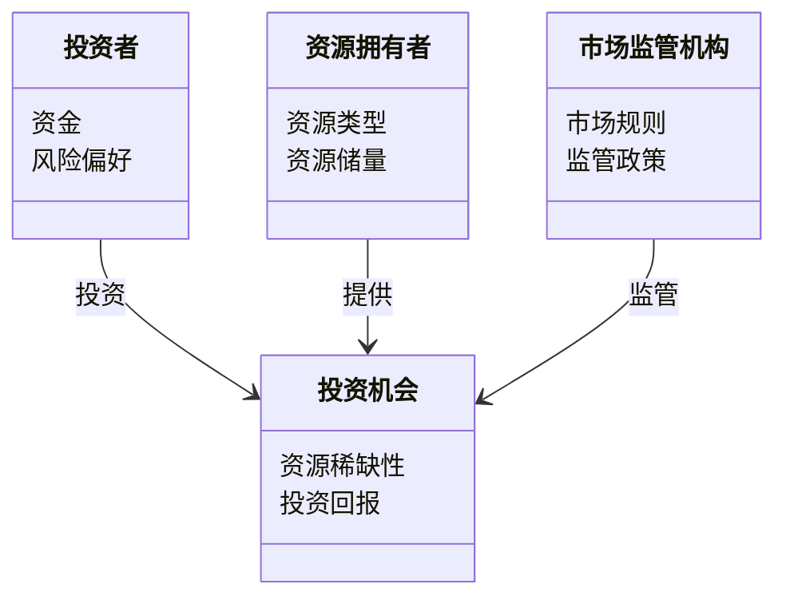

                 


# 杰里米·格兰瑟姆的资源稀缺性投资机会

> 关键词：杰里米·格兰瑟姆，资源稀缺性，投资机会，经济学原理，数学模型，系统架构，项目实战

> 摘要：本文深入分析了杰里米·格兰瑟姆提出的资源稀缺性投资机会，从背景、核心概念、算法原理、数学模型、系统架构到项目实战，层层剖析，帮助读者全面理解资源稀缺性对投资机会的影响，并通过实际案例提供解决方案。

---

# 第一部分: 资源稀缺性投资机会的背景与核心概念

## 第1章: 资源稀缺性与投资机会的背景

### 1.1 资源稀缺性的定义与问题背景
#### 1.1.1 资源稀缺性的定义
资源稀缺性是指某种资源的供给无法满足人类需求的情况，导致其价格上升或供应紧张。

#### 1.1.2 资源稀缺性问题的背景
随着全球人口增长和工业化进程加速，许多自然资源如石油、天然气、稀有金属等面临枯竭的风险。

#### 1.1.3 资源稀缺性与投资机会的联系
资源稀缺性直接影响市场供需关系，从而影响投资机会。稀缺资源往往成为市场的热点，吸引投资者关注。

### 1.2 资源稀缺性的核心要素
#### 1.2.1 资源类型与分布
不同资源的地理分布和储量差异影响其稀缺性。例如，中东地区石油储量丰富，而某些稀有金属分布较为分散。

#### 1.2.2 人类需求与资源消耗
人类对资源的需求持续增长，尤其是能源和原材料的需求，加剧了资源稀缺性。

#### 1.2.3 资源稀缺性的衡量指标
常用的指标包括资源储量、开采成本、替代资源的可用性等。

### 1.3 投资机会的背景介绍
#### 1.3.1 投资机会的定义
投资机会是指在特定市场中，由于供需失衡或其他因素导致某种资产或资源的投资价值上升的可能性。

#### 1.3.2 资源稀缺性与投资机会的关系
资源稀缺性直接推动某些资源或资产的投资机会，例如能源转型中的锂电池需求。

#### 1.3.3 当前资源稀缺性投资的现状
当前，能源转型和环保政策推动了许多资源的投资机会，如太阳能板所需的稀有金属。

---

## 第2章: 资源稀缺性与投资机会的核心概念

### 2.1 核心概念的原理
#### 2.1.1 资源稀缺性的经济学原理
资源稀缺性遵循供需法则，供给不足时价格上涨，需求增加时进一步推动价格上涨。

#### 2.1.2 投资机会的市场机制
市场机制通过价格信号引导资本流向稀缺资源领域，从而创造投资机会。

#### 2.1.3 资源稀缺性与价格的关系
稀缺性直接导致价格上涨，进而影响投资决策。

### 2.2 核心概念的属性对比
以下表格展示了资源稀缺性与投资机会的属性对比：

| 资源属性 | 投资机会属性 |
|----------|--------------|
| 稀缺性   | 投资价值     |
| 可替代性 | 替代成本     |
| 供给弹性 | 供应调整速度 |

### 2.3 ER实体关系图
```mermaid
erDiagram
    投资者 [投资行为] 投资机会
    资源拥有者 [拥有] 资源
    市场监管机构 [监管] 投资机会
    资源稀缺性 <--- 投资机会
```

---

# 第二部分: 资源稀缺性投资机会的算法与数学模型

## 第3章: 资源稀缺性预测的算法原理

### 3.1 资源稀缺性预测模型
#### 3.1.1 线性回归模型
线性回归用于预测资源价格随时间的变化趋势。

#### 3.1.2 时间序列分析
时间序列分析如ARIMA模型适用于预测未来资源稀缺性。

#### 3.1.3 机器学习算法
机器学习算法如随机森林和神经网络可用于复杂预测。

### 3.2 资源稀缺性预测的数学模型
#### 3.2.1 线性回归模型
$$ y = \beta_0 + \beta_1x + \epsilon $$

#### 3.2.2 时间序列模型
$$ ARIMA(p, d, q) $$

#### 3.2.3 机器学习模型
$$ y = f(x) $$

### 3.3 算法实现
使用Python实现线性回归模型预测资源价格：
```python
import numpy as np
from sklearn.linear_model import LinearRegression

# 示例数据
X = np.array([1, 2, 3, 4, 5]).reshape(-1, 1)
y = np.array([2, 4, 5, 4, 6])

# 训练模型
model = LinearRegression()
model.fit(X, y)

# 预测
print(model.predict(np.array([[6]])))
```

---

## 第4章: 资源稀缺性投资机会的数学模型

### 4.1 投资回报模型
$$ ROI = \frac{\text{净收益}}{\text{投资成本}} \times 100\% $$

### 4.2 风险评估模型
$$ \text{风险} = \frac{\text{波动率} \times \text{标准差}}{\text{预期收益}} $$

### 4.3 优化模型
$$ \max \text{利润} = \text{收入} - \text{成本} $$

---

# 第三部分: 资源稀缺性投资机会的系统架构与设计

## 第5章: 系统架构设计

### 5.1 系统功能设计


### 5.2 系统架构设计


---

# 第四部分: 资源稀缺性投资机会的项目实战

## 第6章: 项目实战

### 6.1 环境安装
安装Python和相关库：
```bash
pip install numpy pandas scikit-learn
```

### 6.2 核心代码实现
实现资源价格预测模型：
```python
import numpy as np
from sklearn.linear_model import LinearRegression

# 示例数据
X = np.array([1, 2, 3, 4, 5]).reshape(-1, 1)
y = np.array([2, 4, 5, 4, 6])

# 训练模型
model = LinearRegression()
model.fit(X, y)

# 预测
print(model.predict(np.array([[6]])))
```

### 6.3 案例分析
分析锂电池投资机会，基于资源稀缺性和市场需求预测。

---

## 第7章: 最佳实践与小结

### 7.1 最佳实践
- 定期更新模型数据
- 结合多种算法进行预测
- 注意风险管理

### 7.2 小结
资源稀缺性直接影响投资机会，投资者需结合市场趋势和模型预测制定策略。

### 7.3 注意事项
- 数据质量影响预测准确性
- 模型需定期更新以适应市场变化
- 风险管理是投资成功的关键

### 7.4 拓展阅读
推荐阅读杰里米·格兰瑟姆的相关著作，深入理解资源稀缺性与投资机会的关系。

---

通过以上目录大纲，读者可以系统地学习杰里米·格兰瑟姆提出的资源稀缺性投资机会，从理论到实践，全面掌握相关知识和技能。

