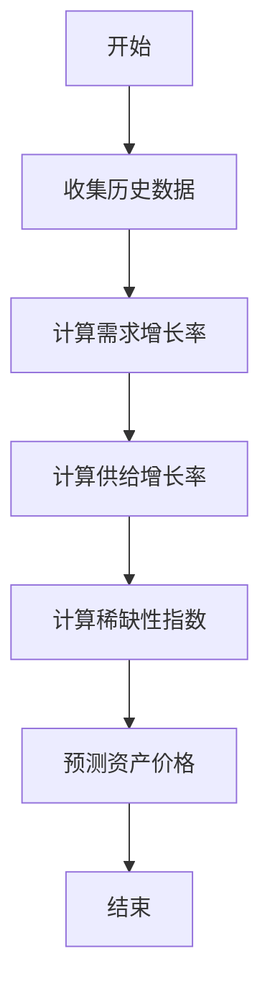
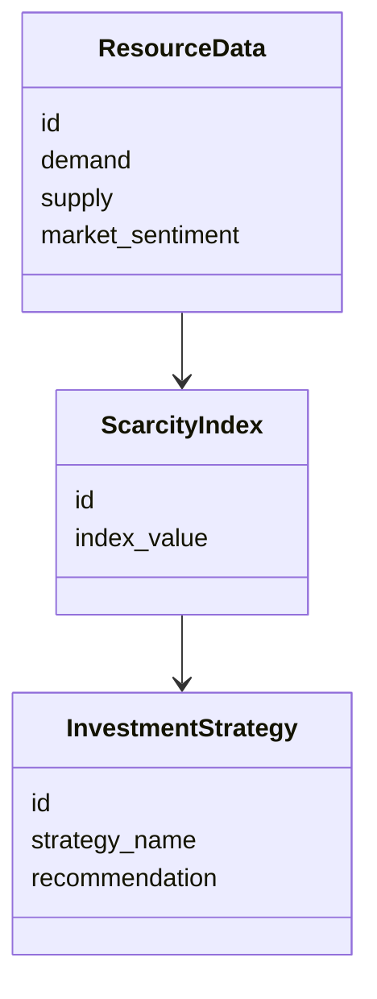
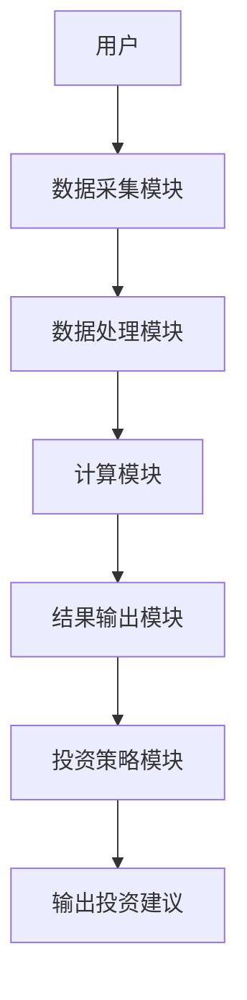
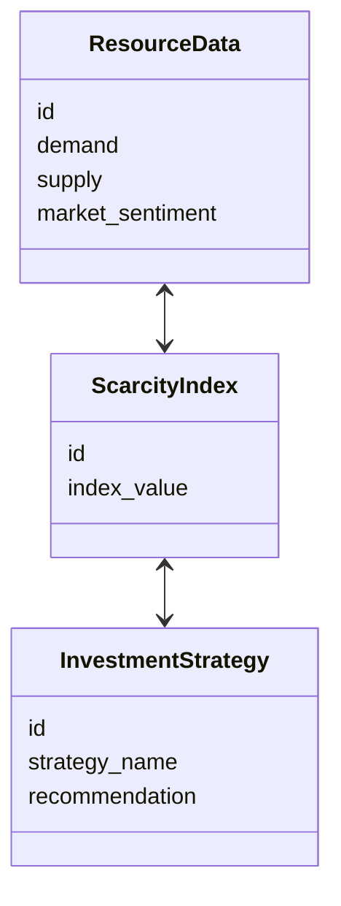

                 


# 杰里米·格兰瑟姆的资源稀缺性投资理论

关键词：杰里米·格兰瑟姆、资源稀缺性、投资理论、经济影响、资产定价、投资策略、系统架构

摘要：本文系统阐述杰里米·格兰瑟姆的资源稀缺性投资理论，从理论背景、核心概念、数学模型、系统架构到项目实战，全面解析资源稀缺性对经济和投资的影响。通过详细分析资源稀缺性对资产定价的影响，探讨如何将该理论应用于投资策略中，结合系统架构设计和项目实战，帮助读者深入理解资源稀缺性投资理论的精髓。

---

# 第1章 资源稀缺性投资理论的背景与核心概念

## 1.1 资源稀缺性与投资的关系

### 1.1.1 资源稀缺性的基本概念
资源稀缺性是指自然资源、劳动力、资本等生产要素的有限性，与人类对资源的需求之间存在矛盾。这种矛盾直接影响资产价格和投资决策。资源稀缺性可以通过以下公式表示：
$$
\text{资源稀缺性} = \frac{\text{需求}}{\text{供给}}
$$

### 1.1.2 资源稀缺性对经济的影响
资源稀缺性导致资源价格波动，进而影响经济活动。例如，石油稀缺会导致油价上涨，从而影响全球供应链和通货膨胀。资源稀缺性对经济的影响可以用以下公式表示：
$$
\text{经济影响} = \text{资源价格} \times \text{需求弹性}
$$

### 1.1.3 投资与资源稀缺性的联系
投资者通过分析资源稀缺性，预测资产价格走势。例如，稀缺的矿产资源可能推高相关企业的股价。资源稀缺性与投资的关系可以用以下公式表示：
$$
\text{投资收益} = \text{资产价格波动} \times \text{投资策略}
$$

## 1.2 杰里米·格兰瑟姆的理论背景

### 1.2.1 格兰瑟姆的学术与实践经历
杰里米·格兰瑟姆是投资大师，长期研究资源稀缺性对投资的影响。他的理论结合了经济学、金融学和数学。

### 1.2.2 资源稀缺性理论的提出动机
格兰瑟姆关注资源枯竭问题，认为资源稀缺性是影响投资回报的重要因素。例如，稀有金属的需求增长可能导致价格飙升。

### 1.2.3 理论的核心思想与框架
格兰瑟姆认为，资源稀缺性会导致资产价格波动，投资者应通过分析稀缺性来制定投资策略。

## 1.3 资源稀缺性理论的基本原理

### 1.3.1 资源稀缺性的定义与分类
资源稀缺性可以分为短期稀缺性和长期稀缺性。短期稀缺性由市场波动引起，长期稀缺性由资源枯竭导致。

### 1.3.2 资源稀缺性与资产价格的关系
资源稀缺性直接影响资产价格，例如石油价格上涨可能导致能源公司股价上涨。资源稀缺性与资产价格的关系可以用以下公式表示：
$$
\text{资产价格} = \text{稀缺性} \times \text{市场情绪}
$$

### 1.3.3 资源稀缺性理论的数学模型
格兰瑟姆提出了资源稀缺性指数模型，用于量化资源稀缺性对资产价格的影响：
$$
\text{稀缺性指数} = \frac{\text{需求增长率}}{\text{供给增长率}}
$$

## 1.4 理论的边界与外延

### 1.4.1 资源稀缺性的边界条件
资源稀缺性分析需考虑技术进步、政策变化等因素。

### 1.4.2 理论的适用范围与限制
资源稀缺性理论适用于大宗商品和资源型行业，对周期性资产影响较大。

### 1.4.3 相关理论的对比与联系
资源稀缺性理论与凯恩斯的需求理论、索洛增长理论等有联系，但更关注长期稀缺性对投资的影响。

## 1.5 核心概念与联系

### 1.5.1 核心概念原理
资源稀缺性是资产价格波动的核心因素。

### 1.5.2 核心概念属性特征对比表格
| 特征 | 稀缺性 | 非稀缺性 |
|------|--------|-----------|
| 需求 | 高     | 低       |
| 供给 | 低     | 高       |
| 价格 | 高     | 低       |

### 1.5.3 ER实体关系图架构的 Mermaid 流程图
```mermaid
erDiagram
    resource
    +----+      +----+      +----+
    | id |<----->| name |<----->| type |
    +----+      +----+      +----+
```

---

# 第2章 资源稀缺性理论的核心模型

## 2.1 资源稀缺性分析模型

### 2.1.1 模型的构成要素
资源稀缺性分析模型包括需求、供给、价格和市场情绪四个要素。

### 2.1.2 模型的输入与输出
输入：需求增长率、供给增长率；输出：稀缺性指数。

### 2.1.3 模型的假设条件
假设市场参与者理性，市场信息对称。

## 2.2 资源稀缺性与资产定价的关系

### 2.2.1 资产定价的基本原理
资产价格由供需关系决定。

### 2.2.2 资源稀缺性对资产定价的影响
资源稀缺性增加资产价格波动。

### 2.2.3 资产定价的数学模型
$$
\text{资产价格} = \text{稀缺性指数} \times \text{市场情绪}
$$

## 2.3 资源稀缺性与投资策略的结合

### 2.3.1 投资策略的基本框架
基于资源稀缺性指数制定投资策略。

### 2.3.2 资源稀缺性在投资策略中的应用
关注稀缺资源相关行业，如稀有金属、能源等。

### 2.3.3 投资策略的优缺点分析
优点：捕捉稀缺性带来的超额收益；缺点：短期波动大，需长期持有。

---

# 第3章 资源稀缺性理论的数学模型与算法原理

## 3.1 资源稀缺性分析的数学模型

### 3.1.1 模型的建立与假设
建立资源稀缺性指数模型，假设需求和供给增长率可预测。

### 3.1.2 模型的变量与方程
需求增长率 \( d \)，供给增长率 \( s \)，稀缺性指数 \( I \)：
$$
I = \frac{d}{s}
$$

### 3.1.3 模型的求解方法
通过历史数据拟合模型，预测未来稀缺性指数。

## 3.2 资源稀缺性与资产定价的算法原理

### 3.2.1 算法的基本原理
通过计算稀缺性指数，预测资产价格波动。

### 3.2.2 算法的输入与输出
输入：需求增长率、供给增长率；输出：资产价格预测。

### 3.2.3 算法的实现步骤
1. 收集历史数据。
2. 计算需求和供给增长率。
3. 计算稀缺性指数。
4. 预测资产价格。

## 3.3 算法的 Mermaid 流程图



## 3.4 算法的 Python 实现

### 3.4.1 环境安装与配置
安装Python和相关库（pandas、numpy）。

### 3.4.2 核心代码实现
```python
import pandas as pd
import numpy as np

# 数据加载
data = pd.read_csv('resource_data.csv')

# 计算需求增长率
demand_growth = data['demand'].pct_change()

# 计算供给增长率
supply_growth = data['supply'].pct_change()

# 计算稀缺性指数
scarcity_index = demand_growth / supply_growth

# 预测资产价格
predicted_price = scarcity_index * data['market_sentiment']
```

### 3.4.3 代码的解读与分析
通过计算需求和供给增长率，得出稀缺性指数，进而预测资产价格。

---

# 第4章 资源稀缺性理论的系统分析与架构设计

## 4.1 系统分析

### 4.1.1 问题场景介绍
设计一个基于资源稀缺性理论的投资管理系统。

### 4.1.2 项目介绍
开发一个实时监测资源稀缺性指数的系统，帮助投资者制定投资策略。

### 4.1.3 系统功能设计



### 4.1.4 系统架构设计



## 4.2 系统架构设计

### 4.2.1 领域模型 Mermaid 类图


### 4.2.2 系统架构 Mermaid 序列图


## 4.3 系统交互设计

### 4.3.1 系统交互流程
用户输入数据，系统计算稀缺性指数，输出投资建议。

### 4.3.2 系统接口设计
API接口：接收数据，返回投资建议。

---

# 第5章 项目实战：基于资源稀缺性理论的投资系统开发

## 5.1 环境安装与配置

### 5.1.1 安装Python
安装Python 3.8及以上版本。

### 5.1.2 安装依赖库
安装pandas、numpy、matplotlib。

## 5.2 核心代码实现

### 5.2.1 数据采集模块
```python
import requests
import pandas as pd

url = 'https://api.resourceindex.com/data'
response = requests.get(url)
data = response.json()
df = pd.DataFrame(data)
```

### 5.2.2 数据处理模块
```python
# 计算需求和供给增长率
df['demand_growth'] = df['demand'].pct_change()
df['supply_growth'] = df['supply'].pct_change()

# 计算稀缺性指数
df['scarcity_index'] = df['demand_growth'] / df['supply_growth']
```

### 5.2.3 投资策略模块
```python
# 预测资产价格
df['predicted_price'] = df['scarcity_index'] * df['market_sentiment']

# 生成投资建议
df['recommendation'] = df['predicted_price'].apply(lambda x: 'Buy' if x > 0 else 'Sell')
```

## 5.3 代码的解读与分析
通过数据处理和计算，得出投资建议，指导投资者进行交易。

## 5.4 实际案例分析与详细解读
以石油市场为例，分析稀缺性指数对油价的影响，指导投资者制定买卖策略。

---

# 第6章 总结与展望

## 6.1 项目小结
本文系统阐述了杰里米·格兰瑟姆的资源稀缺性投资理论，通过理论分析、系统设计和项目实战，展示了如何将理论应用于实际投资。

## 6.2 最佳实践 tips
- 定期更新数据，保持模型准确性。
- 结合市场情绪，优化投资策略。
- 长期持有，避免短期波动影响。

## 6.3 未来展望
未来研究方向包括动态调整模型、多因素分析和机器学习的应用。

---

# 参考文献

（此处列出相关书籍、论文和其他参考资料）

